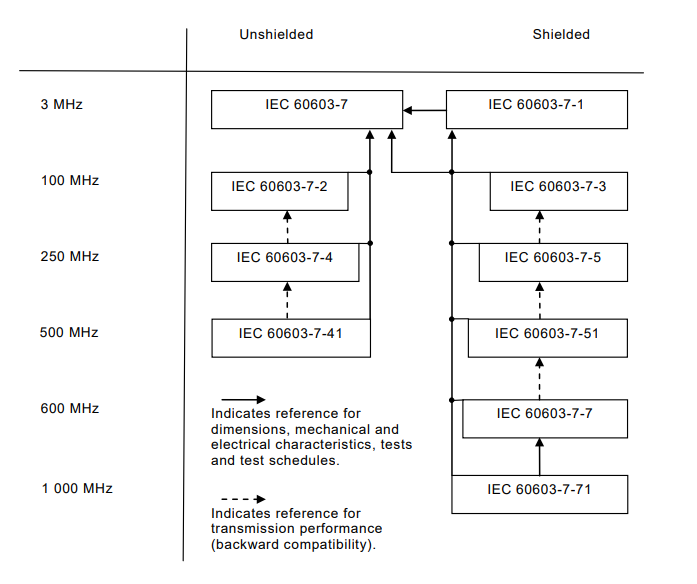
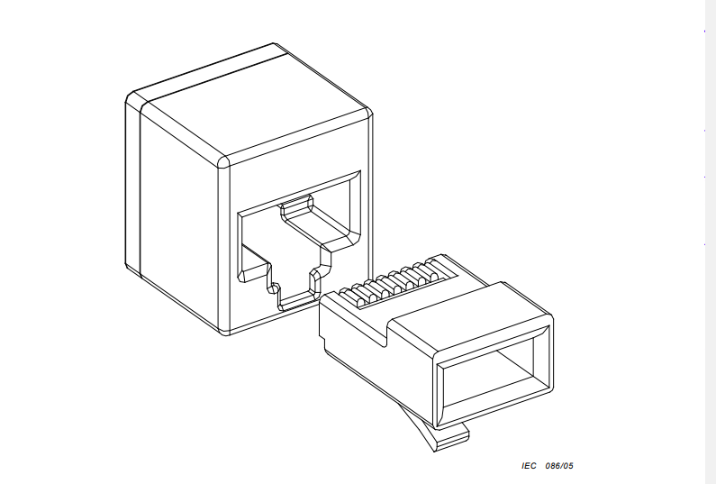
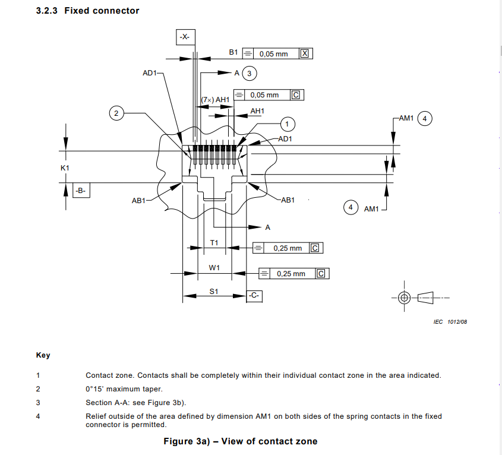
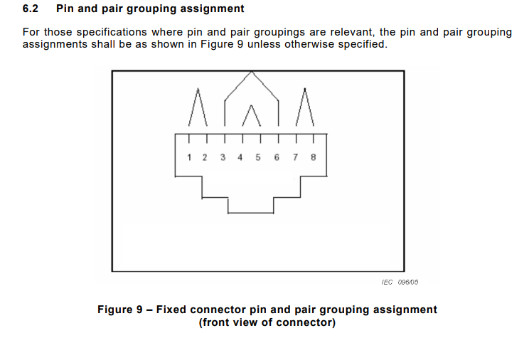
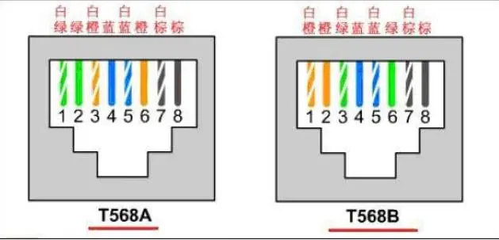

# 作业

- IEC 60603-7
- ISO CAT标准/TIACAT标准
查询RJ45连接器与双绞线的相关标准，给出你查询的方法、简要的介绍情况即标准版本演变情况（word电子版），另打包附上所查电子档资源

- 通过各类网络手段搜索与查询IEC 60603-7标准
- 写出你如何查询的、查询的结果、IEC60603-7的历史演变情况，以及标准的理解
- 作业为电子档，word+查询的相关电子资料
- 最终上传到共享文档

# 作业
## RJ45
搜索方法：
- [标准搜索站点](https://www.diyq.net/)
- [IEC-60603-7-2020下载链接](https://down.freestandarddownloadwebsite.com/file/IEC/EN-IEC-60603-7-2020.zip)

IEC 60603-7 ，标准名称是“Connecters For Electronic Equipment-Part 7:Detail specification for 8-way,unshielded,free and fixed connectors”，中文名称是“电子设备连接器－第7部分：8位非屏蔽自由和固定连接器的详细规范”。它由国际电工委员会（IEC）制定和发布。IEC 60603-7，是RJ45连接器的标准 ，包括一整个系列的标准信息。下图是它的文件相互关系。

全文共分为7个部分，对RJ45接口连接器的接口定义、尺寸、电压、材料、电缆、阻抗、引脚、电缆、等电气特性和机械特性以及测试试验方法做了详细的规定。

RJ45 型网线插头又称水晶头，共有八芯做成，广泛应用于局域网和 ADSL 宽带上网用户的网络设备间网线（称作五类线或双绞线）的连接。在具体应用时，RJ45 型插头和网线有两种连接方法（线序），分别称作 T568A 线序和 T568B 线序。

## 双绞线
搜索方法：
- 搜索引擎关键字 TIA568+filetype:pdf
- [C2G](https://www.cablestogo.com/learning/library/standards-specs-certs/ansi-tia)

ANSI/TIA 568 C.2 平衡双绞线电信布线和组件标准
ANSI/TIA 56 8 C.2标准由电信行业协会编写，旨在消除制造商和购买者之间的误解，促进互换性和产品改进，并帮助购买者根据其需求选择合适的产品。
发展过程：
- 在1985年初，在电脑与通讯方面一直都缺乏建筑物中通讯配线系统的标准，CCIA (Computer Communications Industry Association)就要求EIA这个组织，希望能发展出电脑与通讯方面的标准，因此在1991年7月，第一个版本的标准出现了！那就是EIA/TIA-568。
- TIA/EIA-568在1995年颁布了第二个版本，也是最广为接受的版本，即 ANSI/TIA/EIA-568.A。
- 2001年，TIA/EIA-568发布了第三个版本，即ANSI/TIA/EIA-568.B。ANSI/TIA/EIA-568-B.1布线标准详细说明了重要的标准需求，例如拓朴结构、设计和施工所需的电缆和布线长度等。为了测试需要，568-B.1标准详细定义了例如插入损耗、近端串音（NEXT）、远端串音（FEXT）、回波损耗及其它和结构化布线系统相关的测量参数。该标准详细定义了已安装电缆的性能测试指标。
- ANSI/TIA/EIA-568.B标准在2009年被ANSI/TIA-568.C替代。
  - ANSI/TIA-568.C共分成4个部分：
  - ANSI/TIA-568.C.0：用户建筑物通用布线标准
  - ANSI/TIA-568.C.1：商业楼宇电信布线标准
  - ANSI/TIA-568.C.2：平衡双绞线电信布线和连接硬件标准
  - ANSI/TIA-568.C.3：光纤布线和连接硬件标准

这些标准文件具体涵盖100Ω 3类、5e类、6类和6A类双绞线电缆和组件。该文件规定了强制性和咨询性标准。强制性标准规定了适用于保护、性能、管理和兼容性的最低可接受要求。咨询标准提出了将提高布线系统性能的标准。

ANSI（美国国家标准委员会）认可的标准使用年限为5年，而最初的568-B系列标准，即568-B.3光纤布线连接硬件标准，是早在2000年3月30日批准的，568-B.1（总则性标准）和568-B.2(铜缆布线连接硬件标准)是在2001年批准的。经过多年的积累，通信应用领域的技术进步使得568-B系列布线标准出现了大量的增补内容（如现行568-B.1标准有6个附录，568-B.2有10个附录，568-B.3有1个附录）。

本文件分为以下三个主要部分：概述概述部分规定了布线的向后兼容性和互操作性。这意味着所有较新版本的电缆必须满足的要求，支持的传输，并在具有较旧版本电缆的系统中运行。重要的是要注意，当较旧的电缆或设备用于具有较新电缆的系统时，性能将限于最慢的系统组件。通用部分还规定了公认的电缆类别及其传输特性。

只有使用兼容组件才能实现性能。每类电缆必须由四对双绞线组成，其实心或绞合导线的尺寸在22AWG和24AWG之间，具有热塑性绝缘层和直径小于或等于9.0mm的整体热塑性护套。

本部分标准还定义了电缆中导体的内部颜色代码。线对1-白色-蓝色，蓝色线对2-白色-橙色，橙色线对3-白色-绿色，绿色线对4-白色-棕色，棕色此外，标准的这一部分提供了两个标准引脚，T568A和T568B，用于这种带有八位模块化连接器的电缆类型。T568B更常用。

| T568A                 | T568B                 |
| --------------------- | --------------------- |
| Pin - Conductor Color | Pin - Conductor Color |
| 1 - White - Green     | 1 - White - Orange    |
| 2 - Green             | 2 - Orange            |
| 3 - White - Orange    | 3 - White - Green     |
| 4 - Blue              | 4 - Blue              |
| 5 - White - Blue      | 5 - White - Blue      |
| 6 - Orange            | 7 - White - Brown     |
| 7 - White - Brown     | 7 - White - Brown     |
| 8 - Brown             | 8 - Brown             |

