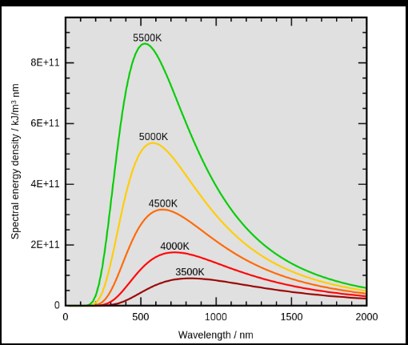
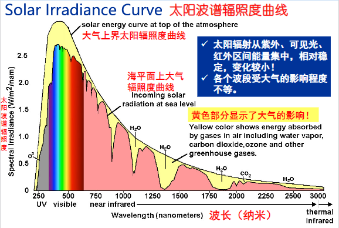
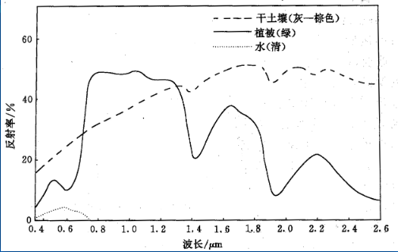
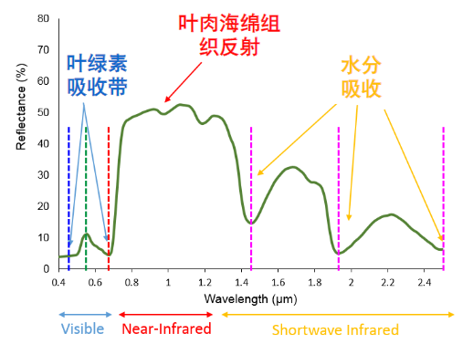
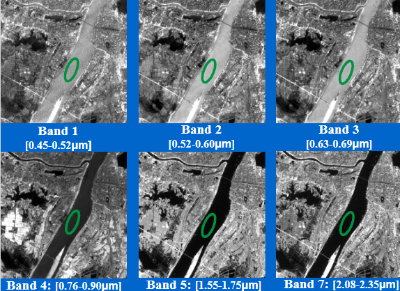

- [Chapter 2 遥感物理基础](#chapter-2-遥感物理基础)
  - [2.1 电磁波谱与电磁辐射](#21-电磁波谱与电磁辐射)
    - [一、电磁波的产生](#一电磁波的产生)
    - [二、电磁波的性质](#二电磁波的性质)
    - [三、电磁波谱](#三电磁波谱)
        - [探测火箭用什么波段？](#探测火箭用什么波段)
    - [四、电磁辐射](#四电磁辐射)
  - [2.2 物体的发射辐射](#22-物体的发射辐射)
    - [一、热辐射](#一热辐射)
    - [二、黑体辐射](#二黑体辐射)
      - [普朗克定律](#普朗克定律)
      - [斯蒂芬-波尔茨曼定律](#斯蒂芬-波尔茨曼定律)
      - [维恩位移定律](#维恩位移定律)
    - [三、一般物体发射辐射](#三一般物体发射辐射)
      - [（一）、地物波谱发射率](#一地物波谱发射率)
      - [（二）、地物发射率](#二地物发射率)
    - [四、太阳辐射](#四太阳辐射)
      - [（一）、太阳辐射能量分布特点](#一太阳辐射能量分布特点)
      - [（二）、太阳常数](#二太阳常数)
  - [2.3 地物的反射辐射](#23-地物的反射辐射)
    - [一、电磁波传输过程](#一电磁波传输过程)
    - [二、地物反射波谱](#二地物反射波谱)
    - [三、典型地物反射波谱特性（🔺）](#三典型地物反射波谱特性)
      - [（一）、绿色植物](#一绿色植物)
      - [（二）、水体](#二水体)
      - [（三）、土壤](#三土壤)
    - [四、地物反射波谱测量](#四地物反射波谱测量)
  - [2.4 大气对电磁波传输的影响](#24-大气对电磁波传输的影响)
    - [一、大气成分](#一大气成分)
    - [二、大气结构](#二大气结构)
    - [三、大气对电磁辐射的影响](#三大气对电磁辐射的影响)
    - [四、大气窗口](#四大气窗口)

# Chapter 2 遥感物理基础

## 2.1 电磁波谱与电磁辐射

### 一、电磁波的产生
电磁波式横波，性质与广播相同，在真空光速
- 产生机制
  - 电荷的加速（交变电场）
  - 电子能级跃迁（受激发射）
  - 原子和分子的热运动（热辐射）：温度越高的热辐射越强
  - 物质的放射性衰变
### 二、电磁波的性质
波粒二象性

### 三、电磁波谱
- 电磁波按波长或频率顺序排列成谱。
- Gamma 射线 （<0.1nm）波长小于0.1nm，比X射线能量还高的一种电磁辐射，会被地球大气层阻挡，要在地球之外观测。有极强的穿透能力。
- X射线（0.1-10nm），伦琴射线，很高的穿透能力。能使照相底片感光，使空气电离。
- 紫外线波段（0.01=0.38um）。紫外线指数值当太阳在天空中位置最高时，到达地球表面得太阳光线中紫外线辐射对人楼梯皮肤的可能损失程度。用途：碳酸盐和油污的测定。（接收0.03-0.38），（0.01-0.03被大气吸收。
- 可见光波段（0.38-0.76um）。prism(棱镜)进行分光，实现多光谱和高光谱。最主要的工作波段。
- 红外线波段（0.76-1000um）
  - 反射红外 0.76um-3um
  - 发射红外 3um-1000um
  - 遥感中用的热红外波段通常指**8-14um**和**3-5um**短波红外波段范围。
- 微波（1-1000mm）波长较长，散射相对较小，大气中衰减小。主动被动之分。全天候（各种气候条件）、全天时（24小时）。
- 遥感中利用的波段
  - 紫外（UV）0.3-0.38um
  - 可见光（VIS）0.38-0.76um
  - 红外（IR）0.76-1000um
  - 微波1mm-1m

空间分辨率：遥感图像能区分的最小单元尺寸。

可见光：3.5m空间分辨率
多光谱，蓝、绿、红、近红外，6m空间分辨率

**同步轨道**：固定在某个方向上，随地球旋转，周期24小时

**静止轨道**：相对于地球是静止的。

##### 探测火箭用什么波段？
火箭尾焰上千度，3-5短

### 四、电磁辐射
**对流、传导、辐射**

1. `辐射源`：任何物体都是辐射源

2. 电磁辐射的 **`度量`**
   1. `辐射能量`（焦耳）：电磁辐射携带的能量。
   2. `辐射通量`（瓦特）：单位时间通过某一面积的辐射能量。
   3. `通量密度`（瓦特/平方米）：单位时间内通过单位面积的辐射能量。
      * 辐照度I：针对<u>被照射物体</u>而言
      * 辐射出射度M：针对<u>辐射源</u>
   4. `辐射亮度`L（瓦特/球面度/平方米）：辐射源在某一方向，单位投影面积，单位立体角内的辐射通量。$L=\frac{d^2\Phi}{d\Omega dA \cos{\theta}}$ , $\Omega=\frac{dS}{r^2}$
      - 朗伯源：电磁辐射亮度大小与方向无关，即表面发射反射各向同性，这类辐射源成为朗伯源。
      - 太阳通常近似地被称为朗伯源，以简化对太阳辐射的研究。
      - 严格来说只有绝对黑体才是朗伯源。

## 2.2 物体的发射辐射

### 一、热辐射
特点：
- 任何物体任何温度均存在热辐射
- 热辐射谱是连续谱，各种波长（频率）都有，但是强度不同
- `热辐射强度`按波长分布与温度有关。温度越高，短波长的电磁波比例越高。

### 二、黑体辐射
可以吸收任何入射的电磁辐射，既没有反射，也没有投射的理想物理体，也叫完全辐射体。

自然界不存在绝对黑体。黑色的烟煤接近黑体。恒星和太阳是接近黑体辐射的辐射源。

**黑体辐射定律** 黑体的辐射量与波长和温度有关。

#### 普朗克定律
描述黑体辐射出射度与温度和波长分布的关系。

辐射出射度：辐射通量密度，辐射源在单位面积的发出的辐射通量。

$$
M_{\lambda}(\lambda,T)=\frac{2\pi hc^2}{\lambda^5}\cdot\frac{1}{e^{hc/\lambda kT}-1}\\
\begin{aligned}
  &M_{\lambda}=黑体光谱辐射出射度\\
  &\lambda=波长（um）\\
  &k=玻尔兹曼常数（1.38\times10^{-23}J/K）\\
  &h=普朗克常数（6.63\times10^{-34}Js）\\
  &T=温度（K）\\
  &c=光速（3.0\times10^9m/s）\\
\end{aligned}
$$

**性质**
* 温度越高，相应波段处辐射出射度越大。不同的温度的曲线**不相交**。
* 辐射出射度随波长连续变化，每条曲线**只有一个最大值**。

#### 斯蒂芬-波尔茨曼定律
对普朗克定律在全波段积分  
$$
\begin{aligned}
M&=\int_{0}^{\infty}{\frac{2\pi hc^2}{\lambda^5}\cdot\frac{1}{e^{hc/\lambda kT}-1}d\lambda}\\
&=\frac{2\pi^5k^4}{15c^2h^3}T^4\\
&=\sigma T^4\\
\sigma&=\frac{2\pi^5k^4}{15c^2h^3}=5.6697\times10^{-12}(W/cm^2\cdot K^4)
\end{aligned}
$$

在**全波段**范围内，某黑体的`总辐射出射度`与黑体的`温度`的`四次方`成正比。

每条黑体辐射曲线下面所围起来的面积的积分值，就是该温度是的总辐射出射度。

温度微小变化，就会引起辐射出射度很大的变化。是红外装置测定温度的理论基础。

#### 维恩位移定律

随着黑体温度升高，辐射最大值所对应的波长向短波方向移动。$\lambda_{max}=b/T$

黑体温度与峰值波长的对应关系
太阳：6000k(0.48um)
地表：300k(9.66)(8-14um)

玻尔兹曼定律的差异：$20^4$倍

| T(K)                  | 300  | 500  | 1000 | 2000 | 3000 | 4000 | 5000 | 6000 | 7000 |
| --------------------- | ---- | ---- | ---- | ---- | ---- | ---- | ---- | ---- | ---- |
| $\lambda_{max}(\mu m$ | 9.66 | 5.80 | 2.90 | 1.45 | 0.97 | 0.72 | 0.58 | 0.48 | 0.41 |

针对探测目标，选择最佳的遥感波段和传感器
- 对1000k林火，它的$\lambda_{max}$=2.90um，中红外波段。
- 对地表（300K）的土壤，水体，岩石等，地球的$\lambda_{max}$=9.66um，远红外波段。

### 三、一般物体发射辐射

相同条件下，实际地物的发射的辐射量比绝对黑体低。（吸收、反射、透射）

#### （一）、地物波谱发射率
$$
\varepsilon_{\lambda}=\frac{M_\lambda}{M_{b\lambda}}\\
\begin{aligned}
&{M_\lambda}：地物某波长的辐射出射度\\
&{M_{b\lambda}}：黑体同温度同波长的辐射出射度\\ 
\end{aligned}
$$
影响因素：地物的性质、表面状况、温度和波长

#### （二）、地物发射率

$$
\varepsilon=\frac{M(T)}{M_b(T)}\\
\begin{aligned}
&{M_\lambda}：地物辐射出射度\\
&{M_{b\lambda}}：黑体同温度的辐射出射度\\ 
\end{aligned}
$$
等于相应曲线下的面积之比

反应地物与黑体的接近程度

典型地物的发射率(T=300k,room temperature)
| Material |                   | $\varepsilon$ |
| -------- | ----------------- | ------------- |
| 铝箔     | Aluminum foil     | 0.02          |
| 磨光的铜 | Copper, polished  | 0.03          |
| 氧化铜   | Copper, oxidized  | 0.5           |
| 碳       | Carbon            | 0.8           |
| 白油漆   | White paint, flat | 0.87          |
| 红砖     | Red brick         | 0.9           |
| 混凝土   | Concrete          | 0.94          |
| 黑油漆   | Black paint, flat | 0.94          |
| 煤烟     | Soot              | 0.95          |

`发射波谱曲线`：温度一定时，物体的发射率随波长变化，表示这种变化的曲线。是**识别地物**的重要方法之一。

地物：植被、水、裸土、森林、海洋

| 地物分类类型 | 光谱发射率$\varepsilon_\lambda$                    |
| ------------ | -------------------------------------------------- |
| 绝对黑体     | $\varepsilon_\lambda=\varepsilon=1$                |
| 灰体         | $\varepsilon_\lambda=\varepsilon且0<\varepsilon<1$ |
| 选择性辐射体 | $\varepsilon_\lambda=f(\lambda)$                   |
| 绝对白体     | $\varepsilon_\lambda=\varepsilon=0$                |

地物发射率与吸收率之间的关系？能量转换

证明：地物的发射率=吸收率

`基尔霍夫定律`：相同温度下， 不同物体对**相同波长**的**辐射出射度M**与**吸收率α**之比值都是一个**常数**，并等于该温度下黑体对同一**波长**的**辐射出射度Mb**。

基尔霍夫定律 $M=\alpha M_b=\alpha\sigma T^4$

地物发射律 $M=\varepsilon M_b=\varepsilon\sigma T^4$

好的吸收体也是好的发射体！如果不吸收某些波长的电磁波，也不发射该波长的电磁波。

### 四、太阳辐射
#### （一）、太阳辐射能量分布特点
- 光谱是连续的，辐射特性与黑体辐射特性基本一致。
- 紫外到中红外波段能量集中、稳定。
- 太阳辐射的组成：**峰值在0.5um左右**，约99%集中在**0.2-4um**，约44%集中在可见光。

太阳辐射能各谱段的百分比
| 波长λ               | 波段                 | 百分比% |
| ------------------- | -------------------- | ------- |
| <1nm，1~200nm       | X射线，γ射线，远紫外 | 0.02    |
| 0.20~0.31um         | 中紫外               | 1.95    |
| 0.31~0.38um         | 近紫外               | 5.32    |
| 0.38~0.76um         | 可见                 | 43.50   |
| 0.76~1.5um          | 近红外               | 36.80   |
| 1.5~5.6um           | 中红外               | 12.00   |
| 5.6~1000um，>1000um | 远红外               | 0.41    |

#### （二）、太阳常数

***太阳常数***是**不受大气影响**，在距离太阳一个天文单位内，单位面积单位时间**接收**到太阳辐射能量：
$$I_0=1.36\times10^3W/m^2$$

- 太阳常数实际上是辐射通量密度的概念，即辐照度；
- 可以认为太阳常数是在大气顶端接受的太阳能量。
- 研究表明太阳常数不是稳定值，但变化很小。

**一个天文单位**：地球到太阳之间的平均距离。

太阳波谱辐照度曲线 Solar Irradiance Curve

地球辐射的分段特性
| 波段名称 | 可见光与近红外                                      | 中红外                       | 远红外                 |
| -------- | --------------------------------------------------- | ---------------------------- | ---------------------- |
| 波长     | 0.35-2.5um                                          | 2.5-6um                      | >6um                   |
| 辐射特性 | 地表反射太阳辐射为主，地表物体自身的热辐射几乎等于0 | 地表反射太阳辐射和自身热辐射 | 地表物体自身热辐射为主 |

## 2.3 地物的反射辐射

### 一、电磁波传输过程

到达地面的太阳辐射能量=反射能量(Reflected)+吸收能量(Absorbed)+透射能量(Transmitted)

反射能量：可见光、近红外遥感

吸收能量：热红外遥感

透射能量：微波遥感

在可见光与近红外波段，地表物体自身的热辐射几乎等于零，地物发出的波谱主要以反射太阳辐射为主。当然，太阳辐射到达地面后，物体除了反射作用外，还有对电磁辐射的吸收作用，如黑色物体的吸收能力较强。最后，电磁辐射未被吸收和反射的其余部分则是透过的部分。（基尔霍夫定律）

地物的（反射）光谱特性：不同地物对电磁波相应特征不同。是遥感识别地物的基础。

**地物的反射类型**：镜面反射、漫反射、方向反射（实际物体反射）

`镜面反射`：发生在光滑物体表面的一种反射。物体的反射满足反射定律，入射波和反射波在同一平面内，入射角等于反射角。只有在反射波射出的方向才能探测到电磁波。

`漫反射`：发生在非常粗糙的表面上的反射现象。不论入射方向如何，其反射出来的能量在各个方向是一致的。即当入射辐照度一定时，从任何角度观察反射面，其反射辐照亮度是一个常数。这种反射面又叫朗伯源。（航天遥感中，地球表面相对于传感器的高度，可近似视为朗伯面。）

`方向反射`：介于镜面和漫反射之间的一种反射。自然界中绝大多数地物的反射都属于这类反射，又叫做非朗伯面反射。对太阳的反射由各向异性。即实际物体面在有入射波时各个方向都有反射能量，但大小不同。

了解物体表面性质对反射影响的意义
- 遥感图像上记录的辐射亮度，既与辐`射入射方位角和天顶角`有关，也与反射方向的`方位角和天顶角`有关。
- 由于镜面反射会造成太阳光直接进入遥感器，在成像时间选择上，`应避免中午成像，防止形成镜面反射`。否则水体会形成非常亮的耀斑，周围地物的反射信息有受到干扰和削弱。

### 二、地物反射波谱

反射率：地物反射能量与入射总能量的比。表征物体对电磁波的反射能力。

$$\rho=\frac{地物发射通量}{地物入射通量}$$

地物反射波谱：可见光和近红外波段上地物反射率随波长的变化规律。

波谱反射率：地物在某波段的反射能量与入射总能量的比。

$$\rho_\lambda=\frac{地物某波段的反射通量}{地物同波段的入射通量}$$

地物反射波谱：可见光至近红外波段上地物反射率随波长的变化规律。

表示形式：`反射波谱曲线`。横坐标表示波长，纵坐标表示反射率。`某一地物的波谱曲线反映出不同波段的反射率`，将此与遥感传感器的对应波段接收的辐射数据相对照，可以得到遥感数据与对应地物的识别规律。

特点一：某一地物在不同波段的反射率不同。
特点二：不同地物在不同波段的反射率不同。
特点三：同种地物的反射光谱具有相似性，但也有差异性。

地物存在**同物异谱**和**异物同谱**的现象。`同物异谱`是指同类地物，在某个波段上波谱特征不同（周围环境、病虫害或放射性物质等）；`异物同谱`是指不同类型的地物具有相同的波谱特征。这给遥感解译判读带来困难。

地物反射波谱的影响因素：
- 太阳位置
- 传感器位置
- 地理位置
- 地形
- 季节
- 气候变化
- 地面湿度变化
- 大气状况

### 三、典型地物反射波谱特性（🔺）

#### （一）、绿色植物

**可见光波段**
- 在0.45um附近（蓝色波段）有一个**吸收谷**
- 在0.55um附近（绿色波段）有一个**反射锋**
- 在0.67um附近（红色波段）有一个**吸收谷**

**近红外波段**
- 从0.76um处反射率迅速增大，形成一个爬升的“**陡坡**”，至1.1um附近有一个峰值，反射率最大可达50%，形成植被的独有特征。
- 以1.45um，1.95um，2.70um为中心是水的吸收带，其附近区间收到绿色植物含水量的影响，反射率下降，形成低谷。

主要影响因素：
- 植物`类型`
- 植被`生长季节`
- 植被`生长状态`

#### （二）、水体
**纯净水体**的反射主要在可见光中的蓝绿光波段，在可见光其他波段的反射率很低。近红外和中红外纯净的自然水体的反射率很低，几乎趋近于0。

水体的反射主要在蓝绿光波段，其他波段吸收都很强，特别到了近红外波段，吸收就更强，所以水体在遥感影像上常呈**黑色**。但当水中含有其他物质时，反射光谱曲线会发生变化。

主要影响因素：
- `含沙量`：水中含泥沙时，由于泥沙散射，可见光波段反射率会增加，峰值出现在黄红区。
- `叶绿素浓度`：水中含叶绿素时，近红外波段明显抬升，这些都成为影像分析的重要依据。

#### （三）、土壤
土壤含水量增加，土壤的反射率就会下降，在水的各个吸收带（**1.4um，1.9um，2.7um**处附近区间），反射率的下降尤为明显。

主要影响因素：
- 土质
- 有机物含量
- 含水量

### 四、地物反射波谱测量

## 2.4 大气对电磁波传输的影响

### 一、大气成分
干洁空气、水汽、悬浮尘粒等

氮气
氧气
稀有气体
二氧化碳
水蒸气等其他杂质

碳达峰：碳排放不再增长

碳中和：碳排放=碳吸收

### 二、大气结构
对流层：平均12km，**吸收、散射**引起电磁衰减。

平流层：（12-55km）气流水平运动，大气平稳。

中间层：（55-80km）温度随高度升高迅速降低，存在强烈对流，又称为高空对流层。

热层（电离层）：（80-800）空气稀薄，气温很高，ui高度升高。

外层（逃逸层）：（>800km）电离层顶以上的大气，空气极其稀薄，气体分子可逃逸。

### 三、大气对电磁辐射的影响

**吸收**（absorption）

**散射**（scattering）

反射（reflection）

扰动（disturbance）

**折射**（refraction）

偏振（polarization）：光是横波

地物反射的能量（具有选择性，表现为波普曲线特性不同），如果不经过地物反射，就没有地物携带的信息。

研究大气影响，目的是对观测进行补偿。

（一）、大气对不同波段的影响

可见光波段——分子散射

紫外红外微波区——大气吸收

（二）、大气吸收

氧气

臭氧

二氧化碳

尘埃

（三）、大气散射

瑞利散射（Rayleigh）
- 直径远小于波长。
- 分子散射，波长越大，散射强度越小，波长四次方成反比。

米氏散射（Mie）
- 光波长与微粒直径差不多
- 波长因素影响不剧烈。
- 气溶胶引起的散射。0.76~15um的波长。

非选择散射（Non-selective）
- 微粒直径远大于波长。
- 云雾看起来白色。

**反射与散射的区别**：
- 反射在交界面，散射在物体内部

微波（瑞利）散射弱，

（四）、大气折射

`两小儿辩日`：日初出大如车盖，及日中则如盘盂，此不为远者小而近者大乎？

（五）、大气反射

### 四、大气窗口

**大气波段**：很少或没有被大气衰减的电磁波段。

| 大气窗口 | 波段                      | 透射率%         | 应用举例 |
| -------- | ------------------------- | --------------- | -------- |
|          |                           |                 |          |
|          |                           |                 |          |
|          |                           |                 |          |
| 微波     | 1.0~1.8mm 1~5mm 10~1000mm | 35~40 50~70 100 | Radarsat |
