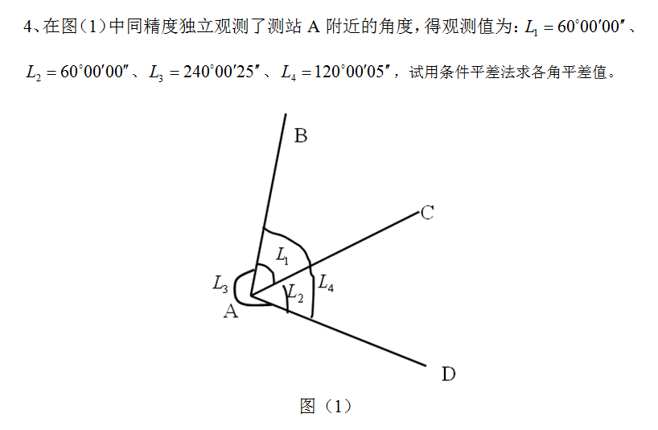
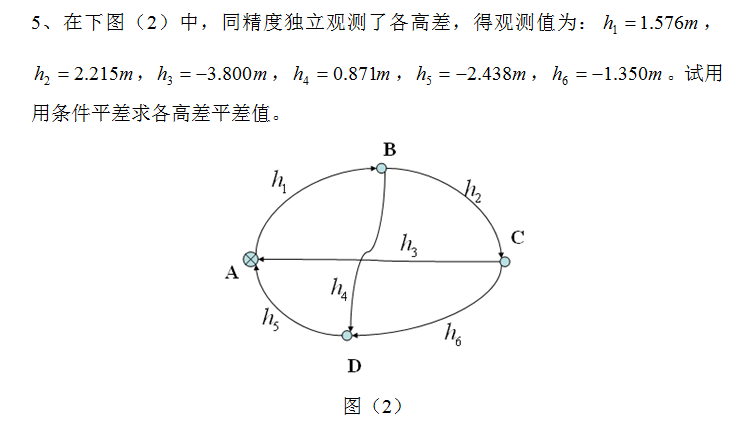

# 第5次作业

## 1.简答
条件平差中求解的未知量是什么？能否由$AV-W=0$直接求出？

未知量是改正数。

不能直接求出，因为结果不唯一。

条件平差的前提是有多余观测量，条件方程式的个数与多余观测量有关，每有一个多余观测量，就可列出一个独立的条件方程式，在进行条件平差时，应列出与多余观测数相同的独立的条件方程式。

## 2.计算
在图中同精度独立观测了测站A附近的角度，得观测值为：$L_1=60^\circ00^\prime00^{\prime\prime}、L_2=60^\circ00^\prime00^{\prime\prime}、L_3=240^\circ00^\prime25^{\prime\prime}、L_4=120^\circ00^\prime05^{\prime\prime}$，试用条件平差法求各角平差值。

 

- ans:
n=4，t=2，r=n-t=2

条件方程：
$$
\hat{L_1}+\hat{L_2}-\hat{L_4}=0\\
\hat{L_3}+\hat{L_4}-360^\circ=0
$$

将$\hat{L_i}=L_i+v_i$带入得改正数方程：
$$
v_1+v_2-v_4-5^{\prime\prime}=0\\
v_3+v_4+30^{\prime\prime}=0
$$

即
$$
\begin{bmatrix}1&1&0&-1\\0&0&1&1\end{bmatrix}\begin{bmatrix}v_1\\v_2\\v_3\\v_4\end{bmatrix}+\begin{bmatrix}-5\\30\end{bmatrix}=0
$$

设各角权相等，
系数阵
$$N_{aa}=AP^{-1}A^T=\begin{bmatrix}1&1&0&-1\\0&0&1&1\end{bmatrix}\begin{bmatrix}1&&&\\&1&&\\&&1&\\&&&1\end{bmatrix}\begin{bmatrix}1&0\\1&0\\0&1\\-1&1\end{bmatrix}=\begin{bmatrix}3&-1\\-1&2\end{bmatrix}$$

法方程为  $\begin{bmatrix}3&-1\\-1&2\end{bmatrix}\begin{bmatrix}k_1\\k_2\end{bmatrix}+\begin{bmatrix}-5\\30\end{bmatrix}=0$

即
$$
\left.
    \begin{aligned}
3k_a-k_b-5=0\\
-k_a+2k_b+30=0
    \end{aligned}
\right \}
$$

则 $K=-N_{aa}^{-1}W$，解得$\left \{ \begin{aligned}k_a=-4\\k_b=-17\end{aligned}\right.$

改正数 
$$v=QA^TK=\begin{bmatrix}1&&&\\&1&&\\&&1&\\&&&1\end{bmatrix}\begin{bmatrix}1&0\\1&0\\0&1\\-1&1\end{bmatrix}\begin{bmatrix}-4\\-17\end{bmatrix}=\begin{bmatrix}-4\\-4\\-17\\-13\end{bmatrix}$$

检验：
$$
\hat{L_1}+\hat{L_2}-\hat{L_4}=0\\
\hat{L_3}+\hat{L_4}-360^\circ=0
$$

## 3.
在下图中，同精度独立观测了个高差，得观测值为：$h_1=1.576m,h_2=2.215m,h_3=-3.800m,h_4=0.871m,h_5=-2.438m,h_6=-1.350m$。试用条件平差求个高差平差值。

 

- ans:
n=6，t=3，r=n-t=3

条件方程：
$$
\hat{h_3}=\hat{h_5}+\hat{h_6}\\
\hat{h_3}=-\hat{h_1}-\hat{h_2}\\
\hat{h_4}=\hat{h_2}+\hat{h-6}
$$

将$\hat{h_i}=h_i+v_i$带入得改正数方程(mm)：
$$
v_3-v_5-v_6-12=0\\
v_3+v_1+v_2-9=0\\
v_4-v_2-v_6+6=0
$$

即
$$
\begin{bmatrix}0&0&1&0&-1&-1\\1&1&1&0&0&0\\0&-1&0&1&0&-1\end{bmatrix}\begin{bmatrix}v_1\\v_2\\v_3\\v_4\\v_5\\v_6\end{bmatrix}+\begin{bmatrix}-12\\-9\\6\end{bmatrix}=0
$$

设各边权相等，
系数阵
$$
N_{aa}=AP^{-1}A^T=\begin{bmatrix}0&0&1&0&-1&-1\\1&1&1&0&0&0\\0&-1&0&1&0&-1\end{bmatrix}\begin{bmatrix}1&&&&&\\&1&&&&\\&&1&&&\\&&&1&&\\&&&&1&\\&&&&&1\end{bmatrix}\begin{bmatrix}0&1&0\\0&1&-1\\1&1&0\\0&0&1\\-1&0&0\\-1&0&-1\end{bmatrix}=\begin{bmatrix}3&1&1\\1&3&-1\\1&-1&3\end{bmatrix}
$$

法方程为  
$$\begin{bmatrix}3&1&1\\1&3&-1\\1&-1&3\end{bmatrix}\begin{bmatrix}k_a\\k_b\\k_c\end{bmatrix}+\begin{bmatrix}-12\\-9\\6\end{bmatrix}=0$$

解得$\begin{bmatrix}k_a\\k_b\\k_c\end{bmatrix}=\begin{bmatrix}5.25\\0\\-3.75\end{bmatrix}$

改正数：$v=QA^TK=\begin{bmatrix}1&&&&&\\&1&&&&\\&&1&&&\\&&&1&&\\&&&&1&\\&&&&&1\end{bmatrix}\begin{bmatrix}0&1&0\\0&1&-1\\1&1&0\\0&0&1\\-1&0&0\\-1&0&-1\end{bmatrix}\begin{bmatrix}5.25\\0\\-3.75\end{bmatrix}=\begin{bmatrix}0\\3.75\\5.25\\-3.75\\-5.25\\-15\end{bmatrix}$

检验：
$$
\hat{h_3}=\hat{h_5}+\hat{h_6}\\
\hat{h_3}=-\hat{h_1}-\hat{h_2}\\
\hat{h_4}=\hat{h_2}+\hat{h-6}
$$