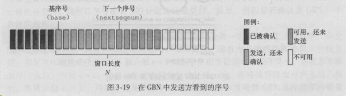
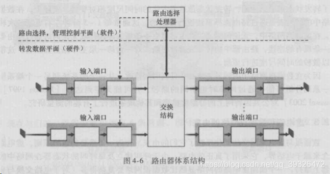

**COPIED FROM [计算机网络（自顶向下方法）学习笔记](https://blog.csdn.net/qq_39326472/article/details/88089747)**

- [第一章 计算机网络和因特网](#第一章-计算机网络和因特网)
  - [1.1 什么是因特网](#11-什么是因特网)
    - [1.1.1 组成描述](#111-组成描述)
    - [1.1.2 服务描述](#112-服务描述)
    - [1.1.3 协议](#113-协议)
  - [1.2 网络的边缘](#12-网络的边缘)
    - [1.2.1 接入网](#121-接入网)
    - [1.2.2 物理媒体](#122-物理媒体)
  - [1.3 网络核心](#13-网络核心)
    - [1.3.1 分组交换](#131-分组交换)
    - [1.3.2 电路交换](#132-电路交换)
    - [1.3.3 分组交换和电路交换的对比](#133-分组交换和电路交换的对比)
    - [1.3.4 网络的网络](#134-网络的网络)
  - [1.4 分组交换中的时延、丢包、吞吐量](#14-分组交换中的时延丢包吞吐量)
    - [1.4.1 分组交换网中的时延概述](#141-分组交换网中的时延概述)
    - [1.4.2 排队时延和丢包](#142-排队时延和丢包)
    - [1.4.3 端到端时延](#143-端到端时延)
    - [1.4.4 计算机网络的吞吐量](#144-计算机网络的吞吐量)
  - [1.5 协议层次及其服务模型](#15-协议层次及其服务模型)
    - [1.5.1 分层体系结构](#151-分层体系结构)
    - [**1.5.2 封装**](#152-封装)
- [第二章、应用层](#第二章应用层)
  - [2.1 应用层协议原理](#21-应用层协议原理)
    - [2.2.1 网络应用程序体系结构](#221-网络应用程序体系结构)
    - [2.1.2 进程通信](#212-进程通信)
    - [2.1.3 可供应用程序使用的运输服务](#213-可供应用程序使用的运输服务)
    - [2.1.4 因特网提供的传输层服务](#214-因特网提供的传输层服务)
    - [2.1.5 ssl与tcp与http](#215-ssl与tcp与http)
    - [2.1.6 应用层协议](#216-应用层协议)
    - [2.1.7 本博客涉及的应用层应用](#217-本博客涉及的应用层应用)
  - [2.2 WEB和HTTP](#22-web和http)
    - [2.2.1 HTTP概述](#221-http概述)
    - [2.2.2 持续连接和非持续连接](#222-持续连接和非持续连接)
    - [2.2.3 HTTP报文格式：请求报文和响应报文](#223-http报文格式请求报文和响应报文)
    - [2.2.4 用户与服务器的交互：Cookie](#224-用户与服务器的交互cookie)
    - [2.2.5 Web缓存](#225-web缓存)
    - [2.2.6 条件GET方法](#226-条件get方法)
  - [2.3 文件传输协议FTP](#23-文件传输协议ftp)
  - [2.4 因特网中的电子邮件](#24-因特网中的电子邮件)
    - [2.4.1 SMTP](#241-smtp)
    - [2.4.2 与HTTP对比](#242-与http对比)
    - [2.4.3 邮件报文格式和MIME](#243-邮件报文格式和mime)
    - [2.4.4 邮件访问协议](#244-邮件访问协议)
  - [2.5 DNS：因特网的目录服务](#25-dns因特网的目录服务)
    - [2.5.1 DNS提供的服务](#251-dns提供的服务)
    - [2.5.2 DNS工作机理概述](#252-dns工作机理概述)
    - [2.5.3 DNS记录和报文](#253-dns记录和报文)
  - [2.6 P2P应用](#26-p2p应用)
    - [2.6.1 P2P文件分发（BitTorrent)](#261-p2p文件分发bittorrent)
    - [2.6.2 分布式散列表（DHT）](#262-分布式散列表dht)
  - [2.7 套接字编程](#27-套接字编程)
- [第三章、传输层](#第三章传输层)
  - [3.1 概述和运输层服务](#31-概述和运输层服务)
    - [3.1.1 传输层和网络层的关系](#311-传输层和网络层的关系)
    - [3.1.2 因特网传输概述](#312-因特网传输概述)
  - [3.2 多路复用和多路分解](#32-多路复用和多路分解)
  - [3.3 无连接运输：UDP](#33-无连接运输udp)
    - [3.3.1 UDP报文结构](#331-udp报文结构)
  - [3.4 可靠数据传输原理](#34-可靠数据传输原理)
    - [3.4.1 构造可靠信道的可靠数据传输](#341-构造可靠信道的可靠数据传输)
    - [2.4.2 流水线可靠数据传输协议](#242-流水线可靠数据传输协议)
    - [3.4.3 回退N步(GBN)](#343-回退n步gbn)
    - [3.4.4 选择重传（SR）](#344-选择重传sr)
  - [3.5 面向连接的TCP](#35-面向连接的tcp)
    - [3.5.1 TCP连接](#351-tcp连接)
    - [3.5.2 TCP报文段结构](#352-tcp报文段结构)
    - [3.5.3 往返时间的估计与超时](#353-往返时间的估计与超时)
    - [3.5.4 可靠数据传输](#354-可靠数据传输)
    - [3.5.5 流量控制](#355-流量控制)
    - [3.3.6 TCP连接管理](#336-tcp连接管理)
  - [3.6 拥塞控制原理](#36-拥塞控制原理)
    - [**3.6.1 拥塞原因与代价**](#361-拥塞原因与代价)
    - [3.6.2 拥塞控制方法](#362-拥塞控制方法)
    - [3.6.3 网络辅助的拥塞控制例子：ATM ABR拥塞控制 异步传输方式  可用比特率](#363-网络辅助的拥塞控制例子atm-abr拥塞控制-异步传输方式-可用比特率)
  - [3.7 TCP拥塞控制原理](#37-tcp拥塞控制原理)
- [第四章、网络层](#第四章网络层)
  - [4.1 概述](#41-概述)
    - [4.1.1 转发和路由选择](#411-转发和路由选择)
    - [4.1.2 网络服务模型](#412-网络服务模型)
  - [4.2 虚电路和数据报网络](#42-虚电路和数据报网络)
    - [4.2.1 虚电路网络](#421-虚电路网络)
    - [4.2.2 数据报网络](#422-数据报网络)
    - [4.2.3 虚电路和数据报网络的由来](#423-虚电路和数据报网络的由来)
  - [4.3 路由器工作原理](#43-路由器工作原理)
    - [4.3.1 输入端口：](#431-输入端口)
    - [4.3.2 交换结构](#432-交换结构)
    - [4.3.3 输出端口](#433-输出端口)
    - [4.3.4 何处出现排队](#434-何处出现排队)
    - [4.3.5 路由选择控制平面](#435-路由选择控制平面)
  - [4.4 网际协议（IP）：因特网中的转发和编址](#44-网际协议ip因特网中的转发和编址)
    - [4.4.1 数据报格式](#441-数据报格式)
    - [4.4.2 IPV4编址](#442-ipv4编址)
    - [4.4.3 因特网控制报文协议ICMP](#443-因特网控制报文协议icmp)
    - [4.4.4 IPv6](#444-ipv6)
    - [4.4.5 涉足IP安全性](#445-涉足ip安全性)
  - [4.5 路由选择算法](#45-路由选择算法)
    - [4.5.1 链路状态路由选择算法LS](#451-链路状态路由选择算法ls)
    - [4.5.2 距离向量路由算法DV](#452-距离向量路由算法dv)
    - [4.5.3 层次路由选择](#453-层次路由选择)
  - [4.6 因特网中的路由选择](#46-因特网中的路由选择)
    - [4.6.1 AS(自治系统)内部的路由选择：RIP（DV思想）](#461-as自治系统内部的路由选择ripdv思想)
    - [4.6.2 AS内部的路由选择：OSPF（LS思想）](#462-as内部的路由选择ospfls思想)
    - [4.6.3 AS间的路由选择：BGP](#463-as间的路由选择bgp)
  - [4.7 广播和多播路由选择](#47-广播和多播路由选择)
    - [4.7.2 多播](#472-多播)
- [第五章、链路层](#第五章链路层)
  - [5.1 链路层概述](#51-链路层概述)
    - [5.1.1链路层提供的服务](#511链路层提供的服务)
  - [5.2 差错检测和纠正技术](#52-差错检测和纠正技术)
  - [5.3 多路访问链路和协议](#53-多路访问链路和协议)
    - [5.3.1信道划分协议](#531信道划分协议)
    - [5.3.2随机接入协议](#532随机接入协议)
    - [5.3.3 轮流协议](#533-轮流协议)
  - [5.4 交换局域网](#54-交换局域网)
    - [5.4.1 链路层寻址和ARP](#541-链路层寻址和arp)
    - [5.4.2 以太网](#542-以太网)
    - [5.4.3 链路层交换机](#543-链路层交换机)

---

# 第一章 计算机网络和因特网

## 1.1 什么是因特网

> 我们可以从两个角度来回答这个问题：一种是描述组成它的软硬件；另一种是将其视为为分布式应用提供基础服务的联网设施来描述。其实，第一种角度，是从它的组成来描述，第二种角度是从它的功能来描述

### 1.1.1 组成描述

> 因特网是一个世界范围的计算机网络，这意味着它互联了数以亿计的计算设备（不仅仅是计算机哦）；这些设备包括但不限于传统PC、工作站以及所谓的服务器。现在有更多的设备加入到因特网中，比如便携式计算机、电视机、汽车、传感器等。
>
> 用因特网的术语来说，所有连入因特网的设备都叫做**主机或者端系统**
>
> 以下是重点的一些概念：
>
> **端系统**通过**通信链路**和**分组交换机**连接到一起。
>
>  端系统之间发送数据时，发送端系统将其数据分成一段一段，然后加上必要的信息后形成一个个的数据包，这个数据包用术语来说叫做分组。于是**分组**==用户数据+必要信息。链路系统就是用来传输分组的。分组到达接收端系统后，接收端系统将根据必要信息来抽取用户数据；
>
> 分组交换机从它的一条入链路接收分组，并且选择一条出链路将分组转发出去；分组交换机也有很多种类，最为有名的是路由器和链路层交换机；两者的的不同之处在于，**链路层交换机主要用在接入网中，路由器主要用在网络核心.**
>
> 端系统通过**因特网服务提供商（**Internet Service
> Provider，简称ISP）接入因特网；
> 
> 很有名的协议有：**TCP（Transport Control
> Protocol，传输控制协议）和IP(Internet
> Protocol，网际协议)**；因为协议控制了信息的传递，所以对协议达成一致就很重要，所以需要一个标准来规范协议，以便创造可以协同工作的系统和产品

 

### 1.1.2 服务描述

> 应用程序编程接口（API)

### 1.1.3 协议

> 前面提到了分组这一概念，分组==用户数据+必要数据；这些必要数据为分组接收者理解用户数据提供保障，而协议就是如何使用必要数据理解用户数据的方法或者规则；分组接收者接收到分组并按照协议获得了用户数据后，还应该对此消息做出反应，而如何做出反应也是协议规范的一部分（不反应也是一种反应哦）
>
> **协议:**定义了两个或多个通信实体（不一定是端系统，还有可能是分组交换机等）之间交换信息的格式和次序以及对该信息所采取的动作
>
> 凡是通信实体的所有活动都要受到协议的约束。比如，硬件实现的控制协议控制了两块网卡之间的比特流；在端系统中，拥塞控制协议控制了发送方和接收方之间传输数据的速率等

## 1.2 网络的边缘

> **端系统**：与因特网相连的计算机和其它设备，往往处于网络的边缘
>
> **端系统分类：**客户和服务器

### 1.2.1 接入网

> **接入网**：是指将端系统连入到边缘路由器的物理链路
>
> **边缘路由器**：是指端系统到任何其他远程端系统路径上的第一台路由器
>
>  

- DSL(Digital Subscribe Line)数字用户线

> 这是一种宽带住宅接入的方法，它的ISP是本地电话公司。其使用的通信链路的物理材质为电话线，是一种双绞线。
>
> 用户使用DSL调制解调器通过电话线与ISP中的数字用户线接入复用器（DSLAM）来交换数据；家庭DSL调制解调器将数字数据转换为高频音后通过电话线传输到ISP中心，并且通过DSL解调器将DSLAM发送过来的模拟信号转为数字信号；

- CIC(Cable Internet Access)电缆因特网接入

> 这是另一种宽带住宅接入方法，它的ISP是有线电视公司。其使用的通信链路的物理材质有光纤和同轴电缆，也被称为混合光纤同轴（Hybrid
> Fiber Coax HFC）；
>
> 用户使用电缆调制解调器通过同轴电缆与光纤结点相连，光纤结点通过光缆与电缆头端相连，而电缆头端接入了因特网。在电缆头端，电缆调制解调器端接系统（Cable
> Modem Termination
> System）起到DSLAM的作用，即实现模拟信号和数字信号的转换；

- FTTH(Fiber TO The Home)光纤到户

> 这里主要是指使用光纤作为通信链路的材质，有两种竞争性的光纤分布方案，一种是主动光纤网络（Active
> Optical Network），另一种是被动光纤网络(Passive Optical
> Network).其主要区别在于，是否在传输数据时共享光纤。

- 以太网和WIFI

> 以太网接入是一种在公司、大学、家庭里很流行的接入方式；用户使用双绞线与以太网交换机相连，从而接入因特网；接入以太网交换机的速度可达100Mbps;
>
> 在无线局域网中，无线用户从一个接入点发送和接收数据，而该接入点与企业网相连，企业网最终接入因特网；在无线LAN中，用户需要在一个接入点的几十米范围之内；

- 广域无线接入

> 在移动设备中，通过蜂窝网提供商运营的基站来发送和接收分组，与WIFI不同的是，用户仅需要位于基站的数万米范围之内即可；

### 1.2.2 物理媒体

> 传输媒体是构成通信链路的主要部分，物理媒体通常可以分为导引性媒体和非导引性媒体；其中导引性媒体，信号沿着固体前行；而非导引性媒体中，信号沿着固体媒体前行
>
> 值得注意的是，架设传输媒体的人历成本要远远高于物理材料的成本

- 双绞线
> 最便宜的**引导性**传输媒体，由两条相互螺旋缠绕的铜线组成。目前局域网中的双绞线数据传输速率在10Mbps到10Gbps之间，所能达到的数据传输速率取决于线的粗细以及传输距离；双绞线实际上已经成为高速局域网联网的主要方式；因为现代的双绞线技术速率和传输距离都是很不错的；

- 同轴电缆
> 也由两个铜导体构成，但是它们是同心的，而非并行的；借助特殊的结构和绝缘层，同轴电缆可得到较高的数据传输速率；在电视系统中应用广泛；同轴电缆可被用作**引导性**的共享媒体；

- 光纤
> 一种可以**引导**光脉冲的媒体

- 陆地无线电信道
> 无线电信道承载电磁频谱中的信号，**不需要物理线路**，提供与移动用户的连接以及长距离承载信号的方式；是一种有吸引力的媒体；

- 卫星无线电信道
> 通过卫星连接两个或多个在地球上的微波发射方（也被称为地面站），该卫星在一个频段上接收信号，在另一个频段上发送信号；种类有同步卫星和近地轨道卫星；

## 1.3 网络核心

> 网络核心即为由互联端系统的分组交换机和链路构成的网状网络
> 
> 通过网络链路和交换机移动数据有两种基本方法：电路交换和分组交换

### 1.3.1 分组交换

> 分组在通信链路上以等于该链路的最大传输速率传输通过通信链路。因此如果某条链路的最大传输速率为R，分组长度为L，则该链路传输该分组的时间为L/R；这个时间也被称为传输时延（值得注意的是，这里说的时间很有可能是传播时延而不是传输时延，这两者的区别在关于延迟时间的计算中将详细解释，虽然这里书上写的是传输，但是根据后文，我认为是传播）；分组交换的常见方式是存储转发机制；

- 存储转发

大多数分组交换机采用存储转发机制来转发分组；所谓存储转发是指交换机在收到一个完成的分组，才会向链路输出转发分组，否则就将收到的部分分组缓存起来；因为缓存等待一个分组的全部数据而导致的时间开销被称为存储转发时延

因为需要缓存分组，所以此时分组交换机需要一个缓冲队列；缓冲队列的空间有限性就有可能导致分组交换机无法继续缓存分组（因为链路被占用或者分组还没全部到位）而使到达分组交换机的数据包被迫丢弃；这就导致了分组不但承担了传输时延，还承担了队列时延。

- 排队时延与分组丢失

因为需要缓存分组，所以此时分组交换机需要一个输出缓存和输出队列；缓冲队列的空间有限性就有可能导致分组交换机无法继续缓存分组（因为链路被占用或者分组还没全部到位）而使到达分组交换机的数据包被迫丢弃；这就导致了分组不但承担了传输时延，还承担了队列时延。

- 转发表与路由选择协议

实际上，分组交换机之所以能够知道往哪去是因为其内部有一个**转发表**，这个表维护了一个IP地址和链路的对应关系，所以处理流程为：

> 1.通过分组的必要信息，获得目的端系统的IP地址
> 
> 2.通过IP地址索引转发表，从而确定输出链路

### 1.3.2 电路交换
> 在电路交换网络中，在端系统通信会话期间，交换机会预留端系统间通信路径上的相关资源（缓存，链路传输速率），即先建立连接，然后通信；而在分组交换网络中，这些资源没有被预留；也就是说，在端系统进行通信时，其所需要的资源是被保持的，其他通信是无法使用这一部分资源的；也就说，端系统间真正建立了一条"连接"；而这一连接，用电话的术语被称为"电路"。传统的电话网络就是电路交换网络的例子。

- 电路交换网络中的复用
> **时分复用**（Time-Division Multiplexing TDM）：是指将时间划分为固定区间的**帧**，每个帧则又被划分为固定数量的时间**空隙**；当网络需要建立一条连接时，网络将在每个帧中为该连接指定一个时隙；在该时隙内，链路用来传输该链接的数据；
>
> **频分复用**(Frequency-Division Multiplexing)：将频率域划分为频段，然后将频段分配给连接；此频段被用来专门传输链接的数据。该频段的宽度成为带宽。

### 1.3.3 分组交换和电路交换的对比 

**分组交换的优点**：
+ 它提供了比电路交换更好的带宽共享；
+ 它比电路交换更简单、更有效、实现成本更低；

**分组交换的缺点**：
+ 分组交换不适合实时服务，因为端到端的时延是可变、不可预测的，这和整个网络的情况相关；

**电路交换的优点**：
+ 提供了端对端传输数据的速率保证；

**电路交换的缺点：**
+ 电路交换存在静默期，这是指专用电路空闲时，其占用的资源并没有得到充分的利用；
+ 建立连接的过程比较复杂；

总体上来说，分组交换的性能要好于电路交换的性能，但是不同类型的分组交换方式有不同的应用场景；比如一些对最低速率有着严格要求的应用，比如实时服务等，为了获得速率保证，牺牲网络的效率也是可以接受的。趋势向着分组交换发展。

### 1.3.4 网络的网络

不得不说，因特网是一个庞大而复杂的系统，但是我们仍然有办法描述它（我们不是已经这么做过了吗？），但是我们需要一个模型来刻画因特网的结构；该用什么样的结构来刻画因特网呢？我想，最普遍的说法就是：因特网是网络的网络。但是这一说法足够精炼的同时也不够明确。更重要的是，我们可以选择更明确的方法来刻画因特网；书中通过5个模型不断过渡到最终模型，其实过渡的过程就结构不断合理、连接方式不断明确的过程。

我们在什么是因特网一节中介绍ISP，端系统是通过ISP接入因特网的，为了实现端系统的互联，ISP也必须互联，其实网络模型就是用来表达ISP和端系统以及ISP之间的结构的抽象；

网络结构1：存在唯一的全球承载ISP互联所有的接入ISP，这是指，全球ISP是一个又路由器和通信链路构成的网络，该网络跨越全球，并且其他的接入ISP都至少和一个它的路由器相连；

网络结构2：存在多个全球承载ISP，它们分别于一部分的接入ISP互联；为了实现端系统的互联，这多个全球ISP也必须互联；网络结构是一个两层结构，其中全球承载ISP位于顶层，接入ISP处于底层；

网络结构3：顶层全球承载ISP基本上已经定型，但是接入ISP现在还很混乱，比如，它们直接同顶层ISP相连；而网络结构3中，接入ISP也是分层的：较小区域中的ISP连入较大区域的ISP，而不是直接与顶层ISP相连；为什么会出现这样的结构呢？这是因为，如果都直接同顶层ISP相连，那么两个同一较小区域内，分属不同ISP的端系统之间通信的数据也会到顶层ISP中心去一趟，如果它们不是直接接入顶层ISP，而是接入了一个较大区域的ISP，那么它们之间的通信数据就不用去顶层ISP中心了，因为它们通过较大区域的ISP已经实现了互连，所以通信速度肯定就上去了。

网络结构4：是在网络结构3的基础上，增加了以下特点而形成的结构：存在点（Point of Presence，PoP）、多宿、对等、因特网交换点（Internet exchange point，IXP）。

> PoP存在于等级结构中所有层次，但是底层ISP除外；一个PoP是ISP网络中的一台或者多台路由器群组，其中客户ISP能够通过第三方提供的高速链路直接将它的路由器和供应商的PoP连接，从而实现与提供商ISP连接。这样接入速度很明显就提高了。
>
> 多宿（multi-home）是指，任何ISP（除第一层ISP）都可以与两个或者多个提供商ISP连接，这被称为多宿；这样网络的可靠性就提高了。
>
> 对等（peer）是指，位于相同等级结构层次的一对邻近ISP能够直接将它们的网络连接到一起，使它们之间流量经直接连接而不是经过上游的中间ISP传输，这样既不用付费，速度也可能会快一些；因特网交换点是为了实现多个ISP可以对等而创建的。

网络结构5：网络结构5是在网络结构4的基础上增加了内容提供商网络而构成。内容提供商构建自己的网络，并且通过与较低层ISP对等而"绕过"较高层因特网ISP，而且内容提供商对端用户也有了更多的控制。

总体来说，今天的因特网是一个"网络的网络"，其结构复杂，由十多个顶层ISP和数十万个较低层ISP构成。近年来，主要的内容提供商创建自己的网络，直接在可能的地方与较低层ISP互联。

## 1.4 分组交换中的时延、丢包、吞吐量

因特网能够看成是一种运行在端系统上的分布式应用提供服务的基础设施

计算机网络必定要要限制在端系统之间的吞吐量，故在端系统之间存在时延、丢包；

### 1.4.1 分组交换网中的时延概述

> 一个分组在沿途每个节点承受不同类型的时延，这些时延中最为重要的是：结点处理时延、排队时延、传输时延和传播时延.这些时延总体累加起来是结点总时延

**时延的类型**

- 处理时延

处理时延是因为节点需要解析分组的必要信息然后决定其出链路（索引转发表等操作）而产生的，通常在微秒或者更低数量级；

- 排队时延

排队时延是因为分组所对应的出链路前面有其他分组正在传输，所以分组需要该链路的缓冲队列里等待其他分组传输完毕而产生的；一般来说，排队时延是到达该队列的流量强度和性质的函数，通常可以达到毫秒级到微秒级；

- 传输时延

传输时延是将所有分组的比特推向链路所有需要的时间，实际的传输时延通常在毫秒到微秒数量级。用L表示分组的长度，用Rbps表示从路由器A到B的链路传输速率。传输时延是L/R。

- 传播时延

传播时延是指比特进入链路后，从该链路的起点到下一个结点所用的时间；一旦分组中的最后一个比特到达路由器就意味着该分组的所有比特都已到达路由器；广域网中，传播时延一般是毫秒级的。传播时延是d/s。d是路由器A到B的距离。s是链路的传播速率。

**传输时延和传播时延的对比**

如果打个比方的话，传输时延就是大卡车经过收费站的时间而传播时间就是车在高速公路上行驶的时间。传输时延是分组长度和链路传输速率的函数。传播时延是两台路由器间距离的函数

### 1.4.2 排队时延和丢包

**丢包：**到达的分组发现一个满的队列。由于没有地方存储这个分组，路由器将丢弃该分组，该分组将会丢失

排队时延和丢包与网络的状况和结点的缓冲空间大小、处理速度相关；如果分组到达的速度高于结点的处理速度，那么分组就会在缓冲队列里排队等待。当缓冲空间用完后，如果还有到的分组，那么该分组将被迫丢弃

为了描述网络状体，我们引入了流量强度这一概念：流量强度=分组到达的速度/结点的处理速度；流量工程里一个金科玉律就是：设计系统时流量强度不能大于1；

当**流量强度**持续大于1时，就将出现丢包现象

### 1.4.3 端到端时延

> $d_{end-end}=N(d_{proc}+d_{trans}+d_{prop})$

### 1.4.4 计算机网络的吞吐量

计算机网络的吞吐量实际上是一个速度指标，它描述了比特经过某个节点的速度。对于某条路径上的结点来说，和该结点有关的速度有两个：**接收数据的速度和发送数据的速度**，**而该结点的吞吐量是这两个速度中较小的一个**；对于某条路径来说，该路径的吞吐量则是所有节点的吞吐量的最小值；网络的吞吐量可以衡量网络的性能.

任何时间的**瞬时吞吐量**是主机B接受到该文件的速率

如果该文件由F比特组成，主机B接受到所有比特用去Ts，则文件的**平均吞吐量**为F/Tbps

吞吐量可以近似为源和目的地之间路径的最小传输速率。最小传输速率的链路为**瓶颈链路**。

在今天，因特网对吞吐率的限制因素通常是接入网。

## 1.5 协议层次及其服务模型

因特网是一个极为复杂的系统，该系统里存在着大量的应用程序和协议、各种类型的端系统、分组交换机和各种类型的链路级媒体。但是它同时也是有着清晰结构的，就像我们前面在网络核心
一节介绍的，我们仍能构建它的结构模型

### 1.5.1 分层体系结构

> 计算机网络采用分层的体系结构，**分层**的体系结构因为提供模块化而具有很高的价值，同时也易于服务实现的多样性：某一层对其上一层提供服务，同时它可以利用下一层提供的服务。只要对上提供的服务和对下利用的服务没有变化，其层内部的实现并不会对系统结构产生影响；对于大而复杂且需要不断更新的系统来说，改变服务的实现而不影响系统其他组件是分层模式的另一个重要优点
>
> 为了给网络协议的设计提供一个结构，网络设计者以分层的方式组织协议以及实现这些协议的软硬件
>
> 一个协议层可以使用软硬件实现，同时某个协议层的不同部分常常位于网络组件的各部分。协议分层具有概念化和结构化的优点。模块化使得更新系统组件更为容易。但是分层也有其缺点，就是功能上的冗余，比如许多协议栈针对链路和端到端两种情况都提供了差错恢复功能。第二种潜在的缺点就是某层的功能可能需要仅在其它层才出现的信息

总体来说，将各层的所有协议组合起来，称为**协议栈**。因特网的协议栈有5个层次组成**：物理层、链路层、网络成、传输层、应用层**


**应用层**：应用层协议分布在多个端系统，端系统中的应用程序使用该协议与另一个端系统中的应用程序通信。处于应用层的分组称为**报文**；

**传输层**：传输层在应**用程序端点之间**传输应用层报文，因特网中有两个传输层协议：TCP和UDP。处于传输层的分组称为**报文段**。TCP提供确保传递、流量控制、拥塞控制机制。UDP提供无连接服务，即不提供不必要服务的服务。没有可靠性、没有流量和拥塞控制。

**网络层**：网络层将称为数据报的网络层分组从**一台主机移动到另一台主机**。网络层协议包含著名的IP协议以及其他一些路由选择协议。**数据报**
  ** 
链路层**：链路层将称为**帧的链路层分组从一个结点移动到路径上的另一个端点**。一个帧可能被沿途不同链路上的不同链路层协议处理。**帧**

**物理层**：物理层的任务是将**帧中的比特从一个结点移动到下一个节点**，它提供了传输信息的实际物理通道；

- OSI模型

在因特网协议栈出现以前，OSI模型是ISO组织研发的计算机网络结构模型。OSI的模型一共有7层，从下到上依次为：物理层，链路层，网络层，传输层，**会话层，表示层**，应用层。相比因特网体系结构，OSI多了两层。

因特网将两层的功能留给了开发者自行实现。

### **1.5.2 封装**

> 一个分组，在不同的层次有不同的称谓，是因为它们经过每一层的时候就被该层封装上了属于该层的相关信息，也就是前面提到的必要信息；于是，每一分层的分组有两种类型的字段：首部字段和有效负载；其中有效负载即为来自上一层的分组数据，而首部字段就是该层加上的必要信息；分组不断被封装以实现各层协议规定的相关功能


# 第二章、应用层

## 2.1 应用层协议原理

> 研发网络应用的核心是写出能够运行在不同端系统和通过网络彼此通信的程序；值得注意的是，我们不需要写在网络核心设备如路由器或者链路层交换机上运行的软件，这种设计方式即将应用程序限制在端系统的方法，促进了大量网络应用程序的迅速研发和部署

### 2.2.1 网络应用程序体系结构

> 应用程序的体系结构不同于网络的体系结构。从应用程序研发者的角度来看，网络体系结构是固定的，并为应用程序提供特定的服务集合；换言之，应用程序体系结构使用应用程序开发设计的，它规定了在端系统上如何组织应用程序。两种常见的现代网络应用程序所采用的体系结构为：**客户-服务器体系结果和对等体系结构**

- 客户-服务器体系结构

在该体系结构中，有一个**总是打开**的主机，即服务器，它接收和服务来自其他许多被称为客户的主机请求；值得注意的是，在该体系结构中，**客户之间是不直接通信**的；该服务器具有固定的、周知的地址

客户-服务器体系结构的著名应用有：Web、FTP、Telnet和电子邮件。

通常，如果仅有一台服务器处理所有的请求，那么服务器系统将很快变得不堪重负，为此，配备大量主机的数据中心常被用于创建强大的虚拟的服务器，一个数据中心可以有数十万台服务器，它们需要供电和维护，同时服务提供商还需要支付不断出现的互联和带宽费用，以及发送和接收到达/来自数据中心的数据；

- P2P体系结构

在P2P体系结构中，对位于数据中心的专用服务器有着最小（或者没有）依赖。应用程序在间断连接的**主机对之间使用直接通信**，这些主机被称为**对等**方。对等方并不为服务提供商所拥有，因为这种对等方通信不需要通过专门的服务器，所以该体系结构也被称为对等方到对等方结构

目前，流量密集型应用都是P2P体系结构的。这些应用包括文件共享（例如BitTorrent）、协助下载（例如迅雷）、因特网电话（例如Skype）和IPTV(例如迅雷看看)。

值得注意的是，某些应用具有混合的体系结构，它们结合了客户-服务器和P2P这两种体系结果，比如许多的即时通讯工具，服务器用来跟踪用户IP地址，但是用户之间的通信则使用直接发送

P2P体系结构最引人入胜的特性之一就是它们的**自扩展性**。比如在文件共享应用中，对等方可能通过向文件的原始拥有者发出请求而产生工作量，但是对等方也有可能通过为其他对等方传送文件而为原始拥有者分担压力；P2P体系结构也是成本有效的，因为他通常不需要庞大的服务器基础设施和服务带宽。

**但是P2P也面临着以下三个问题：**

1.ISP友好。大多数住宅ISP受制于非对称带宽应用，也就是下载比上传要多得多。但是P2P视频和文件分发应用改变了从服务器到住宅ISP的上载流量，因而给ISP带来压力；
2.安全性。因为其高度的分布和开放式，P2P应用也可能给安全带来挑战；
3.激励。如何说服用户资源向应用提供带宽、存储和计算资源？这是一个问题；

### 2.1.2 进程通信

> 在操作系统中，实际进行通信的是进程而不是应用程序；当进程运行在同一个端系统上时，它们使用进程间通信机制相互通信；而进程间通信的规则是由端系统上的操作系统确定的。当进程运行在不同的端系统上时，它们通过跨越计算机网络的报文相互通信；发送进程产生报文并且向网络中发送，接收进程接收报文并对此作出响应（不响应也是一种响应）。

- 客户进程和服务器进程

对于没对通信进程，我们通常将这两个进程之一标识为客户，而另一个进程标识为服务器。

需要注意的是，在某些P2P应用中，一个进程可能既是客户也是服务器，因为在一个文件共享应用中，一个进程的确既能请求文件也能发送文件。所以从进程所扮演的角色来区分是客户进程还是服务器进程不够精确，所以我们从发起通信的顺序来定义它们：在给定的一对进城之间，**首先发起通信的进程被标记为客户进程，在会话开始时等待联系的进程被称为服务器进程。**

- 进程与计算机网络之间的接口

多数应用程序是由通信进程对组成的，运行在不同端系统上的进程对之间通过计算机网络来实现通信。所以，在应用程序进程和计算机网络之间存在一个接口，该接口被称为**套接字**。更为准确的说，套接字是同一台主机内应用层和运输层之间的接口。由于该套接字是建立网络应用程序的可编程接口，因此套接字也被称为应用程序和网络之间的**应用编程接口**（Application
Programming Interface）.

应用程序开发者可以控制套接字在应用层的一切内容，但是对于运输层的相关部分，几乎没有控制权，可以做的有：

- 选择传输层协议和设定几个传输层参数，比如最大缓存和最长传输层报文长度

```{=html}
<!-- -->
```
- 进程寻址

为了向特定目的进程发送报文，发送机进程需要知道接收进程（更为准确的说是，接收进程对应的套接字）的标记。该标记由两部分组成：**接收进程所在的主机地址和接收进程在该主机中的标记**；在因特网中，主机由IP地址标记，其中IP地址是一个32位（IPV4）标记；而接收进程（或者说是其对应的套接字）使用端口号标记；一些常用的应用程序有着固定的端口号，比如Web服务器使用80端口、邮件服务器（运行SMTP协议）使用25端口等

### 2.1.3 可供应用程序使用的运输服务

> 传输层协议的特点大致可以从以下这四个方面考量：可靠数据传输、吞吐量、定时和安全性

- 可靠数据传输

如同在第一章中介绍的，分组在传输过程中可能会丢失。比如，分组因为路由器中的缓存溢出而被丢弃或者分组在传输的过程中发生了损坏等情况；有些应用是不允许数据发生丢失的，比如电子邮件、文件传输、远程主机访问、Web文档传输以及金融应用等。为了支持这些应用，必须做一些工作以**确保应用程序一段发送的数据正确、完全地交付给接收数据的进程**。如果一个协议提供了这样得确保数据交付的服务，就认为该协提供了可靠数据传输。当应用程序使用可靠数据传输的传输层协议时，只要将要发送的数据传输进套接字就可以完全相信该数据可以完整无差错地到达接收方；

当一个运输层协议不提供可靠数据传输时，由发送方发送的数据就可能不能够到达接收进程。有些应用是允许这样的情况发生的，这些应用被称为丢失允许的应用。这类应用常见的有：交谈式音频和视频。它们能够承担丢失一定量的数据损失，在这些应用中，如果丢失少量数据将出现小干扰，但是不会出现致命的损伤，这些应用为**容忍丢失的应用**。

- 吞吐量

在一条网络路径上的两个进程之间的通信会话中，可用吞吐量就是指能够向接收进程交付比特的速率。因为会有其他会话共享该网络的路径的带宽，并且因为这些会话的到来和离开，可用吞吐量将发生变化；这就导致另一种自然的服务，即运输层协议能够提供确切的可用吞吐量。使用这种服务时，应用程序就能以明确的速度接收数据，并且运输层应当保证可用吞吐量必须总是至少为该速度；

对吞吐量有明确要求的应用程序被称为**带宽敏感的应用**。许多多媒体应用是带宽敏感的（尽管某些多媒体应用程序可能采用自适应编码技术对数字视频和音频以与当前可用带宽相匹配的速度加解码。），比如因特网电话。而**弹性应用**则对吞吐量没有严格的要求。这类应用包括：电子邮件、文件传输以及web传送等。值得注意的是，吞吐量当然是越多越好了。

- 定时

定时和吞吐量都是关于速度的。一个提供定时服务的例子是：发送方注入套接字中的每个比特到达接收方的套接字不迟于100ms。也就是说，定时是对数据从发送到到达所需时间的要求，而吞吐量是对数据交付速度的要求。打个比方，吞吐量是指一个小时内经过某个收费站的汽车数目，而定时则是第一辆车从出发到进入收费站的时间。有些应用为了服务的有效性而对数据到达时间有严格的要求，常见的应用有：因特网电话、多方在线游戏等；

- 安全性

运输层可以提供一些安全服务，以防止传输的数据以某种方式在这两个进程之间被察觉到。这些安全服务包括：数据的加解密、数据的完整性和端点鉴别等。

### 2.1.4 因特网提供的传输层服务

因特网（更一般的是TCP/IP网络）为应用程序提供连个运输层协议，即UDP和TCP。每个协议对应用程序提供了不同服务的组合。以下为常见的因特网应用的特点：


- TCP服务

TCP服务模型包括了面向连接的服务和可靠数据传输服务。


**面向连接的服务**：在应用层数据报文开始流动之前，TCP会在客户端和服务器端相互交换传输层控制信息。这个握手过程将提示客户端和服务器端，让它们为即将到来的大量分组做好准备；握手阶段接收后将建立一个TCP连接。这条链接是**全双工**的，即连接双方使用该条链接可以同时进行报文的收发。这条连接将在通讯结束后拆除；
**   
可靠的数据传输：**应用程序使用TCP协议可实现无差错、按适当顺序交付所有发送的数据，没有字节的丢失和冗余；

TCP服务还提供了**拥塞控制**机制。该机制不一定会给通行双方带来好处，但是会给网络带来整体好处；当发送方和接收方之间的网络出现拥塞时，TCP将使用拥塞控制机制来使网络恢复正常

- UDP服务

UDP服务是一种不提供不必要服务的轻量级运输协议。它仅提供最小服务。UDP是无连接的也就是说通信之前没有握手；UDP不提供数据的可靠传输；UDP也没有拥塞控制机制。有些应用场景下，UDP协议将带来更多的便利和效率，比如DNS和一些因特网电话服务（为了避免拥塞控制协议的控制而使用UDP）

- 传输层无法提供的服务

从可靠数据传输、吞吐量、定时、安全性等四个角度来看运输层提供的服务，我们发现，运输层无法对吞吐量和定时做出保证。但是，今天的因特网能够为时间敏感的应用提供满意的服务，尽管它并不提供任何定时或者带宽保证；

### 2.1.5 ssl与tcp与http

[http和https和ssl和tcp/ip之间的关系和区别](https://blog.csdn.net/u011068702/article/details/78268552)

### 2.1.6 应用层协议

应用层协议定义运行在不同端系统上的应用程序进程如何相互传递信息。涉及的内容包括：交换的报文类型（请求或者响应）、报文中包含哪些字段、字段如何被解释、一个进程何时收发报文并如何对报文进行响应等内容

需要注意的是，应用层协议是网络应用的一部分

### 2.1.7 本博客涉及的应用层应用

即将介绍的应用包括：Web、文件传输、电子邮件、目录服务和P2P。Web部分将介绍HTTP协议，它比较简单和易于理解；FTP则和HTTP形成了对照；电子邮件是比Web更为复杂的应用，因为它使用了多个应用层协议；大多数用户不会直接和DNS接触，但是DNS很好地说明了一种核心的网络功能是如何在应用层实现的。最后便是P2P应用的简单介绍了。

## 2.2 WEB和HTTP

### 2.2.1 HTTP概述

HTTP（HyperText Transfer
Protocol）是WEB的应用层协议，它是Web的核心；HTTP有两部分实现，一个客户端程序一个服务器程序；HTTP定义了客户和服务器进行报文交换的方法；

Web页面是由对象组成的，一个对象是一个文件，它们通过一个URL地址进行寻址。客户和服务器交互的核心思想是客户通过HTTP请求对服务器发出对Web页面的请求报文，服务器收到该报文后将返回包含该对象的HTTP响应报文。URL地址由两部分组成：存放对象的服务器主机名和对象的路径名

HTTP使用**TCP**作为它的传输层协议；HTTP客户首先发起一个与服务器的TCP连接，需要注意的是，服务器根据请求作出响应，但是不存储任何关于该客户的状态信息；也正因为这样，HTTP被称为**无状态协议**。同时，Web使用了客户端-服务器的应用体系结构；其中web服务器总是开着的

### 2.2.2 持续连接和非持续连接

在因特网应用程序中，客户端和服务器将在很长的时间范围里通信；应用程序将根据自身的特点，选择以规则的间隔周期性性发出请求也可以间断性一个个发出请求。当通信是使用TCP协议时，服务器端需要做出一个决定：这些请求是使用一个TCP连接完成还是通过独立的TCP连接完成。如果采取前一个方法，则称应用程序使用**持续连接**，如果使用后一种方式，则称为**非持续连接**。

HTTP既可使用持续连接也可以使用非持续连接。尽管**HTTP在静默情况下使用持续连接**

- 采用非持续连接的HTTP

使用非持续连接时，每个TCP连接在服务器发送一个对象后就会关闭，也就是每个TCP只传送一个请求报文和响应报文；

为了描述持续连接和非持续连接的特点，我们引入RTT(Round-Trip
Time)。RTT指的是，一个短分组从客户端到服务器，然后再返回客户端所用的时间。RTT包括分组的传播时延、排队时延、处理时延（因为是短分组，所以其传输时延可不计）；因为客户端和服务器建立TCP连接的时候，会通过一个三次握手的过程来交换传输控制信息。三次握手的前两次占用了一个RTT，客户结合第三次握手通行会通过该连接发送一个HTTP请求报文，一旦该分组到达服务器，服务器便开始使用TCP传输HTML对象。因此，粗略地说，响应时间是两个RTT加上传输HTML的时间（不是传播）。

- 采用持续连接的HTTP

从上面可以看出，非持续连接必须为每个请求新建一个TCP连接，而每个TCP连接将占用系统资源，包括缓冲区和变量等，这样服务器的负担就很重了。第二，一个对象将通过两个RTT的时延才能交付。

如果使用持续连接，那么服务器在发送响应报文后将保持该TCP打开，后续客户端可以使用该连接来向服务器发出请求。不但一个完整的页面可以通过同一个连接传送，同一台服务器上的多个页面也可以通过同一个连接发送。这就提高了效率；

一般来说，如果一条连接在一定的时间间隔后没被使用的话，就会被关闭。HTTP默认使用的是带流水线的持续连接。

### 2.2.3 HTTP报文格式：请求报文和响应报文

- 请求报文


一个请求报文具有至少一行的内容。请求报文的第一行称为**请求行**，其后继的各行被称为**首部行**。请求行包含三个内容：方法字段、URL字段、HTTP版本；其中方法字段可为：GET、POST、PUT、DELETE、HEAD等。URL字段里可以传递请求对象的标志；

首部行包含是否在发送完响应报文后关闭TCP连接的Connection；请求的主机地址（该头部信息被Web高速缓存所要求）；浏览器版本；可接受的语言等头部信息；

在首部行之后一个空行，之后便是请求的"实体体"。该实体体可以在POST方法里传递Form表单内容或者传递其它一些二进制流数据等。值得注意的是，表单也不一定必须使用POST方法。如果使用get,实体体为空，会显示在url中。

Head类似于get方法，将会用一个http报文进行响应，但是不返回请求对象，经常用作调试跟踪。put方法允许用户上传对象到指定的Web服务器上指定的路径。Delete方法允许用户或应用程序删除Web服务器上的对象。

- HTTP响应报文格式


响应报文总体上也分三个部分，第一部分是**状态行**，包含HTTP版本、状态以及状态信息等内容；第二部分是**首部行**，包含发送日期、服务器类型、上一次修改请求资源的时间、内容的类型等内容。第三部分是**实体体**。**实体体包含请求对象本身**。

这里的Date是从文件系统中检索到该对象，插入到响应报文，并发送该响应报文的时间。

- 常见状态码

200：请求成功 处理方式：获得响应的内容，进行处理

301：请求到的资源都会分配一个永久的URL，这样就可以在将来通过该URL来访问此资源
处理方式：重定向到分配的URL

400：非法请求 处理方式：丢弃

404：没有找到 处理方式：丢弃

505：服务器不支持请求报文使用的http版本。

### 2.2.4 用户与服务器的交互：Cookie


前面提到，HTTP是无状态协议，但是Web站点为了识别用户身份或者限制用户访问的时间或者将用户访问的内容同用户身份相关联，Web站点可以使用Cookie技术；

- Cookie技术包含4个组件
- HTTP响应报文里增加一个关于Cookie的首部行；
- HTTP请求报文里增加一个关于Cookie的首部行；
- 用户端系统保留一个Cookie文件，由浏览器保存维护；
- Web站点建立Cookie和用户身份的关联；

虽然，Cookie的使用方便了用户也方便了服务端，但是它的使用存在争议，因为使用Cookie被认为是对用户隐私的一种侵犯，因为Web站点可以通过Cookie得到很多用户的信息，并有可能将这部分信息卖给第三方等

### 2.2.5 Web缓存

Web缓存器也被称为**代理服务器**，它代表初始web服务器来满足HTTP请求。它有自己的存储空间，并在存储空间里保持有最近请求过的对象的副本；可以通过配置浏览器，将所有指向初始服务器的请求首先指向代理服务器。

当代理服务器收到一个HTTP请求后，它将检查本地是否缓存过该对象，如果缓存过该对象，将检查是否过期，如果没有过期，则直接将该对象返回给浏览器；如果本地不存在或者存在已过期，则代理服务器将根据请求报文里的Host首部行以及请求行里的URL字段向初始服务器发出请求，然后将响应对象返回给浏览器并缓存在本地。

通常，代理服务器与客户端的通信速度要快于初始服务器与客户端的连接速度；Web代理服务器可以大起大减少对客户请求的响应时间；而且，缓存器能从整体上大大降低因特网上的web流量，从而有助于提高所有应用程序的性能；

通过使用内容分发网络（Content Distribution
Network），Web缓存器正在因特网中发挥越来越重要的作用

Web缓存即是客户又是服务器

### 2.2.6 条件GET方法

高速缓存器的使用，带来很多好处，但是有一个问题就是代理服务器对缓存对象的管理：如何确保所请求的对象是最新的？其实HTTP提供了一种机制，允许缓存器证实其使用的对象是最新的，这种机制就是条件GET方法。使用条件GET方法只需在使用GET方法的时候，增加一个If-Modified-Since首部行，其对应的内容是一个时间，如果所请求的资源在指定日期后被修改了，那么服务器将返回新的对象，否则**服务器**将返回一个包含空实体体的报文。这样代理服务器就可以确认缓存是否过期了。

## 2.3 文件传输协议FTP

在一个典型的FTP应用中，用户通过FTP代理和FTP交互。用户首先提供远程主机的主机名，使得FTP用户代理建立一个到远程主机的TCP连接，之后需要用户提供用户名和密码，它们作为FTP命令的一部分在TCP连接上传输；一旦服务器授权，用户便可以和服务器进行文件传输了。

HTTP和FTP都是应用层协议，它们都运行在**TCP**协议之上，但是它们之间也有一些重要区别，其中一个就是FTP使用连个并行的TCP连接来传输数据，一个TCP被称为**控制连接**，用来传输FTP命令；一个TCP连接被称为**数据连接**，用于传输文件数据；因为FTP协议内，控制信息是通过一个独立的TCP连接传输，所以我们称FTP的控制信息是**带外传送**的；如**果控制信息和数据信息通过同一个TCP传输，则称为带内传送。**TCP控制连接端口21，数据连接端口20

需要注意的是，**FTP中控制连接贯穿整个会话，但是数据连接会在一个文件开始传输的时候建立**，在传输结束后关闭；所以每次传输一个新的文件时，都会新建一个数据连接；

同时，**FTP需要在整个会话期间，保留用户的状态**，也就是将控制连接同用户账户关联起来，同时记录用户在远程目录树上的操作，这就限制了FTP可以同时维持的会话总数.

- FTP命令和回答

从客户到服务器的命令和从服务器到客户的回答，都是以7比特ASCII格式在控制连接上传递的

**常见的命令如下：**

|                   |                            |
| ----------------- | -------------------------- |
| RETR \<filename\> | 从服务器上找回（复制）文件 |
| STOR \<filename\> | 储存（复制）文件到服务器上 |
| USER \<username\> | 系统登录的用户名           |
| PASS \<password\> | 系统登录密码               |

**常见的回答如下：**

 

|     |                        |
| --- | ---------------------- |
| 125 | 打开数据连接，开始传输 |
| 331 | 要求密码               |
| 452 | 磁盘空间不足，写错误   |
| 425 | 无法打开数据连接       |

## 2.4 因特网中的电子邮件
因特网电子邮件系统有三个核心组件：**用户代理**、**邮件服务器**、**SMTP**（简单邮件传输协议，Simple
Mail Transfer Protocol）。

邮件服务器构成了电子邮件系统的核心。每个收发方在邮件服务器上拥有一个邮箱；一个典型的电子邮件发送过成为：发送方通过用户代理将邮件传送到发送方的邮件服务器，然后再传输到接收方的邮件服务器，然后邮件被分发到接收方的邮箱里；接收方从邮件服务器里获取自己的邮件时需要通过邮件服务器的验证

SMTP是因特网中电子邮件的主要应用层协议，它使用**TCP可**靠数据传输从发送方的邮件服务器向接收方的邮件服务器发送邮件；在每台邮件服务器上同时运行SMTP服务器和SMTP客户端。当邮件服务器接收其他邮件服务器的邮件时，它表现为SMTP服务器，当邮件服务器向其他邮件服务器发送邮件时，表现为SMTP客户端。

如果发送端不能将邮件发送个接受端的服务器，发送端的邮件服务器会在一个报文队列中保持该报文并在以后尝试再次发送。

### 2.4.1 SMTP

**传输的三个阶段**：握手、传输、关闭连接。

SMTP25号端口。SMTP是**持续连接**的。对每一报文，客户使用一个新的MAIL
FROM：crepes.fr开始。当所有报文发送完后才发送QUIT，断开连接。SMTP出现在因特网之前，尽管它有着很不错的特性，但是它具有的某种陈旧的特征表明它仍然是一种继承的技术，比如，它限制邮件报文的所有部分只能使用**7比特的ASCII**表示，这就导致二进制多媒体文件需要编码为ASCII，而且在发送方需要编码，接收方则需要解码。

值得注意的是，SMTP报文一般不**使用中间邮件服务器发送报文**，也就是邮件不会在中间某个邮件服务器保留；在SMTP握手阶段，SMTP客户端将介绍发送方和接收方的邮箱地址；一旦介绍完毕后，SMTP客户端将开始发送报文


### 2.4.2 与HTTP对比

HTTP和SMTP都是用TCP协议；持续的HTTP和SMTP都是用持续连接；但是两者也有区别。

- 首先HTTP被设计为一个Pull协议而SMTP被设计为一个Push协议。即用户通过HTTP主动向服务器请求内容，而SMTP则是客户将内容推向服务器端；
- 第二个区别就是HTTP传输的数据不一定是用ASCII字符，但是SMTP则只能使用ASCII字符；
- 第三个重要区别就是，HTTP将每个对象封装在自己的响应报文里，而SMTP则将所有的报文对象放到一个报文之中；

### 2.4.3 邮件报文格式和MIME


报文由两部分组成：一个包含环境信息的首部和一个包含邮件内容的报文体；首部和报文体之间使用空行分开；首部行的格式为关键字：及其值；每个首部必须包含一个From和To首部行。首部也可以包含其它信息，比如Subject等。这与2.4.1中接触的SMTP命令不同，那节中的命令是握手协议的一部分；本节中研究的内容是邮件报文自身的一部分

### 2.4.4 邮件访问协议


需要注意的是，**SMTP是邮件服务器之间发送邮件报文**的协议，并不是用户通过代理和邮件服务器之间通信的协议；用户代理使用邮件访问协议来从邮件服务器上获取邮件信息；目前常用的邮件访问协议有**POP3**（Post
Office Protocol-Version 3）、**因特网邮件访问协议**（**IMAP**，Internet
Mail Access protocol）和**HTTP**

- POP3

POP3是一个非常简单的协议，因为简单，所以功能有限；POP3使用端口**110**来建立TCP连接（SMTP使用端口25）；POP3按照三个阶段进行工作：**特许、事务处理和更新**；在特许阶段，用户代理发送密码和用户名，进行身份鉴别；第二阶段，用户代理取回报文，同时还可以做删除、取消删除等标记或者统计邮件信息；第三个阶段是在用户退出后，POP3结束会话，删除被标记的邮件；

一个需要注意的是，POP3用户代理可以使用两种事务处理模式：一种是**下载并删除**，另一种是**下载保留**；POP3代理发出的命令和其工作模式相关；下载并删除的方法存在的问题是，如果用户在一台设备上查看了邮件（下载了邮件）后，邮件将被删除，那么在其他设备上将无法查看邮件；这给用户带来一定的不便。使用下载保存方式，则用户下载邮件后，邮件还在服务器上。

在用户代理与邮箱服务器之间的POP3会话期间，该POP3服务器保留了一些状态信息，特别是标记了哪些用户报文被标记为删除了。但是POP3服务器并不在POP3绘画过程中携带状态信息，大大简化了POP3的服务。

- IMAP

POP3协议无法为用户提供邮件分类管理的功能，虽然用户可以通过将邮件下载到本地，然后由用户代理程序做分类管理，但是处理的结果是无法同步到其他查看设备上的。为了解决这一问题，IMAP诞生了。IMAP是一个邮件访问协议，比POP3要复杂的多，当然也就有更多的特色了。

（远程）IMAP将每一份邮件和一个一个文件夹联系起来，当报文第一次到达服务器时，它与收件人的INBOX相关联。收件人可以将邮件移到新创建的文件夹，阅读邮件，删除邮件等。IMAP允许用户在不同文件夹里移动邮件并且查询邮件。值得注意的是，IMAP服务器维护了IMAP会话的用户状态信息，但是POP3并不；IMAP协议还允许用户代理获取报文组件而不是报文整体。

- 基于Web的电子邮件

这种方式主要是指，用户使用HTTP协议和邮件服务器通信。用户代理就是普通的浏览器，但是，邮件服务器之间还是使用SMTP协议的

## 2.5 DNS：因特网的目录服务

### 2.5.1 DNS提供的服务

首先，需要注意的是，在计算机网络里，我们通过**IP地址**来标记某一时刻网络中唯一的主机。IP地址（IPV4）由4个字节组成，有着严格的层次结果，每个字节使用点号分隔。同时，为了方便记忆，我们也通过为主机提供一个便于记忆的主机名来标志主机，这样主机之间的通信就变得方便了。但是，同时也就引入一个问题：**主机名和IP地址的转换问题**；因为在信息的发送者一端，通常使用主机名来标识主机，但是在计算机网络里是使用IP地址来标机主机。

计算机网络里有一种应用专门提供这样的服务，它就是**DNS（Domain Name
System）域名系统**。**DNS是一个由分层的DNS服务器组成的分布式数据库和一个使得主机可以查询分布式数据库的应用层协议组成；**

用户主机上应该运行着DNS客户端。DNS通常被其他应用层协议使用，比如：HTTP、SMTP和FTP等。这些协议在正式工作以前，首先利用DNS提供的服务，将主机名转换为IP地址，可以发现的是，DNS为用户带来方便的同时，也为网络应用带来额外的时延------查询DNS服务器的时延。需要注意的是，缓存作为一种提高性能，特别是查询性能的手段，在DNS中同样适用。

DNS运行在UDP之上，使用53号端口

- 除了提供**主机名到IP地址的转换**外，DNS还提供以下重要服务：


**主机别名**：虽然，主机名比起IP地址好记多了，但是有时候我们的主机名仍然很长，很不好记忆，所以我们需要为主机名再起一个名字，这就是主机别名，DNS不但提供主机名到IP地址的转换服务，还提供主机名与主机别名的转换；此时主机名被称为规范主机名；

**邮件服务器别名**：DNS同样也提供邮件服务器主机名和别名的转换服务，实际上，公司的邮件服务器和Web服务器可以使用相同的主机别名；MX记录允许一个公司的邮件服务器和Web服务器使用相同的主机名。

**负载分配**：DNS也被用在冗余的服务器之间分配负载。每个服务器有着不同的IP地址，但是它们都和同一个主机名相关联，也就是一个IP地址集合同一个规范主机名相联系；当某个DNS服务器收到DNS请求时，该服务器奖使用IP地址的整个集合作为相应，但是在每个应答中，循环这些地址的次序。因为客户端通常都是使用IP地址集合的首个元素，所以DNS就在冗余的Web服务器之间分配了负载。同理，多个邮件服务器可以具有相同的别名。

### 2.5.2 DNS工作机理概述

首先，DNS使用**UDP**作为其传输层协议；DNS服务使用**53**端口；当主机上的DNS客户端收到一个转换请求时，客户端将向网络发送一个DNS查询报文，然后客户端将收到一个包含相关信息的DNS回答报文，这个报文里有客户端想要的内容，之后DNS客户端将IP地址返回给请求的提出者即可。从使用DNS服务的请求者来看，DNS就像一个简单的提供直接转换服务的黑盒子，实际上这个黑盒子非常复杂，由分布在全球的大量DNS服务器以及定义DNS服务器和查询主机之间如何通信的应用层协议组成；

**DNS采用分布式的设计方案**，实际上，DNS是一个在因特网实现分布式数据库的精彩范例！而之所以这样做，是因为，**单一的DNS服务器无法解决单点故障、无法保证通信容量以及无法临近所有的查询主机和维护困难**等问题

- 分布式层次的数据库


为了处理扩展性问题，DNS服务器采用层次式组织，并且分布在全世界范围内；大致来说，存在三种DNS服务器：**根**DNS服务器、**顶级域**DNS服务器和**权威**DNS服务器；举例说明，其工作的普遍流程：一个DNS客户端，希望获得www.baidu.com的IP地址，粗略的说，DNS客户端首先和根DNS服务器取得联系，它将返回负责解析顶级域名com的服务器的IP地址（或者其集合），客户将同这些服务器之一取得联系，然后顶级域DNS服务器建返回baidu.com的权威服务器的IP集合，客户端通过与这些服务器之一取得联系，获得www.baidu.com的IP地址。


根DNS服务器：因特网上有13个根DNS服务器，大部分分布在北美洲，尽管我们可以将这13个根DNS服务器视为单个的服务器，但是每台服务器实际上是一个冗余的计算机网络以提供安全性和可靠性；

顶级域DNS服务器：负责顶级域名，如com，org，net，edu，gov以及各个国家的顶级域名的转换。

权威DNS服务器：因特网上，具有公共可访问主机的每个组织机构必须公共可访问的DNS记录，这些记录将主机名映射为IP地址。一个组织的权威DNS服务器收藏了这些DNS记录，多数大学和大公司实现和维护它们自己的基本和辅助（备份）权威DNS服务器；当然，也可以通过付费的方式，将相关的信息插入到其它权威服务器中；

除了上面三种DNS服务器，还有一种不在DNS层次结构之中，但是很重要的DNS，是**本地DNS服务器**。本地DNS服务器通常邻近其所在网络的其他主机。当主机发出DNS请求时，该请求被发往本地DNS服务器，它起着代理的作用，并将请求转发到DNS服务器层次结构中。

DNS查询有两种，一种是**递归查询**一种是**迭代查询**；实践中，查询通常满足这样的模式：**从请求主机到本地DNS服务器的查询是递归的，其余查询是迭代的**。所谓迭代就是，如果请求的接收者不知道所请求的内容，那么接收者将扮演请求者，发出有关请求，直到获得所需要的内容，然后将内容返回给最初的请求者。也就是说，在递归查询中，一定要给请求者想要的答案；迭代查询则是指，如果接收者没有请求者所需要的准确内容，接收者将告诉请求者，如何去获得，但是自己并不去发出请求。

- DNS缓存

DNS缓存实际上是为了盖上时延性能并且减少在因特网上传输的DNS报文数量而引入的。DNS缓存原理十分简单，每当DNS服务器发出请求后收到回答时，就将回答的内容缓存在它自己的主机空间上。这样，如果有相同的请求到达时，就不需要再去发出请求，直接使用缓存即可；因为有了缓存，本地DNS就可以直接提供一些经常被访问的主机名所对应的IP地址，而不需要询问根DNS服务器了。需要注意的是，缓存不可避免的一个问题：有效时间。如果缓存过时而未得到更新，那么就会导致一些请求失败。

个人认为，缓存技术就是一种典型的使用空间换时间的策略

### 2.5.3 DNS记录和报文

共同实现分布式数据库的所有DNS服务器存储了资源记录(Resource
Record)。而RR提供了主机名到IP地址的映射信息；一条RR是具有一下字段的4元组：（name,
value, type,
TTL）;其中TTL是指该记录的生存时间，它决定了该条记录何时被删除。

首先看看type，type有4种取值，包括：A、NS、CNAME、MX等：

- type=A：则name为主机名，value为对应的IP地址；
- type=NS：则name为域，value为如何获得该域下主机IP地址的权威DNS服务器的主机名；
-    
type=CNAME：则value为name（本身为主机别名）所对应的主机的规范主机名；
- type=MX：则value为那么所对应的邮件服务器的规范主机名；

如果为了获得邮件服务器的规范主机名，请求一条MX记录；为了获得其它服务器的规范主机名，请求一条CNAME记录

所以如果一条记录为type=A，则它直接包含了需要的信息；如果是NS，需要进一步得到权威DNS服务器的IP地址（同时返回一条NS记录，并返回一条以该NS记录的value值为name的A记录）希望得到一条A记录；而type=CNAME和MX的记录则实现了主机别名到主机规范名的转换，可以通过该规范名继续构建查询链条，直到获得希望的IP地址；

- DNS报文

DNS报文有两种，即**查询报文**和**回答报文**，并且两种报文有着相同的结构：
DNS报文结构：


前12字节为首部区域。标识符是一个用来标记该查询的16比特数。该标志符会被复制到相应的回答报文里，以便匹配请求和回答；

标志字段有若干标志，用来指出报文的类型（请求还是响应）、查询类型（递归还是迭代）、是否是所请求名字的权威DNS服务器、以及4个有关数量的字段，用来指示4类数据区域出现的数量；
    问题区域包含了正在进行的查询信息，包括名字字段、查询类型；

回答区域包含了对最初请求的名字的资源记录，回答报文的回答区域可以包含多条RR，因此一个主机名能有多个IP地址；
    权威区域包含了其他权威服务器的信息；

附加区域包含了其它有帮助的记录，比如在对于一个MX类型的请求回答报文里，回答区域里指出了邮件服务器的规范主机名，而附加区域里就有可能包含一个类型为A的关于该规范主机名的的IP地址；

- 向DNS数据库中插入数据

需要在注册登记机构完成这一任务，当你注册一个域名时，需要向该机构提供你的基本和辅助DNS服务器的名字和IP地址；该注册机构将确保一个类型为NS和类型为A的记录输入对应的顶级域名服务器；这样就完成了插入数据

## 2.6 P2P应用

对总是打开的基础设施服务器没有依赖，成对间歇连接的主机之间相互通信。

有两种典型因特网应用十分适合P2P体系结构，一种是**文件分发（BitTorrent)**，另一种是**大型对等方社区中的数据库**；我们将探讨**分布式散列表**的概念。P2P体系结构有着良好的**自扩展性**。这种扩展性的直接成因是：对等方除了比特的消费者之外还是他们的重新分发者

### 2.6.1 P2P文件分发（BitTorrent)

BitTorrent
是一种用于文件分发的流行P2P协议；用BitTorrent的术语来说，参与一个特定文件分发的所有对等方的集合被称为一个**洪流**；在一个洪流中的对等方彼此下载等长度的文件块；当一个对等方下载文件块的时候，也向其他对等方发送了多个块；一旦某对等方获得了完整文件，就可以自私地离开洪流或者大公无私地留下来继续向其他对等方发送文件.


P2P文件共享协议，参与一个特定文件分发的所有对等方结合被称为一个洪流（torrent），在一个洪流的对等方彼此下载等长度的文件块，可以随时离开洪流，也可继续向其他对等方上载。每个洪流都有一个**追踪器。**

Alice加入某洪流时，会在追踪器里进行注册，周期性通知追踪器它仍在洪流中。我们称所有与ALICE成功的创建了一个TCP链接的对等方成为邻近对等方。

洪流随机从参与对等方的结合中选择一个子集，将他们的IP地址发给Alice，Alice维护这张对等方列表，试图与所有对等方建立并行的TCP连接。

Alice周期询问每个邻近对等方（连上的）他们有的文件块列表，她随时知道邻居有哪些文件块

Alice使用**最稀缺优先技术**，首先请求那些邻居们副本数量最少的块，使该文件块迅速分发，以**均衡每个块在洪流中的副本数量**

BitTorrent使用一种算法，Alice优先从像她传时速度最快的邻居（4个，每10s修改一次）那里获取文件块。

每过30s，Alice也要随机选择另外一个对等方Bob，向他发送块。若Alice是Bob最快的前四快，Bob也是Alice的前4快，则Bob和Alice互相发送数据。

每过30s换一个新的对象，互相交换数据（**一报还一报**），为了使对等方能够找到彼此协调的速率上传

### 2.6.2 分布式散列表（DHT）

- 分布式、P2P版本的key-value数据库，在大量对等方上存储key-value值（键值对）
- 分布式数据库用来定位拥有某key-value的对等方，然后向查询方返回该键值对
- 使用散列函数把每个键映射为$[0,2^{n}-1]$之间的一个整数。
- 把（键，值）对存储在最邻近对等方那里。比如有8个对等方，标识符为1，3，4，5，8，10，12和15。因此将（11，"wangwenxuan")存储在12上。
- 环形DHT。（就是环形）。为了防止放松的报文太多了，还可以可以增加捷径，使每个对等方不仅仅联系直接前驱和直接后继。
- 对等方扰动。对等方可能忽然离开或到来。为了处理对等方扰动。我们要求每个对等方联系第一个和第二个后继。周期性的证实他们俩是活着的。


## 2.7 套接字编程

当发送进程能够将数据分组退出套接字之门之前，当使用UDP时，必须将目的地址（IP+端口号）附着在分组上。在分组传给发送方的套接字后，因特网将使用目的地址通过因特网为该分组选路到接受进程的套接字。发送方的源地址也是由IP和端口号组成。然而，将源地址附着在分组上通常是由底层操作系统自动完成的。

# 第三章、传输层

输层位于应用层和网络层之间，是分层的网络体系结构中重要的部分，该层为运行在不同主机上的应用进程提供直接的通信服务起着至关重要的作用。在这里我们将讨论两个大的问题：将网络层在不同端系统之间的通信服务扩充到运行在两个端系统上不同的应用层进程之间的通信服务（如何实现进城之间通信的可靠传输）和控制传输层实体的传输速度以避免网络拥塞或者从网络拥塞中恢复过来，这里需要考虑的有拥塞的后果和原因以及常见的拥塞控制手段，特别的，我们将了解TCP协议中的拥塞控制。

## 3.1 概述和运输层服务

传输层协议为运行在不同端系统上的应用进程之间提供**逻辑通信**功能；应用层进程使用传输层提供的逻辑通信功能而无需考虑实现通信的物理基础设施的细节；

值得注意的是，**传输层协议是在端系统中实现**的而不是在路由器中实现的。传输层接收来自应用层的报文并通过添加传输层首部以生成传输层报文段。在生成过程中可能会对来自应用层的报文加以分割；然后在发送端系统中，运输层会将这些报文段交给网络层；网络层将其封装成网络层分组，也被称为数据报，然后向目的地发送**。路由器不会检查封装在数据报中的传输层报文段的字段**；在接收端，网络层从数据报中抽取传输层报文段，并将其交给传输层，传输层接收到报文段后，使该报文段中的数据被接收进程所使用。

网络应用可以使用多种传输层协议**，因特网有两种传输层协议，即TCP和UDP**，不同的传输层协议提供不同的运输层服务

| 应用           | 应用层协议 | 运输层协议 |
| -------------- | ---------- | ---------- |
| 电子邮件       | SMTP       | TCP        |
| 远程终端访问   | Telnet     | TCP        |
| Web            | HTTP       | TCP        |
| 文件传输       | FTP        | TCP        |
| 远程文件服务器 | NFS        | UDP        |
| 流式多媒体     | 通常专用   | UDP或TCP   |
| 因特网电话     | 通常专用   | UDP或TCP   |
| 网络管理       | SNMP       | UDP        |
| 路由选择协议   | RIP        | UDP        |
| 名字转换       | DNS        | UDP        |


### 3.1.1 传输层和网络层的关系

值得注意的是，网络层提供主机之间的逻辑通信而传输层为运行在不同主机上的应用进程提供逻辑通信；运输层协议只工作在端系统中。在端系统中，传输层协议将来自应用进程的报文移动到网络边缘即网络层，反过来也从网络层接收这些报文段；传输层对报文段如何在网络核心传输并不做干涉；事实上中间路由器既不处理也不识别传输层加载应用层报文上的任何信息

运输层协议能提供的服务常常受制于底层网络层协议的服务类型，如果网络层协议无法为主机之间的通信提供时延和带宽保证的话，运输层协议也就无法为进程之间发送的应用程序报文提供时延或者带宽保证.

然而即使底层网络协议不能在网络层提供响应的服务，运输层协议也能提供某些服务。例如，即使底层网络协议是不可靠的，运输协议也能为应用程序提供可抗的数据传输服务。

### 3.1.2 因特网传输概述

因特网为应用层提供了截然不同的两种传输层协议：**UDP（用户数据报协议）**它提供一种**不可靠、无连接**的服务；另一种是**TCP**，它提供**可靠的，面向连接**的服务；运输层分组也被称为报文段；

简单了解一下因特网的网络层，网络层协议有一个名字即IP，即网际协议。IP为主机间提供逻辑通信，IP的服务模型为**尽力而为交付服务**（best-effort
delivery
service）这意味着IP尽最大的努力在主机间交付报文段，但是不做任何保证。它不保证报文段的交付、不保证报文段按序交付、不保证报文段中数据的完整性；即**IP提供一种不可靠的服务**；每台主机都需要有一个网络层地址，即IP地址。

UDP和TCP最基本的责任就是将IP提供的主机间交付服务扩展到不同端系统上两个个进程之间的服务。这也被称为**传输层的多路分解和多路复用**；UDP和TCP通过在传输层首部添加差错检查字段来提供完整性检查。进程到进程之间的**数据交付和差错检查**是最低限度的两种传输层服务，**也是UDP可以提供的仅有的两种服务**。UDP和IP一样，也是不可靠服务；

TCP提供额外的服务，首先它是一种可靠数据服务，这意味着TCP协议保证数据的按序、完整地从发送端应用进程发送到接收端应用进程；TCP通过序号、确认、定时器以及流量控制来将IP的不可靠数据传输转换为可靠数据传输；其次，TCP提供拥塞控制，拥塞控制与其说是一种提供给应用程序的服务，不如说是一种提供给整个网络的服务，因为整个网络都将因为拥塞控制而受益；不太严格地说，拥塞控制力求为每一个经过一条拥塞网络的连接提供平等的共享网络链路带宽，从而避免一条TCP连接用过多的流量来淹没通信主机之间的链路和设备；拥塞控制是通过调节发送进网络的的流量速率来做得到；UDP不提供拥塞控制，使用UDP传输的应用程序可以根据需要以任意的速率发送数据。

## 3.2 多路复用和多路分解

有前面的介绍，我们可以知道，传输层将网络层提供的面向主机的逻辑通信扩充为面向不同应用进程的逻辑通信，并且这一过程称为多路复用和多路分解；值得注意的是，多路复用和多路分解是每个计算机网络都需要的

实际上，**传输层和应用程序进程之间通过Socket（套接字）**关联，这样通过Socket就可以区别同一主机上的不同应用进程，从而传输层提供服务变为可能；**传输层从同一台主机上的不同Socket接收数据的过程称为多路复用**；**传输层向同一台主机上的不同Socket传输数据的过程称为多路分解**；为了实现多路复用和多路分解，我们需要标志套接字，并将相关信息添加到报文段中。

实际上，每个套接字都有一个唯一的ID，被称为**端口号**；而在传输层接收到来自应用程序的分组并通过添加传输层首部而形成报文段的过程中，该端口号被写入；端口号大小在0-65535之间，其中0-1023属于周知端口号，它们为特定的Socket而拥有。

- 无连接的多路复用与多路分解

需要注意的是，在创建Socket的时候，是由传输层为之分配端口号；一个UDP套接字是由一个目的IP地址和目的端口号即二元组来标志的；如果两个UDP报文段有不同的源IP地址或者源端口号，但是有相同的目的IP和目的端口号的话，它们将通过同一个Socket到达同一个应用程序

- 面向连接的多路复用与多路连接

TCP协议中的Socket是通过一个**四元组**来标记的：（源IP地址，源端口号，目的IP地址，目的端口号）；两个具有不同源IP地址或者源端口号，但有相同的目的IP地址和目的端口号的TCP报文段将通过两个不同的Socket进入同一应用进程；这也表示，一个应用进程可以关联多个Socket，而一个Socket将只关联一个应用进程；常常，这样的对应关系是通过线程来实现的：一个进程有多个线程，而每个线程关联了一个Socket；这样做可以提高服务器性能嘛

实际上，传输层就是根据这些信息来实现多路分解的；而这些信息是在多路复用的时候被放置在报文段中的

## 3.3 无连接运输：UDP

一个不提供不必要服务的传输层协议是什么样的呢？什么都不做？那是不行的，我们必须做一些什么！前面提到过，差错检查和进程到进程的数据交付是传输层协议必须提供的功能，事实上，UDP的确做到了这些，并且。。只做了这些。它几乎没有对IP增强别的东西；因为在发送报文段之前，发送方和接收方的传输层实体之间没有握手，所以UDP也被称为无连接的；

DNS是一个使用UDP的应用层协议例子；UDP在接收到来自Socket的数据时，UDP为该报文添加首部字段（源和目的端口号，以及其他两个小字段），然后将报文段交给网络层，网络层通过IP协议尽力地将该报文段交付，至于结果，尽力就好；当DNS客户端等待不到对该查询的响应时（有可能网络层将其丢失了）则会向其他Name
Server发送查询请求，要么就通知应用程序，做不到

既然TCP提供了可靠数据传输，并且提供了拥塞控制，为什么人们还需UDP呢？事实上，有些应用很适合UDP（因为没有连接过程啊，因为不会受拥塞控制的调节啊，更自由）；UDP有以下好处：

-    
关于何时、发送什么数据的应用层控制更为精细：这是因为一旦应用程序将数据交给UDP，UDP就会打包将其发送给网络层，不会受到传输层的调节，这在一些实时应用中比较实用；当然，应用程序还可以通过UDP+自主开发一些功能的模式来扩展UDP。
-    
无需建立连接：所以就不会引入额外的时延。这也可能是DNS使用UDP而不是TCP的主要原因，如果使用TCP的话，DNS服务将会慢很多；HTTP使用TCP的主要原因是对TCP的可靠性的依赖超过对速度的要求；
-    
无需维护连接状态：TCP为了实现可靠数据传输和拥塞控制需要在端系统中维护一些参数，这些参数包括：接收和发送的缓存、拥塞控制参数、确认号和序号；这些参数信息都是必须的；而UDP因为不建立连接，所以自然也就不需要维护这些状态，这就减少了时空开销；
- 分组首部更小：TCP有20字节的首部开销，而UDP只有8字节；

这些应用程序使用了TCP作为其传输层协议：电子邮件、远程终端访问、Web、文件传输；这些应用通常使用UDP作为其传输层协议：远程文件服务器、网络管理（因为这里应用即便在网络处于拥塞的情况下仍要工作，所以UDP更为合适）、**路由选择协议**和**名称转换**（DNS）；这些应用两个都有使用：流式多媒体、因特网电话等多媒体应用；这**些应用对实时性的要求较高同时对可靠性的要求又不是很高，所以既可以使用UDP也可以使用TCP协议。**

不过在UDP之上运行多媒体应用是有争议的，因为UDP没有拥塞控制协议，所以其对网络有很大的威胁性：大量的UDP流量将使网络过度拥塞而造成TCP连接几乎无法传输数据，并且因为网络拥塞，所以应用又有着较高的丢包率，而因为丢包率UDP很有可能继续发送数据，由此使得网络效率低下。也有研究人员提出一些新的机制，使得所有数据源，包括UDP源执行自适应的拥塞控制来解决这一问题；

需要注意的是，使用UDP仍然可以实现可靠数据传输，只不过这一部分功能需要在应用程序中自主开发；将可靠性直接构建于应用程序中，将使其既可以可靠地传输数据又可以避免受制于TCP的拥塞控制（传输速率的控制）

### 3.3.1 UDP报文结构


UDP首部只有4个字段，每个字段占用两个字节，分别是：**源端口号、目的端口号、长度和校验和**；其中，**长度表示包含首部在内的UDP报文段长度**，以字节为单位；校验和字段用来计算报文段在传输的过程中是否出现了差错；一种常见的校验和的计算方法是：发送方将前三个字段做按位加运算，然后将其取反作为校验和；然后接收方对所有四个字段（每个字段16位）进行求和，如果没有出现差错，则最后的结果全是1，否则就表明出现了错误；出现错误的原因可能有：传输链路上数据受到干扰、数据存储在中间路由器的时候，出现了错误

UDP作为传输层协议，提供的差错检测功能很有可能和底层协议提供的相似功能产生冗余；但是，这是必须的，因为由于不能保证源和目的地之间所有链路都提供差错检测功能，即便数据在链路上正确传输，也无法保证其在中间路由器的内存中不发生错误；所以要实现端到端的差错检测，就必须在传输层协议中实现该功能；这一原则在系统设计中被称为**端到端原则**："因为某一功能必须在端到端实现，与在较高层次提供这些功能的代价相比，在较低层次上设置的功能可能是冗余的，或者根本是没有用的"

IP作为网络层协议，可以运行在任何第二层协议上，所以运输层提供差错检测也是必须的；UDP可以检测差错，但是无法恢复差错，能做的除了将其丢弃外，便是将其交给应用程序然后给出警告.

## 3.4 可靠数据传输原理

可靠数据传输的问题，不仅在传输层需要考虑，在链路层以及应用层都需要考虑这个问题，所以了解一些其基本原理是必要的，特别是在详细了解TCP中为实现可靠数据传输而采取的。许多原理

可靠数据传输为上层实体提供的服务抽象是：数据可以通过一套可靠的信道进行传输，借助于可靠信道，传输数据就不会受到损坏或者丢失；并且所有数据都可以按照其发送顺序进行交付。而这正是TCP向调用它的应用所提供的服务模型

实现这种抽象服务是可靠数据传输的责任，但是因为可靠数据传输的底层协议可能是不可靠的，所以这项任务有一点困难；

单方向的可靠数据传输流程大概是这样的：可靠数据传输->不可靠数据传输->不可靠的传输信道->可靠数据接收->上传Data

### 3.4.1 构造可靠信道的可靠数据传输

> 一个可靠数据传输协议，将要面对以下问题：**分组丢失**、**分组损坏到达**、**分组乱序到达**
>
> 总结可靠传输需要的技术：检验和、序号、定时器、肯定和否定确认分组。

- （1）经完全可靠信道的可靠数据传输：rdt 1.0


最简答的情况，底层信号完全可靠，然而这在实际中不能实现

- （2）经具有比特差错信道的可靠数据传输：rdt 2.0

假设所有发送的分组都可以按其发送顺序被接收。基于重传机制的可靠数据传输协议称为**自动重传请求协议**（ARQ）。增加了ACK和NCK

ARQ协议中还需要另外三种协议功能来处理存在比特差错的情况：**差错检测，接收方反馈，重传**。

rdt2.0的发送端每发送一个分组需要等待接收端的确认信号，这种协议被称为**停等协议**。

-    (3) rdt 2.1

 

rdt 2.0 中有一个致命的缺陷，就是没有考虑到 ACK 和 NAK 分组受损的可能性。

考虑ACK和NAK受损的个两可能性：

- 增加足够的校验和比特
- 当接受到模糊不清的ACK和NAK分组时，只需要重传当前数据分组。这引入了**冗余分组**

> 冗余分组的根本困难在于接收方不知道它上次所发送的ACK和NAK是否被发送方正确接收到。因此它无法事先知道接收到的分组是新的还是一次重传。

解决这个新问题的一个简单的方法就是在数据分组中添加一个字段，让发送方对其数据分组编号，即将发送数据分组的
**序号**
放在该字段。于是，接收方只需要检查序号即可确定收到的分组是否一次重传。对于停等协议这种简单的情况，1
比特的序号就足够了。


-    (4) rdt 2.2

> 
> 如果不发送NAK，而是对上次正确接收的分组发送一个ACK，我们也能实现同样的效果。
>
> 发送方接收到对一个分组的两个ACK（**冗余ACK）**后，就知道接收方没有正确接收到跟在确认两次的分组后面的分组。
>
> rdt 2.2 是在有比特差错信道上实现的一个无NAK的可靠数据传输协议。
>
> rdt 2.1和rdt
> 2.2的区别在于，接收方此时必须包括由一个ACK报文所确认的分组序号


- （5）经具有比特差错的丢包信道的可靠数据传输：rdt3.0


> 在 rdt 3.0
> 中，丢包的问题让发送方解决。不管是发送的分组丢失，还是接收方返回的确认分组丢失，只要在经过一定的时延后，让发送方重发该分组即可。
>
> 由此产生的 **冗余数据分组**
> 则由接收方通过序号处理。为了实现基于时间的重传机制，需要一个**倒计时定时器**
>
> 因为分组序号在 0 和 1 之间交替，因此 rdt 3.0 有时被称为
> **比特交替协议**。


### 2.4.2 流水线可靠数据传输协议

> rdt 3.0的核心问题在于他是一个停等协议

- 流水线协议

> rdt 3.0
> 是一个功能正确的协议，但是由于它是一个停等协议，大部分的时间都浪费在等待确认上面，所以性能不好。
> 解决这种特殊性能问题的一个简单的方法是：不使用停等方式运行，允许发送方发送多个分组而无需等待确认。这种技术被称为
> 流水线。
>
> 
> **要使用流水线技术，则须：**
>
> -    
> 增加序号范围。因为要传送多个分组，而每个传输中的分组必须有一个单独的序号。
> -    
> 协议的发送方和接收方两端必须能缓存多个分组。发送方至少得能缓存那些已发送但未确认的分组，而接收方或许也需要缓存那些已经正确接收的分组。
> -    
> 所需序号的范围和对缓冲的要求取决于数据传输协议如何处理丢失、损坏及延时过大的分组。
>
> ** 流水线的差错恢复有两种基本方法**：
>
> -         回退 N 步
> -         选择重传
>  

 

### 3.4.3 回退N步(GBN)

在回退N步中，发送方维护一个**N------窗口大小**和一个**base------发送方期待收到的最小待确认分组序号**，同样也是窗口的起点，还有一个**next
Sequence**变量，表示上层需要发送分组时，可以使用的序号。这样全部序号就被划分为**0-base-1**，这一部分的分组是已发送且收到接收方确认的分组，**base~next
Sequence-1**这一部分的分组是已发送但是尚未收到确认的，其中base是尚未收到确认的最小序号；**next-1~base+N-1**表示当前发送方可以使用的序号，表示一种发送能力；当发送方收到确认号为base的确认分组后就会向前移动窗口，所以回退N步也被称为**滑动窗口协议**

这是发送方需要维护的数据，同时发送方需要响应的事件有：**上层调用、收到ACK、超时事件**；

- 上层调用：检查next
Sequence是否在窗口之内，如果在，这说明发送方还有发送能力，发送之；
-    
收到ACK：回退N步策略对序号为n的分组采取**累积确认**的方式，即当收到序号为n的ACK时，表明序号小于等于n的分组全部到位；发送方收到的ACK毕竟来自接收方，收到ACK的情况还得看接收方如何发送；
-    
超时事件：如果发生超时事件，那么发送方会重发所有已发送但是未确认的分组，即分组号在base和next
sequence-1之间的所有分组；这也是为什么叫"回退N步"，如果收到一个ACK，则定时器会重行启动；如果没有待确认的分组，定时器将被终止；

在接收方，如果到达分组的序号为n且该分组是按序到达，那么发送ACK，这就导致发送方移动窗口；如果不是按序到达，那么接收方丢弃所有失序分组；丢弃一个正确接收的失序分组可能会导致更多的重传




### 3.4.4 选择重传（SR）

回退N步协议存在一个问题就是当窗口和带宽的时延都较大时，单个分组的差错可能会引起GBN重传大量的分组，然后许多本来不用重传的分组会充斥在信道中，造成资源浪费；选择重传就是让发送方仅重传那些丢失和受损的分组而避免不必要的重传

**SR 发送方的事件和动作：**

- 从上层接收数据：
检查下一个可用于该分组的序号，若在发送方的窗口内，则将数据打包发送。
- 超时：
定时器再次用来防止丢失分组。但是现在每个分组必须得有单独的定时器。
- 收到 ACK：倘若该分组序号在窗口内，则 SR
发送方将那个被确认的分组标记为已接收。如果该分组的序号等于send_base，则窗口基序号向前移动到具有最小序号的未确认分组处。如果窗口移动了并且该序号落在窗口内的未发送分组，则发送这些分组。

**SR 接收方的事件于动作：**

- 序号在 [rcv_base, rcv_base + N -1]
内的分组被正确接收：在此情况下，收到的分组落在接收方的窗口内，一个选择
ACK
被回送给发送方。如果该分组以前没收到过，则缓存该分组。如果该分组的序号等于接收窗口的基序号，则该分组及以前缓存的序号连续的分组交付给上层。
- 序号在 [rcv_base - N, rcv_base - 1] 内的分组被正确接收：
产生一个 ACK，即使该分组是接收方以前已确认过的分组。因为视图不一致
- 其他情况：忽略该分组。

接收方将确认一个正确接收的分组而不管其是否按序；失序的分组被缓存，直到形成连续数据后将其提交给上层；值得注意的是，如果接收方收到了已经确认的分组，则说明确认ACK丢失，或者时延太长，接收方和发送方沟通不及时；这也表明了关于那些分组到位了，那些分组还没到位，接收方和发送方有着不一样的视图。

另外还需要注意的是，序号的重用问题，如果在分组中序号字段的位数为k，那么最大的序号为2^k-1，所以有可能不同分组同时占用一个序号，为了避免这种情况，需要做的是控制分组的生命周期。窗口长度必须小于或等于序号空间大小的一半。


**可靠数据传输机制和用途总结：**


## 3.5 面向连接的TCP

> nmap:如果目的主机该端口正在ing ,返回一个特殊报文段。RST置位

 

### 3.5.1 TCP连接

TCP协议之所以被称为是**面向连接**的协议，是因为在一个应用进程可以向另一个应用进程发送数据前，这两个进程将首先"握手"，即它们必须交换一些预报文段，已建立对关于数据传输的参数的共识；作为TCP连接建立的一部分，通信双方都将初始化与TCP连接的许多相关变量

TCP的连接，并不是一条像电路交换网络中端到端的TDM、FDM电路，也不是一条虚电路；其连接状态被端系统所维护而中间路由器完全忽略了该协议，中间路由器看到的只是数据，也就是说，TCP只运行在端系统之上；所以，TCP连接更像一种状态而不是物理的、实际的连接

TCP提供**全双工服务**，并且是**点对点**的，数据从A到B的同时，也能从B到A；TCP协议**无法提供"多播**"服务，一条TCP连接只关联一个发送方和接收方（当然，发送方也是接收方）；

对于TCP建立过程中的"握手"阶段，需要明白的是，手一**共握了三次**，前两次报文段不承载"有**效负载"**，第三次握手的时候，报文段是可以装载"有效负载"的；这个过程是这样的：通信的发起方首先发送一个特殊的TCP报文段给接收方，这是第一次握手；接收方收到该报文段后，对该报文段进行响应，此为第二次握手；发送方接收到响应报文段后，发送第三个报文段，其中包含了有效负载；因为TCP建立的过程，一共发生了三次握手，所以该过程也被称为**"三次握手**"

当TCP连接建立后，两个应用进程就可以发送数据了。应用程序将要发送的数据通过Socket传递给TCP，TCP将数据引导到该连接的发送缓存，**发送缓存**大小是在三次握手的过程中确定的；之后TCP将时不时从该缓存中拿出数据进行发送，一个有趣的事情是，TCP规范中没有规定TCP应该在何时发送缓存里的数据，描述为"TCP应该在它方便的时候以报文段的形式发送数据"；TCP每次可以从缓存中发送的最大数据长度称为**MSS**(Maximum
Segment
Size)。一般来说，MSS+TCP/IP首部的长度要小于等于链路的**MTU**（即链路层最大帧长度Maximum
Transport
Unit）而以太网和PPP的MTU都等于1500字节，TCP/IP的首部通常为40字节，所以MSS一般来说为1460字节。

**注意**：MSS指的是报文段中应用层数据最大长度，而不是包括TCP首部的报文段长度。

TCP为每块客户数据加上TCP首部后就形成了一个个TCP报文段；这些TCP报文段被交给网络层，然后被发送到网络中；当TCP报文段到达接收端时，便进入了接收端的缓存，等待被应用程序读取。

**TCP连接的每一端都有发送和接收缓存**

### 3.5.2 TCP报文段结构

TCP报文段结构，从整体上来说由首部+数据字段组成；其中数据字段来自应用层，其长度不能大于MSS；首部的常规长度为20字节，但是值得注意的是，TCP首部是可变长的；TCP首部是以32比特为单位组织的，其结构组成如下图：


- 源端口号和目的端口号

    这两个数据用于TCP的多路复用和多路分解；分别为16位；

- 序号


该数据被用于实现可靠数据传输之按序到达，在一个TCP连接中，算是一个报文段的id，同时该id还指示了其所承载的数据的位置信息；占32位；

- 确认号


该数据表示接收方已经正确接收的报文段的序号，在流水线的差错恢复方案里，不同的恢复策略有不同的意义：回退N步里，当发送方接收到对K的确认号时，表示所有序号小于K的报文段均已到达；而在选择重传里，则仅表示序号为K的报文段被正确接收；

- 首部长度


TCP的首部是可变长的，所以该字段表示报文段的首部长度，也揭示了应用数据的开始位置；该字段以32比特为单位，占4比特

- 选项字段


该字段用于在发送方和接收方之间协商MSS的大小，在高速网络环境下，也可用于调节窗口大小；

- 标记字段


ACK位表示确认号字段的里的值是否有效，如果ACK被置位，那么该报文段就对确认号所指示的报文段进行了确认；

    RST、SYN和FIN位用于TCP的连接和拆除；

    PSH被置位时，指示接收方应该立即将数据交给上层；


URG被置位时表示报文段里存在着发送端的上层实体置为紧急的数据；紧急数据的最后一个字节由16位紧急指针指出。当紧急数据存在并且给出了指向紧急数据尾指针时，TCP必须通知接收端的上层实体；


然而，实际上，PSH、URG和紧急数据指针在实践中并没有被使用；标记字段一共6比特；

**1. 序号和确认号**

TCP报文段中两个重要的字段是确认号和序号；这两个字段是TCP实现可靠数据传输的重要部分；TCP将数据看作是一个**无结构、有序的字节流**；值得注意的是，TCP的序号是基于传输的字节流之上，而不是报文段的序列之上；也就是说，来自应用层的数据被TCP包装在多个报文段中，其中第2个报文段的序列号不是2，而是1001，如果MSS为1000。关于确认号，如果采取回退N步策略，那么TCP采用一种累计确认的方法，前面已经提到过，这里就不赘述；一条TCP连接可以采取任意数字作为初始序号，这样可以减少将那些残存在网络中的报文段误认为是新建连接的报文段（新旧连接恰巧采用了相同端口）

总体来说，一个报文段的序号就是该报文段数据字段首字节的序号；确认号就是接受主机正在等待接收的数据的下一个字节序号；值得注意的是，服务端对接收端发来的报文段的确认被装载到一个从服务端发往到接收端的报文段中，这种确认被称为"捎带"

TCP被称为提供累计确认

Telnet：应用层协议。

即使报文段没有护具仍有序号。这是因为TCP存在序号字段，报文段必须填入某个序号。

### 3.5.3 往返时间的估计与超时

TCP使用超时重传机制来处理报文段的问题；虽然这在概念上很简单，但是一个问题是，如何设置超时时间？如何设置超时时间，取决于网络的状态，所以需要做的是估计网络的状态。TCP使用一种Sample
RTT的方法来估计RTT。**Sample
RTT**就是从某报文段发出到收到对该报文段的确认之间的时间量。大多数TCP的实现是在某个时刻做一个Sample
RTT测试。TCP并不为已经重发的报文段做Sample
RTT测试，它只为传输一次的报文段测量Sample RTT。

TCP一般来说通过**Estimated RTT=(1-a)Estimated RTT+a*Sample**
RTT来计算因路由器的拥塞和端系统负载变化所导致变化的RTT。a一般取1/8；因为Estimated
RTT表示最近的网络状况，所以其理应得到较大的权值；这种方法也被称为**指数加权移动平均**

除了估计RTT外，计算RTT的变化也是ok的，**DevRTT =(1-b)DevRTT+b*|Sample
RTT-Estimated RTT|**；其中b的推荐值为0.25；当Sample
RTT变化较大的时候，DevRTT的值较大，当Sample
RTT变化较小的时候，DevRTT就较小；

TCP是如何考虑超时时间的呢？该时间因略大于测量的RTT，不易过小------容易引起不必要的重传，也不易过大------网络对于报文段丢失情况的反应就会变慢；最后TCP采用了如下计算方式：Timeout
Interval=Estimated RTT+4*Dev RTT；

当出现超时后，TimeOutInteval值将加倍。不管怎么样，一旦报文段收到并更新Estimated
RTT后，TimeInteval就又用上值计算了

### 3.5.4 可靠数据传输

IP协议提供的是尽力而为的服务：不保证不丢失、不保证按序到达、不保证没有损坏，TCP协议在IP协议之上，提供**可靠数据传输**，从而保证一个进程从其相关联的缓存中读取的数据和另一端进程发送的数据是一致的；TCP使用**超时重传和冗余确认**技术来处理超时、丢失等情况；使用**确认、序号**等技术来保证按序到达；使用**校验和**来检验是否报文段在传输过程中是否发生了错误；

- TCP 发送方有三个与发送和重传有关的事件：

- 从上层应用程序接收数据
- 定时器
- 收到 ACK

**1.超时时间加倍**

在大多数TCP实现中，当发生超时事件时，超时时间并不是从Estimated RTT和Dev
RTT推算出来而是直接将超时时间设置为原来的两倍；然而，每当定时器在另两个事件（收到ACK和接收到上层应用数据）发生时，新的超时时间将由上面提到的两个值计算出来；实际上，这是一种形式受限的拥塞控制


**2. 快速重传**

响应超时事件，然后重传尚未收到确认的报文段，但是，当超时时间过长的时候，会显著增加端到端的延迟；一种可行的方法是对冗余ACK的的检测；在理解冗余ACK之前，需要先看一下接收方为什么会发送冗余ACK。接收方接收到某个报文段时，会检查该报文段是否是按序到达，如果不是，那么接收端会发送对已经收到的最后一个连续报文段的确认，所以如果发送方收到冗余ACK，说明有多个报文段到达了接收端，但不是接收端所期望的------这意味着，很有可能发生了丢失。所以发送方可以在定时器过时之前快速重传所丢失的报文段

**下表是 TCP 接收方的 ACK 接收策略：**


**3.是回退N步还是选择重传**

首先，我们需要明白的是，**TCP采用了累计确**认的机制，也就说，如果接收方正确接收了某一失序到达的分组，那么接收方发送的ACK将是对最后接收的按序到达的分组的确认，而不是对刚刚接收的分组的确认；当然，许多TCP实现都会缓存失序的分组；那么问题来了，发生超时事件后，GBN将重传所有待确认的分组，而不是丢失的分组；而选择重传会好很多

对TCP提出的一种修改意见是所谓的选择确认------即接收方对失序到达的分组也会确认，当该机制和重传机制相结合使得TCP更像选择重传，于是TCP的差错恢复协议最好被分类为GBN和SR协议的混合体.

### 3.5.5 流量控制

流量控制是一个**速度匹配**服务：TCP连接的发送方和接收方都各自维护一个缓存，因此两者的数据交换应该在一个合理的速度范围内：不让对方发生数据溢出；TCP为它的应用程序提供了这种服务：流量控制服务。虽然流量控制和拥塞控制所采取的动作非常相似，但是它们的目的很明显并不同。在接下来的讨论中，我们将假设TCP是这样实现的，即TCP接收方丢弃失序到达的报文段

在TCP首部中有一个**窗口大小**字段，TCP连接的双方通过该字段来向对方表明自己的窗口大小，即缓存空间的大小；同样，在TCP连接的两端，各自维护着相关的变量：**last
Sent、last
Acked**；在发送方，这两个变量之间的分组就是**已经发送但是尚未确认的分组**；而在接收方，**last
Read**表示应用进程下一次读取的数据，**last
Revd**表示最后纳入缓存的报文段编号（注意，我们讨论的前提是TCP会将失序到达的报文段丢弃哦~）；通过这些变量以及报文段首部中窗口大小字段，我们就可以对发送速度做一些控制：在发送方**last
Sent-last Acked应该小于等于接收方的窗口大小**；在接收端A**=last
Received-last Read就是已经使用的空间大小，所以窗口大小=buffer-A**；

对了，还有一个问题就是，如果接收方的窗口大小为0，那么发送端该如何处理呢？一个需要注意的事实是，接收方在没有ACK或者数据要向发送端发送的时候，是不会通知发送方其窗口大小已经改变，即如果应用程序读取了缓存中的数据，发送方是不会知道的，除非它向接收方发送了数据，而发送方对其进行了确认；实际上，发送方也是这么做的！当接收到窗口大小为0的报文段后，发送方会向接收方间隔发送只有一个字节的数据。

### 3.3.6 TCP连接管理

**1. TCP三次握手**

PS：TCP协议中，主动发起请求的一端称为『客户端』，被动连接的一端称为『服务端』。不管是客户端还是服务端，TCP连接建立完后都能发送和接收数据。

起初，服务器和客户端都为CLOSED状态。在通信开始前，双方都得创建各自的传输控制块（TCB）。
服务器创建完TCB后遍进入LISTEN状态，此时准备接收客户端发来的连接请求。

**第一次握手**

客户端向服务端发送连接请求报文段。该报文段的头部中SYN=1，ACK=0，seq=x。请求发送后，客户端便进入SYN-SENT状态。

    PS1：SYN=1，ACK=0表示该报文段为连接请求报文。
    PS2：x为本次TCP通信的字节流的初始序号。
    TCP规定：SYN=1的报文段不能有数据部分，但要消耗掉一个序号。

**第二次握手**

服务端收到连接请求报文段后，如果同意连接，则会发送一个应答：SYN=1，ACK=1，seq=y，ack=x+1。
该应答发送完成后便进入SYN-RCVD状态。

    PS1：SYN=1，ACK=1表示该报文段为连接同意的应答报文。
    PS2：seq=y表示服务端作为发送者时，发送字节流的初始序号。
    PS3：ack=x+1表示服务端希望下一个数据报发送序号从x+1开始的字节。

**第三次握手**

当客户端收到连接同意的应答后，还要向服务端发送一个确认报文段，表示：服务端发来的连接同意应答已经成功收到。
该报文段的头部为：ACK=1，seq=x+1，ack=y+1。
客户端发完这个报文段后便进入ESTABLISHED状态，服务端收到这个应答后也进入ESTABLISHED状态，此时连接的建立完成！

**为什么连接建立需要三次握手，而不是两次握手？**

防止失效的连接请求报文段被服务端接收，从而产生错误。

PS：失效的连接请求：若客户端向服务端发送的连接请求丢失，客户端等待应答超时后就会再次发送连接请求，此时，上一个连接请求就是『失效的』。

若建立连接只需两次握手，客户端并没有太大的变化，仍然需要获得服务端的应答后才进入ESTABLISHED状态，而服务端在收到连接请求后就进入ESTABLISHED状态。此时如果网络拥塞，客户端发送的连接请求迟迟到不了服务端，客户端便超时重发请求，如果服务端正确接收并确认应答，双方便开始通信，通信结束后释放连接。此时，如果那个失效的连接请求抵达了服务端，由于只有两次握手，服务端收到请求就会进入ESTABLISHED状态，等待发送数据或主动发送数据。但此时的客户端早已进入CLOSED状态，服务端将会一直等待下去，这样浪费服务端连接资源。


**2. TCP连接的释放一共需要四步，因此称为『四次挥手』：**
我们知道，TCP连接是双向的，因此在四次挥手中，前两次挥手用于断开一个方向的连接，后两次挥手用于断开另一方向的连接。
**第一次挥手**

若A认为数据发送完成，则它需要向B发送连接释放请求。该请求只有报文头，头中携带的主要参数为：
FIN=1，seq=u。此时，A将进入FIN-WAIT-1状态。

    PS1：FIN=1表示该报文段是一个连接释放请求。
    PS2：seq=u，u-1是A向B发送的最后一个字节的序号。

**第二次挥手**

B收到连接释放请求后，会通知相应的应用程序，告诉它A向B这个方向的连接已经释放。此时B进入CLOSE-WAIT状态，并向A发送连接释放的应答，其报文头包含：
ACK=1，seq=v，ack=u+1。


PS1：ACK=1：除TCP连接请求报文段以外，TCP通信过程中所有数据报的ACK都为1，表示应答。
    PS2：seq=v，v-1是B向A发送的最后一个字节的序号。

PS3：ack=u+1表示希望收到从第u+1个字节开始的报文段，并且已经成功接收了前u个字节。
    A收到该应答，进入FIN-WAIT-2状态，等待B发送连接释放请求。

第二次挥手完成后，A到B方向的连接已经释放，B不会再接收数据，A也不会再发送数据。但B到A方向的连接仍然存在，B可以继续向A发送数据。
**第三次挥手**

当B向A发完所有数据后，向A发送连接释放请求，请求头：FIN=1，ACK=1，seq=w，ack=u+1。B便进入LAST-ACK状态。
**第四次挥手**

A收到释放请求后，向B发送确认应答，此时A进入TIME-WAIT状态。该状态会持续2MSL时间，若该时间段内没有B的重发请求的话，就进入CLOSED状态，撤销TCB。当B收到确认应答后，也便进入CLOSED状态，撤销TCB。
**为什么A要先进入TIME-WAIT状态，等待时间后才进入CLOSED状态？**

为了保证B能收到A的确认应答。
若A发完确认应答后直接进入CLOSED状态，那么如果该应答丢失，B等待超时后就会重新发送连接释放请求，但此时A已经关闭了，不会作出任何响应，因此B永远无法正常关闭。


## 3.6 拥塞控制原理

### **3.6.1 拥塞原因与代价**

计算机网络拥塞的原因是因为网络中的分组太多，而链路带宽和路由器缓存容量都是有限的；

- 当分组的到达速率接近链路容量时，分组将经历巨大的排队时延；
- 发送方必须执行重传已补偿因为缓存溢出而丢弃的分组
-    
发送方遇到大时延时所进行的不必要重传会引起路由器利用其链路带宽来转发不必要的分组副本。
-    
当一个分组沿着一条路径被丢弃时，每个上游路由器用于转发该分组到丢弃该分组而使用的传输容量最终被浪费掉了；

### 3.6.2 拥塞控制方法

> 1.拥塞控制：拥塞控制是作用于网络的，它是防止过多的数据注入到网络中，避免出现网络负载过大的情况；
> 2.流量控制：流量控制是作用于接收者的，它是控制发送者的发送速度从而使接收者来得及接收。

总体来说，我们可以更具网络层是否为传输层拥塞控制提供了显式帮助来区分拥塞控制方法：**端到端拥塞控制和网络辅助拥塞控制**；

在**端到端拥塞控制**方法中，网络层并没有向传输层拥塞控制提供显式支持，即便网络中存在拥塞，端系统也必须通过对网络行为的观察（如分组丢失与时延）来判断；TCP必须通过端到端的方法解决拥塞控制，因为**IP层不会像端系统提供有关网络拥塞的反馈信息**。TCP报文段的丢失（超时或者收到3次冗余确认而得知）被认为是网络拥塞的一个迹象，TCP将相应地减小窗口长度；

在**网络辅助的拥塞控制**方法里，网络层会向发送方提供关于网络中拥塞状态的显式反馈消息；比如使用一个比特位来指示网络是否拥塞；拥塞信息从网络反馈到发送方一般有两种方式，其中直接反馈信息可以由网络路由器发送给发送方，这种方式的通知通常采用一种拥塞分组的形式；第二种形式的通知是路由器标记或者更新从发送方到接收方的分组中的某个字段来指示拥塞的产生，然后由接收方向发送方通知该网络发生了拥塞。

### 3.6.3 网络辅助的拥塞控制例子：ATM ABR拥塞控制 异步传输方式  可用比特率

ATM基本上采用一种面向虚电路的方法来处理分组交换。

ABR已被设计成一种弹性数据传输服务。

对于ATM
ABR服务，数据信元经过一系列交换机传输到目的地。在数据信元中夹杂着所谓的资源管理信元（RM信元）。这些RM信元可被用作在主机和交换机之间传递与堵塞相关的消息。当一个RM信源到达目的地时，它将掉头并向发送端发送。交换机也可能自己产生一个RM信元，并将该信元直接发送给源。因此，RM信元可以用来提供直接网络反馈和经由接收方的网络反馈。

与拥塞相关的信令信息：

1.EFCI比特。每个数据信元都包含一比特的**显式转发拥塞指令（EFCI）。**某拥塞的网络交换机可把一个数据信元中的EFCI设为1来向目的主机发送网络已经堵塞的信令。当一个RM到达时，如果多数近来收到的数据信元的EFCI都是1.则目的地会将RM的堵**塞指示比特**（CI）设为1，并将RM信元发送给发送方。
2.CI和NI比特。RM信元的夹杂比率可调。每个RM信元包含一个拥塞指示比特（CI）和无增长比特（NI）。轻微堵塞NI设1，严重堵塞CI设1.
3.ER的设置。每一个RM信元还包含一个两个字节的显式速率（ER）字段。一个拥塞的交换机也许会降低ER的值。ER字段被设置为在源和目的路径上所有交换机中的最小可支持速率。

## 3.7 TCP拥塞控制原理

TCP必须使用端到端的拥塞控制而不是网络辅助的拥塞控制，因为IP并不会向端系统提供显式的网络拥塞反馈；TCP所采用的方法是让每一个发送方根据其所感知的网络拥塞程度来限制其能向连接发送流量的速率；如果TCP判断网络通畅，那么它会提高发送速率，如果TCP判断网络拥塞，那么它会限制发送速率；需要解决三个问题：TCP如何限制发送速率？TCP如何感知网络拥塞程度？TCP该以何种算法改变其发送速率？

我们知道，TCP连接的双方都维护着两个窗口，其中一个是作为发送方的窗口，也被称为**拥塞窗口**cwnd，它对发送方能向网络中发送流量的速率进行了限制，last
sent-last acked<=min{cwnd,rwnd}；另一个自然是作为接收方的接收窗口。

我们假设，发送方可以在RTT时间范围内连续发送cwnd个字节的数据，所以发送速率即为cwnd/RTT；发送方通过调整窗口大小来对发送数据的速率加以控制

我们将TCP发送方的丢包事件定义为：要么**超时**，要么收到接收方的**3个冗余ACK**；如果网路拥塞，那么网络中的路由器就会发生缓存溢出，进而导致数据报被丢弃，然后就会引起发送方的丢包事件；此时，TCP发送方就可以认为TCP连接出现了拥塞

另外，TCP将接收方发送的ACK视为网络通畅的标志，如果ACK到达的速率较高，那么TCP的拥塞窗口就会以较高的速率扩大，如果ACK到达的速率较慢，那么TCP拥塞窗口的增加速度也会较慢；因为TCP使用ACK对拥塞窗口做出调节，所以也别称为**自计时**的；

TCP发送速率过高，网络就很容易拥塞；TCP发送方如果过于谨慎，那么就无法充分利用网络的带宽；所以TCP如何设置自己的发送速率，才能使得网络不会拥塞而且还充分利用带宽呢？关于这个问题，TCP使用下列指导性原则回答这些问题：


一个丢失的报文段意味着拥塞，因此当丢失报文段时应当降低TCP发送方的速率；

一个确认报文段指示该网络正在向接收方交付发送方的报文段，因此，当收到对先前报文段的确认时，可以增加发送方的速率；

带宽检测；TCP调节器传输速率的策略是增加其速率以响应到达的ACK，除非出现丢包，此时才减少发送速率；以为网络中没有明确的拥塞控制状态信令，ACK和丢包事件充当了隐式信号.

以上为TCP拥塞控制的概述，接下来就是广受赞誉的TCP拥塞控制算法，该算法包含三个主要部分：**慢启动、拥塞避免、快速恢复；**慢启动和拥塞控制是TCP的强制部分；两者的差异在于对收到的ACK做出反应时增加cwnd长度的方式；快速恢复是推荐部分，对于TCP发送方并非是必须的
**1.慢启动**

TCP连接在开始的时候，其cwnd常设置为一个MSS，然后在慢启动状态每收到一个ACK，cwnd就增加一个MSS；这样的话，在慢启动阶段，发送速率是指数增加的（1,2,4,8...）

何时结束这种指数增长？有三种情况：发送了超时、发生了冗余ACK以及cwnd达到ssthresh。**ssthresh是慢启动阈值的速记**；在慢启动阶段，如果发生了超时事件，那么ssthresh就被设置为当前cwnd的一半，然后将cwnd置为1；当cwnd逐步增加到ssthresh时，再翻倍增加cwnd就有一点鲁莽了，所以此时TCP结束慢启动，进入拥塞避免模式。在拥塞避免模式里，TCP将更谨慎地增加cwnd；如果收到冗余ACK，那么TCP会做一次快速重传，然后进入快速恢复阶段；


**2.拥塞避免**

一旦进入拥塞避免状态，cwnd的值大约是上次遇到拥塞时的一半，所以TCP在每个RTT中，只将cwnd增加一个1个MSS大小；也就是说在拥塞避免阶段，cwnd是线性增加的；

当出现超时时，TCP将cwnd设置为1，然后将ssthresh更新为cwnd的一半；当收到冗余ACK时，TCP将cwnd减半，然后将ssthresh置为cwnd值的一半，并且进入快速恢复状态；


**3.快速恢复**

在快速恢复阶段，对于引起TCP进入该状态的缺失报文段，每收到一个ACK，cwnd增加一个MSS；最终，当对丢失报文段的一个ACK到达时，TCP降低cwnd后进入拥塞避免状态；如果出现超时事件，快速恢复在执行如同慢启动和拥塞避免中相同动作后，进入慢启动状态.


当多条连接共享一条瓶颈链路时，那些具有较小RTT的连接能够在链路空闲时更快的抢到可用带宽（即较快的打开其拥塞窗口），因而将比那些具有较大RTT的连接享用更高的吞吐量。

# 第四章、网络层

## 4.1 概述

### 4.1.1 转发和路由选择

  ** 
网络层的作用：将分组从一台发送主机移动到一台接收主机。需要两种功能：**
       
**转发**：当一个分组到达路由器的一条输入链路时，路由器必须将该分组移动到适当的输出链路
       
**路由选择**：分组从发送方流向接收方时，网络层必须决定这些分组采用的路由或路径，路由选择算法
       
转发是路由器本地动作，路由选择是网络范围过程。比如开车从北京到上海，转发相当于在某个路口选择某一条岔路，路由选择相当于规划从北京到上海所有线路的过程

每台路由都有一张**转发表**。路由器检查分组首部字段值（可能是目的地址或所属连接，看网络层协议）来转发分组，使用该值在转发表索引查询。该值指出了该分组将被转发的路由器输出链路接口

路由选择算法决定了插入路由器转发表中的值。路由器接收路由选择协议报文，来配置转发表。有两种算法：
        **集中式
        分布式**
  ** 
分组交换机**：指一台通用分组交换设备，根据分组首部字段值从输入链路接口转移分组到输出链路接口。
        **链路层交换机**：基于链路层字段中的值做转发决定
        **路由器**：基于网络层字段值做转发决定

**连接建立：某些网络结构（ATM、帧中继、MPLS）除了转发和路由选择功能，还有连接建立功能**。要求从源到目的地沿着所选择路径彼此握手，建立连接。

### 4.1.2 网络服务模型

    定义了分组在发送与接收端系统之间的**端到端运输特性**
**    网络层可以提供的服务（注意IP并没有这些服务！）：**

-             确保交付
-             具有时延上界的确保交付
-             有序分组交付
-            
确保最小带宽：模仿发送方和接收方之间一条特定比特率传输链路的行为。发送速率低于该速率，分组不会丢失，且会在预定时延内到达
-             确保最大时延抖动：确保发送方两个相继分组之间的时间 =
目的地接收到它们之间的时间
-            
安全性服务：使用仅由源和目的地主机知晓的密钥，加密数据报，源加密，目的主机解密。此外还有数据完整性和源鉴别服务


因特网的网络层IP协议提供单一服务，尽力而为服务，无带宽保证，无丢包保证，无顺序保证，不定时，无拥塞指示。

   **其他提供服务的服务模型：**


- 恒定比特率（CBR) ATM网络服务


就是使网络连接看起来就像在发送和接收主机之间存在一条专用的、固定带宽的传输链路，以使用性质相同的虚拟管道来提供分组（ATM术语称为信元）流。

- 可用比特率（ABR）ATM网络服务

比尽力而为的服务稍好一点的服务。然而与IP不同的是，信元不能重排序。最小传输速率是可以保证的。

## 4.2 虚电路和数据报网络

> 仅在网络层提供连接服务的计算机网络成为**虚电路**；仅在网络层提供无连接服务的计算机网络称为**数据报网络。**
>
> 运输层面向连接服务是在位于网络边缘的**端系统**中实现的；我们很快看到，网络层连接服务除了在端系统中，也在位于**网络核心的路由器**中实现

### 4.2.1 虚电路网络

>    
> 包括**ATM、帧中继**的体系结构是虚电路网络，在网络层使用连接。**IP**是数据报网络

 **   虚电路组成：**

-         源和目的主机之间的路径，一系列链路和路由器
-         VC号，该路径每段链路一个号码，属于一条虚电路的分组首部有VC号
-        
该路径每台路由器转发表表项。当跨越一台路由器创建一条虚电路时，转发表增加一个新表项，终止将会删除


一条虚电路每条链路上可能有不同VC号，每台路由器必须用一个新的VC号更新每个分组的VC号（which
can get from the forwarding
tables）也就是一个分组经过一台路由器，首部VC号可能就变了，原因：

-         逐链路代替该号码减少了分组首部VC字段长度
-        
大大简化虚电路建立。如果要求一个VC号，创建虚电路时路由器需要交换处理大量报文来约定VC号


虚电路网络中的路由器必须为进行中的连接维护**连接状态信息**。创建一个连接，转发表加一项，释放一个连接，转发表删一项。该信息将VC号与输出接口号联系起来。即使没有VC号转换，仍有必要维持状态信息，该信息将VC号和输出接口号联系起来。
**    虚电路3个阶段：**

-         虚电路建立

>            
> 发送运输层与网络层联系，指定接收方地址，等待网络建立虚电路
>            
> 网络层决定发送方和接收方之间的路径，即虚电路要通过一系列链路和路由器，为每条链路设置vc号
>             网络层在路径上每台路由器的转发表增加一个表项
>
>             预留该虚电路路径上的资源

-         数据传送


发起呼叫--->入呼叫--->接收呼叫--->呼叫连接--->数据流开始--->接收数据

-         虚电路拆除


网络层通知网络另一侧端系统结束呼叫，更新删除路由器上转发表项以表明虚电路不存在（说明路由器转发表项是虚电路的物理体现）
**    信令报文**

>         端系统向网络发送指示 虚电路启动与终止的报文
>        
> 路由器之间传递的用于建立虚电路（修改路由器表中的连接状态）的报文。
>
> 用来交换这些报文的协议称为**信令协议**

### 4.2.2 数据报网络

> 每当端系统要发送分组，为分组加上目的地地址，推进网络。
>    
> 分组从源到目的地传输，通过一系列路由器传递，每台都使用分组的目的地址转发该分组
>     
> 每个路由器有转发表，将目的地址映射到输出链路接口，路由器将分组向该接口转发
>    
> 目的地址（其实就是IP地址）32bit，转发表不可能对每个目的地址有一个表项，因此，路由器用分组的目的地址的前缀与表项进行匹配。当有多个匹配时，使用**最长前缀匹配规则。**
>    
> 数据包网络中路由器不维持连接状态信息，但是维护了**转发状态信息**。实际上每1-5分钟，路由选择算法更新一次转发表。
>
>   
> 因为在数据包网络中的转发表能在任何时刻修改，从一个端系统到另一个端系统发送一系列分组可能在通过网络时走不同的路径，并可能无序到达

### 4.2.3 虚电路和数据报网络的由来

> 虚电路来源于电话界（真电路）
>    
> 端系统设备复杂，网络层服务模型应尽可能简单，复杂功能在更高级实现（按序、可靠数据传输、拥塞控制等）
>        
> 因为简单，所以互联各种链路（卫星、以太网、光纤、无线）和丢包特性的网络变得容易
>        
> 增加一个新服务器只需连接一台主机到网络，定义一个新的应用层协议即可，使得Web之类的新服务很快在因特网部署

## 4.3 路由器工作原理



**    路由器的组成部分**

-         输入端口：

            执行将一条输入的物理链路与路由器相连接的**物理层**功能
            执行与位于入链路远端的数据链路层交互的**数据链路层**功能
           
查找功能，查询转发表决定路由器的输出端口，将分组转发到输出端口

-         交换结构

            将路由器的输入端口与输出端口相连
            分组通过交换结构转发到输出端口

-         输出端口


存储从交换结构接收的分组，执行必要的链路层和物理层功能在输入链路上传输这些分组。
            当链路是双向的时，输出端口与输入端口在同一线路卡成对出现

-         路由选择处理器

            执行路由选择协议
            维护路由选择表、连接的链路状态信息，为路由器计算转发表
    **    路由转发平面**
           
一台路由器的输入端口、输出端口和交换结构共同实现了转发功能，并且用**硬件**实现（软件太慢，需以纳秒时间尺度运行）
        **路由控制平面**
           
路由器的控制功能（执行路由选择协议、对上线或者下线链路进行响应、管理功能），在毫秒时间尺度上运行，用**软件**实现并在选择处理器上执行（一种cpu）

### 4.3.1 输入端口：


**查找：**
       
查找必须在纳秒级别执行，不仅要用硬件执行查找，而且要对大型转发表使用快速查找算法，而且需要更快的内存访问速度（DRAM、SRAM）。

**影子副本：**

转发表由路由选择处理器计算和更新，从路由选择处理器经过独立总线复制到（输入）线路卡（**影子副本**）
       
有了转发表副本，转发决策能在每个输入端口本地做出，无须调动路由选择处理器，避免集中式处理

**排队：**
       
查找确定了某分组输出端口，分组就能发送进入交换结构。一个被阻塞的分组必须在输入端口处排队。

**尽管查找在输入端口可以说是最为重要的，但必须采取许多其它动作：**

必须出现物理层和数据链路层处理

必须检验分组的版本号、检验和和寿命字段。后两个字段必须重写

必须更新用于网络管理的计数器

**匹配加动作**

### 4.3.2 交换结构


通过交换结构，分组才能实际地从一个输入端口交换（转发）到一个输出端口中
**    三种交换方式：**

-         经内存交换


一个分组到达输入端口时，该端口会先通过中断方式向路由选择处理器发出信号
           
分组从输入端口复制到处理代路由器查找交换进内存，是器内存中（现由输入线路卡处理的）
           
早期路由选择处理器从首部提取目的地址，在转发表查找输出端口，将分组复制到输出端口

-         经总线交换


输入端口经一根共享总线将分组直接传送到输出端口，无需路由选择处理器的干预
            路由器的交换带宽受总线速率限制

-         经互联网络交换


纵横式交换机，2N条总线组成网络，连接N各输入端口和N个输出端口
           
每条垂直的总线与每条水平的总线交叉，交叉点通过交换结构控制器开启闭合
           
某分组到达端口A，需要转发到Y，交换机控制器闭合总线A和Y的交叉点，A在其总线上发送分组，仅由Y接收；同时B也能发分组到X，因为没有公用总线。纵横式网络能并行转发多个分组。但是如果两个不同输入端口的两个分组的目标是同一个输出端口。则一个分组必须在输入端等待。

### 4.3.3 输出端口

### 4.3.4 何处出现排队

    输入、输出端口都能形成分组队列，取决于流量负载、交换结构
    随着队列增长，路由器缓存空间会耗尽，出现**丢包**
  **  需要路由器缓存吸收流量负载波动，需要多少缓存？**
        少量TCP流：RTT * C（链路容量）
        大量TCP流：RTT* C/ (N^1/2)
    输出端口排队，需要分组调度程序选出一个分组发送。提供服务质量保证。


输出端口的一个**分组调度程序**必须在这些排队的分组中选取一个发送。分组调度程序在提供**服务质量保证**上有很大的作用
    **主动队列管理（RQM）：**
       
缓存填满前丢弃（或首部加个标记）一个分组，向发送方提供一个拥塞信号
       
**随机早期检测算法（RED）**：平均队列长度在某个范围内时，以某种概率被丢弃/标记。
    **线路前部阻塞（HOL）**


深色阴影分组必须等待。但不仅该分组要等待，左下角队列中排在该分组之后的浅色阴影分组也要等待，即使右侧输出端口中无竞争。这种现象叫做线路前部阻塞（HOL）

### 4.3.5 路由选择控制平面


网络范围的路由选择控制平面是分布式的，即不同部分（如路由选择算法）执行在不同的路由器上，并且通过彼此发送控制报文进行交互

## 4.4 网际协议（IP）：因特网中的转发和编址

    **网络层三个组件**

-         IP协议
-         路由选择协议
-        
控制报文协议（ICMP）：报告数据报中的差错、对某些网络层信息请求进行响应的设施


### 4.4.1 数据报格式


- 版本号（IPv4、IPv6）：不同版本对数据报不同解释
-    
首部长度：数据报可包含可变数量的选项。不过大部分没有，首部固定20字节
- 服务类型：区分不同类型的IP数据报
-    
数据报长度：首部+数据的长度。该字段16bit，然而一般数据报很少超过1500字节
-    
标识、标志、片偏移：IP分片相关。不过IPv6不允许在路由器上对分组分片
-    
寿命TTL：确保数据报不会永远在网络中循环。每被一个路由器处理时，值-1。若值减到0，丢弃数据报
-    
协议号：到达最终目的地才有用，指示了IP数据报的数据部分应该交给哪个运输层协议。如6交给TCP，如17交给UDP。协议号是将网络层与运输层绑定到一起的粘合剂；端口号是将运输层和应用层绑定的粘合剂
-    
首部检验和：帮忙路由器检测收到IP数据报中首部的比特错误，有错一般丢弃。每台路由器上必须重新计算检验和。IP层仅对IP首部计算检验和，而TCP/UDP检验和是对整个TCP/UDP报文段进行的。
- 源和目的IP地址：源主机通过DNS查找目的地址
- 选项：IPv6已抛弃选项字段
- 数据（有效载荷）：包含运输层报文段（TCP或UDP），或ICMP报文段


一个IP数据报有长为**20**的首部，如果数据报承载一个TCP报文段，则每个无分片数据报承载总长40的首部（还有TCP的20）以及应用层报文
**   1. IP数据报分片  more**

> 网络链路存在MTU
> (最大传输单元)---链路层数据帧可封装数据的上限不同链路的MTU不同
>
> IPv4的设计者决定把数据报的重新组装工作放在端系统而不是路由器中。
>
> 大IP分组向较小MTU链路转发时， 可以被"分片" (fragmented)
>
> 1个IP分组分为多片IP分组
> IP分片到达目的主机后进行"重组"(reassembled)
>
> IP首部的相关字段用于标识分片以及确定分片的相对顺序
>
> 总长度、标识、标志位和片偏移
>
> 假设原IP分组总长度为L，待转发链路的MTU为M
> 若L>M，且DF=0，则可以/需要分片
> 分片时每个分片的**标识**复制原IP分组的标识
> 通常分片时，除最后一个分片，其他分片均分为MTU允许的最大分片
>
> 最后一个片的**标志**为0，其余的为1.
>
> 例：
>
> 4000字节的数据报，在MTU1500字节的链路上
>

>
> 数据报的有效载荷仅当在IP层已完全重构为初始IP数据报时，才会传递给目的地传输层。如果一个或多个片没有到达目的地，则该不完整的数据报被丢失。
> 并不是所有链路层协议都能承载相同长度的网络层分组，如以太网帧能承载不超过1500字节的数据，某些广域网链路帧不超过576字节
> 一个链路层帧承载的最大数据量：**最大传送单元MTU**
> 限制了IP数据报的长度，且发送方与目的路径上的每段链路可能使用不同的链路层协议，有不同的MTU。

**1）如何将过大的IP分组压缩进链路层帧的有效载荷字段？**
           
将IP数据报中的数据分片成多个较小的IP数据报，用单独的链路层帧封装这些小IP数据报，每个小数据报叫**片**
            IPv4将数据报的重新组装放在端系统中，而不是路由器中
    **标识、标志、片偏移字段，帮助主机执行重组任务**
       
一个4000字节的数据报（20+3980）到达一台路由器，转发到一条MTU为1500子节的链路上。必须分配3个独立的片，假设初始数据报的标识号是777，则前两片字节都为20+1480，第三层为20+1020
        IPv6废除了分片，简化了IP分组的处理

### 4.4.2 IPV4编址

    **主机与路由器连入网络的方法**

-        
一台主机通常只有一条链路连接到网络，主机IP发送数据报从该链路发送
-         主机与物理链路的边界叫**接口**，一台路由器有多个接口
-        
IP要求每台主机和路由器都有自己的**IP地址**，因此一个IP地址实际上是与每一个接口相关联的
-        
每个IP地址长度32bit（4字节），总共2^32个可能的IP地址，约40亿个
-         **点分十进制记法**，如193.32.216.9
-        
一个接口的IP地址的一部分需要由其连接的子网决定.如互联3个主机接口与1个路由器接口的网络形成一个子网，IP编址为这个子网分配一个地址：223.1.1.0/24，/24记法称为**子网掩码**，指示了32bit中的最左侧24bit定义了**子网地址**
-        
为了确定**子网**，分开主机和路由器的每个接口，产生几个隔离的网络岛，使用接口端接这些隔离的网络的端点，这些隔离的网络中每一个都叫做一个子网
-        因特网地址分配策略：**无类别域间路由选择CDIR**
-        
a.b.c.d/x的地址的x最高比特构成IP地址的**网络部分**，称为该地址的前缀，一个组织通常被分配一块连续的地址，即具有相同前缀的一段地址。BGP路由选择协议中，该组织网络外的路由器仅考虑x，减少了转发表的长度，因为形式为a.b.c.d/x单一表项足以将数据报转发到该组织内的任何目的地
- **地址聚合（路由聚合**）：使用单个网络前缀通告多个网络的能力

>        
> 一个ISP将8个组织连接到因特网。该ISP向外界通告：向我发送以200.23.16.0/20开始的任何内容。外部无需知道在该地址块内还有8个其他组织，每个组织有自己的子网

-    
一个地址的剩余32-x比特可认为是用于区分该组织内部设备的。组织内部路由器转发分组时，才会考虑这些比特
-    
在CDIR出现之前，采用**分类编址**，**A、B、C**类网络，分别具有**8、16、24**比特子网地址

           E类：240.0.0.0~255.255.255.255

            D类       224.0.0.0~239.255.255.255


C类（/24）仅能容纳2^8-2=254台主机（其中两个用于特殊用途）192.0.0.0~223.255.255.255

B类（/16）支持65534台主机，一个组织分配一个B类地址却只用2000个接口，造成巨大浪费 
128.0.0.0~191.255.255.255

A类  （/8）0.0.0.0~127.255.255.255

**    IP广播地址**
       
当一台主机发出目的地址为**255.255.255.255**的数据报时，报文会交付给同一个网络的所有主机，路由器也会有选择的向邻近的子网发送报文（通常不这样做）。可用于DHCP发现报文的发送，广播最小生成树

**如何获取地址、分配地址？**
  **     1. 获取一块地址**
            子网获取IP地址：由ISP从它大块地址中分配
           
ISP获取IP地址：IP地址由因特网名字和编号分配机构ICANN管理（也管理DNS根服务器、AS标识号）。ICANN向区域性因特网注册机构分配地址，处理本地域内的地址分配/管理
  **      2.获取主机地址**
           
组织获得一块地址，就可为组织内的主机、路由器接口**逐个分**配IP地址
            主机地址能手动配置，也能自动配置，即动态主机配置协议DHCP
      **  3.动态主机配置协议DHCP---UDP**
            DHCP允许主机自动获取一个IP地址
           
DHCP可配置，可以使主机每次连网获得相同IP地址，也可每次分配一个临时IP地址。
           
DHCP还允许主机查看子网掩码、默认网关（第一跳路由器地址）、本地DNS服务器地址
           
DHCP能将主机连接进一个网络的自动能力，常被称为**即插即用协议**
           
DHCP是一个**客户-服务器协议**。新来的主机要获得自使用的IP地址等网络配置信息
            **每个子网**都有一台**DHCP服务器**
            
若子网没有DHCP服务器，则由一个路由器做**DHCP中继**代理，该代理知道该网络的DHCP服务器地址


          **  新主机到来时，DHCP协议的四个步骤**

              **  1.DHCP服务器发现**


新到的客户通过广播DHCP发现报文，发现一个要与其交互的DHCP服务器
                   
客户在**UDP**分组中向端口67发送该发现报文，此时必须用广播地址255.255.255.255，源地址是0.0.0.0
            **    2.DHCP服务器提供**
                   
DHCP收到DHCP发现报文后，响应一个DHCP提供报文，仍然使用广播地址，因为此时新客户并没有IP地址
                   
可能有多台DHCP服务器，每台服务器提供的报文中，有向客户主机推荐的IP地址、网络掩码以及IP地址租用期（一般几天或几小时）
                **3.DHCP请求**
                   
客户从提供中选一个，向选中的服务器提供一个DHCP请求报文进行响应，回显配置参数
                **4.DHCP ACK**
                    收到DHCP请求报文后，用DHCP
ACK报文对其记性响应，证实所传参数
           
客户收到ACK后，交互完成，在租期内使用DHCP分配的IP地址。DHCP提供了机制允许客户**更新**对一个IP地址的租用

 当一个移动结点在子网之间移动时，就不能维持与远程应用的TCP连接。
    **4.网络地址转换NAT**

> 地址10.0.0.0/8是保留的3个IP地址空间之一，这些地址用于家庭网络等专用网络或具有专用地址的地域。具有专用地址的地域是指其地址仅对还网络中的设备有意义的网络。
>
>  
> 当ISP已经为SOHO网络当前地址范围分配过一块连续地址，而SOHO内主机越来也多时，需要用到NAT（比如电信给你家分配一个动态IP地址，家里要好几台手机电脑联网用一个IP地址，需要用NAT）。
        **NAT使能路由器**

NAT路由器对外界来看像一个具有**单一IP地址的单一设备**。例如，家里有一个NAT使能路由器，其IP地址138.76.29.7，且进入和离开家庭的报文都有同样的该地址
            NAT路由器对外隐藏了家庭网络的细节
           
NAT路由器从ISP的DHCP服务器得到它的地址，并且路由器运行一个**DHCP服务器**，为位于NAT-DHCP路由器控制的家庭网络地址空间中的主机提供地址


端口号和IP地址用于路由器将分组转发给特定的内部主机（比如家里的某个手机）
        **NAT重要问题**：
            违反各种原则，应该用IPv6来改进
           
妨碍P2P应用程序，包括P2P共享和语音。一个对等方在NAT后面，不能充当服务器并接受TCP连接，其解决办法是连接反转
               
**连接反转**：A通过C与B联系，C不位于NAT之后并与B建立了TCP连接，已经被很多P2P应用用于**NAT穿越**
               
若对等方A和B都在NAT之后，使用应用程序进行中继处理，如Skype中继

**5.UPnP**
     **   NAT穿越**由通用**即插即用**（UPnP）提供
       
UPnP是一种允许主机发现并配置邻接NAT的协议，要求主机和NAT都是UPnP兼容（运行在NAT使能路由器）。允许外部主机使用TCP和UDP向NAT化的主机发起通信会话。
       
使用UPnP，在主机上运行的应用程序能为某些请求的公共端口号请求一个NAT映射**（专用IP地址，专用端口号

公共IP地址，公共端口号）**。如果某NAT接收请求并生成映射，来自外部的结点能发起到（公共IP地址，公共端口号）的TCP连接。

### 4.4.3 因特网控制报文协议ICMP

    ICMP被主机和路由器用来沟通网络层信息，如**差错报告**
       
如『目的网络不可到达』这种错误是在ICMP产生的，IP路由器找不到路径通往指定主机，该路由器就向发送主机发出ICMP报文指示错误

ICMP通常被认为是IP的一部分，但从体系结构上来讲它是位于IP之上的，因为ICMP报文是承载在IP分组中的。也就是说，ICMP报文是作为IP有效载荷承载的。

**ping**：发送一个ICMP类型8编码0（回显请求）的报文到指定主机，目的主机发回一个类型0编码0（回显回答）的报文

**源抑制报文**：拥塞的路由器向主机发送，强制主机减小发送速率。TCP在运输层有拥塞控制机制，不需要该报文的信息了
    **Traceroute：如何跟踪从一台主机到世界上任意一台主机之间的路由？**
       
原理：IP协议规定，路由器收到TTL为0的数据报会将其丢弃，然后发送一个ICMP告警报文给源主机，which
concludes the name and IP address of it
       
方法：发送TTL为1~n的一系列IP数据报。当到达目的主机时，返回一个端口不可达（数据报携带了不可达UDP端口号）的ICMP报文，则结束探测

### 4.4.4 IPv6


    IPv4地址耗尽，也可升级强化IPv4某些方面
    I**Pv6数据报格式（不一样的地方）**

-         扩大的地址容量

            32bit ---> 128bit
           
除了单播多播地址，引入任播地址，使数据报交付给一组主机中的任意一个

-         简化高效的40字节首部
-         流标签与优先级。 如音频流、视频流、高优先级用户承载的流量
-         分片/重组。 只能在源与目的地进行
-         选项 放到了『下一个首部』位置，使得IP首部定长40字节
-         去除首部检验和

**   IPv6字段**

- 版本号(version)

    不同的IP协议版本使用不同的数据报格式。

- 通信量等级(Traffic Classes)


  使得源节点和路由器能够识别IPv6信息包的优先级。与IPv4服务类型TOS字段含义类似。

- 流标签(Flow Label)


  标记那些需要IPv6路由器特殊处理(如一种非默认服务质量或实时服务)的信息包顺序。

- 有效负载长度(Payload Length)


  定长40字节数据报首部后面的字节数量，包括扩展报头和负载数据，即数据报长度-40。

- 下一个首部(Next Header)


  当IPv6没有扩展报头时，该字段的作用和IPv4的上层协议字段一样。当含有扩展报头时，该字段的值即为第一个扩展报头的类型。

- 跳限制(Hop Limit)

    转发数据报的每台路由器对该字段的值减1，若减为0则丢弃该数据报。

- 源和目的IP地址(Source/Destination Address)
- 数据(Data)


  当数据报到达目的地时，该有效载荷就从IP数据报移出，并交给下一个首部字段中指定的协议。

- 源和目的IP地址(Source/Destination Address)

**2. IPv4到IPv6的迁移**
       
**双栈**：同时使用IPv4和IPv6，这种结点有两种地址。DNS可解析两种地址。如果发送方和接收方中任意一个仅为IPV4使能的，则必须使用IPv4数据报。

        例：


结点B必须生成一个IPv4数据报发给C，IPv6数据报的数据字段可以复制到IPv4数据报的数据字段中，并且要做适当的映射。在IPv4中没有对应的部分的数据，这些字段的信息会丢失


**建隧道：**图中B和E，要使用IPV6交互，但是它们经由中间IPv4路由器关联的，我们将两台IPv6路由器之间的Ipv4路由器的集合成为一个**隧道**，将整个IPv6数据报放在IPv4的有效载荷中。

### 4.4.5 涉足IP安全性

    新型网络层协议：**IPsec**（如果你是Mac
OS，网络设置中添加VPN服务时你会看到）。与IPv4和IPv6向后兼容
        在VPN（虚拟专用网）中部署
       
两台主机要通信，IPsec只需在两台主机中可用，其他主机和路由器继续用普通的IPv4
       
两台主机首先创建IPsec会话（面向连接的），在两台主机发送的TCP和UDP报文段都享受IPsec的安全性服务

- 密码技术约定
- IP数据报有效载荷的加密
- 数据完整性
- 初始鉴别。主机确信在数据报中的源IP地址是该数据报的实际源。

## 4.5 路由选择算法

    路由选择：确定从发送方到接收方通过路由器网络的好路径

主机通常直接与一台路由器相连，该路由器即为该主机的**默认路由器**或**第一跳路由器**
       
源主机默认路由器称为**源路由器**，目的主机默认路由器称为**目的路由器**
        一个分组从源主机到目的主机 == 从源路由器到目的路由器

路由选择算法：给定一组路由器和连接路由器的链路，路由选择算法找到一条源路由器到目的路由器好的路径（最低费用），如最短路径算法（图）
        **第一种分类方法：**

            **全局式路由选择算法**

                用完整、全局性的网络信息计算出最短路径（最低费用路径）
                practically具有全局状态信息的算法称作链路状态算法（LS）
            **分散式路由选择算法**
                迭代、分布式的方式计算最短路径
               
没有结点拥有关于网络链路的完整信息，每个结点仅有与其直接相连链路的信息即可工作
               
通过迭代计算并与相邻结点交换信息，逐渐计算出最低费用路径，距离向量算法（DV）
        **第二种分类方法：**
            **静态路由选择算法**
                变化缓慢，通常人工干预
            **动态路由选择算法**
                网络流量负载或拓扑发生变化时改变路由选择路径
                周期性运行或直接响应变化
                也容易受路由选择循环、路由震荡等问题的影响
        **第三种分类方法**：
            **负载敏感算法**
                链路费用动态变化来反映链路拥塞水平
            **负载迟钝算法**
               
链路费用与拥塞无关，**当今因特网路由选择算法基本都是迟钝的**

### 4.5.1 链路状态路由选择算法LS


网络拓扑和所有链路费用已知。实践中是由每个节点向网络其他所有节点广播链路状态分组完成的，例如OSPF路由选择协议由链，路状态广播算法完成
    所有节点都具有该网络的信息，每个节点运行LS算法
**    Dijkstra算法**
    会产生路由震荡，可以让每台路由器发送链路通告的时间随机化

### 4.5.2 距离向量路由算法DV

    **迭代、异步、分布式**
       
分布式：**每个结点要从一个或多个直接相连邻居接收某些信息**，计算，将计算结果发给邻居
        迭代：过程持续到邻居之间无更多信息交换
        异步：不要求所有节点相互步伐一致操作
    **DV算法**
        Bellman-Ford方程
       
无更新报文发送，不会出现进一步路由选择表计算，算法进入静止状态。直到一条链路费用发生改变
    链路费用改变与链路故障
    **路由选择环路，无穷计数问题**
    **增加毒性逆转**
       
欺骗费用无穷大。如果z通过y路由选择到目的地x，则z通告y，它（z）到x的距离是无限大。
        解决两个直接相连无穷计数问题，更多结点环路无法解决
  **  LS与DV路由选择算法的比较**
        报文复杂性
            显然LS复杂得多，每条链路费用改变都要通知所有结点
        收敛速度
            DV算法收敛较慢，且会遇到路由选择环路和无穷计数问题
        健壮性
            路由器发生故障，LS结点仅计算自己的转发表，提供了一定健壮性
            DV算法一个 不正确的结点会扩散到整个网络
    其他路由选择算法
        LS、DV基本上是当前因特网实践中使用的仅有的两种路由选择算法
        很多种新型算法，一种是基于将分组流量看做网络中源和目的之间的流
        电路交换路由选择算法也有参考价值

### 4.5.3 层次路由选择

    **问题**
       
规模。当路由器数目变得很大，算法开销高的不可实现如LS更新链路费用
        **管理自治**。一个组织应该当按自己愿望运行管理其网络
  **  解决方法：将路由器组织进自治系统AS**
        每个AS由一组处在相同管理控制下的路由器组成（如相同的ISP运营）
       
相同AS中路由器全部运行同样的路由选择算法，叫做**自治系统内部路由选择协议**
       
一个AS内一台或多台路由器负责向本AS之外的目的地转发分组，这些路由器称为**网关路由器**当有多台网关路由器，需要用到自制系统间路由选择协议来配置转发表
            因特网中所有AS中都运行相同的**AS间路由选择协议BGP4**


每台路由器接收来自一个AS内部路由选择协议和一个AS间路由选择协议的信息，并使用来自这两个协议的信息配置它的转发表。

**某AS非网关路由器对转发表增加用于子网x（该AS外）的表项采取的动作：**
        从AS间协议知道经多个网关可达子网x
       
使用AS内部协议的路由选择信息，决定到每个网关的最低费用路径的费用
        **热土豆路由选择**：选择具有最小的最低费用的网关
        从转发表确定最低费用网关接口I，将（x,I）添加到转发表中

如果AS从一个相邻AS处知道一个目的地，该AS能向它某些其他相邻AS通告该路由选择信息
    一个ISP可能分为多个互联的AS

## 4.6 因特网中的路由选择

    AS内部路由选择协议，又称内部网关协议
        路由选择信息协议**RIP**，通常设置在下层ISP中
        开放最短优先**OSPF**，通常设置在上层ISP中

### 4.6.1 AS(自治系统)内部的路由选择：RIP（DV思想）

> AS内部路由选择协议又成为**网关协议**
>
> 是一种**距离向量**协议，使用**跳数**作为其费用测度
>        
> **跳**：沿着源路由器到目的子网（包括）的最短路径经过的子网数量
>        
> 一条路径的最大费用限制为15，因此RIP使用限制在网络直径不超过15跳的自治系统内
>    
> 路由选择更新信息在邻居之间通过使用**RIP响应报文（RIP通告**）来交换，大约每30s交换一次
>        
> 一台路由器或主机发出的响应报文包含了该AS内多达25个目的子网的列表，以及发送方到每个子网的距离
>        
> 每台路由器维护一张称为**路由选择表的RIP表**，包括该路由器的**距离向量和转发表**（目的子网，下一台路由器，到目的地跳数）
>        
> 路由器收到通告后，将通告与路由选择表合并，记下更短路径（DV算法还在收敛，或者新的链路加入AS）
>        
> **一台路由器超过180s没有从邻居听到报文，该邻居要么死记要么链路中断**
>             RIP可以修改本地路由选择表，向活着的邻居发送RIP通告
>             也可以使用RIP请求报文请求邻居到目的地的费用
>    
> RIP被当做一个**应用**进程来实现，能在一个标准socket上发送个接收报文，并且使用一个标准的运输层协议
>        
> 路由器在**UD**P上用端口520相互发送RIP请求/响应报文。意思是RIP使用一个运输层协议实现网络层功能

### 4.6.2 AS内部的路由选择：OSPF（LS思想）

    OSPF和其兄弟IS-IS通常设置在上层ISP中，RIP在下层ISP和企业网中
    OSPF核心：使用洪泛链路状态信息的**LS**协议 +
**Dijkstra最低费用路径算法**。**各条链路费用（权值）是管理员配置的**

使用OSPF，一台路由器构建了整个AS的拓扑图，然后在本地运行Dijkstra算法

使用OSPF，路由器向AS内所有其他路由器**广播路由选择信息**。即使链路未发生变化，也要周期性广播链路状态（at
least 30 minutes at a time）

    OSPF报文由IP直接承载
    优点：
       
**安全**：能够鉴别OSPF路由器之间的交换，仅有受信任的路由器能参与AS内的OSPF协议。包括使用MD5加密
        **多条相同费用路径**：无需仅选择单一路径承载所有流量
        **支持单播多播路由选择**
       
**支持在单个路由选择域内的层次结构**：具有按层次结构构造一个自治系统的能力
    一个OSPF AS可以配置成多个区域，每个区域运行自己的OSPF
LS算法，一个区域内每台路由器可以向该区域其他路由器广播链路状态
       
一个区域内，一台或多台**区域边界路由器**负责为流向该区域以外的分组提供路由选择
       
AS内只有一个OSPF区域配置成主干区域，为其他区域之间的流量提供路由选择。该主干包含AS内所有区域边界路由器，也可能包含一些非边界路由器
       
某区域内分组---》区域边界路由器---》主干---》目的区域边界路由器---》目的地

### 4.6.3 AS间的路由选择：BGP

>    
> BGP：**边界网关协议**，跨越多个AS的源和目的对之间确定路径，现在用的BGP4
> **BGP为AS提供：**
>         从相邻AS获得子网可达性信息
>         向本AS内部所有路由器传播这些可达性信息
>         基于可达性信息和AS策略，决定到达子网的路由
>    
> BGP使得每个子网向因特网其余部分通告它的存在：一个子网高声宣布『在这！』，并且确保因特网中所有AS知道该子网以及如何到达
>  **  1. BGP基础**
>         是因特网中至关重要的协议，正是BGP将一切『粘合』起来
>         BGP中，路由器通过使用179端口的半永久**TCP**连接来交换路由信息
>             跨越两个
> AS的TCP连接称为**外部BGP会话eBGP**，AS内部每对路由器之间的TCP连接成为**内部BGP会话iBGP**
>             iBGP并不总与物理链路对应
>             位于连接两端的两台路由器成为BGP对等方
>    
> 假设你开了公司，与ISP签订协议，获得了一个IP地址范围（子网），每台路由器是通过BGP知道你公司地址的前缀进行转发的，这样别人才能成功将分组发到公司
>    
> BGP使每个AS知道经过其相邻AS可到达哪些目的地子网，**目的地是CDIR化的前缀，子网或子网的集合**
> BGP中，一个AS由其全局唯一的AS号ASN标识，which is allocated by
> ICANN
>    
> 当一台路由器通过BGP会话通告一个前缀时，它在前缀中包括一些属性。带属性的前缀称为一条路由，BGP对等方彼此通告路由
>        
> **AS-PATH：**该属性包含了前缀通告已经通过的AS，当一个前缀传送到一个AS时，AS将其ASN增加到AS-PATH中
>             路由器使用AS-PATH属性检测和**防止循环通告**
>             路由器使用AS-PATH在多条路径中选择相同的前缀
>         **NEXT-HOP：**是一个开始某AS-PATH的路由器接口
>             路由器使用该属性正确地配置它们的转发表
>            
> 使用NEXT-HOP值和AS内部路由选择算法，路由器能确定到每条对等链路的路径的费用，用热土豆路由选择决定适当的接口
> **BGP路由选择**
>        
> BGP使用eBGP和iBGP向在AS中的所有路由器发布路由，路由器可能知道到达任何一条前缀的多条路由。消除规则从上到下：
>
> -             选择具有最高本地偏好值（管理员决定）的路由
> -             选择具有最短AS-PATH的路由
> -            
> 最靠近NEXT-HOP路由器的路由，最靠近指最低费用路径最低，由AS内部算法决定（hot
> potato routing）
> -             使用BGP标识符选择路由
>
> 路由选择策略
>         反应ISP之间商业关系

## 4.7 广播和多播路由选择

> 在**广播路由选择**（必须同一网段)中，网络提供了一种源节点到网络中事务所有其它结点的交付分组的服务；**多播路由选择**使单个源节点能够向其他网络结点的一个子集发送分组的副本。（不必同一网段).

###4.7.1 广播路由选择算法

    **1.N次单播**
       
给定N个目的节点，源结点产生该分组的N份副本，对不同目的地每个副本编址，用单播路由选择传送
       
效率低，多份独立的副本会重复经过某段链路，让网络结点本身生成分组副本更有效


N次单播的一个假设是广播的接收方及其地址为发送方所知晓。但是怎样得到这些消息呢？最可能的是，可能还需要别的机制。浙江增加更多的开销。
    2.**无控制洪泛**
        源节点向所有**邻居**发送分组副本，结点复制该分组并向它邻居转发
        图中有环，会无休止循环
       
当一个结点与两个以上结点连接时，它将生成并转发广播分组的多个副本，副本中的每个又产生多个副本，产生**广播风暴**，使网络变得毫无用处
  **  3.受控洪泛**
       
**序号控制洪泛**：源节点将其地址或其他唯一标识和**广播序号**放入广播分组，每个结点维护**它已经收到的、复制的和转发的源地址和序号列表。**当结点接受到一个广播分组时，它首先检查该分组是否在列表中。如果在，丢弃该分组；如果不在，复制该分组并向该结点的所有邻居转发。
      
**反向路径转发RPF**：仅当分组到达的链路正好位于它自己返回源的最短单薄路径上，才传输报文，否则丢弃。RPF仅需要知道在它到发送方的单薄路径上的下一个邻居；它仅用这个邻居的身份以决定是否洪泛一个接收到的广播分组。
    **4.生成树广播**

**       **
虽然**序号控制洪泛**和**RPF**避免了广播风暴，但它们不能完全避免冗余广播分组的传输。
        构造最小生成树；结点只需知道哪些邻居在生成树中
        分布式生成树算法
           
**基于中心的方法**：建立一棵生成树时，定义一个中心结点（**汇合点、核**），结点向中心结点单薄加入树的报文。加入树的报文使用单播路由选择朝着中心结点进发，直到它到达一个生成树中，经过的路径再嫁接到现有生成树中。

         在实践中，广播协议被用于应用层和网络层

### 4.7.2 多播


只有一部分路由器（那些具有加入该多播组的相连主机的路由器）实际需要接收多播流量。


一些新兴应用要求将分组从一个或多个发送方交付给一组接收方，比如各种直播、游戏

多播数据报使用间接地址来编址。每个分组难道携带所有接收方IP地址？这不科学
       
用一个标识表示一组接收方（D类多播地址），接收方小组称为**多播组**
    **因特网组管理协议IGMP**
        IGMP + 多播路由选择协议 组成网络层多播
**    确定多播路由选择：**

**       
使用一棵组共享树的多播路由选择（共享的）：**通过组共享树进行多播路由选择的基础是构建一棵树。

**       
使用一棵基于源的树的多播路由选择：**而第二种方法为多播组中的每个源构建一棵多播路由选择树。


解决应用RPF时会收到不想要的多播分组这个问题成为**剪枝。**一台接收到该多播分组的多播路由器，如它无加入改组的相连主机，则它向其上游路由器发送一个剪枝报文，则它就能向上游转发一个剪枝报文。


# 第五章、链路层

## 5.1 链路层概述


运行链路层协议的任何设备均称为**结点**，沿着通信路径连接相邻结点的通信信道称为**链路**。通过特定链路时，传输结点将数据报封装在链路层帧中，将该**帧**传入链路

举例：游客想从苏州到临汾玩，旅行社安排的线路是：第一段线路是从苏州乘火车到上海，第二段线路是在上海坐飞机到太原，第三段线路是太原坐大巴到临汾
        游客相当于数据报
        每个运输段相当于一条链路
        每种运输方式相当于一种链路层协议
        旅行社相当于一个路由选择协议

### 5.1.1链路层提供的服务

    **能够提供的协议可能包括：（不同协议包括不同，细节不同）**
        **成帧**
           
网络层数据报经链路传送前，链路层协议要将其用链路层帧封装起来
            帧的结构由链路层协议规定
        **链路接入**
           
**媒体访问控制MAC协议**，规定帧在链路上传输的规则，协调多个结点的帧传输
        **可靠交付**
            保证无差错经链路层移动每个网络层数据报
            **确认和重传**，类似TCP
           
通常用于高差错率链路，如无线链路，同轴电缆、光纤、双绞线等链路不需要
           
目的是在差错发生的链路上纠正差错，而不是通过运输层或应用层进行端到端数据重传


链路层可靠交付可能会被认为是一种不必要的开销。由于这个原因，许多有线的链路层协议不提供可靠交付服务。
        **差错检测和纠正（硬件）**
            奇偶校验
            检验和
            循环冗余检测
    **5.1.2 链路层在何处实现（较硬件）**
        路由器中：在线路卡中实现
       
端主机中：**网络适配器（网络接口卡**，网卡），位于其核心的是**链路层控制器**，一个实现了许多链路层服务（成帧、链路介入、差错检测）的专用芯片。之前是物理分离的卡，现在网卡直接焊在了主板上
       
大部分链路层是在**硬件**中实现的，但部分链路层是在运行于主机CPU上的软件中实现的，软件实现了高级功能，如组装链路层寻址信息和激活控制器硬件，响应控制器中断
        **链路层是协议栈中软件和硬件交接的地方**

## 5.2 差错检测和纠正技术

> **比特级差错检测与纠正，**即对从一个结点发送到另一个物理上连接的邻近结点的链路层帧中的比特损伤进行检测与纠正，它们通常是链路层提供的两种服务。
>
> 为了保护比特免受差错，使用**差错检测和纠正比特（EDC**）。通常，要保护的数据不仅包括从网络层传递下来需要通过链路传输的数据报，而且包括链路帧首部中的链路级的寻址信息、序号和其它字段。
>
> 即使采用差错检验比特，也还是可能有未检出比特差错。

 ** **

**  传输数据中检测差错的三种技术**
        奇偶校验（描述差错检测和纠正背后的思想）
        检验和方法（应用于运输层）
        循环冗余检测（应用在适配器中的链路层）
    **奇偶校验**


     **   单个奇偶校验位**


单个比特的奇偶校验是指在要发送的数据最后附加一个奇偶校验位.奇校验的意思就是整个编码中的1的个数要是奇数.偶校验就是1的个数是偶数.显然如果有偶数个比特发生错误,那么奇偶校验就检测不出来了.
        **二维奇偶校验**


            D中的d个比特被划分为i行j列.对每行没咧计算奇偶值.产生的i +
j + 1奇偶比特就构成了链路层帧的差错检测比特.
          
当出现单个比特差错时,发生错误的行和列都会出现差错.接收方不仅可以检测差错,还可以根据行列索引来纠正它.
           二维奇偶校验也可以检测(但不能纠正)两个比特错误的任何组合.
          
如果在同一行两个比特错误,则那一行的奇偶校验正确,但是会有两列的奇偶校验失败.如果不同行,则会有四列出错.这两种情况都无法纠错,只能检测.但是还是有一些偶数个错误的情况是二维奇偶校验无法检测的.
            接收方检测和纠错的能力被称为**前向纠错（FEC）**.

    **校验和方法**

> 在校验和方法中,数据被切成k比特的序列,这些序列全部相加之后取反码就是校验和.接收方收到数据之后,把所有数据加起来(包括校验和).用结果是否全为1来作为判断数据是否出错的标准.
>
> 和CRC相比,校验和提供较弱的保护.
> 为什么传输层使用校验和而链路层使用CRC呢?
> 1. 传输层使用软件实现,采用简单快速的方案是必须的(校验和)
> 2. 链路层的CRC用硬件实现,能够快速执行CRC操作.
> **   **

**    循环冗余检测(CRC)**


> 编码解码步骤：
>
> CRC编码也称为多项式编码,因为该编码能够将要发送的比特串看成系数是0或1的一个比特串,对比特串的操作被解释为多项式算数.
> 这里不过多讨论多项式理论.
> 编码步骤如下 :
> 1. 发送方和接收方实现协商一个r +
> 1的比特模式(比特串)G,叫做生成**多项式**.要求G的最高位是1
> 2. 对于一个给定的数据段D,发送方选择r个附加比特R,并将它们附加到D上.
> 3. 使得得到的d + r比特模式用模2算数恰好能被G整除.(模2算数就是异或)
>
> 接收方的解码步骤很简单,用G去除收到的d +
> r比特.如果余数非0,接收方知道出了差错.否则认为数据被正确接收.
> 怎么计算R
>
> 要使得R对于n有: $D*2^{r}XOR R=NG$
> 两边同异或R得: $D*2^{r} = nG XOR$
> 所以 $R = remainder{D*2^{r}/G}$

## 5.3 多路访问链路和协议

    **有两种类型的网络链路**
        **点对点链路**
            点对点协议PPP
            高级数据链路控制协议HDLC
        **广播链路**
           
让多个发送和接收结点都连接到相同的、单一的、共享的广播信道上
           
当任何一个结点传输一个帧时，信道广播该帧，其他结点都收到一个副本
            如以太网和无线局域网
    **多路访问问题**
        如何协调多个发送和接收结点对一个共享广播信道的访问
       
所有结点都能传输帧，多个结点可能会同时传输帧，所有结点同时接到多个帧，传输的帧在所有接收方出碰撞了，发生碰撞时，所有帧丢失
       
**多路访问协议**：结点通过协议规范它们在共享的广播信道上的传输行为
            **信道划分协议
            随机接入协议
            轮流协议**
        **协议希望有的特性，理想情况下对速率R bps的广播信道**
            仅有一个结点发送数据，结点具有R bps的吞吐量
            M个结点发送数据时，每个结点平均吞吐量R/M bps
            协议分散，不会因为主结点故障似整个系统崩溃
            协议简单不昂贵

### 5.3.1信道划分协议


**TDM(时分多路复用)**

TDM把时间划分为时间帧,并进一步把时间帧划分为N个时隙(slot).(时间帧和链路层交换的单元帧不是一个意思)
然后把每个时隙分给N个节点中的一个.无论何时某个节点在有分组想要发送的时候,他在循环的TDM帧中指派给它的时隙内传输分组比特.时隙长度一般应是一个时隙内能传输一个分组

       **TDM的缺点**
          1. 最高速率只能达到R/N bps ,即使只有一个人使用信道
          2. 节点总是总是要等待它的时隙,可能会对缓存等造成压力

          3.消除了碰撞且十分公平
**FDM(频分多路复用)**

FDM将Rbps的信道划分为不同的频段(每个频段具有R/N带宽),并把每个频段分给N个结点中的一个.因此FDM在N个较大的信道中创建了N个较小的R/N信道.

FDM的缺点和TDM相同,限制了每个结点只能使用R/N带宽..
 **码分多址CDMA**
           
TDM和FDM分别为结点分配时隙和频率，CDMA对每个结点分配不同的编码
           
每个结点用其唯一编码对发送数据进行编码，使得不同结点能同时传输，接收方仍能正确而接收
            抗干扰，军用系统，民用蜂窝电话

### 5.3.2随机接入协议

        传输结点总是以**信道全部速率R bps**进行发送


有碰撞时，涉及碰撞的每个节点反复重发它的帧（等待一个**随机时延**），直到该帧无碰撞的通过

        常用随机接入协议：
     **   1.时隙ALOHA**
           
当结点有新帧发送时，等到下一个时隙开始传输整个帧（设一个时隙传一个帧）。时隙开始时传输。
           
如果有碰撞，结点在时隙结束之前检测到这次碰撞，以p的概率在后序的每个时隙重传它的帧，直到无碰撞。


时隙ALOHA的确需要在结点中对时隙同步。刚好有一个结点传输的时隙称为一个**成功时隙**。时隙多路访问协议的效率定义为：当有大量的活跃结点且每个结点总有大量的帧要发送时，长期运行中成功时隙的份额。
           
效率：当活跃结点数量趋向无穷大时，最大效率1/e，即37%。一个给定的结点成功传送的概率是$p(1-p)^{n-1}$,因为有N个结点，任意一个结点成功传送的概率是$Np(1-p)^{n-1}$。
        **2.（纯）ALOHA**
            碰撞时，立即以概率p重传该帧，否则等待一个帧传输时间
           
效率：仅为时隙ALOHA的一半：$frac{1}{2e}$，一个给定结点成功传输一次的该概率是$p(1-p)^{2(N-1)}$

   **     3.载波侦听多路访问CSMA**
           
在时隙和纯ALOHA种，一个结点传输的决定独立于其他结点，不关心自己传输时别人是不是在传输
            举例：有礼貌的人类谈话有两个重要规则
               
说话之前先听。如果在说话，等他们说完话再说，网络中称为**载波侦听**
，结点等待直到一小段时间没有传输，然后开始传输
               
如果与他人同时开始说话，停止说话。称为**碰撞检测**，当一个传输结点在传输时一直侦听此信道，如果检测到另一个结点正在传输，它就停止，等待一段随机事件，重复『侦听=当空闲时传输』动作
            这两个规则包含在CSMA和具有碰撞检测的CSMA/CD协议族中
            所有结点都载波侦听了，为何当初会发生碰撞？
               
B的比特沿着广播媒体传播所实际需要的时间不是0（即使2*10^8），在还没到D时，尽管B正在发，但D侦听的信道空闲，D就开始传输，于是发生了碰撞
               
广播信道端到端信道传播时延决定了性能，时延越大，不能侦听到已传输结点的可能就越大，碰撞越多，性能越差

        **4.具有碰撞检测的载波侦听多路访问CSMA/CD**
            **与广播信道相连的适配器：**
               
适配器从网络层一条获得一条数据报，准备链路层帧，并将其放入帧适配器缓存中
               
如果适配器侦听到信道空闲，开始传输帧；如果侦听到信道在忙，等待，直到空闲
                传输过程中，适配器监视信道
               
如果适配器传输整个帧而未检测到其他信号，该适配器完成了该帧，否则停止传输帧
                中止传输后，适配器等待一个随机时间量，继续侦听
           
选择随机回退时间间隔太大，信道会空闲，太小会再次碰撞。当碰撞结点数量较少时时间应该间隔较短，否则较长。二进制指数后退算法解决这个问题
               
帧经历一连串n次碰撞，结点随机从{0，1，2，...，2^n-1}选择一个K值
               
一个帧经历碰撞越多，K选择的间隔越大.该算法称为**二进制指数倒退**。
                以太网中，一个结点等待的实际时间量是K*512bit的时间.
            **效率**
               
信道在大多数时间都会有效地工作。$frac{1}{1+5d_{prop}/d_{trans}}$

###         5.3.3 轮流协议

            **轮询协议**
                指定一个主结点，以循环的方式轮询每个结点
               
主结点首先向结点A发送一个报文，告知A能传输帧的最大数量，A传完后主结点告诉B能传帧的最多数量，如此循环
                缺点：有轮询时延；主结点故障，整个信道就GG
            **令牌传递协议**
               
没有主结点，一个叫令牌token的特殊帧在结点之间以固定次序交换，如1发给2，2发给3，N发给1，就像网络拓扑结构中的环状网络令牌
               
当一个结点收到令牌时，有帧发送，则发送最大数量的帧，然后转发令牌；没帧发送，直接把令牌转发.

                缺点：单点故障。
     **   DOCISIS**：用于电缆因特网接入的链路层协议

## 5.4 交换局域网


交换机运行在链路层，它们使用**链路层地址**而不是IP地址来转发链路层帧通过交换机网络

### 5.4.1 链路层寻址和ARP

        **1.MAC地址**
           
并不是**主机或路由器**具有链路层地址，而是它们的适配器（网络接口）具有链路层地址。具有多个网络接口的主机或路由器也有多个链路层地址，就像它也有多个IP地址一样。
           
链路层交换机并没有链路层地址，交换机透明地执行在主机与路由器之间承载数据报的任务
            链路层地址也叫**LAN地址、物理地址、MAC地址**
           
MAC地址长度**6字节**，2^48个可能的MAC地址，通常用**十六进制表示法**，如5C-66-AB-90-75-B1
            MAC地址一般是固定的（也有软件改变适配器MAC地址的可能）
           
**没有两块适配器有相同的MAC地址**，MAC地址空间由IEEE管理，IEEE给公司固定前24个比特，后面24个比特让公司自己去生成
           
MAC地址具有**扁平接口**。比如具有802.11接口的手机总是有相同mac地址，而当主机移动时，IP地址会改变（IP地址是**层次结构**）
            MAC地址像身份证号，IP地址像邮政地址，有层次，会改变
           
当某适配器要向目的适配器发送一个帧时，发送适配器将目的适配器的MAC地址插入该帧，发送到局域网上，适配器可以接受一个并非向它寻址的帧，当适配器接受一个帧时，检查帧中的目的MAC地址与自己的MAC地址是否匹配，若匹配则取出数据报，向上传递，否则丢弃
            适配器通过**MAC广播地址FF-FF-FF-FF-FF-FF**来广播
**       2. 地址解析协议ARP（即插即用的）**
            转换网络层地址和链路层地址，如**IP地址和MAC地址的转换**
           
DNS为因特网中任何地方的主机解析主机名，而ARP只为在同一个**子网**上的主机和路由器接口解析IP地址
           
每台主机和路由器在内存中有一个**ARP表**，包含IP地址到MAC地址的映射关系，过期时间20分钟
           
若发送方的ARP表没有目的主机的表项，发送反公用ARP协议来解析这个地址
               
首先发送方构造一个ARP分组，字段包括发送和接受IP地址和MAC地址，ARP查询分组和响应分组格式相同
               
适配器用MAC广播地址发送该ARP查询分组，每个适配器都把ARP分组向上传递给ARP模块，检查自己的IP地址和分组中的目的IP地址是否一致
               
匹配的主机发送回一个ARP响应分组，然后查询主机更新它的ARP表，并发送它的IP数据报
            ARP协议是一个跨越链路层和网络层的协议
**       3. 发送数据报到子网以外**
           
路由器有几个接口，就有几个IP地址、ARP模块和适配器，假设一个路由器连着两个子网A、B
           
子网A中的适配器要发往子网B中的适配器，先通过子网A的ARP把数据报发到子网A跟子网B相连的路由器（目的地址是路由器的MAC），路由器通过子网B的ARP将该数据报转发给目的适配器（目的地址是最终目的地的MAC）。

###    5.4.2 以太网


以太网占领了现有的**有线局域网**市场，就像因特网之于全球联网的地位
       
集线器是一种物理层设备，作用于比特而不是帧。当0或1的比特到达一个接口时，集线器只是重新生成这个比特，将其能量强度放大，并将该比特向其他所有接口传输出去
       
早期基于集线器**星形拓扑以太网**，现在位于中心的集线器被交换机所取代。交换机是无碰撞的存储转发分组交换机，运行在链路层
    **以太网帧结构**

       
数据字段（46~1500字节）：承载了IP数据报（如），超过1500字节的数据报需要分片；若小于46字节，需要填充到46字节
       
目的地址（6字节）：目的适配器的MAC地址。当目的适配器收到一个以太网帧，若目的地址是自己的MAC地址或广播地址，将数据字段传给网络层，其他则丢弃
        源地址
        类型字段：允许以太网复用多种网络层协议
        CRC（4字节）：差错检测
       
前同步码（8字节）：以太网帧以前同步码开始，前7个字节用于唤醒接收适配器，同步发送方接收方时钟，第8个字节最后两个比特（11）警告目的适配器，重要内容来了
       
以太网技术向网络层提供**不可靠**、**无连接**服务。没有通过CRC校验只是丢弃。


以太网有时候的确重传了数据，但并不知道正在传输新数据还是旧数据。
    **以太网技术**
       
早期10BASE-2和10BASE-5标准规定两种类型的同轴电缆的10Mbps以太网，每种标准限制在500米，通过转发器得到更长运行距离。


BASE表示基带以太网。前面的数字代表速率。T代表双绞线。F代表光纤。 
100BASE-FX
       
今天的以太网，结点经点对点由双绞铜线或光纤构成的线段与一台交换机相连
        10Gbps以太网，5类UTP线缆
       
线代交换机是**全双工**的，一台交换机和一个结点能同时向对方发送帧而没有干扰。在基于交换机的以太局域网中，没有必要使用MAC协议了！

### 5.4.3 链路层交换机

        交换机的任务：接收入链路层帧，转发到出链路
       
交换机自身对子网中的主机和路由器是透明的，主机/路由器向另一个主机/路由器寻址一个帧，顺利将帧发送进局域网，并不知道交换机干嘛

        交换机输出接口设有缓存
        交换机是**即插即用设**备，管理员无需配置
        交换机是**双工**的，任何交换机接口能同时发送和接收
    **转发和过滤**
     
借助于交换机表，包含局域网上某些主机和路由器的表项（MAC地址，通向该地址的交换机接口，表项放置的时间）
     
**假定目的地址为DD-DD-DD-DD-DD-DD的帧从交换机接口x到达，交换机用该MAC地址索引交换机表，有三种可能：**
            表中没有该地址，交换机广播该帧
         
表中有表项将该地址与接口x联系起来，过滤掉，因为该帧从x来，DD也通过x去，说明该帧跟DD适配器在同一个局域网段，该帧已经在包含目的地的局域网网段广播过了
         
表中有表象将该地址与接口y≠x联系起来，该帧需要被转发到与接口y相连的局域网段，放到接口y前的输出缓存，完成转发功能
  **  自学习：表是自动、动态建立的**
        交换机表初始为空
        对于每个接口接收到的每个入帧，交换机在其表中存储
            该帧源MAC地址
            帧到达的接口
            当前时间
     
一段时间后，交换机没有接受到以该地址作为源地址的帧，在表中删除该地址。如果一台PC被另一台PC代替，原来PC的MAC地址将被清除
    **链路层交换机的性质**
        消除碰撞
         
交换机缓存帧并且不会在网段上同时传输多于一个帧，交换机提供了比广播链路局域网高的多的性能改善
        异质的链路
         
交换机将链路彼此隔离，因此局域网中的不同链路能够以不同速率运行，在不同媒介上运行
        网络管理
            主动断开异常适配器
         
收集带宽使用的统计数据、碰撞率和流量类型，这些信息用来调试解决问题

**安全性**

交换机毒化：向交换机发送大量不同伪造源MAC地址的分组，用伪造表项填满了交换机表，没有为合法主机留下空间，导致交换机广播大多数帧，被嗅探器俘获到

    **交换机和路由器比较**


路由器是第三层的分组交换机，交换机是第二层的分组交换机

交换机：
- 交换机即插即用，相对高的分钟过滤和转发速率
- 防止广播帧循环，交换网络的活跃拓扑限制为一颗生成树
- 大型交换网络要求在主机和路由器中有大的ARP表，生成大量ARP流量和处理量
- 对广播风暴不提供任何保护，使得以太网崩溃

路由器：         
- 分组不会被限制到生成树上，可以使用源到目的地的最佳路径，拓扑结构更加丰富
- 对第二层的广播风暴提供了防火墙保护
- 不是即插即用，需要人为配置IP地址
- 对分组处理时间较长，因为必须处理第三层字段       
