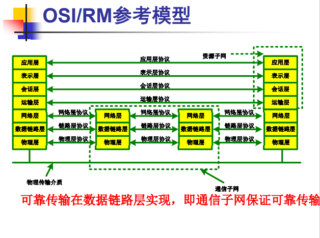
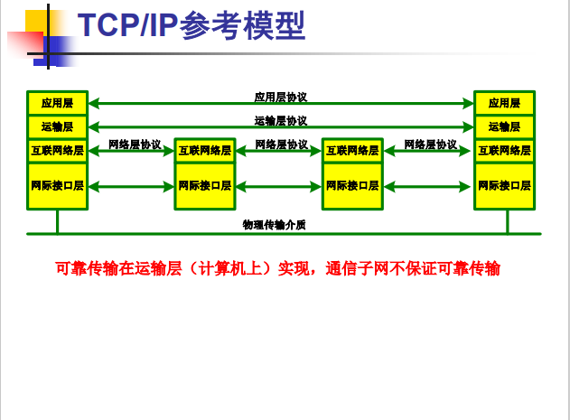
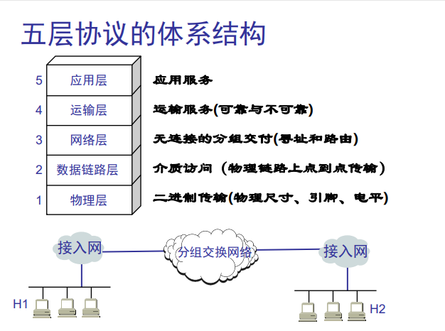

- [chapter 1 概述](#chapter-1-概述)
  - [1.1 作用和定义](#11-作用和定义)
  - [1.2 发展过程](#12-发展过程)
  - [分组交换](#分组交换)
  - [1.3 分类](#13-分类)
  - [1.4 主要性能指标](#14-主要性能指标)
  - [1.5 体系结构](#15-体系结构)
    - [1.网络协议](#1网络协议)
    - [2.体系结构的形成](#2体系结构的形成)
    - [3.五层协议的体系结构](#3五层协议的体系结构)
    - [4.实体、协议、服务和服务访问点](#4实体协议服务和服务访问点)
    - [5.面向连接服务于无连接服务](#5面向连接服务于无连接服务)
    - [6.OSI与TCP/IP比较](#6osi与tcpip比较)

# chapter 1 概述

## 1.1 作用和定义

计算机网络是一些互相连接的、自治的“广义计算机”的集合

**最重要的功能**
+ 通信（连通性）——计算机网络使上网用户之间都可以交换信息，好像这些用户的计算机都可以彼此直接连通一样。
+ 共享——即资源共享。可以是信息共享、软件共享，也可以是硬件共享

定义：
> 按照**网络协议**，把**自主独立**的计算机用通**信线路和通信设备**互相连接起来，以实现彼此之间的**数据通信和资源共享**的一种计算机系统**集合**

计算机网络组成

$$
计算机网络
\left\{
\begin{aligned}
&硬件
\left\{
\begin{aligned}
&计算机（服务器、工作站、智能终端）\\
&网络设备（网卡、交换机、路由器、集线器、中继器、网桥、modem）\\
&传输介质（双绞线、同轴电缆、光缆、微波、卫星通信）\\
&网络外围设备（打印机器、存储器）
\end{aligned}
\right.
\\
&网络软件
\left\{
\begin{aligned}
&网络协议和协议软件\\
&网络通信软件\\
&网络操作系统\\
&网络管理和应用软件
\end{aligned}
\right.
\end{aligned}
\right.
$$

$$
\left\{
\begin{aligned}
  
\end{aligned}
\right.
$$

## 1.2 发展过程

主要分为五个阶段：
+ 远程终端联机阶段
+ 以资源共享计算机网络阶段
+ 分组交换阶段
+ Internet阶段
+ 多媒体网阶段、云模型、移动互联和物联网阶段
+ 6G通信...

电路交换
+ 电路交换必定是面向连接的。
+ 电路交换的三个阶段：建立连接->通信->释放连接
+ 电路交换传送计算机数据效率低：计算机数据具有突发性；导致通信线路的利用率很低。

分组交换
- 

## 1.3 分类

## 1.4 主要性能指标

## 1.5 体系结构

### 1.网络协议

+ 计算机网络中的数据交换必须遵守事先约定好的规则。
+ 这些规则明确规定了所交换的数据的格式以及有关的同步问题（同步含有时序的意思）。
+ 为进行网络中的数据交换而建立的规则、标准或约定即网络协议(network protocol)，简称为协议。

`网络协议的组成要素`
  + 语法：数据与控制信息的结构或格式
  + 语义：需要发出何种控制信息，完成何种动作以及作物何种响应
  + 同步：事件实现顺序的详细说明

### 2.体系结构的形成

相互通信的两个计算机系统必须高度协调工作才行，而这种“协调”是相当复杂的

“分层”可将庞大而复杂的问题，转化为若干较小的局部问题，而这些较小的局部问题就比较易于研究和处理。

互联网精神：平等、开放、协作、共享

**分层的好处**
+ 各层之间是独立的。
+ 灵活性好。
+ 结构上可分割开。
+ 易于实现和维护。
+ 能促进标准化工作。
+ 缺点：额外开销

+ 计算机网络的`体系结构`(architecture)是计算机网络的各层及其协议的集合，其从**功能角度**描述计算机网络。
+ 体系结构就是这个计算机网络及其部件所应完成的功能的**精确定义**。
+ `实现`(implementation)是遵循这种体系结构的前提下用何种硬件或软件完成这些功能的问题。
+ 体系结构是抽象的，而实现则是具体的，是真正在运行的计算机硬件和软件。

### 3.五层协议的体系结构

### 4.实体、协议、服务和服务访问点

+ 实体(entity) 表示任何可发送或接收信息的硬件或软件进程。
+ 协议是控制两个对等实体进行通信的规则的集合。
+ 在协议的控制下，两个对等实体间的通信使得本层能够向上一层提供服务。
+ 要实现本层协议，还需要使用下层所提供的服务
---
+ 本层的服务用户只能看见服务而无法看见下面的协议。
+ 下面的协议对上面的服务用户是透明的。
+ 协议是“水平的”，即协议是控制对等实体之间通信的规则。
+ 服务是“垂直的”，即服务是由下层向上层通过层间接口提供的。
+ 同一系统相邻两层的实体进行交互的地方，称为服务访问点 SAP (Service Access Point)

### 5.面向连接服务于无连接服务

+ 面向连接服务(connection-oriented)
  + 面向连接服务具有连接建立、数据传输和连接释放这三个阶段。
+ 无连接服务(connectionless) 
  + 两个实体之间的通信不需要先建立好连接。
  + 是一种不可靠的服务。这种服务常被描述为“尽最大努力交付”(best effort delivery)或“尽力而为”

### 6.OSI与TCP/IP比较

---

因特网的组成

- 边缘部分：由所有连接在因特网上的主机组成。这部分是用户直接使用的，用来进行通信（传送数据、音频或视频）和资源共享
- 核心部分：由大量网络和连接这些网络的路由器组成。这部分是为边缘部分提供服务的（提供连通性和交换）

两种通信方式

+ 客户服务器方式（C/S 方式），即Client/Server方式
+ 对等方式（P2P 方式），即Peer-to-Peer方式
  + 客户(client)和服务器(server)都是指通信中所涉及的两个应用进程。
  + 客户服务器方式所描述的是进程之间服务和被服务的关系。
  + 客户是服务的请求方，服务器是服务的提供方。
  + 对等连接(peer-to-peer，简写为P2P)是指两个主机在通信时并不区分哪一个是服务请求方还是服务提供方。
  + 只要两个主机都运行了对等连接软件（P2P 软件），它们就可以进行平等的、对等连接通信。
  + 双方都可以下载对方已经存储在硬盘中的共享文档。
