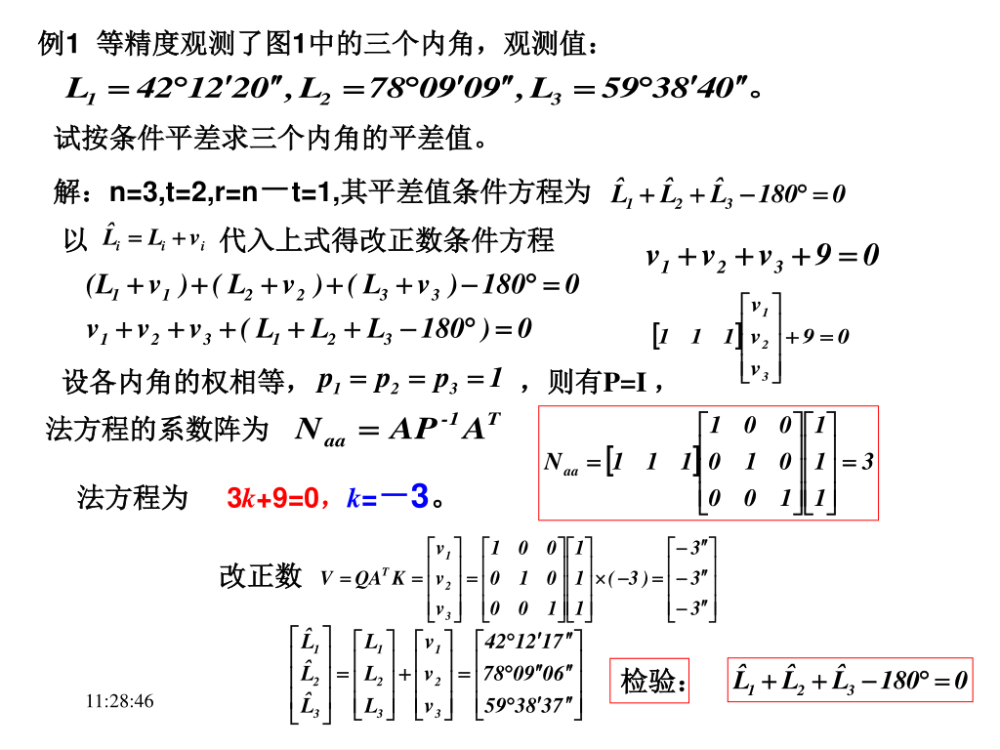
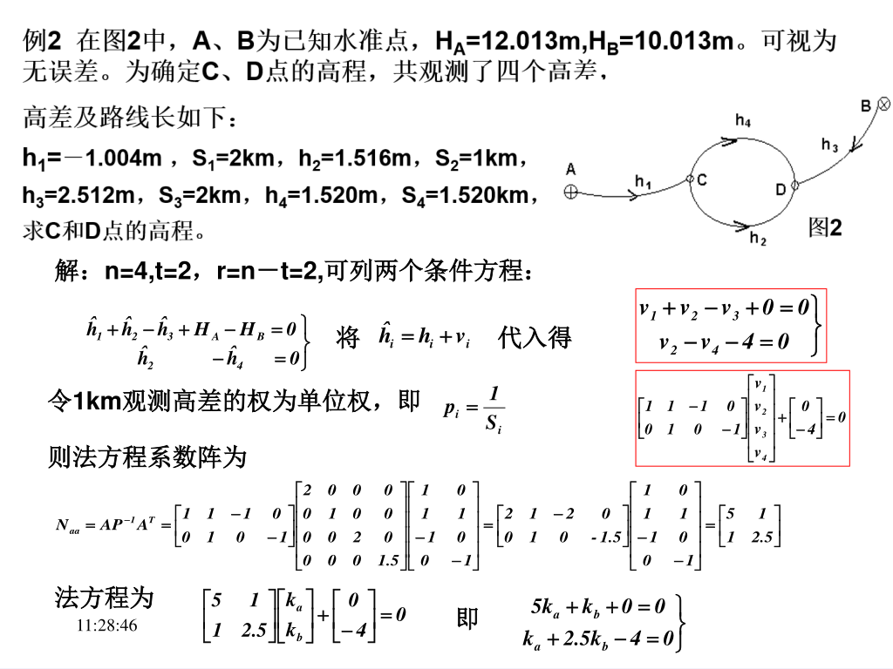
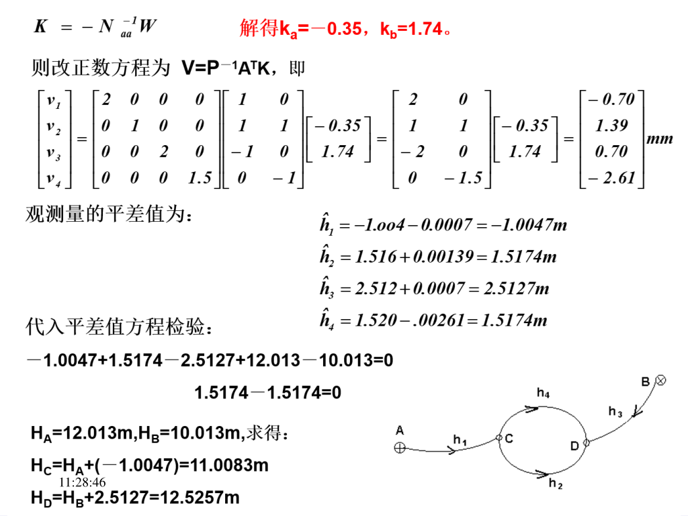

- [chapter 3 条件平差](#chapter-3-条件平差)
  - [3.1 导入](#31-导入)
  - [3.2 平差原理](#32-平差原理)
    - [（一）条件平差概念](#一条件平差概念)
    - [（二）基本数学模型](#二基本数学模型)
    - [（三）条件平差的估值方程————改正数方程和联系数法方程](#三条件平差的估值方程改正数方程和联系数法方程)
    - [（四）条件平差公式总结](#四条件平差公式总结)
    - [（五）计算步骤](#五计算步骤)
  - [3.3 条件方程](#33-条件方程)
  - [3.4 精度估计](#34-精度估计)
  - [3.5 公式汇编及举例](#35-公式汇编及举例)

# chapter 3 条件平差

## 3.1 导入

数学问题：求函数$\frac{1}{2}v_1^2+v_2^2+\frac{1}{4}v_3^2$，满足：$\left\{\begin{aligned}v_1+v_2+22=0\\-v_2+v_3-10=0\end{aligned}\right.$的极值。根据高等数学安徽给你的拉格朗日乘常数法，组成新函数：
$$
\begin{aligned}
&
\Phi=f+\lambda_1\varphi_1+\lambda_2\varphi_2=\frac{1}{2}v_1^2+v_2^2+\frac{1}{4}v_3^2-2k_a(v_1+v_2+22)-2k_b(-v_2+v_3-10)

\\&

\begin{aligned}
&\frac{\partial\Phi}{\partial{v_1}}=v_1-2k_a=0\\
&\frac{\partial\Phi}{\partial{v_2}}=2v_2-2k_a+2k_b=0\\
&\frac{\partial\Phi}{\partial{v_3}}=\frac{1}{2}v_3-2k_b=0\\    
\end{aligned}

\rightarrow

\left \{
\begin{aligned}
&v_1=2k_a\\
&v_2=k_a-k_b\\
&v_3=4k_b\\
\end{aligned}
\right .

\rightarrow

\left \{
\begin{aligned}
&v_1+v_2+22=0\\
&-v_2+v_3-10=0\\
\end{aligned}
\right .

\rightarrow

\left \{
\begin{aligned}
&3k_a-k_b+22=0\\
&-k_a+5k_b-10=0\\
\end{aligned}
\right .

\\&
\rightarrow

\left \{
\begin{aligned}
&k_a=-7.143\\
&k_b=0.571\\
\end{aligned}
\right .

\rightarrow

\left \{
\begin{aligned}
&v_1=-14.286\\
&v_2=-7.714\\
&v_3=2.284
\end{aligned}
\right .

\rightarrow

f_{min}=\frac{1}{2}v_1^2+v_2^2+\frac{1}{4}v_3^2=162.855
\end{aligned}
$$

（1）数学上的求条件极值方法解决了条件模型解算

（2）概率论与数理统计理论助推提出最小二乘原理

（2）线性代数的向量和矩阵的运用

## 3.2 平差原理

### （一）条件平差概念

**条件平差**：

未知数：观测值的平差值（或改正数）

未知数个数：观测数

未知数之间关系：存在条件

估值准则：$V^TPV=最小\rightarrow求条件极值$

**间接平差**：

未知数：参数，可以是直接观测量，也可以是间接观测值。

未知数个数：必要观测数

未知数之间关系：独立（任何一个参数都不能用其余的参数表示出来）

估值准则：$V^TPV=最小\rightarrow求自由极值$

**例1**：设有平面三角形，为确定三角形的形状，等精度观测了三个内角，其观测值分别是$L_1,L_2,L_3$以三个度数的最或然值$\hat{L_1},\hat{L_2},\hat{L_3}$为未知数，列出来未知数之间的条件关系式。

$$
\hat{L_1}+\hat{L_2}+\hat{L_3}=180^\circ
$$

以$\hat{L_i}=\hat{L_i}+v_i(i=1,2,3)$代入上式，得
$$
v_1+v_2+v_3+w=0\\
w=L_1+L_2+L_3-180^\circ
$$

取全部观测量得改正数作为平差时得未知数，根据观测值得相互关系列出条件方程，根据最小二乘原理求满足条件方程得未知数得最或然值，并做出相应的精度评定，该过程为条件平差。

### （二）基本数学模型

设 观测值为：$L_1,L_2,\cdots,L_n$；相应的改正数为：$v_1,v_2,\cdots,v_n$；观测值的平差值为：$\hat{L_1},\hat{L_2},\cdots,\hat{L_n}$，$\hat{L_i}=L_i+v_i(i=1,2,\cdots,n)$

向量表示
$$
\hat{L}=\begin{bmatrix}
    \hat{L_1}\\\hat{L_2}\\\vdots\\\hat{L_n}
\end{bmatrix}
\qquad
V=\begin{bmatrix}
    v_1\\v_2\\\vdots\\v_n
\end{bmatrix}
\qquad
L=\begin{bmatrix}
    L_1\\L_2\\\vdots\\L_n
\end{bmatrix}
\qquad
\hat{L}=L+V
$$

共有$r=n-t$个条件方程
$$
\hat{L}=L+V\\
A\hat{L}+A_0=0\\
AV-W=0\\
W=-(AL-A_0)
$$

### （三）条件平差的估值方程————改正数方程和联系数法方程

数学模型：

$$
\mathop{A}\limits_{r{\times}n}\mathop{V}\limits_{r{\times}1}-\mathop{W}\limits_{r{\times}1}=0\\\mathop{D}\limits_{n,n}=\sigma^2_0\mathop{Q}\limits_{n,n}=\sigma^2_0\mathop{P^{-1}}\limits_{n,n}\\
$$

估值准则：
$$
V^TPV=min
$$

设辅助函数
$$
\Phi=V^TPV-2K^T(AV-W)
$$

极值方程
$$
(\frac{d\Phi}{dV})^T=0
$$

改正数方程
$$
V=QA^TK
$$

上式代入条件方程，得：
$$
AQA^TK-W=0\\
K=N^{-1}W
$$

说明：

（1）法方程得阶数：N是rxr阶矩阵

（2）法方程得秩：rank(N)<=r

（3）当rank(A)=r时，称A行满秩，法矩阵N满秩，法方程有唯一解。

### （四）条件平差公式总结

条件平差的数学模型为

$$
\mathop{A}\limits_{r,n}\mathop{\Delta}\limits_{n,1}-\mathop{W}\limits_{r,1}=0 \tag{函数模型}
$$
$$
\mathop{D}\limits_{n,n}=\sigma_0^2\mathop{Q}\limits_{n,n}=\sigma_0^2\mathop{P^{-1}}\limits_{n,n} \tag{随机模型}
$$
$$
AV-W=0\\V^TPV=min \tag{平差模型}
$$

$$
AV-W=0 \tag{条件方程}
$$
$$
AP^{-1}A^TK-W=0 \tag{法方程}
$$
$$
NK-W=0 \qquad (AP^{-1}A^T=N)
$$

$$
K=N^{-1}W
$$

$$
V=P^{-1}A^TK\\
\hat{\sigma_0^2}=\frac{V^TPV}{r}
$$

### （五）计算步骤

  1. 根据问题性质及观测量的情况，列出条件方程式。条件方程的个数等于多余观测数r。
  2. 由条件方程式组成联系数法方程，法方程的个数等于多余观测数。
  3. 解算法方程，求出联系数K。
  4. 将K代入改正数方程式，求出V值，并求观测值的最或然值$\hat{L}=L+V$。
  5. 为了检验平差计算的正确性，常常要将各最或然值$\hat{L_i}$代入原条件方程式，看其是否闭合。
  6. 精度估计。

## 3.3 条件方程

## 3.4 精度估计

通过观测值的改正数V来计算单位权方差和中误差：
$$
\hat{\sigma_0^2}=\frac{V^TPV}{r}
$$

平差值函数的方差
$$
D_{FF}=\hat{\sigma_0^2}Q_{FF}
$$

谐因数传播律
$$
Z=KX+K_0\\
Q_{ZZ}=KQ_{XX}K^T
$$

## 3.5 公式汇编及举例

条件平差的函数模型和随机模型是
$$
AV+W=0\\
D=\sigma_0^2Q=\sigma_0^2P^{-1}
$$

条件方程：
$$AV+W=0$$

法方程：
$$N_{aa}K+W=0$$

改正数方程：
$$V=P^{-1}A^TK=QA^TK$$

观测量平差值：
$$\hat{L}=L+V$$

平差值函数：
$$\hat{\varphi}=f(\hat{L_1},\hat{L_2},\cdots,\hat{L_n})$$

权函数式为：
$$d\hat{\varphi}=f_1d\hat{L_1}+f_2d\hat{L_2}+\cdots+f_nd\hat{L_n},(f_i=\frac{\partial f}{\partial \hat{L_i}})_{L_i}$$

单位权方差的估值：
$$\hat{\sigma_0^2}=\frac{V^TPV}{r},\hat{\sigma_0}=\sqrt{\frac{V^TPV}{r}}$$

平差值函数的方差：
$$\hat{\sigma^2_{\hat{\varphi}}}=\sigma_0^2Q_{\hat{\varphi}\hat{\varphi}}=\sigma_0^2[f^TQf-(AQf)^TN^{-1}_{aa}AQf]$$
