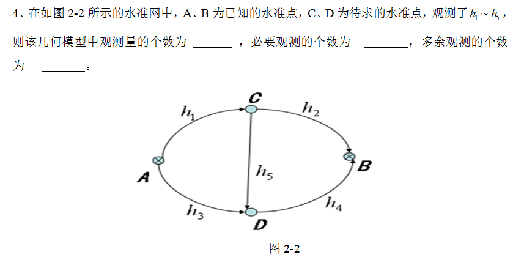

# 第四次作业

## 1.填空
在如图所示的水准网中，A,B为已知的水准点，C，D为待求得水准点，观测了h1~h5，则该几何模型中观测量得个数为____，必要观测得个数为____，多余观测得个数为____。

- ans:5;2;3

## 2.
测量平差用到的最小二乘原理为____。
- ans:最小二乘估计

## 3.
从概率论得角度出发，利用最小二乘原理所得到得观测量和待求量得最佳估值应满足____、____、____。
- ans:无偏性；一致性；有效性

## 4.简答
简述四种平差模型参数个数u与必要观测数t之间的关系。
- ans:
  - 条件平差u=0
  - 有参数的条件平差0<u<t
  - 间接平差u=t
  - 有限制条件的间接平差u>t
## 5.
四种基本平差方法的随机模型是什么？有什么作用？
- ans:
$$E(L)=\tilde{L}\\D_L=\sigma_0^2Q_L=\sigma_0^2P_L^{-1}$$

作用：精度评价。

>   函数模型反应了测量控制网中各几何元素间的数学关系，但测量元素是存在误差的，因此还必须建立观测值向量$\mathop{L}\limits_{n\times1}$及相关量随机模型，亦即观测向量的协方差阵：
>   $$\mathop{D}\limits_{n\times n}=\sigma^2_0\mathop{Q}\limits_{n\times n}= \sigma^2_0\mathop{P^{-1}}\limits_{n\times n}$$
>   式中D为L的协方差阵，Q为L的协因数阵，P为L的权阵，$\sigma_0^2$为单位权方差。

## 6.计算
写出下列函数的线性化的形式。其中A、B为已知值，$L_i$为观测值，$\tilde{L_i}=L_i+\Delta_i$。（1）$\tilde{L_1}\cdot\tilde{L_2^2}-A=0$，（2）$\frac{\sin{\tilde{L_1}}\cdot\sin{\tilde{L_2}}}{\sin(\tilde{L_3}+\tilde{L_4})}-A^2=0$。

- ans:
- $L_1L_2^2+2L_1L_2\Delta_2+L_2^2\Delta_1-A=0$

$\sin{L_1}\sin{L_2}+\sin{L_2}\sin{\Delta_1}+\sin{L_1}\sin{\Delta_2}-A^2(\sin{(L_3+L_4})+\sin{\Delta_3}\cos{\Delta_4}+\sin{\Delta_4}\cos{L_3}-\sin{L_3}\sin{L_4}(\sin{\Delta_3}\sin{\Delta_4}))$

- [参考资料](https://www.docin.com/p-1399900146.html)