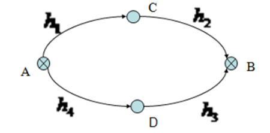
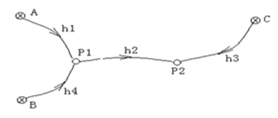

# 第6次作业

## 1.填空题
间接平差法误差方程的形式为____

$$V=B\hat{x}-l$$

## 2.
间接平差中误差方程的个数和平差参数的个数分别为____和____

n,t

## 3.计算

设有等精度观测的条件方程为$\begin{aligned}v_1-v_2+v_3+2=0\\v_3+v_4+v_7+1=0\\v_2+v_5+v_6+v_7-1=0\end{aligned}$，试组成法方程。

$$
\begin{bmatrix}
    1&-1&1&0&0&0&0\\
    0&0&1&1&0&0&1\\
    0&1&0&0&1&1&1\\
\end{bmatrix}
\begin{bmatrix}
    v_1\\v_2\\v_3\\v_4\\v_5\\v_6\\v_7\\
\end{bmatrix}
+\begin{bmatrix}
    2\\1\\-1
\end{bmatrix}=0
$$

等权观测，则
$$
N_{aa}=AP^{-1}A^T
=\begin{bmatrix}
    1&-1&1&0&0&0&0\\
    0&0&1&1&0&0&1\\
    0&1&0&0&1&1&1\\
\end{bmatrix}
\begin{bmatrix}
    1&&&&&&\\
    &1&&&&&\\
    &&1&&&&\\
    &&&1&&&\\
    &&&&1&&\\
    &&&&&1&\\
    &&&&&&1\\
\end{bmatrix}
\begin{bmatrix}
    1&0&0\\
    -1&0&1\\
    1&1&0\\
    0&1&0\\
    0&0&1\\
    0&0&1\\
    0&1&1\\
\end{bmatrix}
=\begin{bmatrix}
    3&1&-1\\
    1&3&1\\
    -1&1&4\\
\end{bmatrix}
$$

法方程为：$NK-W=0$，即
$$
\begin{bmatrix}
    3&1&-1\\
    1&3&1\\
    -1&1&4\\
\end{bmatrix}
\begin{bmatrix}
    k_a\\k_b\\k_c
\end{bmatrix}
+\begin{bmatrix}
    2\\1\\-1
\end{bmatrix}=0
$$

## 4.
在图所示的水准网中，A、B点位已知水准点，C、D点为待定的水准点，已知$H_A=15.000m、H_B=18.303m$，同精度独立观测的高差观测值为：$h=(1.258m,2.041m,1.571m,1.724m)^T$。试按条件平差求（1）各段高差平差值及其中误差；（2）C、D点高程平差值及其中误差。

条件方程：
$$
\hat{h_1}+\hat{h_2}=H_B-H_A\\
\hat{h_3}+\hat{h_4}=H_B-H_A\\
$$

$\hat{h_1}=h_i+v_i$ 代入改正数方程(mm)：
$$
v_1+v_2-4=0\\
v_3+v_4-8=0\\
$$

即
$$
\begin{bmatrix}
    1&1&0&0\\
    0&0&1&1\\
\end{bmatrix}
\begin{bmatrix}
    v_1\\v_2\\v_3\\v_4
\end{bmatrix}
+\begin{bmatrix}
    -4\\-8
\end{bmatrix}
=0
$$

系数阵：
$$
N=AP^{-1}A^T
=\begin{bmatrix}
    1&1&0&0\\
    0&0&1&1\\
\end{bmatrix}
\begin{bmatrix}
    1&&&\\
    &1&&\\
    &&1&\\
    &&&1\\
\end{bmatrix}
\begin{bmatrix}
    1&0\\1&0\\0&1\\0&1\\
\end{bmatrix}
=\begin{bmatrix}
    2&0\\0&2\\
\end{bmatrix}
$$

法方程：$NK-W=0$即
$$
\begin{bmatrix}
    2&0\\0&2\\
\end{bmatrix}\begin{bmatrix}
    k_a\\k_b\\
\end{bmatrix}
+\begin{bmatrix}
    -4\\-8
\end{bmatrix}
=0
$$

得
$$
K=\begin{bmatrix}
2\\4
\end{bmatrix}
$$

由$v=QA^TK$
$$
v=\begin{bmatrix}
    1&&&\\
    &1&&\\
    &&1&\\
    &&&1\\
\end{bmatrix}
\begin{bmatrix}
    1&0\\1&0\\0&1\\0&1\\
\end{bmatrix}
\begin{bmatrix}
2\\4
\end{bmatrix}
=\begin{bmatrix}
    2\\2\\4\\4
\end{bmatrix}
$$

则
（1）$h_1,h_2,h_3,h_4$各段高差平差中误差分别为$\begin{bmatrix}2&2&4&4\end{bmatrix}^T$mm，高差平差值为$\begin{bmatrix}1.260&2.043&1.575&1.728\end{bmatrix}^T$m

（2）C中误差为$2$mm，平差值为16.260m，D中误差为$4$mm，平差值为16.728m

## 5.
已知间接平差的函数模型为：$\left.\begin{aligned} &V=B\hat{x}-l\\&l=L-(BX^0+d) \end{aligned}\right \}$，试根据最小二乘原理$V_TPV=min$，导出间接平差的基础方程、法方程和解的形式。

$$L+V=B\hat{X}+d$$
令 
$$\hat{X}=X^0+\hat{x}$$
$$l=L-(BX^0+d)$$
$$V=B\hat{x}-l$$
$$\frac{\partial{V^TPV}}{\partial{\hat{x}}}=2V^TP\frac{\partial{V}}{\partial{\hat{x}}}=V^TPB=0$$
$$B^TPV=0$$
$$B^TPB\hat{x}-B^TPl=0$$
令$N_{bb}=B^TPB$，$W=B^TPl$
则法方程
$$N_{bb}\hat{x}-V=0\\\hat{x}=N_{bb}^{-1}W$$
$$\hat{L}=L+V\qquad\hat{X}=X^0+\hat{x}$$

## 6.
在图所示的水准网中，A、B、C为已知水准点，高差观测值及路西那长度如下：$h_1=+1.003m$，$h_2=+0.501m$，$h_3=+0.503m$，$h_4=+0.505m$；$S_1=1km$，$S_2=2km$，$S_3=2km$，$S_4=1km$。已知$H_A=11.000m$，$H_B=11.500m$，$H_C=12.008m$，试用间接平差法求$P_1$及$P_2$点的高程平差值。

（1）选参数

设P1，P2高程分别是$X_1,X_2$

（2）列误差方程
$$
\hat{h_1}=\hat{X_1}-H_A\\
\hat{h_2}=\hat{X_2}-\hat{X_1}\\
\hat{h_3}=\hat{X_2}-H_C\\
\hat{h_4}=\hat{X_1}-H_B\\
$$

代入$\hat{h_i}=v_i+h_i$误差方程，得：
$$
v_1=\hat{X_1}+12.003\\
v_2=\hat{X_2}-\hat{X_1}-0.501\\
v_3=\hat{X_2}-12.511\\
v_4=\hat{X_1}-12.005\\
$$

即
$$
\begin{bmatrix}
    v_1\\v_2\\v_3\\v_4
\end{bmatrix}
=\begin{bmatrix}
    1&0\\-1&1\\0&1\\1&0
\end{bmatrix}
\begin{bmatrix}
    \hat{X_1}\\\hat{X_2}
\end{bmatrix}
+\begin{bmatrix}
    12.003\\-0.501\\-12.511\\-12.005
\end{bmatrix}
$$

$$
X_0=\begin{bmatrix}
    X^0_1\\X^0_2\\
\end{bmatrix}
=\begin{bmatrix}
    12.003\\12.511
\end{bmatrix}
$$

$$
\begin{bmatrix}
    v_1\\v_2\\v_3\\v_4
\end{bmatrix}
=\begin{bmatrix}
    1&0\\-1&1\\0&1\\1&0
\end{bmatrix}
\begin{bmatrix}
    \delta\hat{X_1}\\\delta\hat{X_2}
\end{bmatrix}
-\begin{bmatrix}
    0\\-7\\0\\2
\end{bmatrix}
$$

$$P=\begin{bmatrix}
    1&&&\\&\frac{1}{2}&&\\&&\frac{1}{2}&\\&&&1\\
\end{bmatrix}$$

$$
N=B^TPB=
\begin{bmatrix}
    1&-1&0&1\\0&1&1&0
\end{bmatrix}
\begin{bmatrix}
    1&&&\\&\frac{1}{2}&&\\&&\frac{1}{2}&\\&&&1\\
\end{bmatrix}
\begin{bmatrix}
    1&0\\-1&1\\0&1\\1&0
\end{bmatrix}
=\begin{bmatrix}
    2.5&-0.5\\
    -0.5&1\\
\end{bmatrix}
$$

$$
W=B^TPl=\begin{bmatrix}
    1&-1&0&1\\0&1&1&0
\end{bmatrix}
\begin{bmatrix}
    1&&&\\&\frac{1}{2}&&\\&&\frac{1}{2}&\\&&&1\\
\end{bmatrix}
\begin{bmatrix}
    0\\-7\\0\\2
\end{bmatrix}
=\begin{bmatrix}
    5.5\\-3.5
\end{bmatrix}
$$

（3）组成法方程：
$N\hat{x}-W=0$

$$
\begin{bmatrix}
    2.5&-0.5\\
    -0.5&1\\
\end{bmatrix}
\begin{bmatrix}
    \delta\hat{X_1}\\\delta\hat{X_2}
\end{bmatrix}
-\begin{bmatrix}
    5.5\\-3.5
\end{bmatrix}
=0
$$

（4）法方程解算：$\hat{x}=N^{-1}W$
$$
\begin{bmatrix}
    \delta\hat{X_1}\\\delta\hat{X_2}
\end{bmatrix}
=\begin{bmatrix}
    2.5&-0.5\\
    -0.5&1\\
\end{bmatrix}^{-1}
\begin{bmatrix}
    5.5\\-3.5
\end{bmatrix}
=\begin{bmatrix}
    \frac{5}{3}\\-\frac{8}{3}
\end{bmatrix}
$$

$\hat{L}=L+V,\hat{X}=X^0+\hat{x}$：

$$
\hat{X}=\begin{bmatrix}
    X^0_1\\X^0_2\\
\end{bmatrix}
+\begin{bmatrix}
    \delta\hat{X_1}\\\delta\hat{X_2}
\end{bmatrix}
=\begin{bmatrix}
    12.0047\\12.5083
\end{bmatrix}
$$