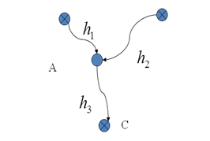

# 第7次作业

## 1.填空

在各种平差方法的精度评定中，单位权中误差的计算都是相同的，它的计算公式是          。

$$\sigma^2_0=\frac{V^TPV}{r}=\frac{V^TPV}{n-t}$$

## 2.计算
已知某平差问题的误差方程为：$
\begin{aligned}
&V_1=-\hat{x_1}\\
&v_2=-\hat{x_2}+2\\
&V_3=\hat{x_2}-1\\
&V_4=-\hat{x_2}\\
&V_5=-\hat{x_1}+\hat{x_2}-3\\
\end{aligned}
$观测值的权阵位：$
\begin{bmatrix}
2&&&&\\
&2&&&\\
&&3&&\\
&&&2&\\
&&&&4\\
\end{bmatrix}$，试求单位权中误差的估值、参数
$\hat{x}=\begin{bmatrix}\hat{x_1}&\hat{x_2}\end{bmatrix}^T$，及其协因数阵、方差阵。

- ans

$B=\begin{bmatrix}-1&0\\0&-1\\0&1\\0&-1\\-1&1\end{bmatrix}$，
$l=\begin{bmatrix}0\\-2\\1\\0\\3\end{bmatrix}$，
$P=\begin{bmatrix}2&&&&\\&2&&&\\&&3&&\\&&&2&\\&&&&4\\\end{bmatrix}$，
$V=\begin{bmatrix}v_1\\v_2\\v_3\\v_4\\v_5\end{bmatrix}$，
$\hat{x}=\begin{bmatrix}\hat{x_1}\\\hat{x_2}\end{bmatrix}$

$$V=B\hat{x}-l$$

即
$$
\begin{bmatrix}v_1\\v_2\\v_3\\v_4\\v_5\end{bmatrix}
=
\begin{bmatrix}-1&0\\0&-1\\0&1\\0&-1\\-1&1\end{bmatrix}
\begin{bmatrix}\hat{x_1}\\\hat{x_2}\end{bmatrix}
-
\begin{bmatrix}0\\-2\\1\\0\\3\end{bmatrix}
$$

$$
N=B^TPB=
\begin{bmatrix}-1&0\\0&-1\\0&1\\0&-1\\-1&1\end{bmatrix}^T
\begin{bmatrix}2&&&&\\&2&&&\\&&3&&\\&&&2&\\&&&&4\\\end{bmatrix}
\begin{bmatrix}-1&0\\0&-1\\0&1\\0&-1\\-1&1\end{bmatrix}
=
\begin{bmatrix}6&-4\\-4&11\end{bmatrix}
$$

$$
W=B^TPl=
\begin{bmatrix}-1&0\\0&-1\\0&1\\0&-1\\-1&1\end{bmatrix}^T
\begin{bmatrix}2&&&&\\&2&&&\\&&3&&\\&&&2&\\&&&&4\\\end{bmatrix}
\begin{bmatrix}0\\-2\\1\\0\\3\end{bmatrix}
=
\begin{bmatrix}-12\\19\end{bmatrix}
$$

由$N\hat{x}-W=0$
得
$$\hat{x}=N^{-1}W=\begin{bmatrix}-1.12\\1.32\end{bmatrix}$$

则
$$V=B\hat{x}-l=\begin{bmatrix}1.12\\0.68\\0.32\\-1.32\\-0.56\end{bmatrix}$$

单位权中误差
$$\sigma_0^2=\frac{V^TPV}{r}=2.8267$$

协因数阵
$$D_{\hat{X}\hat{X}}=\hat{\sigma_0}^2Q_{\hat{X}\hat{X}}=\hat{\sigma_0}^2N^{-1}_{bb}=\begin{bmatrix}0.62186667 &0.22613333\\0.22613333& 0.3392\end{bmatrix}$$

方差阵
$$D=\sigma_0^2Q=\begin{bmatrix}
    5.6533&&&&\\
    &5.6533&&&\\
    &&8.4800&&\\
    &&&5.65333&\\
    &&&&11.3067
\end{bmatrix}$$

## 3.计算

在图所示水准网中，A、B、C为已知点，P为待定高程点，已知$H_A=21.910m、H_B=22.870m、H_C=26.890m$，观测高差及其相应的路线长度为：$h_1=3.552m \qquad s_1=1km\\h_2=2.603m \qquad s_2=6km\\h_3=1.425m \qquad s_3=3km$。 试求：（1）P点的高程平差值；（2）P点平差后的高程中误差。

- ans

n=3 

t=1 

r=n-t=2

$P=\begin{bmatrix}1&&\\&\frac{1}{6}&\\&&\frac{1}{3}\end{bmatrix}$，
$V=\begin{bmatrix}v_1\\v_2\\v_3\end{bmatrix}$，
$\hat{x}=\begin{bmatrix}\hat{x_1}\end{bmatrix}$

$$\hat{x}=X^0+\delta{x}$$

$$X^0=H_A+h_1=25.462m$$

$$V=B(x+X^0)-l$$
$$V=Bx-(l-BX^0)$$

$$
\begin{bmatrix}v_1\\v_2\\v_3\end{bmatrix}
=
\begin{bmatrix}1\\1\\-1\end{bmatrix}
\begin{bmatrix}x\end{bmatrix}
-
\begin{bmatrix}10\\11\\-3\end{bmatrix}
$$

$$N=B^TPB=1.5$$

$$W=B^TPl=12.8333$$

由
$$Nx-W=0$$

得
$$x=N^{-1}W=8.5556mm$$

$$\hat{x}=x+X^0=25.471m$$

$$V=\begin{bmatrix}-1.444\\-2.444\\11.556\end{bmatrix}$$

$$\sigma^2_0=\frac{V^TPV}{r}=23.8$$
$$\sigma_0=4.88mm$$

即中误差为4.9mm，高程平差值为25.471m