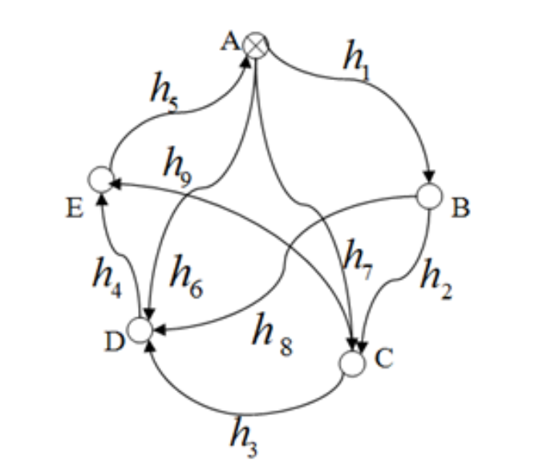
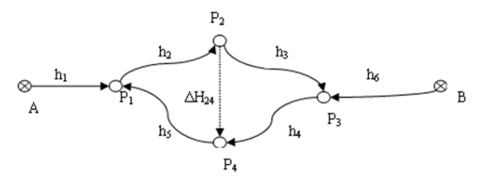

# 第9次作业

## 1.简答题

四种基本平差方法的模型是什么？有什么作用？

间接平差

$$\mathop{V}\limits_{n,1}=\mathop{B}\limits_{n,t}\mathop{x}\limits_{t,1}-\mathop{l}\limits_{n,1}$$

具有参数的条件平差

$$\mathop{A}\limits_{c,n}\mathop{V}\limits_{n,1}+\mathop{B}\limits_{c,u}\mathop{x}\limits_{u,1}-\mathop{W}\limits_{c,1}=0$$

条件平差

$$\mathop{A}\limits_{r,n}\mathop{V}\limits_{n,1}-\mathop{W}\limits_{r,1}=0$$

附条件间接平差

$$\mathop{V}\limits_{n,1}=\mathop{B}\limits_{n,u}\mathop{x}\limits_{u,1}-\mathop{l}\limits_{n,1}\quad,\quad\mathop{C}\limits_{s,u}\mathop{x}\limits_{u,1}-W_x=0$$

## 2.计算题

在所示的水准网中，A为已知点，B、C、D、E为待定点，观测了9条路线的高差$h_1~h_9$，列出下列四种情况下的函数模型，并指出方程的个数。

（1）条件平差法的函数模型

（2）选取B、C、D三点的高程平差值为参数

（3）选取$h_1~h_5$的高差平差值为参数

（4）选取$h_5~h_8$的平差值为参数

$n=9\\t=4\\r=5$

(1) 条件平差 AV-W=0，c=5

(2) 附有参数的条件平差 c=8

(3) 附有限制条件的间接平差 c=10

(4) 间接平差 V=Bx-l，c=9

## 3.计算题

在如下图所示的水准网中，A、B为已知水准点，$P_1\sim P_4$为待定水准点，已知$P_2$至$P_4$点间的高差固定值为$\Delta H_{24}=1200mm$，观测高差为$h_1(i=1,2,\cdots 6)$，试列出观测方程和限制条件。

$n=7\\t=4\\r=3$

L=BX+d ， CX+C=0

设P1~P4高程为Xi

观测方程：
$$
\begin{aligned}
    &X_1=H_A+h_1\\
    &X_2=H_A+h_1+h_2\\
    &X_3=H_B+h_6\\
    &X_4=H_B+h_6+h_4\\
\end{aligned}
$$

限制条件：
$$
X_2-X_4=\Delta H_{24}
$$

