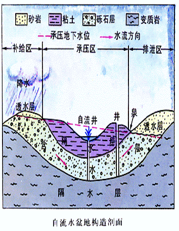
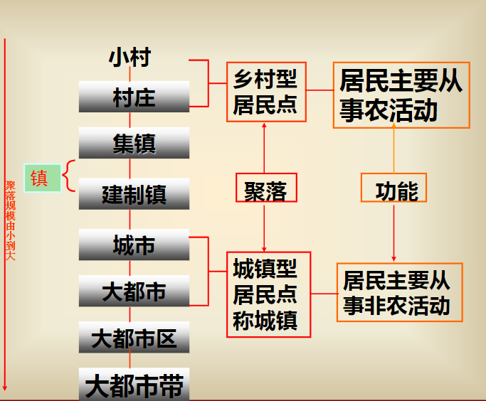

# 地理学基础
自然地理学和人文地理学

## Contents
- [Chapter 1 地理科学导论](chapter-1.md)
- [Chapter 2 地球与地球系统](chapter-2.md)
- ~~Chapter 3 地壳与地貌（地质地貌学）~~
- [Chapter 4 气象与气候](chapter-3.md)
- [Chapter 5 海洋与陆地水](chapter-4.md)
- [Chapter 6 土壤与土地](chapter-5.md)
- [Chapter 7 生物与生态系统](chapter-6.md)
- [自然地理学复习总结](guideline-ans.md)
- ~~Chapter 8 地带性与自然区划~~
- [Chapter 9 人口与迁移](chapter-8.md)
- [Chapter 10 城市、乡村与聚落](chapter-9.md)
- [Chapter 11 产业与发展](chapter-10.md)
- [Chapter 12 文化与宗教](chapter-11.md)
- [人文地理学复习总结](guideline2-ans.md)
- [阅读材料——北京，有2000万人假装在生活](peking.md)
- [阅读材料——人骨、人皮和人肉——密教仪式的往日世界](https://zhuanlan.zhihu.com/p/24871478)
- [阅读材料——亮出你的舌苔或空空荡荡](la.md)
- [完全版](a.md)

# 《人文地理学》Guideline
考试结构
1. 填空题：1*15=15
2. 名词解释：3*8=24
4. 简答题：6*6=36
5. 综合题：1*25=25

## 1：人口与迁移
- 解释：人文地理学、人口地理学、人口和人口分布、人口密度、人口构成（人口结构）、人口负担系数（抚养比）、人口自然增长率、人口迁移（移民、迁出地&迁入地）、国际、国内人口迁移、难民（联合国&地理学角度）
- 人文地理学的研究对象是？人文地理学的学科特性是？
- 人口地理学的基本内容包括？
- 人口密度在测度人口分布上有哪些不足？
- 如何计算人口抚养比并解释所谓“人口红利”？
- “人口老龄化”的涵义（定义、表现和原因）
- 世界人口和中国人口的分布特征
- 影响人口分布的因素有哪些？
## 2：聚落与城市
- 名词解释：**聚落、聚落地理学、城市、城市地理学、乡村、工业化、基本和非基本活动、城市职能和性质**
- 列举聚落地理学研究的主要内容（参考课本）
- 城市地理学的主要研究内容
- 城市化研究的主要内容
- 城镇不同于乡村的本质特征
- 全球六大世界级都市带（5国外+1国内）
- 地理学角度下城市化概念包含了哪些内容？
- **“城市化是一个地域空间过程”的内涵**
- 如何理解城市化的动力机制
- 解释城市发展中的推拉说(推力和拉力）
- 城市化的分类（成对出现，对比记忆）
- 城市化的发展阶段分为哪些？
- 度量城镇化的指标主要有哪些？
## 3：产业与发展
概念与理论：
- 产业、产业机构、产业分类的定义
- 三次产业的分类和实质内涵（参考课本p274）
- 第三产业基本概念和划分层次（国际&国内）
- 现代服务业定义（广义&狭义）
- 配第克拉克定律、霍夫曼工业化阶段理论、库兹涅茨法则、“雁行模式”的内容
- 主导、支柱产业的定义及区别
- 杜能农业区位论（内容，意义，缺点，应用）
- 韦伯工业区位论（内容，意义，缺点，应用）
## 4：文化与宗教
- 名词解释：宗教、文化
- 宗教在文化中的作用
- 导致宗教传播的因素
- 世界三大宗教的传播过程

# 《自然地理学》Guideline

## 考试结构
1. 填空题 1*10=10
2. 选择题 2*5=10
3. 名词解释 3*10=30
4. 简答题 6*5=30
5. 综合 1*20=20

## 1：绪论
-  什么是地理学？
-  什么是地理事物？
-  地球表层的定义？
-  概括地理学的学科特点
-  列举地理学的主要的分支
-  列举近代地理学形成的重要标志
-  列举现代地理学的主要研究主题和方向
## 2：地球系统
-  名词解释：恒星日、太阳日、恒星年、回归年、黄赤交角、天球、经度、纬度
-  类地行星和类木行星的区别
-  概括太阳系中行星的共同特征
-  概述地球形状和大小的地理意义
-  列举地球内部和外部圈层并描述其分布特点
-  描述地球的公转和自转分别对地球自然环境产生怎样的影响
-  解释黄赤交角->太阳回归运动->地球五带之间的关系
-  概述地球表面的基本特征
## 3：大气圈
-  名词解释：干洁空气、大气气溶胶、气压、地转风、梯度风、大气环流、行星风系、三圈环流、季风、逆温、气团、气团的变性、气旋/反气旋、露点
-  列举大气组成成分并简述各主要成分的特点
-  描述大气垂直分层结构及各分层的特征
-  描述太阳辐射能量在地气系统中的传播过程
-  列举气压系统的基本类型
-  地球热量带如何划分？
-  降水的形成需具备哪些条件？
## 4：水圈
-  名词解释：盐度、水系、流域、径流、河流、湖泊、沼泽、冰川、大陆冰川、山岳冰川、水循环、潮汐、洋流、
-  解析水循环中的“大循环” 与“小循环”
-  概述海水温度、盐度、密度的分布规律
-  分析水循环对于地球系统的重要意义
-  描述太阳和月亮对地球海洋潮汐的影响
-  描述径流的动态形成过程
-  列举地下水的分类
-  解释自流盆地的形成原理
## 5：土壤
-  名词解释：土壤和土地、土壤肥力、土壤有机质、地质大循环、生物小循环
-  列举土壤的组成成分
-  阐述土壤圈在地球表层系统中的地位和作用
-  解析“土壤形成的基本规律是物质大循环和生物小循环过程矛盾的统一”
-  列举主要的影响土壤形成和演变的因素
-  概述母质对于土壤形成的影响
-  列举中国土壤的分类（级+纲）
-  列举土壤资源存在的问题及合理保护和利用土壤资源的措施
## 6：生物圈
-  名词解释：生物圈、环境、生态因子、生态幅、种群、群落、生态系统、生物放大作用、食物链
-  列举生物之间的相互关系
-  解析生物对环境的趋同/趋异适应
-  概括光/温度/土壤对生物的作用
-  列举生态系统的组成和功能群
-  解析生物->食物链->食物网->营养级的结构关系
- [地理学基础](#地理学基础)
- [Chapter 1 绪论](#chapter-1-绪论)
  - [1.1 地理与地理学](#11-地理与地理学)
  - [1.2 地理学的特征与分类](#12-地理学的特征与分类)
  - [1.3 地理学的发展与演变](#13-地理学的发展与演变)

# 地理学基础
# Chapter 1 绪论

## 1.1 地理与地理学
**什么是地理学？**  
`定义`：现代地理科学是研究**地球表层**各圈层相互作用关系，及其空间差异与变化的学科体系，是基于综合分析自然、经济和社会诸要素及其相互作用的区域特性来研究人类活动与地理环境欢喜的科学，主要包括*自然地理学*和*人文地理学*。  
`科学内涵`：地球表面或某一地区各种事物和现象之间的内在联系。

**地理的作用？**  
- 衣：天气、气候
- 食：作物、种植
- 住：阳光、空气、水电、景观、风水、城乡
- 行：方位（方向、路线、地图）、开车、旅游  

**地理学的研究对象？**
- 地球表层
- 地理事物及其分布
- 地理环境
- 地理系统
- 人地关系地域系统  

`地球表层`：接近地球海陆表面，由岩石圈、水圈、大气圈、生物圈和智慧圈等相互作用、相互渗透形成的统一整体。地球表层的上界是大气圈的**对流层顶**，下界是岩石圈的**沉积岩底**。  

## 1.2 地理学的特征与分类
- 学科特征
- 学科性质
- 学科分类

`学科特征`：
- 综合性：研究对象地球表系统是多种要素相互作用的综合体；地理学的综合性研究分为不同的层次；横断学科。
- 区域性：地球表面自然地理现象和人文现象空间分布不均一；尺度；
- 动态性：地球表面不断变化的特征。
- 软科学性：在城市绘画、区域规划、区域发展方略等研究起作用。
- 工程性：地理工程设计和建设直接服务于一些具体问题的解决。
- 学科视角独特、研究方法多样性。

`学科性质`
- 跨学科性质
- 大科学性质
  - 横断科学
  - 边缘科学
  - 综合科学

地理学的性质不仅仅是一个概念问题，它涉及到地理学的定义、地理学的研究对象、以及由对象规定的研究内容、研究方法和在科学中的地位，社会发展中的作用等。  

按传统的科学分类体系，地理学是自然科学和社会科学两大领域教会的跨界学科，兼有自然科学和社会科学的属性。按现代的科学分类观点，地理学是自然科学和社会科学相结合的，并与之平行的一个独立的科学系统。  

`学科分类`
- 自然地理学
  - 气候学
  - 地形学
  - 生物地理
  - 土壤地理学
  - 水文学
  - 自然资源学
- 人文地理学
  - 人口地理
  - 经济地理
  - 政治地理
  - 历史地理
- 地理技术
  - 遥感
  - 地图学
  - 地理信息科学

## 1.3 地理学的发展与演变

- 古代地理学（到18世纪末期）
  - ※西方古代地理学
  - 《荷马史诗》是最早的地理记述
  - “地圆说”和对埃拉托色尼（Eratosthenes）对地球周长的观测
  - 地理大发现：欧洲人对离之遥远地方的发现。
  - 美洲的发现
  - 绕过非洲通往东方航线的发现
  - 首次全球航行
  - 世界地图基本完成
  - ※中国古代地理学
  - 汉书·地理志
  - 制图六体
  - 水经注
  - 梦溪笔谈
  - 徐霞客游记
  - 皇舆全览图（康熙年间）
- **近代地理学**（到1950年）
  - `形成标志`：德国洪堡的《宇宙》和李特尔的《地学通论》问世
  - 
- 现代地理学（1950年后）
  - 标志是地理数量方法、理论地理学的诞生和计算机制图、地理信息系统、卫星等应用出现
  - 强调地理的统一性、理论化、数量化、行为化和生态化

现代地理学的研究主题和方向

- [Chapter 2 地球和地球系统](#chapter-2-地球和地球系统)
  - [2.1 地球在宇宙中位置](#21-地球在宇宙中位置)
  - [2.2 地球的形状、大小和结构](#22-地球的形状大小和结构)
  - [2.3 地球的运动](#23-地球的运动)
  - [2.4 地理坐标](#24-地理坐标)
  - [2.5 地球表面的基本形态和特征](#25-地球表面的基本形态和特征)

`教学重点（key point）`：
- 认识地球的宇宙环境及其形状、大小、圈层结构及表面形态结构特征
- 掌握地球运动规律及其地理意义

# Chapter 2 地球和地球系统

## 2.1 地球在宇宙中位置

`天体`：地球大气以外的宇宙空间各种星体的统称。宇宙中的物质以各种形态存在着，聚集态的星体、弥散态的星云、星际气体和尘埃统称为天体。分为恒星、行星、流星、彗星、星云等。

`恒星`：炽热的气体组成、能自身发光的球形天体

太阳系：银河系直径约100万光年，太阳在距银心27000光年，距边缘23000光年的地方，以每秒250公里的速度绕银心运动，约两亿年绕行一周。  

太阳系包括8大行星、67个卫星和至少50万个小行星，还有少数彗星。  

`太阳结构`从里到外：
- 热核反应区
- 辐射转移区
- 对流层
- 光球层
- 色球层
- 日冕层

**太阳系中行星和卫星绕太阳的运动共同特征**（key point):
- 所有卫星轨道偏心率都很小，几乎都接近圆形
- 轨道面都近似在一个平面上，对地球轨道面（黄道面）的倾斜也都不大
- 所有行星都自西向东环绕太阳公转；除金星和天王星外，所有行星的自转方向也自西向东
- 所有行星的赤道面对轨道面的倾斜都比较小，只有天王星例外
- 绝大多数卫星轨道都近似圆形，轨道面接近母星的赤道面
- 绝大多数卫星、包括土星环在内，公转方向都和母星的公转方向相同

`木星的结构`：
- 铁和硅组成固体核
- 氢组成的液态氧的海洋
- 氢和氦组成的1000多千米厚的大气层

**类地行星 & 类木行星**

|          | 类地     | 类木     | 冥王星 |
| -------- | -------- | -------- | ------ |
| 行星     | 水金地火 | 木土天海 | 冥王星 |
| 质量     | 较小     | 较大     | 较小   |
| 体积     | 较小     | 较大     | 较小   |
| 密度     | 较高     | 较低     | 较低   |
| 光环     | 无       | 有       | 无     |
| 表面温度 | 较高     | 较低     | 较低   |
| 卫星数目 | 少       | 多       | 少     |

**日地距离及其环境意义**（key point）：
- 距离不近不远，为生命孕育创造了条件
- 接受太阳辐射比较合适，使地表平均温度高于水的冰点、低于水的沸点，大部分水以液态存在，为生命的孕育创造了条件。

## 2.2 地球的形状、大小和结构
`地球形状`就是大地水准面的形状。  
大地水准面：大地测量中的地球形状，以平均海水面表示的平滑封闭曲面。  
赤道直径比两极直径长42.5千米

**地球形状的物理意义**（key point）：
- 日地平均距离为14960*1E+4km，这样可以将投射到地面的太阳光线是为平行光线。当平行光线射到地球表面时，不同纬度地区的正午太阳高度角将不相同。  
- 造成地球上热量的带状分布和与地表热状况相关的自然现象的地带性分布。

`地球的大小`
地球赤道半径 约为6 378 140m，极半径约为6 356 755m，总面积5.1×10^8km2，总体积约为10 820×10^8km3，总质量为5.98×10^27g。

**地球大小的重要意义**：（key point）
- 巨大质量，使它能吸引维持周围气体，保持一个具有一定质量和厚度的大气圈
- 没有这样的大气圈，就没有海洋和河湖，没有风，没有生物

`地球的圈层构造`：在高空和地球内部，基本上是上下平行分布的，但是在地球表面附近，各圈层是相互渗透重叠的。  
- 内部圈层：
  - 地壳：地表至莫霍洛维奇面之间厚度极不一致的岩石圈的一部分
  - 地幔：莫霍面以下，深度35~2900km的圈层，下界为古登堡面
  - 地核：2900km以下至地心为地核
- 外部圈层：
  - 岩石圈：地球表层由固体岩石组成的圈层
  - 大气圈：环绕地球的由气体组成的圈层
  - 水圈：地球表层由各种形态存在的水组成的圈层
  - 生物圈^：地球表层所有活着的有机体组成的圈层

## 2.3 地球的运动
`自转`  
自转的发现和证明：
- 天体的周日运动：日月星辰移日为周期在`天球`上绕地球自东向西运动的现象。  
- 昼夜交替现象

天球：一个与地球同球心，并有相同的自转轴，半径无限大的球。  

自转的证明（key point）：
- 两极扁缩：（惯性离心力角度）赤道半径a=6378km，极半径b=6348km
- 落体偏东：从高处下落的物体，并不垂直的降落到地面点，而是稍稍偏向东方的一点。
- 傅科摆的偏转：
  - 原理：惯性使摆的摆动方向超然于地球自转。
  - 傅科摆特点：特殊的悬挂装置、长摆绳（67m）、重摆锤（27kg）、刻有度数的圆盘（直径6m的沙盘）
  - 傅科摆实验：傅科摆每经过一个周期的震荡，在沙盘上画出的轨迹都会偏离原来的轨迹，在直径6米的沙盘边缘，两个轨迹之间相差大于3毫米。

自转的规律性：地球绕地轴旋转，称为地球自转，自转一周的时间即欸自转周期，叫做一日。
- 方向：（自西向东）握住地轴，拇指指向北极（北极星），则四指指向自转方向。
- 周期：
  - **恒星日**——取春分点为标准，则春分点连续两次通过同一子午面的时间，叫做一恒星日。
  - **太阳日**——如果取太阳为标准，则地球上同一地点连续两次通过地心与日心的连线所需的时间，叫做一个太阳日。
  - 恒星日与太阳日的区别？
- 速度:
  - 角速度：单位时间内地球绕轴自转的角度 $\omega=360^{\circ}/T=360^{\circ}/23^h56^m\approx15^{\circ}/h$
  - 线速度：随纬度升高而减小，随高度升高而增大。

**自转的意义和影响**：（key point）
- 是确定地理坐标的基础。如果没有两个极点，不可能建立统一的地理坐标。
- 自转决定昼夜交替，使地表各种过程有昼夜节奏。
- 自转使所有在北半球做水平运动的物体都发生向右偏转，在南半球向左偏。
  - 科里奥利力：地球自转情况下运动物体的偏转力。
  - $D=2v\omega \sin{A}$
    - v为运动物体的速度
    - $\omega$是地球自转角速度
    - A是运动物体所在纬度
  - 原因：
    - 地球上的方向是以经纬线为标准的
    - 由于地球自转，经纬线的方向是变化的
    - 惯性使物体力图保持原运动状态不变
  - 特点：只影响运动物体的反向，而不影响其速率；而运动物体的速度却决定着偏转力的大小。当物体静止不动，即v等于零时，偏转力也等于零。
  - 影响：科里奥利力对气团、洋流、流水的运动方向和其他许多自然现象有着明显的影响。
- 地球自转造成同一时刻、不同经线上具有不同的地方时间。
- 由于地球和月球的引力，地球发生弹性形变，在洋面表现为潮汐，地球自转使潮汐变为已知相反的潮汐波，并反过来对它起阻碍作用。
- 地球的整体自转运动，同它的局部运动：地壳运动、海水运动、大气运动等，都有密切的关系。大陆漂移、地震、潮汐摩擦、洋流等现象都在不同程度上受到地球自转的影响。

`公转`  
公转轨道：
- 半长轴$a=1.496\times10^8km$
- 半短轴$b=1.4958\times10^8km$
- 近日距离$=1.471\times10^8km$
- 远日距离$=1.521\times10^8km$

1月初通过近日点，7月初通过远日电。近日点每年东旋$11^{\prime\prime}$  

公转速度
- **恒星年和回归年**
  - 地球连续两次通过太阳和另一个恒星与地球轨道的交点所需时间365天6时9分9.5秒，称为一个`恒星年`。
  - 地球连续两次通过春分点的平均时间为365天5时48分46秒，称为一个`回归年`。
  - `岁差`*是地球自转轴长期进动，引起春分点沿黄道西移，致使回归年短于恒星年的现象*。岁差是地球公转和地轴运动相结合的结果，这决定了二分二至地球位置不是定点，而是在公转轨道上不断西移的动点，从而导致地球公转一周不等于太阳直射点纬度变化一周。正是由于春分点的移动，太阳直射点的回归运动（回归年）较之恒星年存在月20分钟的差别，岁差因此得名。
- `近日点和远日点`：大致1月3日，地球最接近太阳，此位置称为`近日点`；大致7月4日，地球最远离太阳，此位置称为`远日点`。
- **黄赤交角**：
  - 太阳视运动的路线叫做黄道，黄道所在的黄道面和地球轨道面是重合的。黄道面与赤道面的交角即为黄赤交角，为$23^\circ27^\prime$。
  - 赤道和黄道面的两个交点称为春分点和秋分点（key point）。
  - 地轴的倾斜方向固定不变，因此，太阳光只能直射地球上南北纬$23^\circ27\prime$之间的地方。地球绕太阳公转的结果，使太阳光线直射范围在南北纬$23^\circ27\prime$之间作周期性改变，从而形成了四季的更替（key point）。
- 太阳高度角：太阳光线与地平面之间的夹角。日出时是0，正午达到最大。

**公转的地理意义**
- 四季的划分：由于黄赤交角的存在，太阳回归运动是地球四级交替的根本原因。
- 五带的划分
  - 热带：有太阳直射，终年炎热
  - 南北温带：无太阳直射，无极昼极夜，四季分明
  - 寒带：有极昼极夜，终年严寒
  - 回归线：$23.5^\circ$
  - 极圈：$66.5^\circ$

太阳回归运动是地球五带形成的最根本原因。在地球大气上界，太阳辐射的纬度分布差异形成了五带。五带的性质纯属天文热量带。天文热量带的地学意义在于它是所有自然地理要素纬度地带性的根本原因。

## 2.4 地理坐标

纬线与纬度
- `纬线`：所有与地轴垂直的面和地表相交而成的圆，就是纬线。所有纬线都相互平行，赤道是最大的纬圈。
- `纬度`：一地的纬度就是该地铅垂线对赤道面的夹角。

经线与经度
- `经线圈`：所有经过地轴的平面，和地球表面相交而成的圆，就是`经线圈`。每个经线圈都包含两条相差$180^\circ$的`经线`，一条经线是一个半圆弧。

## 2.5 地球表面的基本形态和特征
- 海陆分布
  - 海洋占明显的优势：地表面积$5.1\times10^8km^2$，海洋面积占71%，陆地面积占29%。
  - 海陆分布不均匀：以新西兰为中心太平洋为主体水半球（海洋90.5%），以法国为中心陆半球（陆地47.3%）。
  - 海陆分布的对蹠（zhi）现象：地球大陆上任一点的对蹠点，95%以上可能是海洋。
  - 除南极洲外，所有的大陆都是成对的。北美和南美，欧洲与非洲，亚洲和澳洲。
  - 每个大陆都是北部宽广，向南逐渐变窄，像一个底边位于北方的三角形。
  - 南半球各个大陆西边都是向里凹进，东边向外突出。
- 地表起伏曲线
  - 最高8848.13m
  - 最低-11022m
  - 平均陆地高程875m
  - 平均海底高程-3795m
- 岛屿：被海洋环绕，但面积比陆地小的小块陆地，称为岛屿。
  - 大陆岛：大陆附近，地质构造上与相邻大陆有密切联系。
  - 海洋岛：火山岛、珊瑚岛
- **地球表面基本特征**（key point）
  - 太阳辐射集中分布于地表，太阳能的转化也主要在地表进行。
  - 固态、液态、气态物质同时并存于地表，使海洋表面成为液——气界面，海底称为液——固界面，陆地表面成为气——固界面，而沿岸地带成为三相界面。
  - 地球表面具有其特有的，由其本身发展形成的物质和现象，如生物，风化壳，土壤层等。
  - 相互渗透的地表各圈层之间，进行着复杂的物质，能量交换和循环，如水循环，地质循环等，并且在交换和循环中伴随着信息的传输。
  - 地球表面存在着复杂的内部分异。
  - 地球表面使人类社会发生、发展的环境，是人类活动的基本场所。

- [Chapter 3 大气圈与气候系统](#chapter-3-大气圈与气候系统)
    - [key issues](#key-issues)
    - [key point](#key-point)
  - [3.1 大气的组成和热能](#31-大气的组成和热能)
    - [1. 大气圈的组成](#1-大气圈的组成)
      - [大气的组成](#大气的组成)
      - [大气污染及其种类](#大气污染及其种类)
    - [2. 大气圈的结构](#2-大气圈的结构)
      - [大气质量](#大气质量)
      - [大气压力](#大气压力)
      - [大气分层](#大气分层)
    - [3. 大气圈的热能](#3-大气圈的热能)
      - [太阳辐射](#太阳辐射)
      - [地面辐射和大气辐射](#地面辐射和大气辐射)
    - [4. 气温](#4-气温)
      - [气温的空间分布](#气温的空间分布)
      - [逆温](#逆温)
      - [地球上的热量带](#地球上的热量带)
  - [3.2 大气水分和降水](#32-大气水分和降水)
    - [1. 大气湿度](#1-大气湿度)
    - [2. 蒸发与凝结](#2-蒸发与凝结)
    - [3. 水汽凝结现象](#3-水汽凝结现象)
    - [4. 大气降水](#4-大气降水)
      - [1. 降水的形成](#1-降水的形成)
      - [2. 降水的类型](#2-降水的类型)
      - [3. 降水的时间变化](#3-降水的时间变化)
  - [3.3 大气运动和天气系统](#33-大气运动和天气系统)
    - [1. 大气的水平运动](#1-大气的水平运动)
    - [2. 大气环流](#2-大气环流)
      - [全球环流](#全球环流)
      - [季风环流](#季风环流)
      - [局地环流](#局地环流)
    - [主要的天气系统](#主要的天气系统)
    - [3. 气团](#3-气团)
    - [4. 锋](#4-锋)
    - [5. 气旋和反气旋](#5-气旋和反气旋)
  - [3.4 气候的形成](#34-气候的形成)
    - [气候的概念](#气候的概念)
    - [气候系统](#气候系统)
    - [气候的形成](#气候的形成)
    - [气候带和气候型](#气候带和气候型)
  - [3.5 气候变化](#35-气候变化)

# Chapter 3 大气圈与气候系统

### key issues
认识大气的组成、特性及其运动规律，掌握 ***气候的形成和变化规律***
### key point
- **大气**：指围绕着地球的厚层气体。
- **大气圈**：指大气所形成的连续圈层。
- **大气过程**：指大气圈中存在的各种物理过程，
如辐射过程、增温冷却过程、蒸发凝结过程等。
- **气象**（天气现象）：指由大气过程所形成的
风、云、雨、雪、雾、露、霜、冰等千变万化
的物理现象。
- **天气**：某地区短时间内大气过程和现象的综
合。即短时间内风、云、降水、温度和气压等
气象要素连续变化的综合现象。其特点是多变。
- **气候**：指某地区多年间常见的和特有的大气
过程和现象的综合

## 3.1 大气的组成和热能

### 1. 大气圈的组成

#### 大气的组成
地球外层的大气圈是多种物质的混合物，由干洁空气、水汽悬浮尘粒或杂质组成。大气物质由三相：气相、液相和固相。  

| 大气组成 |          |        | 主要作用                                       |
| -------- | -------- | ------ | ---------------------------------------------- |
| 干洁空气 | 主要成分 | $N_2$  | 生物体的基本成分                               |
|          |          | $O_2$  | 维持生物活动的必要物质                         |
|          | 次要成分 | $CO_2$ | 植物光合作用的原料；对地面保温                 |
|          |          | $O_3$  | 吸收紫外线，使地球上的生物免遭过量紫外线的伤害 |
| 水汽     |          |        | 成云致雨的必要条件；对地面保温                 |
| 固体杂质 |          |        | 成云致雨的必要条件                             |

空气的组成：
- 氧气：20.94%
- 氮气：78.03%
- 惰性气体：0.93%
- 其他气体：0.10%

干洁空气（干空气）： 不包含水汽和固体杂质的整个混合气体

目前，人们关心最多的是含量较少、寿命较短的微量和痕量成分，如二氧化碳（CO2）、臭氧（O3）、水汽以及气溶胶等。这是因为尽管它们的浓度很低，但它们在大气中的浓度均有较大的时空变化，对**地气系统热量的收支、大气温度的垂直结构及人类活动**有着明显的影响。

**二氧化碳（$CO_2$)**  
- 来源：是大气中的可变成分之一。它主要来自火山喷发、动植物的呼吸以及人类活动等。
- CO2对太阳辐射的吸收虽然很少，但它能强烈吸收地面长波辐射，从而使低层大气变暖；同时，它能向周围及地面放射长波辐射，对大气和地表温度有明显的“温室”作用。CO2对大气辐射收支的影响主要表现在两方面：
- 一方面，CO2的增加将导致平流层放射更多的长波辐射，从而引起平流层的冷却；
- 另一方面，将吸收更多的地面长波辐射，同时吸收能量的一部分又重新辐射回地面，从而引起对流层和地面温度的升高。

**臭氧($O_3$)**  
- 来源：是大气重要的可变成分和微量成分之一。它主要是由于氧分子在太阳辐射下，通过光化学作用，分解为氧原子后再与另外的氧分子结合而形成的。
- 作用：臭氧能强烈地吸收太阳紫外辐射（几乎能吸收0.2～0.3μm波段的全部太阳紫外辐射），使大气温度升高。在大气温度的垂直结构上，平流层形成了一个暖区，同时，使地面上的生物能够免受过多的太阳紫外辐射的伤害

◼ 南极臭氧洞指的是南极春天（每年10月），南极大陆上空气柱臭氧总量急剧下降，形成一个面积与极地涡漩相当的气柱臭氧总量很低的地区。
◼ 臭氧洞有两层含义：一是从空间分布的角度来看，随着纬度增加气柱臭氧总量逐渐增加，在南极环极涡漩外围形成臭氧含量极大值，进入环极涡漩后，气柱臭氧总量
突然大幅度下降，形成低值区；二是，从时间角度看，9 月到10月南极地区气柱臭氧总量突然大幅度下降，形成季节变化中低谷

**水汽**
- 成云致雨的必要条件；对地面保温。整个大气包含的水汽占地球总水量的0.001%。
- 来源：水面的蒸发、植物的蒸腾等。
- 分布： 3km 高度以内，是*大气中唯一可以发生相变的大气组分*。大气中水汽含量的时空分布极不均匀，主要集中在大气的低层，以夏季和低纬地区（热带沙漠地区除外）为最多。
- 作用：
  - 大气中水汽含量虽然不多，但它在天气和气候的形成和演变中担当着非常重要的角色。
  - 通过水相变和水循环、以及伴随的潜热转换，把大气圈、生物圈和地球表面紧密地联系起来。
  - 水汽也能强烈地吸收地面辐射，同时它又向周围空气和地面放射长波辐射，在水相变化中又能吸收或放出热量，这些都对地面和空气的温度有一定的影响

**气溶胶**
- 定义：大气中均匀分布的相当数量的固体微粒和液体微滴，如海盐粉粒、灰尘（特别是硅酸盐）、烟尘和有机物等多种物质，所构成的稳定混合物，统称为大气气溶胶。
- 气溶胶的产生：除了火山爆发、流星燃烧、森林火灾、海浪飞沫、风尘、植物花粉传播等自然原因外，更重要的是由于人类活动，如工业生产、生活燃烧以及各种交通工具排放的烟雾粉尘等。  
- 气溶胶的作用：
  - 成云致雨；
  - 改变透明度；
  - 影响辐射平衡  
- 气溶胶的气候效应有：直接和间接两种。
  - 直接效应是通过散射和吸收，改变大气中的长短波辐射传输特征。
  - 间接效应是改变液态水、云的微结构及其光学特性，如增加云中的水滴的密度，使平均半径变小，增加云的反照率等)

#### 大气污染及其种类
- 概念：大气污染物在大气中达到一定浓度，而对人类的生产和健康造成直接或间接危害时称大气污染。
- 种类：直接污染和间接污染
  - 直接污染：因污染物性质、浓度、时间等因素造成危害的污染物，如粉尘微粒、硫化物、氮化物、氧化物、卤化物（氯化氢、氟化氢）
  - 间接污染：污染物与大气正常成份发生反应形成新的污染物或污染物发生光化学反应形成的新污染物
- 污染气体：主要有二氧化硫（SO2）、一氧化碳（CO）、硫化氢（H2S）、氟化氢、氮氧化物、氨等上千种。这在工业和交通发达的城市尤为严重，它们的含量虽微，却对人类健康和生存环境带来严重危害。
- PM
  - PM，英文全称为particulate matter(颗粒物）。科学家用PM2.5表示每立方米空气中这种颗粒的含量，这个值越高，就代表空气污染越严重。
  - 在城市空气质量日报或周报中的可吸入颗粒物和总悬浮颗粒物是人们较为熟悉的两种大气污染物。
  - 可吸入颗粒物又称为PM10，指直径大于2.5微米、等于或小于10微米，可以进入人的呼吸系统的颗粒物；总悬浮颗粒物也称为PM100，即直径小于或等于100微米的颗粒物。
  - PM2.5产生的主要来源，是日常发电、工业生产、汽车尾气排放等过程中经过燃烧而排放的残留物，大多含有重金属等有毒物质。
  - 一般而言，粒径2.5微米至10微米的粗颗粒物主要来自道路扬尘等；2.5微米以下的细颗粒物（PM2.5）则主要来自化石燃料的燃烧（如机动车尾气、燃煤）、挥发性有机物等。

### 2. 大气圈的结构

**天高地厚？**：高层大气物理学：大气上界为3000km。假定大气是均质的，则大气高度约8000m。  
#### 大气质量
- `大气上界`：
大气按其物理性质来说是不均匀的，特别是在铅直方向变化急剧。在很高的高度上空气十分稀薄，气体分子之间的距离很大。**在理论上，当压力为零或接近于零的高度为大气顶层**，但这种高度不可能出现。因为在很高的高度渐渐到达星际空间，不存在完全没有空气分子的地方。气象学家认为，只要发生在最大高度上的某种现象与地面气候有关，便可定义这个高度为大气上界。因此，过去曾把极光出现的最大高度（1200km）定为大气上界。物理学家、化学家则从大气物理、化学特征出发，认为大气上界至少高于1200km，但不超过3200km，因为在这个高度上离心力以超过重力，大气密度接近星际气体密度。所以在高层大气物理学中，常把大气上界定在**3000km**
- `大气质量`
假定大气是均质的，则大气高度约为8000m，整个大气柱的质量为
$$\begin{aligned}
 m_0&=p_0 H\\
    &=1.125\times 10^{-3}\times8\times10^5\\
    &=1013.3g/cm^2
\end{aligned}$$  
$p_0$为标准情况下（$T=O^0$,气压为1013.25hPa）的大气密度。
**整个地球大气的总质量为$5.14\times10^{18}kg$**

#### 大气压力
- `气压`：
静止大气中任一高度单位面积上所承受的空气柱重量，叫做大气压力，简称气压。气压的测量单位是帕（Pa）（$N/m^2$），气象学采用百帕hPa作为单位，$1hPa=10^{-2}N/cm^2$。
**当选定温度为0℃，维度为45°的海平面时，气压为1013.35hPa，称为一个标准大气压。**
地面气压在980~1040hPa之间变化，平均为1013hPa。
- `气压的分布`：
理想气体状态方程（克拉波龙方程）：$PV=(m/M)RT$
- 气压随高度变化：大气压力总是随着海拔高度的升高而降低的，而且气压随着高度的变化与气温和气压条件有关。（因为空气密度和空气柱厚度随着高度升高而减小。）
  - 空气密度小的地方，气压随高度递减得慢——暖空气，因其密度小，单位气压高度差大；而冷空气，因其密度大，单位气压高度差小。高层大气，因其密度小，气压随着高度增加而降慢，每改变单位气压，高度差大。
  - 气压相同时，温度愈高，气压梯度愈小——在气压相同的条件下，气柱温度愈高，密度愈小，单位气压高度差愈大，气压垂直梯度小。反之气柱温度愈低，气压随着高度递减快。单位气压高度差愈小，气压垂直梯度大。
  - 气温相同时，气压愈大，气压梯度愈大——在相同气温下，气压值愈大的地方，空气密度愈大，气压随着高度递减快，单位气压高度差小，气压梯度愈大，反之单位气压高度差大，气压梯度愈小
- `气压垂直梯度`:每升高（或降低）单位距离，气压减小（或增大）的数值，称为垂直气压梯度或单位高度气压差（Gz）。
- `气压场和气压系统`：
  - `等压线和等压面`：某一水平面上气压相等各点的连线，称为`等压线`；空间气压相等各点组成的面，称为`等压面`，它是一个起伏不平的曲面。
  - `气压场`：气压的空间分布称为气压场。
  - **`气压系统的基本类型`**：
    - 低气压：简称低压，其等压线闭合，中心气压低，等压面向下凹陷如盆地，空气向中心辐合，气流上升；
    - 高气压：简称高压，其等压线闭合，中心气压高，等压面向上凸出如山丘，空气向四周辐散，气流下沉；
    - 低压槽：简称槽，由低压向外延伸出来的狭长区域，或一组未闭合的等压线向气压较高一方突出的部分。在槽内各等压线弯曲最大处的连线，称为槽线。槽附近空间等压面形如山谷，空气向槽内辐合上升；
    - 高压脊：简称脊，由高压向外延伸出来的狭长区域，或一组未闭合的等压线向气压较低一方突出的部分。在脊中各等压线弯曲最大处的连线，称为脊线。脊线附近空间等压面形如山脊，空气向外辐散；
    - 鞍（鞍型气压区）：两个高压与两个低压相对应的中间区域，其附近空间等压面形状似马鞍。

#### 大气分层
**由于地球引力作用，大气密度随高度的增加逐渐减小，到大气上界，逐渐过渡为星际气体密度。** 按照分子组成，大气可分为两个大大层次，即均质层和非均质层。均质层为从地表至85km高度的大气层，除水汽有较大变动外，其组成较均一。*从地面到高空，不仅大气的密度、成分不同，大气的温度也存在着明显的变化。* 可以这么认为：地球大气在垂直方向上形成 **三个相对的暖层和两个相对的冷层**  
大气的垂直分层的**依据**
- 气温适度在垂直方向上的分布；
- 大气中的扰动程度；
- 不同程度上的电离现象。

大气中温度、密度以及物质成分的分层结构
世界气象组织（WMO）根据气温从地面到高空垂直方向上的分布，将整个大气分成：
- 对流层 Troposphere
- 平流层 Stratosphere
- 中间层 Mesosphere
- 暖层   Thermosphere
- 散逸层 Exosphere

**对流层**
- 厚度：本层厚度最簿，并随纬度、季节而不同，在高纬地区平均：8~9km,中纬地区平均：10~12km,低纬地区平均17~18km，夏季大于冬季。
- 温度随高度的升高而降低；因为该层的热量来自于地面的长波辐射，平均气温递减率为$0.65^\circ\mathrm{C}/100m$；
- 具有强烈的对流运动；因为地面受热不均。
- 天气现象复杂多变；几乎所有的水汽、云、雨、雷、电等现象都发生在此层。
- 在对流层内，按气流和天气现象分布特点又可分为三层：
  - 下层：又称摩擦层或扰动层。它的范围自地面到2km高度。下层受地面强烈影响摩擦作用、湍流交换十分明显，各气象要素具有明显的日变化。由于本层的水汽、尘粒含量多，因而低云、雾、霾、浮尘等出现频繁。
  - 中层：从摩擦层顶到6km左右高度。这一层受地表影响较小，气流的状况基本上可以表征整个对流层空气运动的趋势。大气中的云和降水现象大都产生在这一层。
  - 上层：从6km高度到对流层顶。由于这一层离地面更远，受地表影响更小，水汽含量极少，气温常在0℃以下，各种云多由冰晶和过冷水滴组成。在中、低纬度地区上层，常有风速＞30m/s的强风带出现。
  - 此外，在对流层和平流层之间有一个厚度为数百米至1-2km的过渡层，称为对流层顶。此层主要特征是：气温随高度增加变化很小，甚至无变化。这种温度的垂直分布抑制了对流作用的发展，上升的水汽、尘粒多聚集其下，能见度变坏。
- **对流层顶的温度在低纬度地区平均为-83℃，在高纬度地区约为-53℃。(为什么??**

**平流层**
- 对流层顶到55km
- 温度随高度升高而增加：
在平流层内，随着高度的增高，气温最初保持不变或微有上升，自25km以上气温随高度增加而明显上升，到平流层顶可达-3℃左右，平流层这种气温分布的特征，主要是臭氧对太阳紫外线的强烈吸收。虽然25km以上臭氧的含量已逐渐减少，但紫外辐射的强度随高度逐渐增强，而空气密度随高度升高又迅速减小，致使高层吸收的有限辐射可以产生较大的温度增量。
- 没有强烈的对流运动
平流层温度随高度升高而增加，不利于空气对流运动发展。所以叫平流层。飞机在此层飞行不易颠簸。
- 水汽、尘埃含量很少：平流层远离地面，加之有逆温层存在，空气无对流运动，水汽、尘埃很少，使得平流层天气晴朗，大气透明程度好。但有时在20-30km处可看到贝母云，它常出现在冬季极区。

**中间层**
- 平流层顶到85km
- 气温随高度增加迅速降低：
顶界温度可降至-83℃ -113℃，几乎成为大气层中的最低温。其原因是这里没有臭氧吸收太阳紫外辐射，而氮和氧等气体所能吸收的波长更短的太阳辐射又大部分被更上层的大气吸收了。因此，这里的气温随高度是递减的。
- 有相当强烈的垂直运动：这种下暖上凉的气温垂直分布，有利于导致空气的垂直运动，又称“高空对流层”。该层的**80-90km高度**上有一个只在白天出现的**电离层**，叫做D层。

**暖层**
- 中间层顶到800km。
- 空气质量小，空气稀薄，空气密度只有空气总质量的0.5%，在120km高空，空气密度小至声音都难于传播；
- 随高度升高而温度升高；因为所有波长小于0.175um的太阳紫外辐射都被暖层气体所吸收，顶层温度可达1000℃；
- **空气处于高度电离状态，能反射无线电波**；
- 出现极光现象。

极光：
作为太阳风的一部分荷电粒子在到达地球附近时，被地球磁场俘获，并使其朝向磁极下落。它们与氧和氮的原子碰撞，击走电子，使之成为激发态的离子，这些离子发射不同波长的辐射，产生出红、绿或蓝等色的极光特征色彩。在太阳活动盛期，极光有时会延伸到中纬度地带。

**散逸层**
- 800km高度以上的大气层
- 整个大气层的最外一层，是大气圈与星际空间的过渡地带，没有明显的边界。这一层的气温也随高度的增加而升高。由于气温高，且距地较远，受地球引力作用很小，所以大气质点中某些高速运动的分子不断地向星际空间散逸，散逸层也由此而得名。

**大气分层结构小结**

| 层序   | 高度      | 温度分布特点           |
| ------ | --------- | ---------------------- |
| 对流层 | 0~17km    | 随高度升高而降低 ↘     |
| 平流层 | 17~50km   | 随高度升高而升高 ↗     |
| 中间层 | 50-80km   | 随高度升高而降低 ↘     |
| 暖层   | 80-500km  | 随高度升高而升高 ↗     |
| 外层   | 500km之外 | 地球大气与宇宙的过渡层 |

| 层圈   | 高度范围 | 温度变化                                     | 物质成分变化                                        | 对流特征                                         |
| ------ | -------- | -------------------------------------------- | --------------------------------------------------- | ------------------------------------------------ |
| 对流层 | 0~10km   | 随高度升高而降低 ↘                           | N2、O2、CO2及惰性气体和一些有害气体、水气、气溶胶粒 | 对流运动显著，水平、垂直运动，形成各种天气现象。 |
| 平流层 | ~50km    | 气温受地面影响较小（气温随高度增加基本不变） | 臭氧明显增多，水汽含量极少                          | 气流稳定，水平运动为主                           |
| 中间层 | ~80km    | 随高度升高而迅速降低 ↘                       | 水汽含量极少                                        | 强烈垂直对流，顶层出现一个电离层                 |
| 暖层   | ~800km   | 随高度升高而迅速升高 ↗                       | 空气稀薄                                            | 空气高度电离，反射无线电波                       |
| 外层   | >800km   | 温度随高度增加而升高↗                        | 空气稀薄                                            | 大气质点能散逸到星际空间                         |

### 3. 大气圈的热能
地球气候系统的能源主要是太阳辐射，它从根本决定地球、 大气的热状况，从而支配其他的能量传输过程。地球气候系统内部也进行着辐射能量交换。因此，需要研究太阳、地球及大气的辐射能量交换和其他地－气系统的辐射平衡。

#### 太阳辐射
太阳辐射能主要分布在可见光区和红外光区，其中，可见光占太阳辐射总能量的50%，并以0.47um附近最强，红外区占43%，紫外区占7%。太阳辐射强度：单位时间内垂直投射在单位面积上的太阳辐射能。单位：焦耳/平方厘米*分。  
**影响因素：**
- 太阳高度角：太阳直射光与地面测点切线间的夹角。角越大，辐射越大。
- 日地距离：南北半球冬夏的温差不同，南半球夏季（1月）今日顶啊，获得太阳辐射多余北半球夏季（7月）；南半球冬季（7月）远日点，获得太阳辐射少于北半球冬季（1月）。因而南半球冬夏温差大于北半球。
- 可照时数：太阳辐射强度与可照师叔成正比，夏强冬弱。太阳辐射强度与日照时间成正比。北半球夏季，昼长夜短，可照时间长，太阳辐射达到量大；冬季，昼短夜长，可照时间短，太阳辐射到达量少。南半球正好相反。

**太阳辐射随纬度、季节的分布情况：**
- 太阳辐射量的大小因纬度、时间而变化——春秋
分时，赤道最多；夏至时，90ON最多；冬至时，90OS
最多。
- 全年和冬半年获得太阳辐射最多的是赤道，随纬
度增高而减小，到极点达最小；冬半年递减比夏半年
快；夏半年太阳辐射量最大值在20O~25O的纬度带。
所以热赤道北移。
- 太阳辐射年较差随纬度增高而增大；赤道地区和
两极附近太阳辐射量的水平梯度都比较小，而中纬
度水平梯度较大；
- 极圈内有极昼极夜现象；极夜期间。太阳辐射为
零，极昼期间，极圈内太阳辐射大于赤道，北半球
夏至日，极地的太阳辐射量比赤道大0.365倍

**太阳常数**：
在大气上界，**垂直**于太阳光线的$1cm^2$面积内，1min内获得的太阳辐射能量，称为太阳常数。数值为 **$1370W/m^2$**。

**太阳辐射在大气中的减弱**：
太阳幅射光通过大气圈，然后到达地表。由于大气对太阳辐射有一定的吸收、散射和反射作用，使投射到大气上界的太阳辐射不能完全到达地面。所以在地球表面所获得太阳辐射强度比1370W/m2小。  

**太阳暖大地 - > 大气还大地 - > 大地暖大气**
  

**温室效应**：
大气中各种微尘和二氧化碳成分的存在，犹如温室覆盖的玻璃一样，**阻挡了地面向外的辐射**，增强了大气你辐射，对地面由保温和增温的作用，这种现象称为大气温室效应。
**阳伞效应**：
大气中微尘的增加，由于在阳光下撑了一把伞，减弱了到达地面的太阳辐射，对地面由降温作用，这种现象称之为大气阳伞效应。

- 大气对太阳辐射的吸收：大气中吸收太阳辐射的成分主要使水汽、氧、臭氧、二氧化碳以及固体杂质。大气对太阳辐射的吸收是由选择性的，炫耀集中在太阳辐射光谱两端能量较小的区域，因此大气直接吸收的太阳能并不多，对大气来说太阳辐射并不是主要热源。
- 大气对太阳辐射的散射：太阳辐射通过大气，遇到空气分子、尘粒、云端等质点时，都要发生散射，但是并不像吸收那样把辐射转变成热能，而只是改变辐射的方向，时太阳辐射通过散射同部分太阳辐射就到不了地面，如果太阳辐射遇到直径比波长小的空气分子，则辐射的波长越短，散射的愈强。

**为什么天空呈现蔚蓝色？**
主要是因为空气分子在选择地对波长青色、蓝色光进行散射。
**为什么日出、日落时，太阳呈现红色？**
太阳高度角不同，太阳光通过大气的厚度也不同，太阳高度角越小，太阳光投射时所穿过的大气质量就大（垂直时，穿过的质量为1），日出、日落时，日光通过的大气质量数最大，尤其是底层大气的水滴、灰尘等大质点多，红光、橙光散射增强，导致出现红色霞光。

**到达地面的太阳辐射（总辐射）**：总辐射=直接辐射+散射辐射   
*直接辐射*：太阳光以平行光线形式直接投射到地面的辐射。
影响直接辐射的因素：
- *太阳高度角*
- 大气透明度

*散射辐射*：太阳光经散射后到达地面的部分。  
影响散射辐射的因素：
- 太阳高度角
- 透明度
- 云量

影响*总辐射*的因素：
- 太阳高度角越大，总辐射越大
- 云量越多，总辐射越小（云量多时，直接辐射减小的幅度大于散射辐射增加的幅度）
总辐射的时空分布规律：
- 总辐射在夜间为零，日出后逐渐上升，中午最大；一年中夏季大，冬季小。
- 一般是纬度越低，总辐射越大，反之越小。

**地面对太阳辐射的反射**：
道道地面的太阳辐射只有一部分被地面吸收，另一部分则被地面反射出去。地面对入射太阳辐射的反射取决于地面的反射率。而反射率取决于地面的性质。
一般地：陆地表面约为10%~30%，且随着太阳高度的减小而增大，神色土比浅色土小，粗糙土比平滑土小；
水面随着太阳高度角和平静度而变，太阳高度角愈小，反射率愈大，波浪起伏的睡眠，其反射率为10%，对陆地稍小。

#### 地面辐射和大气辐射
- `大气辐射`：大气获得热量后，以电磁波的方式昼夜不断地向四面八方发射长波辐射，其辐射能力取决于大气温度、湿度和云量状况。气温越高，水汽和液态水的含量越多，其辐射能力越大。
- `大气逆辐射`：大气辐射中指向地面的那部分辐射。（大气还大地）
- 大气的保温效应（`温室效应`）
  - 大气逆辐射几乎被地面全部吸收，这就使得地面因辐射所消耗的能量得到一定的补偿，因而大气对地面有保温作用。
  - 据计算，如果没有大气，地面平均温度要由现在的15摄氏度降低到-23摄氏度，较现在低38摄氏度。

- **大气获得能量的结构**
  - **对太阳辐射的直接吸收**： 大气中吸收太阳辐射的物质主要是臭氧、水汽和液态水。
  - **对地面辐射的吸收**： 地表吸收了到达大气上界太阳辐射能的50％，变成热能，温度升高，而后以大于3 m的长波（红外）向外辐射。这种辐射能量的75％～95％被大气吸收，只有少部分波长为8.5～12 m的辐射能通过“大气窗”逸回宇宙空间。
  - **潜热输送**： 海面和路面的水分蒸发使地面热量得以输送到大气层中。一方面水汽凝结成雨滴或者雪时，放出潜热给空气；另一方面余地或者雪讲到地面不久后又被阵法，这个过程交替进行。全球表面年平均潜热输送约2760MJ/m2 ，占辐射平衡的84%，可见地气间能量交换主要是通过潜热输送完成的。
  - **感热输送**： 大气获得热能后依据本身温度向外辐射，称为大气辐射。其中一部分外逸到宇宙空间，一部分向下投向地面，即为大气逆辐射。大气逆辐射的存在使地面实际损失略少于长波辐射放出的能量，地面得以保持一定的温暖程度。这种保温作用，通常称为“温室效应”（key point）。据计算，如果没有大气，地面平均温度将是－18oC，而不是现在的15摄氏度。

### 4. 气温
气温时大气热力状况（空气冷热程度）的数量度量。目前，气象观测和记录的气温，是指离地面`一定高度`上（我国规定`1.5米`高），放在`百叶窗箱`里的温度计测得的`空气`温度。
理论研究方面，多数采用绝对温度（开式温度），以（°A）或者（°K）表示。温度换算：$K=C+273.16$  

表征温度变化的几个物理量
- `较差`：指一定周期内，温度最高值与最低值之差。
- `日较差`：一日内最高温度与最低温度之差。
- `年较差`：一年中最热月平均温度与最冷月平均温度之差。
- `绝对年较差`：年极端最高气温与极端最低气温之差。
- `位相`：最高温度与最低温度出现的时间差

#### 气温的空间分布
大气温度在水平方向山和处置方向上的分布都是不均匀的。

`等温线`：同一水平面上气温相同个点的连接。任意一条等温线上的各点温度都相等。表示同一时间等温线水平分布状况的地图，叫做等温线图。

**气温的水平分布**：主要受纬度、海陆分布、地形起伏、大气环流、洋流等因素影响。
- 气温随纬度增高而递减，北半球南北温差冬大夏小，南半球则季节相反；
- 冬季北半球等温线在大陆凸向赤道，在海洋凸向极地，反映同一纬度上陆地冷于海洋，夏季时则相反；南半球洋多陆少，等温线较平直；
- 高温带（冬、夏月平均温均＞24℃）不是出现在赤道，冬季在 5 ° —10 ° N，夏季在 20 °N左右，该带称为热赤道。
- 洋流的影响大，中纬度西岸气温比同纬度的东岸高。冬季太平洋和大西洋北部等温线急剧向北凸出，反映黑潮暖流、阿留申暖流、墨西哥湾暖流的强大增温作用；夏季北半球等温线沿非洲和北美西岸向南凸出，反映了加那利寒流和加利福尼亚寒流的影响。
- 南半球冬夏最低气温都出现在南极，北半球则夏季在极地、冬季在高纬大陆东部、西伯利亚和格陵兰。最高气温北半球夏季出现在低纬大陆内部热带沙漠地区。
在我国，最低气温为 －53℃，出现在黑龙江的漠河；最高气温48.9℃，出现在新疆的吐鲁番。

**气温的垂直分布**：
每上升单位距离气温的降低值，称为气温直减率，以 r 表示，单位为℃／100m 。 对流层大气平均 r ＝ **0.65 ℃／100m** 。气温直减率一般夏季和白天大，冬季和夜晚小。

#### 逆温
- 定义：指对流层内发生温度随高度增加而上升的局部反常现象。出现逆温的气层称为逆温层，它的状态稳定，会阻止下层空气的垂直对流运动，因此又叫阻挡层。
- 成因：辐射逆温、平流逆温、下沉逆温、锋面逆温、融雪逆温
- **逆温产生的原因：**
  - 辐射：经常发生在晴朗无云的夜间，由于地面有效辐射很强，近地面层气温迅速下降，而高处气层降温较少，从而形成自地面开始的逆温层。
  - 平流：暖空气水平移动到冷地面或气层之上，其下层受冷地面或气层的影响顺迅速降温，上层受影响较小降温较慢，从而形成逆温。
  - 空气下沉：常发生在山地。山坡上的冷空气循山坡下沉到谷底，谷底原来的较暖空气被冷空气抬挤上升，从而出现温度的倒置现象。
- **影响**：逆温的存在阻碍空气垂直运动，妨碍烟尘、污染物、水汽凝结物的扩散，有利于雾的形成并使能见度变坏，使大气污染更为严。废气污染严重的工厂不宜建在闭塞的山谷，以免地形逆温引起大气污染事故

#### 地球上的热量带
太阳辐射的分布规律尽管受到其他因素的干扰，从全球范围来看，热量分布总趋势仍然与纬度大致平行，由低纬向高纬呈带状排列，形成地球上的热量带，热量带是形成地球气候带的基础。
* 10°S-10°N 赤道带
* 10°-25° 热带
* 25°-35° 亚热带
* 35°-55°中纬度带
* 55°-极圈 亚极地带
* 极圈内 极地带

小结  
◼ 1. 太阳辐射能在地球上的接收和转化过程。  
◼ 2.大气获得能量的具体结构包括吸收太阳辐射；吸收地面辐射；潜热输送；感热输送。  
◼ 3. 地-气系统作为一个整体辐射收支是平衡的。  
◼ 4. 气温是大气热力状况的数量度量  

## 3.2 大气水分和降水

### 1. 大气湿度
大气从海洋、湖泊、河流以及潮湿土壤的蒸发或植物的蒸腾作用中获得水分。水分进入大气后，通过分子扩散和气流的的传递而散布于大气中，使之具有不同的潮湿度。常用多个湿度参量表示水气含量。

**为什么暴雨总是发生在暖季？**
因为暖季，气温比较高，饱和水汽压大，空气中所能容纳的水汽含量增多，因而能使原来已处于饱和状态的蒸发面因温度升高而变成不饱和，蒸发增强，当温度降低时，由于饱和水汽压减小，空气中多余的水汽就会凝结出来。

### 2. 蒸发与凝结

**水相变化与潜热交换**：
`蒸发`——由水变成水汽；
凝结——由水汽变成水；
冻结——由水变成冰；
融解——由冰变成水；
凝华——由水汽直接变成冰；
升华——由冰直接变成水汽。

水的相变过程伴随着能量转化和交换，这种能量称为**潜热**（能）

**蒸发及其影响因素**
- 1.蒸发面的**温度**。蒸发面的温度愈高，蒸发过程愈迅速。因为温度高时，蒸发面上的饱和水汽压大，饱和差也比较大。这是影响蒸发的主要因素。
- 2.**空气湿度和风**。空气湿度愈大，饱和差愈小，蒸发过程缓慢；空气湿度愈小，饱和差愈大，蒸发过程迅速。无风时，蒸发面上的水汽靠分子扩散向外传递，水汽压减小很缓慢，容易达到饱和，故蒸发过程微弱。有风时，蒸发面上的水汽随气流散布，水汽压比较小，故蒸发过程迅速。
- 3.**蒸发面的性质**。在同样温度条件下，冰面饱和水汽压比水面饱和水汽压小，如果当时实有水汽压相同，冰面上的饱和差比水面小，因而冰面的蒸发比水面慢。由于海水浓度比淡水大（海水含有盐分），在温度相同的情况下，海水比淡水蒸发慢；清水蒸发比浊水慢，因为浊水吸热多，温度升高快。

`凝结`是发生在f≥100％（e≥E）过饱和情况下的与蒸发相反的过程。凝结现象在地面和大气中都能发生。

### 3. 水汽凝结现象
空气中的水两个凝结条件：
- 空气要达到饱和或过饱和状态。
- 要有凝结核。

空气达到饱和或过饱和的途径：
- 增加空气水汽含量，如暖水面的蒸发。
- 降低气温，大气中水滴凝结主要由于空气冷却而产生（绝热冷却：云、雨产生的主要方式；辐射冷却和平流冷却：雾、露、霜等产生的主要方式；混合冷却）。

**露与霜**：
日没后，地面及近地面层空气冷却，温度降低。当气温降到露点（湿空气等压降温到饱和时的温度）以下时，水汽即凝附于地面或地面物体上。如温度在0摄氏度以上，水汽凝结为液态，称为**露**；温度在0摄氏度一下，水汽凝结成固态，称为**霜**。

霜和露的**形成条件**：
近地面层空气湿度要大；有利于地面辐射的扩散。
晴天、夜晚容易形成霜和露。

**霜期**
入冬后第一次出现霜日交初霜日，最后一次出现霜日叫做终霜日。自初霜日其至终霜日止的持续期称为霜期。自终霜日到初霜日的持续期称为无霜期。

**雾淞**是一种白色固体凝结物，由过冷雾滴附着于地面物体或树枝迅速冻结而成，俗称“树挂”。多出现于寒冷而湿度高的天气条件下冻结而成。它经常出现在有雾、风小的严寒天气里。
**雨凇**是平滑而透明的冰层。它多半在温度为0—-6℃时，由过冷却雨、毛毛雨接触物体表面形成；或是经长期严寒后，雨滴降落在极冷物体表面冻结而成。

**雾（fog）**
雾使漂浮在近地面曾的乳白色微信奥水滴或冰晶，使水平能见度小于1km的物理现象。如果能见度在1~10km内则为轻雾。

**霾（haze）**
霾是由空气中的灰尘、硫酸、硝酸、有机碳氢化合物等粒子组成的。他也能使大气浑浊，事业模糊并能导致能见度恶化，如果水平能见度小于10km时，将这种非水成物组成的气溶胶系统造成的视程障碍称为霾。

**雾和霾的区别**
- 1.**存在形态**的区别：雾是悬浮于空气中的水滴小颗粒；霾是悬浮于空气中的固体小颗粒，包括灰尘、硫酸、硝酸等各种化合物。
- 2.**颜色**的区别：雾是由小水滴构成，呈乳白色，青白色；霾是由各种化合物构成，呈黄色，橙灰色。
- 3.**能见度**区别：雾越接近地面的地方密度越大，对光线的影响也越大，能见度很低，一般在1公里之内；霾在空气中均匀分布，颗粒较小，密度较低，对光线有一定影响，能见度较低，一般在十公里之内。
- 4.**持续时间**区别：雾是由小水滴构成，当大气温度升高，水滴蒸发，雾气就会减少，持续时间短；霾是由固体小颗粒构成，消解速度慢，持续时间长。

**云**：是高空水汽凝结现象。空气对流、锋面抬升、地形抬升等作用使空气上升到凝结高度时，就会形成云。此时气温如果在0℃以上，水汽凝结为水滴；如果在0℃以下，一般凝华成为冰晶。

**云的形成条件**
- 充足的 水分；
- 足够的凝结核
- 要有使空气中水汽凝结的冷却过程，特别是要有使空气上升运动引起的绝热冷却过程。

------------------------------

### 4. 大气降水

#### 1. 降水的形成

**降水**的定义：从云中降到地面上的液态或者固态水，称为降水。
降水的形成：
云滴增大为雨滴、雪花或者其他降水物，并降至地面的过程。
关键：只有当云滴增长到能克服空气阻力和上升气流的顶托，并且在降落到地面的过程中不至于被蒸发掉时，降水才形成。

从雨滴到形成降水需具备两个基本条件：
一是雨滴下降速度超过气流上升速度；二是雨滴从云中降落到地面前不被完全蒸发。降水的形成，必须经历云滴增大为雨滴、雪花及其他降水物的过程。(key point)

#### 2. 降水的类型
根据降水形成原因（主要是气流上升特点），可分为四个基本类型：
- **对流雨** 暖季空气湿度较大，近地面气层强烈受热，引起对流而形成的降水称为对流雨。赤道全年以对流雨为主。我国西南夏季多对流雨。
- **地形雨** 暖湿空气前进途中遇到较高山地阻挡被迫抬升，绝热冷却，在达到凝结高度时便产生降水。因此，山的迎风坡常成为多雨中心；背风坡因水汽早已凝结降落，且下沉增温，将发生焚风效应，降水很少，形成雨影区。
- **锋面雨** 两种物理性质不同的气团相遇，暖湿空气沿交界面上升，绝热冷却，达到凝结高度便产生云雨。温带地区锋面雨占主要地位。
- **台风雨** 台风是产生在热带海洋上的一种空气漩涡。台风中有大量暖空气上升，可产生强度极大的降水。

#### 3. 降水的时间变化
降水强度 单位时间内的降水量，称为
降水强度。气象部门为确定一定时间内降水的数
量特征，并用以预报未来降水数量变化趋势，将
降水强度划分为若干等级
雨量和分级：

| 种类     | 24小时降水量 | 12小时降水量 | 目视特征                                         |
| -------- | ------------ | ------------ | ------------------------------------------------ |
| 小雨     | <10mm        | <5mm         | 雨滴清晰可辨，地全湿，无积水或积水形成很慢       |
| 中雨     | 10~24.9      | 5~14.9       | 雨滴连续成线，可闻雨声，地面积水形成较快         |
| 大雨     | 25.0~49.9    | 15.0~29.9    | 雨滴模糊成片，雨声激烈，地面积水形成很快         |
| 暴雨     | 50.0~99.9    | 30.0~69.9    | 雨如倾盆，讲话受雨声干扰而听不清，地面积水->水流 |
| 大暴雨   | 100.0~249.0  | 70.0~139.9   |                                                  |
| 特大暴雨 | >250.0       | >140.0       |                                                  |

## 3.3 大气运动和天气系统
大气时刻不停地运动着。就规模而言，既有对全球产生影响的大规模的全球性运动，也有对局地地区产生影响的小尺度的局地运动。这种不同规模的大气运动状态，称为大气环流。大气运动最直接的原因是气压的时空分布和变化，尤其是水平气压梯度力的存在和变化。大气运动的最直接的结果是使地球上的物质能量得以传输。
### 1. 大气的水平运动
- 风
  - 空气的水平运动称为风
  - 空气的垂直运动称为上升气流或者下沉气流。
- 影响水平运动的四种力
  - 气压梯度力（原动力）
    - 当气压梯度存在时，作用域单位质量空气上的力，叫做气压梯度力。分为垂直气压梯度力和水平气压梯度力两种。
    - 水平气压梯度力使空气从高压区流向低压区，是大气水平运动的原动力。
    - 表达式：$G=-\frac{1}{\rho}\frac{\Delta{p}}{\Delta{n}}$
      - $G$——水平气压梯度力
      - $\rho$——空气密度
      - $\Delta{p}$——两条等压线之间的气压差
      - $\Delta{n}$——两条等压线之间的垂直距离
      - $\frac{\Delta{p}}{\Delta{n}}$——为水平气压梯度
      - “-”号表示方向由高压指向低压
    - 示意图 
  - 地转偏向力（改变方向）
    - 由于地球自转而使地表运动物体发生方向偏转的力。它包括水平和垂直两个分力。
    - 水平地转偏向力为：$A=2mv\omega\sin{\varphi}$
      - m：空气质量
      - v：风速
      - ω：地球自转角速度
      - $\varphi$：地理纬度
    - 方向：总是与空气运动方向垂直。在北半球，它使风向右偏；南半球向左偏。
    - 大小：它的大小与风速和纬度成正比，在赤道上为零，随纬度而增大，在两极达到最大。
    - 性质：地砖偏向力只能改变风的方向，而不能改变风的速度。
    - 示意图
  - 惯性离心力（改变方向）
    - 离心力是指空气作曲线运动时，收到一个离开曲率中心而沿曲率半径向往的作用力。这是空气为了保持惯性方向运动而产生的，所以称为惯性离心力。
    - 方向与空气运动方向垂直，不改变运动的速度。
    - $C=\frac{V^2}{r}$
      - C——离心力
      - V——空气运动的速度
      - r——曲率半径
    - 一般情况下，空气运动的去鲁班经很大，惯性离心力远小于地转偏向力，但在空气运动速度很大而曲率半径很小时，如龙卷风、台风，离心力很大，甚至超过地转偏向力。
  - 摩擦力（减速、改变方向）
    - 摩擦力是指地面和空气之间，不同运动状况的空气层之间相互作用而产生的阻力。气层之间的阻力，称为内摩擦力；地面对空气的阻力，称为外摩擦力。
    - 近地面层最显著，随高度增加而迅速减弱，一般到1——2km以上就可以忽略不计。此高度以上的气层称为自由大气。
    - 摩擦力方向与风向相反，使风速减小，导致地转偏向力也相应减弱。陆地表面摩擦力总是大于海洋表面。
  - 概括
    - 一般来说，气压梯度力是使空气产生运动的直接动力，是最基本的力。其它力是在空气开始运动后产生和起作用的，而且所起的作用视具体情况而有不同。
    -  地转偏向力对高纬地区或者大尺度的空气运动影响较大，而对低纬度地区特别是赤道附近的空气运功影响甚小；
    - 惯性离心力是在空气作曲线运动时起作用，而在空气运动接近于直线式，可以忽略不计；
    - 摩擦力在摩擦层中起作用，而对自由大气中的空气运动也不考虑。
    - 地转偏向力、惯性离心力和摩擦力虽然不能使空气由静止状态转变为运动状态，但是能影响运动方向和速度。
    - 气压梯度力和重力既可以改变空气运动状态，又可使空气由静止状态转变为运动状态。

- 自由大气中的空气运动
  - **地转风**
    - 指自由大气中空气作等速、直线水平运动。
    - 地转风是气压梯度力和地转偏向力相平衡，即G=A时，空气作等速、直线的水平运动。
    -令G=A，则
      $$
          \left. 
            \begin{matrix}
              G=-\frac{1}{\rho}\frac{\Delta{p}}{\Delta{n}} \\
              A=2V \omega\sin{\varphi}  
            \end{matrix} 
          \right \}
          \rightarrow 
          V_g=-\frac{\Delta{p}}{2\omega\rho\sin{\varphi}\Delta{n}}
      $$
    - 地转风的大小与气压梯度力成正比，与空气密度和纬度的正弦成反比。即等压线越密集，风速越大，但实际观测到的地转风速却时高纬度地区大于低纬度地区，这是由于高纬度的气压梯度值远大于低纬度的缘故。
    - 地转风方向与水平气压梯度力的方向垂直，即平行于等压线。在北半球，背风而立，高压在右，低压在左，南半球相反，这成为白贝罗风压定律。
  - **梯度风**
    - 自由大气中，当空气作曲线运动时，水平气压梯度力G、地转偏向力A和惯性离心力C三个力达到平衡时的空气水平运动，称为梯度风。
    - 以北半球圆形等压线为例，低压中心气压梯度力G指向中心，地转偏向力A和惯性离心力C都向外，当；三个力平衡时：G=A+C
    - 高压中，气压梯度力G和惯性离心力C都自中心指向外，当三力达到平衡时，地转偏向力A必定右外沿指向中心，而且大小等于气压梯度力G和惯性离心力C之和，即A=G+C
    - 北半球，低压中的梯度风必然平行于等压线，绕低压中心作逆时针旋转，高压中梯度风平行于等压线绕高压中心作顺时针旋转；南半球则相反。
    - 梯度风的风向仍然遵守白贝罗风压定律，即北半球，背风而立，高压在左，低压在右，南半球相反。
    - 在一定纬度带，当气压梯度力G相等时，则抵押梯度风风速小于地转风速，高压梯度风风速大于地转风速。

### 2. 大气环流
- **`大气环流`** 是指地球上具有一定稳定性的各种气流运行的综合现象。
- 是形成全球各种天气、气候的主要因素。
- `水平尺度`可设计某个地区、半球甚至全球；
- `垂直尺度`有对流层、平流层、中间层或整个大气圈的大气环流；
- `时间尺度`有一日至数日、月、季、半年、一年甚至多年的平均大气环流。
- `表现形式`：行星风系、三圈环流、季风环流

#### 全球环流
- 7个纬向气压带
  - 赤道低压带
  - 极地高压带
  - 副热带高压带
  - 副极地低压带
- 热力环流——大气运动的基本形式
  - 原理：地面冷热不均匀形成的空气环流
  - 热力环流图
  - 三圈环流图
  - 三圈环流的形成
    - 赤道地区空气受热膨胀**上升**，地面形成低压，而高空形成高压；
    - 极地地区空气冷却**下沉**，地面形成高压，高空形成低压；
    - 从赤道上空高压流向极地上空低压的气流受地转偏向力的影响发生偏转，到20~30°附近气流完全达成西风，阻挡了后来的气流，加上气温下降，气流**下沉**，形成副热带高压带。
    - 从南向北的暖气流与自北向南的冷气流相遇动力**抬升**，形成副极地低压。

- **行星风系**
  - *行星风系是指不考虑海陆分布和地形起伏等的影响，全球性的低层盛行风带*。
  - 主要包括三个盛行风带：
    - `信风带`：由副热带高压带吹向赤道。北半球为东北信风，南半球为东南信风。
    - `盛行西风带`：由副热带高压吹响高纬地区。北半球为西南风，南半球为西北风。
    - `极地东风带`：由极地高压向外辐散形成。
  - 风系环流圈
    - 信风环流圈（Hadley环流）：分布于赤道与南北纬30°之间。高空由赤道吹向副热带高压带（西风），地面由副热带吹向赤道（信风）。
    - 中纬度环流圈（Ferrel环流）：分布于中纬度约30°-65°地带。地面由副热带高压吹向副极地低压带（西风），高空由副极地低压带返回。
    - 极地环流圈：分布于高纬度的60°于极地之间地带。地面由极地高压带吹向副极地低压带（东风），高空由副极地低压带返回（西风）。
    - 全球大气环流

- **经向三圈环流**
  - 假设地球不自转，且表面均匀，由于赤道和两极受热不均匀，赤道上空的空气流向极地，而底层气流自极地流向赤道，这样在赤道和极地之间会形成一个南北闭合的环流。
  - 但地球不停自转，空气一旦开始运动，地转偏向力便随之发生作用。在地转偏向力的作用下，南北半球分别形成三圈环流。

#### 季风环流
- 以一年为周期，大范围地区的盛行风随季节而又显著改变的现象，称为`季风`。季风是由于海洋与大陆之间的热力差异而形成的大范围热力环流。
- 夏季，风由海洋吹向陆地，形成夏季风；冬季，风由陆地吹向海洋，形成冬季风。
- 季风成因
  - 海陆热力差异的存在
  - 行星风带的季节移动
    - 对北半球而言：冬季盛行东北季风，夏季由于赤道低压北移，转向为西南季风。地点：产生于赤道和热带地区，也称赤道季风，热带季风。
- 世界季风区
  - 亚洲季风区
  - 非洲季风区
  - 澳洲季风区

#### 局地环流
由于`局部环境`影响，如地表受热不均、地形的起伏以及人类的活动等引起的小范围气流运动，称为局地气流。
- 海陆风环流
- 高原季风
- 焚风
- 城市热岛

### 主要的天气系统
- **`天气`**——大气中的冷热、阴晴、风雨、雷电等气象要素和天气现象的短时间的综合状况。
- 特点——时间尺度小；变化性强。
- `天气系统`——一个地区天气的变化是由大气中一个个移动的大大小小的系统引起的，这些系统统称为天气系统。
- 主要天气系统：
  - 气团
  - 锋面
  - 气旋与反气旋
  - 高压脊与低压槽
- 各种天气系统都具有一定的空间尺度和时间尺度，各种尺度系统间相互交织、相互作用。许多天气系统的组合，构成大范围的天气形势，构成半球甚至全球的大气环流。

| 地带\尺度(km) | 大尺度         | 中间尺度         | 中尺度             | 小尺度   |
| ------------- | -------------- | ---------------- | ------------------ | -------- |
| 温带          | 超长波         | 气旋、锋         | 背风波             | 雷暴     |
| 副热带        | 副热带高压     | 副热带低压切变线 | 飑（biao）线、暴雨 | 龙卷风   |
| 热带          | 赤道辐合带季风 | 台风、气团       | 热带风暴对流群     | 对流单体 |

### 3. 气团
- 定义：*气象要素（温度、湿度、大气静力稳定度）在水平分布上比较均匀的大范围空气团*。
- 性质：
  - 水平范围大：可延伸几百千米甚至是几千千米
  - 垂直范围大：几千米，甚至可达到对流层顶
  - 水平温度梯度小：一般不超过1-2℃/100千米
  - 天气变化小
- 形成条件
  - 大范围性质比较均一的下垫面
  - 能使空气的物理性质在水平方向上均匀化的环流场（利于空气停滞或缓行的环流条件）
- **气团的变性**
  - 气团形成后，随着环流条件的变化，由源地移行到另一新的地区时，由于下垫面性质以及物理过程的改变，气团的属性也随之发生相应的改变，这种气团原有物理属性的改变过程称为气团变性。
  - 当气团移到另一个地区上空后，气团的性质要发生变化，当它在新的地区上空缓慢移动或者停留时，就会获得新的地区的下垫面的性质，同时形成一种新的气团，因此气团的形成和变性时一个过程的两个方面，只不过气团的形成只是不断地变性过程中的一个相对稳定的阶段。日常所见气团大多属于变性气团。

### 4. 锋
- *锋的定义*：
通常，一个地区在单一起团长期控制下天气少变的，但是当由另一个性质不同的气团移来，对该地区影响时，在这两**种气团的交汇处**，往往是天气变化最强烈的，而这两种性质不同的气团**交汇处或过渡地带就是*锋***。
- *锋的概念*：
锋：锋由两种性质不同的气团相接触形成，由于气团占有三度空间，因而锋是三度空间的天气系统，锋的宽度同气团宽度相比显得很狭窄，因而常把锋区看成是一个几何面，称为锋面。锋面与地面的交线称为锋线，锋面和锋线统称锋。其水平范围与气团水平尺度相当，长达几百千米到几千千米。水平宽度在近地面层一般为几十千米，窄的只有几千米，宽者也不过几百千米，到高空增宽，可达200—400km，甚至更宽些。锋向空间伸展的高度视气团的高度而有不同，凡伸展到对流层中上层者，称对流层锋，仅限于对流层低层（1.5km以下）者，称近地面锋。

- *锋的特征*：
锋是冷暖气团间的过渡带，因而锋两侧的温度、湿度、稳定性以及风、云、气压等气象要素都明显差异，故可以把锋堪称大气中气象要素的不连续面。

- *锋的类型*：根据锋两侧冷暖气团移动方向和结构状况，一般把锋分为冷锋、暖锋、准静止锋和锢囚锋四种类型。
  - 暖锋    Warm Front
  - 冷锋    Cold Front
  - 锢囚锋  Occluded Front
  - 准静止锋 Stationary Front
- 锋的符号表示：

### 5. 气旋和反气旋

- **气旋**：中心气压低于四周的水平空气漩涡；气旋方向在北半球为反时针，南半球为顺时针。
- **反气旋**：中心气压高于四周的大型空气漩涡；反气旋方向在北半球为顺时针，南半球为反时针。

- **左右手法判断气旋和反气旋的运动方向**：
  - 南半球用左手，北半球用右手。
  - 手半握，大拇指与四指垂直。
  - 大拇指代表七六的垂直运动方向，四指的指向为水平气流的流向。
  - 如北半球的气旋：右手半握，拇指向上，代表水平气流是逆时针方向，其东部吹偏南风，西部吹偏北风。

1. 名词解释：干洁空气、大气气溶胶、气压、地转风、梯度风、大气环流、行星风系、三圈环流、季风、海陆风、气团
2. 大气的成分及其作用
3. 大气的垂直分层及各层的特点。
4. 影响大气水平运动的力及其特点
5. 锋、锋的分类及锋面天气
6. 气压及其分布规律
7. 为什么晴朗无风的夜晚常有露水？在晴朗无风的夜晚，辐射冷却强烈，近地面层空气因冷却值露点温度，使水汽发生凝结。
8. 为什么冬季英国境内雾日多？
因为温湿的西风气流扽股后将热量传给下垫面，降温至露点，而发生水汽凝结。

## 3.4 气候的形成

### 气候的概念

### 气候系统

### 气候的形成
- 辐射因子
- 环流因子
- 下垫面因子（海陆分布）
- 人为因子

### 气候带和气候型
采用成因分类法：根据气候形成的辐射因子、环流因子、下垫面因子来划分。  
- 低纬度气候
  - 主要受赤道气团和热带气团控制
- 中纬度气候
  - 主要受热带气团和极地气团控制
- 高纬度气候
  - 主要受极地气团和冰洋气团控制
  - 副极地大陆性气候
  - 极地苔原气候
  - 极地冰原气候
- 高地气候
  - 55°S~70°N之间的大陆高山高原地区；
  - 高地地带随着高度增加，气候要素也随之发生变化，导致高山诋毁具有明显的垂直地带性。
- 城市气候
  - 城市热岛效应
  - 城市干岛效应和湿岛效应
  - 城市浑浊岛效应

## 3.5 气候变化
- 气候异常：短期内气候的起伏发生大幅度的震动而大大超过平均状况，这种现象就称为气候异常或气候反常。

- *气候变化的原因*：
  - 太阳辐射的变化
  - 大气环流的变化
  - 下垫面性质的变化

- *人类活动对气候的影响*：通过对下垫面和大气（成分和能量）的影响而实现的。
  - 下垫面改变对气候的影响
    - 植被的改变：每种植被都有其自身的反射率、粗糙度、土壤持水能力等，从而形成地气之间固有的辐射、热量和水分的平衡关系
    - 海洋石油污染，使海面形成油膜，抑制海水的蒸发，使海洋上空变得干燥，同时又减少海面潜热的转移
    - 人工灌溉和兴建水库等
  - 大气成分改变对气候的影响：温室效应导致气候变暖，使海平面上升，水资源发生变化。
- [Chapter 4 海洋与陆地水](#chapter-4-海洋与陆地水)
  - [4.1 地球水循环与水量平衡](#41-地球水循环与水量平衡)
    - [水圈的演化](#水圈的演化)
    - [地球上水的分布](#地球上水的分布)
    - [水平衡与水量平衡](#水平衡与水量平衡)
  - [4.2 海洋起源与海水理化性质](#42-海洋起源与海水理化性质)
  - [4.3 海水的运动](#43-海水的运动)
    - [潮汐与潮流](#潮汐与潮流)
    - [波浪](#波浪)
    - [洋面流和水团运动](#洋面流和水团运动)
  - [4.4 海平面变化](#44-海平面变化)
  - [4.5 海洋资源和海洋环境保护](#45-海洋资源和海洋环境保护)
  - [4.6 河流](#46-河流)
    - [河流、水系和流域](#河流水系和流域)
    - [水情要素](#水情要素)
    - [河川径流](#河川径流)
    - [河流的补给](#河流的补给)
    - [流域的水量平衡](#流域的水量平衡)
  - [4.7 湖泊与沼泽](#47-湖泊与沼泽)
    - [湖泊](#湖泊)
    - [沼泽](#沼泽)
  - [4.8 地下水](#48-地下水)
  - [4.9 冰川](#49-冰川)

# Chapter 4 海洋与陆地水
重点：认识地球水循环和水量平衡的规律，掌握海洋、河流、湖泊、地下水及冰川等水域环境的特点及其变化规律。  

## 4.1 地球水循环与水量平衡
### 水圈的演化
- 水的来源：
  - 自生说：水来自地球内部
  - 外生说：水来自地球以外的宇宙空间

- 水的作用：
  - 水是一种可以重新利用，可以更新的资源
  - 水是自然界的动力
  - 没有水就没有空气
  - 水是生物圈中形成光合作用的基本原料
  - 水是外营力中的主导因素之一，它对地球上物质的运输、搬移、化学迁移均起重要作用

### 地球上水的分布

| 水的分布 |         |        |         |      |        |        |         |
| -------- | ------- | ------ | ------- | ---- | ------ | ------ | ------- |
| 液态水   | 97.859% | 地表水 | 99.389% | 海水 | 97.23% | 海水   | 97.23%  |
| 固态水   | 2.14%   | 地下水 | 0.61%   | 咸水 | 0.008% | 湖水   | 0.017%  |
| 气态水   | 0.001%  | 大气水 | 0.001%  | 淡水 | 2.762% | 河水   | 0.0001% |
|          |         |        |         |      |        | 冰川水 | 2.14%   |
|          |         |        |         |      |        | 地下水 | 0.61%   |
|          |         |        |         |      |        | 土壤水 | 0.005%  |

| 水体储库       |  水量($km^3$) | 占总水量的百分比(%) |
| :------------- | ------------: | ------------------: |
| 江河           |         1 250 |              0.0001 |
| 淡水湖         |       125 000 |               0.009 |
| 盐湖和内陆海   |       104 000 |               0.008 |
| 冰盖和冰川     |    29 200 000 |                2.41 |
| 地下水         |     8 350 000 |                0.61 |
| 海洋           | 1 370 000 000 |                97.3 |
| 大气水         |         1 300 |               0.001 |
| 土壤水和渗流水 |        67 000 |               0.005 |

**水资源**：
- 广义上水资源是指能够直接或简介使用的各种水和水中的物质，在社会生活中具有是哟个价值和经济价值的水都可称为水资源。
- 狭义上水资源是指人类在一定的经济技术条件下能够直接使用的淡水。
- 特性：
  - 资源的循环性
  - 储量的有限性
  - 时空分布的不均匀性
  - 利用的多样性
  - 利、害的两重性

### 水平衡与水量平衡
- **`水循环`**
  - 概念：地球上各种形态的水，在`太阳辐射`、`重力`等的作用下，通过`蒸发、水汽输送、凝结降水、下渗以及径流`等环节，不断地发生`相态转换`的周而复始运动的过程，称为**水循环**。地球上各类水体，通过水循环形成了一个连续而统一的整体。
  - 机理：
    - 服从于能量守恒定律
    - 基本动力是太阳辐射和重力作用
    - 涉及整个水圈，并深入大气圈、岩石圈和生物圈，同时通过无数条线路实现循环和相变
    - 全球来看水循环是个闭合系统，从局部地区来看，水循环是开放系统。
    - 水携带者一些物质一起运动，这些物质不构成完整的循环系统。水文循环仅指水分的循环。
  - 类型：
    - `大循环`：*发生于全球海洋与陆地之间的水分交换过程*。
      - 循环过程中，水分通过蒸发与降水两个环节进行垂直交换；
      - 以水汽输送和径流的形式进行横向交换。
    - `小循环`：*发生在海洋与大气之间，或陆地与大气之间的水分交换过程*。
      - 海洋小循环：海洋蒸发的水汽，在空中凝结，以降水的形式回到海洋的循环过程。
      - 陆地小循环：陆地蒸发的水汽，在空中凝结，以降水的形式回到陆地的过程。
  - **意义（key point）**：
    - 将地球四大圈层相联系在一起，形成相互联系、相互制约的统一整体。
    - 是巨大的物质和能量流动，是具有全球意义的能量纯属过程。
    - 海陆间联系的纽带。
    - 塑造地表形态。
    - 循环。周而复始地被重新利用，成为可再生能源。
- 水平衡
  - 前提：建立在现今的宇宙背景下，地球上的总水量接近一个常数，自然界的水循环持续不断，并具有相对稳定性。
  - 定义：根据质量守恒定律，地球上任何一个区域在任何一段时间内，水的收入与指出的差额等于该地区的储水变化量。
  - 海洋蒸发大于降水，陆地降水大于蒸发，海洋和陆地水最后通过径流达到平衡。

## 4.2 海洋起源与海水理化性质
- 盐度分布特征：从副热带向高纬度递减，等盐度线与纬线平行；大洋盐度高于近岸。
- 温度分布特征：（水平分布）从赤道向两极逐渐降低，等温度线大致成带状分布；北半球水文高于南半球，夏季水温高于冬季。（垂直分布）从海面向海底不均匀递减。
- 密度分布特征：密度随温度、盐度、压力不同而差异。下层海水密度大；从低纬度向两极，水温降低，密度增大。

## 4.3 海水的运动
### 潮汐与潮流
- **潮汐**
  - 由于月球和太阳的引力引起的地球海水面的周期性升降运动。
  - 低纬度海区最显著，因为潮汐是地球自转和日月引力所致。
  - 地球上某一点受到的太阳和地球的引力（`引潮力`）与全球平均值大小有差别，方向也不同，这一引力差使海平面发生升降。
- *潮流*：海水在天体引潮力作用下形成的周期性水平运动。

### 波浪
- 概念：海水质点以原有平衡位置为中心，在垂直方向上作周期性运动的现象。
- 波浪的类型：
  - 风浪和涌浪
  - 深水波与浅水波

### 洋面流和水团运动
- 概念：洋流，又称大洋环流，是指海洋中具有相对稳定的流速和流向的海水，从一个海区水平地或垂直地向另一个海区大规模的非周期性运动。由于洋流在大范围水域常常构成环状，故又称环流。
- 成因：风是洋流的主要动力。此外地球偏转力、海陆分布、海底起伏、地质作用等也导致或影响洋流。

- 类型：
  - 按成因
    - **风海流**（盛行风对水面的摩擦力作用以及风在波浪逆风上所施加的压力，迫使海水向前运动，产生摩擦流）、
    - **密度流**（海水密度差异引起的海流。海水密度分布不均匀而使海区行程了压力梯度，海水从高压区想低压区流动，所以又称为梯度流）、
    - **补偿流**（由于某种原因是海水从一个海区流出，使另一部分海水流入进行补充。补偿流可以是水平流动，也可以是垂直流，上升或下降）。
    *直布罗陀海峡*（密度流）：西班牙最南部和非洲西北部之间，沟通了大西洋和地中海。
  - 按水温：
    - 暖流
    - 寒流
  - 按流经的地理位置
    - 赤道流
    - 大洋流
    - 极地流
    - 沿岸流
- 洋流对地理环境和人类的影响
  - 巨大的打样洋流系统可以促进高低纬间热量输送和交换，对全球热量平衡有重要作用。
  - 对海洋生物资源的分布，世界浴场的地理分布都有显著的影响。
  - 对海洋航运有显著影响。
  - 陆地上污染物随径流进入海洋。洋流把污染物带到更广阔的海洋中，加快了污染物的净化。

## 4.4 海平面变化
null
## 4.5 海洋资源和海洋环境保护
- 海洋资源：与海水本身有直接关系的物质和能量。
  - 化学资源
  - 矿产资源
  - 动力资源
  - 生物海洋资源
- 对地理环境的影响
  - 是到达地球表面的太阳能的主要接收者和蓄积者。
  - 海水冷却向空气中散发大量的热，增温是将从空气中吸收大量的热。
  - 通过与大气的物质和能量交换间接影响气候和受气候影响的自然现象。
- 海洋环境保护
  - 减少和防止海洋污染
  - 合理开发资源

## 4.6 河流

### 河流、水系和流域
- `河流`：陆地表层唯一畅流的液态水，它的水循环机制既受热力因素的影响，又受重力作用的控制。
- `水系`：河流沿途接纳支流，形成复杂的干支流网络系统，就是水系。
- `流域`：河流或水系获得补给水的陆地区域。
- `分水线`：两相邻流域间地面高程最高点的连线，就是两个水系的分水线。

### 水情要素
- `水位`：河流中莫伊标准几面或测站基面上的水面高度，叫做水位。
- `流速`：水质点在单位时间内移动的距离。
- `流量`：单位时间内通过水断面的水量。
- `水温`与`冰情`

### 河川径流
- **`径流`**： 大气降水到达陆地后，除了蒸发而余存在地表或地下，从高处向低处流动的水流。径流分为地表径流和地下径流。

- 河川径流：从地表和地下汇入河川后，向流域出口断面汇集的水流。

- **径流形成过程**
  + 植物截留：开始降雨时，一部分滞留在植物枝叶上
  + 地下径流：降落到地面上的水向土中下渗，除补充土壤含水量外，逐步向下层渗透，**到达地下水面**，成为地下径流
  + 坡面漫流：当降雨强度超过了土壤下渗能力时，雨水沿坡面向地处流动
  + 地面径流：扣除植物截留、下渗、填洼后的雨水进入溪流
  + 壤中流：土壤含水量先达到饱和后，继续下渗的雨量沿饱和层的坡度在土壤空隙间流动

**地面径流形成过程排序？**
降水->植物截留->下渗->形成坡面漫流->填洼->进入溪沟->汇入河槽形成径流->地面径流。
地下径流形成过程？
壤中流形成过程？

### 河流的补给
- 雪水补给
- 融水补给
- 湖泊与沼泽水补给
- 地下水补给
- 人工补给

### 流域的水量平衡
null

## 4.7 湖泊与沼泽
### 湖泊
- 湖泊是陆地表面具有一定规模的天然洼地的蓄水体系，是湖盆、湖水以及水中物质组合而成的自然综合体。

### 沼泽
- marsh 或 swamp ，较平坦或稍低洼而过度湿润的地面称为沼泽。

## 4.8 地下水
- 存在于地表以下岩土层空隙中的各种不同形式的水，统称为地下水。
- 来源：
  - 大气降水渗入补给
  - 地表水补给
  - 凝结水补给
  - 人工补给等
- 按埋藏条件的分类
  - 上层滞水
  - 潜水：是埋藏在地表下第一个稳定隔水层上具有自由表面（潜水面）的重力水。
  - 承压水：充满两个隔水层之间的水称承压水。

## 4.9 冰川
- 发生在陆地上，有大气固态降水演变而成的通常处于运动状态的天然冰体。雪线触及地面是发生冰川的必要条件。
- 雪线：多年积雪区和季节积雪区的界线。
- 冰川对地理环境的影响：
  - 在极地和中低纬高山冰川区，冰川本身就是自然地理要素之一，并形成独特的冰川景观。
  - 作为一种特殊的下垫面，冰盖的扩展将大大增强地球 的反射率，从而促使地球进一步变冷，并影响气团性质和 环流特征。
  - 冰川对径流也有调节作用。
  - 冰川的推进和退缩，将改变其经过的地区的自然带的分布。
  - 冰川的侵蚀和堆积作用显著改变地 表形态，形成特殊的冰川形态。

- [Chapter 5 土壤](#chapter-5-土壤)
  - [5.1 土壤圈的物质组成及特性](#51-土壤圈的物质组成及特性)
  - [5.2 土壤形成和发育](#52-土壤形成和发育)
    - [自然土壤形成的基本规律是地址大循环与生物小循环过程矛盾的统一](#自然土壤形成的基本规律是地址大循环与生物小循环过程矛盾的统一)
    - [土壤形成的因素](#土壤形成的因素)
    - [土壤的主要成土过程](#土壤的主要成土过程)
  - [5.3 土壤分类及空间分布规律](#53-土壤分类及空间分布规律)
    - [土壤分类](#土壤分类)
    - [土壤空间分布规律](#土壤空间分布规律)
  - [5.4 土壤资源的合理利用和保护](#54-土壤资源的合理利用和保护)
    - [土壤资源概念](#土壤资源概念)
    - [世界及我国土壤资源概况](#世界及我国土壤资源概况)
    - [土壤资源开发利用中存在的问题](#土壤资源开发利用中存在的问题)
    - [土壤资源的合理利用和保护](#土壤资源的合理利用和保护)
  - [5.5 土地](#55-土地)

# Chapter 5 土壤

## 5.1 土壤圈的物质组成及特性

- **`土壤`**：分布于地球表面具有肥力特征而能生长植物的陆地疏松表层。
- **`土地`**：由气候、地貌、土壤、植被和水文等自然要素组成的一个自然综合体。
- 土壤的基本属性和本质特性：**具有肥力**。
- *`土壤肥力`*：土壤为植物生长不断供应和协调养分、水分、空气和热量的能力。四个肥力因素不是孤立的，而是相互联系和相互制约的。（key point）
- 土壤的物质组成（key point）
  - 三相四成分
$$\left \{
  \begin{align*}
  &{固相
    \left  \{
    \begin{aligned}
    &土壤矿物质\\
    &土壤有机物
    \end{aligned}
    \right .}\\
  &液相\\
  &气相
  \end{align*}
\right.$$

土壤矿物质：`原生矿物质`（各种岩石受到不同程度的物理风化而未经化学风化的碎屑物，其原有的化学组成和晶体结构均为改变,主要是硅酸盐和铝硅酸盐）和`次生矿物质`（由原生矿物质经风化后重新形成的新矿物，包括简单盐类、此生氧化物类、次生铝硅酸盐类）。是土壤的主要组成物质，构成土壤的骨骼。

土壤有机质：**土壤中动植物残体微生物体及其分解和生成的物质，是土壤中的各种含碳有机化合物**。包括两大类：非特殊性有机物和土壤腐殖质（新鲜有机质经微生物分解转化所形成的黑色胶体物质，占有机质总量的85%~90%。）。土壤有机质对土壤理化性质和肥力影响较大，是植物微生物活动所需养分和能量的源泉。

## 5.2 土壤形成和发育

### 自然土壤形成的基本规律是地址大循环与生物小循环过程矛盾的统一
（key point）
- 地质大循环
  - 结晶岩石矿物在外力作用下发生风化变成细碎而可溶物之，被流水搬运迁移到海洋，经过漫长的地质年代变成沉积岩，当地壳上升，沉积岩又露出海面称为陆地，再次受到风化淋溶。
  - 过程：基岩露出地表——风化淋溶——风化壳——搬运——沉积物——沉积岩
  - 意义：形成了疏松多孔的成土母质，为植物生长提供了基础。（key point）
- 生物小循环
  - 植物营养元素在生物体与土壤之间的循环：植物从土壤中吸收养分，形成植物体，后者供动物生长，而动植物残体回到土壤中，在微生物的作用下转换为植物需要的养分，促进土壤肥力的形成和发展。
  - 过程：低等植物使母质积累有机质和养分——地衣、苔藓——高等绿色植物等
  - 意义：控制了自然界养料物质无限制的淋失，使有限的营养元素得到了无限的利用，使母质转化成土壤，促进土壤从简单到复杂、由低级到高级不停地运动和向前发展。
- 物质大循环和生物小循环的关系
  1. **物质的生物小循环是在地质大循环的基础上发展起来的。**有了地质大循环才有生物小循环，有了生物小循环才有了土壤。
  2. **在土壤形成过程种，这两个循环过程是同时并存的，互相关联和相互作用，从而推动土壤不停地运动和发展。**地质大循环使岩石风化成母土质，使植物养分元素的释放、淋失的过程。生物小循环使植物养分元素的积累过程，它可以不断地从地址大循环中积累一系列生物所必须地养料元素，出于有机质的积累、分解和腐殖质的形成，发生和发展了土壤的肥力，使岩石风化产物脱离了母质阶段形成了土壤。

### 土壤形成的因素
*五大成土因素*
- 气候-climate （影响风化，控制植被生长）
- **母质-parent mater （不同岩石风化壳，冲积土）**
- 生物-biology （植被类型，草地和森林）
- 地形-topography （影响物质与能量的分配）
- 时间-time （控制土壤发育进程）
- ~~人为因素~~

**基本观点**
- 土壤是物质、气候、生物、地形和时间五大自然要素综合作用的产物。
- 所有的成土因素始终同时存在并同等重要和互相不可替代地参与了土壤形成过程。
- 土壤永远受制于成土因素的发展变化而不断地形成烟花；土壤是一个运动者的和有生有灭或有进有退的自然体。
- 土壤形成因素存在着地理分布规律，特别是有由极地经温带至赤道的地带性规律。

**母岩**：与土壤形成有关的块状岩体称为母岩。

**母质**：与土壤由直接发生联系的母岩风化物。

**母质在土壤形成中的作用**

1. 成土母质影响着土壤的质地
2. 母质的化学组成影响着土壤的化学组成
3. 母质可影响土壤形成过程的速度
4. 母质对土壤形成的影响程度随着成土年龄增长而减弱

### 土壤的主要成土过程
- 形成土壤的两个基本作用（对应“一大一小”两个循环）
  - 风化作用：致密的岩石被破坏，营养元素得以释放，形成疏松的风化层。
  - 生物作用：有机质加入，营养元素积聚。
- 具体成土过程
  1. 原始成土过程：在裸露的岩石表面或薄层岩石风化物上着生细菌、放线菌、真菌等微生物，即后生长藻类，再后生长地衣、苔藓，它们开始积累有机物并为高等植物生长创造条件。
  2. 灰化过程：土体亚表层SiO2残留、R2O3及腐殖质淋溶及淀积的过程。
  3. 粘化过程：土体中粘土矿物的生成和聚集过程。
  4. 富铝化过程：土壤形成中土体脱硅富铝铁的过程。
  5. 钙化过程：碳酸盐在土体中淋溶淀积的过程。
  6. 盐渍化过程：土体上部易溶性盐类的聚集过程。
  7. 碱化过程：土壤吸收复合体上交换性钠占阳离子交换量30%以上，pH大于9，呈碱性反应，并引起土壤物理性质恶化的过程。
  8. 潜育化过程：低洼积水地区土体发生还原的过程。
  9. 潴育化过程：土壤形成过程中的氧化还原过程（受地下水浸润的土层）。
  10. 白浆化过程：土壤表层由于土体上层滞水而发生的潴育漂洗过程。
  11. 腐殖质化过程：在生物因素影响下，在土体中尤以土体表层进行的腐殖质累积过程。
  12. 泥炭化过程：有机质以植物残体形式的累积过程。
  13. 土壤的人为熟化过程：在人类合理耕作利用改良及定性培育下，使土壤向着肥力提高的方向发展的过程。

## 5.3 土壤分类及空间分布规律

### 土壤分类
- `土壤分类`是根据土壤自身的发生发展规律，系统地认识土壤，通过比较土壤之间的相似性和差异性，对，对客观存在的形形色色土壤进行区分和分类，系统地编排他们的分类位置，从而可以看出各土壤类型之间的区别和联系，同时对所划分的土壤类型分别给予适当的名称。
- 中国国土壤分类：
  - 以成土因素、成土过程和土壤属性作为基础
  - 采用土纲、亚纲、土类、亚类、土属、土种、变种7级
  - 以土类和土种为基本分类单元，共分为14土纲，27亚纲，60土类，234亚类

### 土壤空间分布规律
- 土壤分布的地带性规律是指广域土壤与大气和生物条件相适应的分布规律。它包括由于*大气候生物条件**纬度、经度及海拔高度**变化所引起的土**壤地带性**分布规律*。

## 5.4 土壤资源的合理利用和保护

### 土壤资源概念
- `土壤资源`：是具有农、林、牧各业生产力的各种土壤类型的总称。（key point）
- 土壤资源是人类赖以生存的最基本和最重要的自然资源。人类的生活所需物质相当大一部分直接或间接源于土壤资源。
- **土壤资源的特点**：（key point）
  - 土壤资源具有一定生产力和重复使用性。
  - 从自然属性说，土壤资源具有可更新性。
  - 土壤资源在空间上具有严格的地域性，在时间上具有明显的季节性。
  - 土壤资源面积（数量）的有限性。

### 世界及我国土壤资源概况
- 世界土壤资源的现状
  - 低质量的土壤资源比例大
  - 类型繁多，利用差异大
  - 耕地面积小，分布不均，开发有一定潜力
- 我国土壤资源的特点
  - 土壤资源类型丰富、类型多样
  - 山地土壤资源所占比重大
  - 耕地面积少、分布不均衡

### 土壤资源开发利用中存在的问题
（key point）
- 耕地面积减少，人地矛盾突出
- 土壤侵蚀严重，危害巨大
- 土壤资源退化，肥力下降
- 土壤盐碱化，沙化加剧
- 土壤污染日益严重，农田生态环境恶化

### 土壤资源的合理利用和保护
- 扩大耕地面积、盘活土地存量
- 综合整治，合理布局
- 改造土壤资源的障碍因素
  - 防止土壤侵蚀
  - 改良盐碱土
  - 改良沙土地
  - 防治土壤污染
  - 培肥土壤提高单位面积产量

## 5.5 土地
null

- [Chapter 6 生态系统](#chapter-6-生态系统)
  - [6.1 生物与环境](#61-生物与环境)
  - [6.2 生物种群和生物群落](#62-生物种群和生物群落)
    - [种群](#种群)
    - [群落](#群落)
  - [6.3 生态系统](#63-生态系统)
  - [6.4 主要生态系统类型](#64-主要生态系统类型)
  - [6.5 生物多样性及其保护](#65-生物多样性及其保护)

# Chapter 6 生态系统
重点：认识生物与环境间的关系，掌握生物种群、生物群落、生态系统以及生物多样性的概念、特点、类型及空间分布规律。

## 6.1 生物与环境
- **`生物圈`**：地球上存在的生物和受其生命活动影响的区域，包括大气圈下层，整个水圈和岩石圈上部，厚度约达20km。（key point）
- 生物分类
  - 等级单位：*界、门、纲、目、科、属、种*。
  - `种`又称物种，是生物分界的**基本单位**。

- `生态因子`：对生物生命活动起直接作用的环境要素（key point）。

- `生态幅`：生物在其生存过程中，对每一种生态因子都有其耐受的上限和下限，上限和下限之间就是生物的对这种生态因子的耐受范围或称作生态幅（ecological amplitude），其中包括最适宜范围；一般的，生物对生态因子的耐受范围越广，它对环境的适应能力越强。

-  生物生态环境中的`生态因子`主要有：光、温度、水、空气、土壤、周围其他生物等。

<!--
- 光的性质、光照强度和光照时间的长短对生物的生长、发育、形态特征、升值、行为和地理分布都有明显的影响。
  - 光的波长对植物的生态作用最为明显。红橙光和蓝光被绿色植物吸收的最多，是光合作用中最有效的生理辐射光。红光与糖的形成关系密切；蓝光有利于蛋白质的形成；黄光和绿光多被植物反射；紫外光能抑制经的伸长和促进花青素的形成，还对生物具有杀伤致死作用。 
  - 光照强度 因时空而发生变化，各种生物对光照的适应程度不同。
  - 光照时间 地球上不同纬度地区每天的日照强度即白昼持续时数有差别。
-->

概括**光/温度/土壤对生物的作用**

`光`的性质、光照强度和光照时间的长短对生物的生长、发育、形态特征、升值、行为和地理分布都有明显的影响。

各种生物对`温度`都有一定的适应范围。在此范围内生物体内的生物化学过程才能正常进行。

土壤是陆生植物生长发育的基地和营养库，它具有供应和调节植物生活中所需水分养料和空气等条件的双重作用.对动物来说，土壤温度和湿度的变化幅度小得多，因此土壤常成为动物极好的隐蔽场所

**列举生物之间的相互关系**

竞争（competition）：对事物生存空间和其他条件具有相似或相同要求的不同物种，为了自身生存，相互间都力求抑制对方，从而给对方带来不利影响，谓之竞争。种间竞争的结果是发生生态分离。生态学上相同的两个物种不可能在同一个地区共存。

寄生作用（parasitism）

捕食作用（predation）

原始合作（cooperation）与互利共生（Mutualism）

**生物对环境的适应**

生物的适应（adaptation）：生物的形态结构、生理机能、个体发育和行为等特征与其长期生存的一定环境条件相互统一。包括趋同适应和趋异适应。

趋同适应（convergent adaptation）亲缘关系相当书院的不同种类的生物，由于长期生活在相同的环境中，通过变异和选择，形成相同或相似的适应特征和适应方式的现象。

趋异效应（divergent adaptation）：同一种生物的若干个体，在不同环境条件下长期生活，形成了不同的适应特征和和适应方式。

## 6.2 生物种群和生物群落
自然界中任何生物种的个体都不可能单一孤立地生存着，总是以同种的去多分体或不同的去多个体成群而出现在一定的空间中。

### 种群
- 生态学上把占据着一定空间或地区的`同种生物的个体群`叫做**种群**（Population）（key point）。
- 种群是物种存在物种进化和表达种内关系的基本单位，是生物群落和生态系统的基本组成成分，同时也是生物资源开发利用和保护的具体对象。

### 群落
- 若干个`生物种群`有规律地结合在一起，形成为一个多生物种、完整而有序的生物体系，即`生态群落`。（key point）

- `物种多样性`：生态群落种物种数目的多少（丰富度）和各物种个体数目的多少（均匀度）两个参数的结合。

- 群落的结构：生物种群在群落内部空间上按一定规律组合排列的现象即使群落的结构。包括
  - 垂直结构
    - 茶胶农业
    - 农业上的间作、套种
    - 鱼池中混合放养青鱼、鲢鱼、鳙鱼、鲤鱼
  - 水平结构
  - 生态结构

- 生物群落的演替
  - 演替是一定地段上一个生物群落被另一生物群落所代替的过程，是生物群落动态中最重要的特征。

## 6.3 生态系统

- `生态系统`：是在一定空间内生物成分（群落）和非生物成分（物理环境）通过物质的循环和能量的流动相互作用、相互依存而构成的一个生态学功能单位。
- 性质：
  - 有*确定边界、有层次性*
  - 是**开放系统**：必须依赖外界环境提供物质和能量的输入和接受输出。
  - 是一个*控制系统和反馈系统*：在一定范围内具有自我调节和自组织能力保持其相对平衡。
  - 是一个*动态系统*：经历由简单到复杂从不成熟到成熟的发育过程。
- 生态系统的组成
  - 非生物成分
    - 无机物
    - 有机化合物
    - 气候因素
  - 生物成分
    - 生产者（producer）
    - 消费者（consumer）
    - 分解者（decomposer）
- 生态系统的结构
  - 食物链：生态系统中生物通过食物关系彼此关联而形成一个能量与物质流通的链式结构，它是生态系统营养结构的具体表现形式之一。（key point）。收到能量传递效率限制（一个环节到下一个环节，能量要损失90%），食物链不可能太长。食物链包括捕食食物链和碎屑食物链（腐食食物链）。
  - 食物网：生态系统内，众多食物链相互交织，形成的网状结构称为食物网。食物网越复杂，抵抗外力干扰的能力越强，系统稳定性越大。
  - 营养级（trophic level）：食物网中，凡是以相同的方式获取相同性质事物的植物类群和动物类群可以称为一个营养级。
  - 生物放大作用：污染物通过食物链产生逐级富集的现象，称为生物放大作用。营养级越高的生物体内所含有的污染物的数量或浓度越大。
- 生态系统的功能
  - 单向的能量流动
  - 循环式的物质流动
  - 信息传递

## 6.4 主要生态系统类型
null

## 6.5 生物多样性及其保护
- 就地保护：自然保护区
- 迁地保护：动物园、植物园、水族馆等
- 离体保存：建立植物种子库、动物细胞库等

- [《自然地理学》Guideline](#自然地理学guideline)
  - [考试结构](#考试结构)
  - [1：绪论](#1绪论)
    - [1.**什么是地理学**？](#1什么是地理学)
    - [2.**什么是地理事物**？](#2什么是地理事物)
    - [3.**地球表层的定义**？](#3地球表层的定义)
    - [4.**概括地理学的学科特点**](#4概括地理学的学科特点)
    - [5.**列举地理学的主要的分支**](#5列举地理学的主要的分支)
    - [6.**列举近代地理学形成的重要标志**](#6列举近代地理学形成的重要标志)
    - [7.**列举现代地理学的主要研究主题和方向**](#7列举现代地理学的主要研究主题和方向)
  - [2：地球系统](#2地球系统)
    - [1.名词解释：**恒星日、太阳日、恒星年、回归年、黄赤交角、天球、经度、纬度**](#1名词解释恒星日太阳日恒星年回归年黄赤交角天球经度纬度)
    - [2.**类地行星和类木行星的区别**](#2类地行星和类木行星的区别)
    - [3.**概括太阳系中行星的共同特征**](#3概括太阳系中行星的共同特征)
    - [4.**概述地球形状和大小的地理意义**](#4概述地球形状和大小的地理意义)
    - [5.**列举地球内部和外部圈层并描述其分布特点**](#5列举地球内部和外部圈层并描述其分布特点)
    - [6.**描述地球的公转和自转分别对地球自然环境产生怎样的影响**](#6描述地球的公转和自转分别对地球自然环境产生怎样的影响)
    - [7.**解释黄赤交角->太阳回归运动->地球五带之间的关系**](#7解释黄赤交角-太阳回归运动-地球五带之间的关系)
    - [8.**概述地球表面的基本特征**](#8概述地球表面的基本特征)
  - [3：大气圈](#3大气圈)
    - [1.名词解释：**干洁空气、大气气溶胶、气压、地转风、梯度风、大气环流、行星风系、三圈环流、季风、逆温、气团、气团的变性、气旋/反气旋、露点**](#1名词解释干洁空气大气气溶胶气压地转风梯度风大气环流行星风系三圈环流季风逆温气团气团的变性气旋反气旋露点)
    - [2.**列举大气组成成分并简述各主要成分的特点**](#2列举大气组成成分并简述各主要成分的特点)
    - [2.**描述大气垂直分层结构及各分层的特征**](#2描述大气垂直分层结构及各分层的特征)
    - [3.**描述太阳辐射能量在地气系统中的传播过程**](#3描述太阳辐射能量在地气系统中的传播过程)
    - [4.**列举气压系统的基本类型**](#4列举气压系统的基本类型)
    - [5.**地球热量带如何划分？**](#5地球热量带如何划分)
    - [6.**降水的形成需具备哪些条件**](#6降水的形成需具备哪些条件)
  - [4：水圈](#4水圈)
    - [1.**名词解释：盐度、水系、流域、径流、河流、湖泊、沼泽、冰川、大陆冰川、山岳冰川、水循环、潮汐、洋流、**](#1名词解释盐度水系流域径流河流湖泊沼泽冰川大陆冰川山岳冰川水循环潮汐洋流)
    - [2.**解析水循环中的“大循环” 与“小循环”**](#2解析水循环中的大循环-与小循环)
    - [3.**概述海水温度、盐度、密度的分布规律**](#3概述海水温度盐度密度的分布规律)
    - [4.**分析水循环对于地球系统的重要意义**](#4分析水循环对于地球系统的重要意义)
    - [5.**描述太阳和月亮对地球海洋潮汐的影响**](#5描述太阳和月亮对地球海洋潮汐的影响)
    - [6.**描述径流的动态形成过程**](#6描述径流的动态形成过程)
    - [7.**列举地下水的分类**](#7列举地下水的分类)
    - [8.**解释自流盆地的形成原理**](#8解释自流盆地的形成原理)
  - [5：土壤](#5土壤)
    - [1.名词解释：**土壤和土地、土壤肥力、土壤有机质、地质大循环、生物小循环**](#1名词解释土壤和土地土壤肥力土壤有机质地质大循环生物小循环)
    - [2.**列举土壤的组成成分**](#2列举土壤的组成成分)
    - [3.**阐述土壤圈在地球表层系统中的地位和作用**](#3阐述土壤圈在地球表层系统中的地位和作用)
    - [4.解析“**土壤形成的基本规律是物质大循环和生物小循环过程矛盾的统一**”](#4解析土壤形成的基本规律是物质大循环和生物小循环过程矛盾的统一)
    - [5.**列举主要的影响土壤形成和演变的因素**](#5列举主要的影响土壤形成和演变的因素)
    - [6.**概述母质对于土壤形成的影响**](#6概述母质对于土壤形成的影响)
    - [7.**列举中国土壤的分类**（级+纲）](#7列举中国土壤的分类级纲)
    - [8.**列举土壤资源存在的问题及合理保护和利用土壤资源的措施**](#8列举土壤资源存在的问题及合理保护和利用土壤资源的措施)
  - [6：生物圈](#6生物圈)
    - [1.名词解释：**生物圈、环境、生态因子、生态幅、种群、群落、生态系统、生物放大作用、食物链**](#1名词解释生物圈环境生态因子生态幅种群群落生态系统生物放大作用食物链)
    - [2.**列举生物之间的相互关系**](#2列举生物之间的相互关系)
    - [3.解析**生物对环境的趋同/趋异适应**](#3解析生物对环境的趋同趋异适应)
    - [4.概括**光/温度/土壤对生物的作用**](#4概括光温度土壤对生物的作用)
    - [5.**列举生态系统的组成和功能群**](#5列举生态系统的组成和功能群)
    - [6.解析生物->食物链->食物网->**营养级的结构关系**](#6解析生物-食物链-食物网-营养级的结构关系)

# 《自然地理学》Guideline

## 考试结构
1. 填空题 1*10=10
2. 选择题 2*5=10
3. 名词解释 3*10=30
4. 简答题 6*5=30
5. 综合 1*20=20

## 1：绪论
### 1.**什么是地理学**？
   - *地理学是研究地球表层人类生存环境的空间差异、时间演变及人与环境相互作用的科学。*
   - 地理学是研究地球表层人地系统的结构、功能、动态、地域分异规律及优化调控的科学。

### 2.**什么是地理事物**？
   - 当把某一事物与其所在的地域联系起来进行研究时，该事物即称为地理事物。这一过程就是地域化过程。

### 3.**地球表层的定义**？
   - 地球表层是指接近地球海陆表面，由岩石圈、水圈、大气圈、生物圈和智慧圈等相互作用，相互渗透形成的统一整体。
   - 一般认为地球表层的上界是大气圈的对流层顶，下界是岩石圈的沉积岩底。

### 4.**概括地理学的学科特点**
   - 综合性
   - 区域性
   - 动态性
   - 软科学性
   - 工程性
   - 学科视角独特、研究方法多样

### 5.**列举地理学的主要的分支**
   - 自然地理学
   - 人文地理学
   - 人口地理学
   - 地质地貌学
   - 地图学
   - 经济地理学
   - 旅游地理学
   - 水文地理学
   - 土壤地理学
   - 气候地理学

### 6.**列举近代地理学形成的重要标志**
   - 德国洪堡的《宇宙》
   - 李特尔的《地学通论》

### 7.**列举现代地理学的主要研究主题和方向**
   - 强调地理的统一性：强化地理学综合性的特点。
   - 理论化、数量化：地理学由定性到定量发展，地理数量方法、地理信息系统。
   - 行为化和生态化：对研究人口、城市、环境等问题提供方法和技术。
   - 趋势
     - 研究方法的变革
     - 从概念模型到定量表达
     - 大数据、可视化、虚拟现实为研究复杂地理学问题提供了重要工具

## 2：地球系统
### 1.名词解释：**恒星日、太阳日、恒星年、回归年、黄赤交角、天球、经度、纬度**
   - 恒星日：取春分点为标准，则春分点连续两次通过同一子午面的时间。
   - 太阳日：如果取太阳为标准，则地球上同一地点连续两次通过地心与日心的连线所需要的时间。
   - 恒星年：地球连续两次通过太阳与另一个恒星与地球轨道的交点所需时间365天6时9分9.5秒。
   - +：地球连续两次通过春分点的平均时间365天5时48分46秒。
   - `黄赤交角`：太阳运动的路线叫做黄道，黄道所在平面（黄道面）与地球轨道面是重合的。黄道面与赤道面的交角即为黄赤交角，约23′27″。
   - `天球`：一个与地球同球心，并有相同的自转轴，半径无限大的球。
   - `经度`：球面坐标系的横坐标，地球上一点离本初子午线（南北走向）以东或以西的度数。
   - `纬度`：该地铅垂线对赤道面的夹角。

### 2.**类地行星和类木行星的区别**

   **类地行星 & 类木行星**

|          | 类地     | 类木     | 冥王星 |
| -------- | -------- | -------- | ------ |
| 行星     | 水金地火 | 木土天海 | 冥王星 |
| 质量     | 较小     | 较大     | 较小   |
| 体积     | 较小     | 较大     | 较小   |
| 密度     | 较高     | 较低     | 较低   |
| 光环     | 无       | 有       | 无     |
| 表面温度 | 较高     | 较低     | 较低   |
| 卫星数目 | 少       | 多       | 少     |

### 3.**概括太阳系中行星的共同特征**
   - 所有卫星轨道偏心率都很小，几乎都接近圆形
   - 轨道面都近似在一个平面上，对地球轨道面（黄道面）的倾斜也都不大
   - 所有行星都自西向东环绕太阳公转；除金星和天王星外，所有行星的自转方向也自西向东
   - 所有行星的赤道面对轨道面的倾斜都比较小，只有天王星例外
   - 绝大多数卫星轨道都近似圆形，轨道面接近母星的赤道面
   - 绝大多数卫星、包括土星环在内，公转方向都和母星的公转方向相同

### 4.**概述地球形状和大小的地理意义**

   **地球形状的物理意义**（key point）：
   - 日地平均距离为14960*1E+4km，这样可以将投射到地面的太阳光线是为平行光线。当平行光线射到地球表面时，不同纬度地区的正午太阳高度角将不相同。  
   - 造成地球上热量的带状分布和与地表热状况相关的自然现象的地带性分布。

   **地球大小的重要意义**：（key point）
   - 巨大质量，使它能吸引维持周围气体，保持一个具有一定质量和厚度的大气圈
   - 没有这样的大气圈，就没有海洋和河湖，没有风，没有生物

### 5.**列举地球内部和外部圈层并描述其分布特点**

   内部圈层：地壳、地幔地核

   外部圈层：岩石圈、水圈、大气圈、生物圈

### 6.**描述地球的公转和自转分别对地球自然环境产生怎样的影响**

   公转的影响：四季交替和五带的划分。

   自转的影响：
   - 确定地理坐标的基础。
   - 决定了昼夜的交替。同一时刻不同的时刻、不同经线有不同的时刻
   - 地转偏向力，北半球做水平运动二物体发生右偏，南半球向左偏。
   - 潮汐现象，地壳运动，大气运动等。

### 7.**解释黄赤交角->太阳回归运动->地球五带之间的关系**

   太阳运动的路线叫做黄道，黄道面与赤道面的交角是黄赤交角。太阳在天球上来往于赤道面的南北两侧的运动叫做太阳回归运动。太阳回归运动是五带形成的最根本原因。

### 8.**概述地球表面的基本特征**
   - 太阳辐射集中分布于地表，太阳能的转化也主要在地表进行。
   - 固态、液态、气态物质同时并存于地表，使海洋表面成为液——气界面，海底称为液——固界面，陆地表面成为气——固界面，而沿岸地带成为三相界面。
   - 地球表面具有其特有的，由其本身发展形成的物质和现象，如生物，风化壳，土壤层等。
   - 相互渗透的地表各圈层之间，进行着复杂的物质，能量交换和循环，如水循环，地质循环等，并且在交换和循环中伴随着信息的传输。
   - 地球表面存在着复杂的内部分异。
   - 地球表面是人类社会发生、发展的环境，是人类活动的基本场所。

## 3：大气圈
### 1.名词解释：**干洁空气、大气气溶胶、气压、地转风、梯度风、大气环流、行星风系、三圈环流、季风、逆温、气团、气团的变性、气旋/反气旋、露点**

   干洁空气：不包含水汽和固体杂质的整个混合气体。

   大气气溶胶：大气中均匀分布的相当数量的固体颗粒和液体微粒，如灰尘、烟尘和有机物等物质构成的稳定混合物。

   气压：静止大气中任意高度单位面积上所承受的空气柱质量。

   地转风：气压梯度力和地转偏向力相平衡时，空气做等速、直线的水平运动。

   梯度风：自由大气中，空气作曲线运动时，水平气压梯度力G、梯度偏向力A和惯性离心力C三个力达到平衡时的空气水平运动、称为梯度风。

   大气环流：地球上具有一定稳定性的各种气流运行的综合现象。

   行星风系：不考虑海陆分布等的影响，全球性的低层盛行西风带。

   三圈环流：假设地球不自转，且表面均匀，由于赤道和两极受热不均，赤道上空的空气流向极地，而低层气流自极地流向赤道，这样在极地和赤道之间形成一个南北闭合的环流。但是地球不停自传，空气开始运动，地转偏向力发生作用，南北半球分别形成三圈环流。

   季风：以一年为周期，大范围地区的盛行风随季节而有显著改变的现象。季风是海陆间热力差异形成的大范围热力环流。

   逆温：对流层内发生温度随高度升高而上升的局部反常现象，会阻止空气垂直对流。

   气团：气象要素在水平分布上比较均匀的大范围空气团。

   气团的变性：气团形成后，随环流条件的变化，由源地移动到新地区时，由于下垫面性质改变，气团的属性发生相应改变。

   气旋：气压中心低于四周的水平空气漩涡。北半球逆时针，南半球为顺时针。

   反气旋：中心气压高于四周的大型空气漩涡。北半球为顺时针，南半球为逆时针。

   露点：湿空气~~等压~~降温达到饱和时的温度。

### 2.**列举大气组成成分并简述各主要成分的特点**
<!--
| 大气组成 |          |        | 主要作用                                       |
| -------- | -------- | ------ | ---------------------------------------------- |
| 干洁空气 | 主要成分 | $N_2$  | 生物体的基本成分                               |
|          |          | $O_2$  | 维持生物活动的必要物质                         |
|          | 次要成分 | $CO_2$ | 植物光合作用的原料；对地面保温                 |
|          |          | $O_3$  | 吸收紫外线，使地球上的生物免遭过量紫外线的伤害 |
| 水汽     |          |        | 成云致雨的必要条件；对地面保温                 |
| 固体杂质 |          |        | 成云致雨的必要条件                             |
-->
$$大气组成
\left\{
\begin{aligned}
   &干洁空气
   \left\{
   \begin{aligned}
      &主要成分
        \left\{         
        \begin{aligned}
          &N_2:生物体的基本成分\\
          &O_2:维持生物活动的必要物质\\      
        \end{aligned}
        \right.\\
      &次要成分
        \left\{
        \begin{aligned}
          &CO_2:植物光合作用的原料，对地面保温\\
          &O_3:吸收紫外线，使地球上的生物免遭过量紫外线的伤害\\      
        \end{aligned}
        \right.\\             
   \end{aligned}
   \right.\\
   &水汽:成云致雨的必要条件；对地面保温\\
   &固体杂质：成云致雨的必要条件\\
\end{aligned}
\right.
$$

### 2.**描述大气垂直分层结构及各分层的特征**

| 层序   | 高度      | 温度分布特点           |
| ------ | --------- | ---------------------- |
| 对流层 | 0~17km    | 随高度升高而降低 ↘     |
| 平流层 | 17~50km   | 随高度升高而升高 ↗     |
| 中间层 | 50-80km   | 随高度升高而降低 ↘     |
| 暖层   | 80-500km  | 随高度升高而升高 ↗     |
| 外层   | 500km之外 | 地球大气与宇宙的过渡层 |

| 层圈   | 高度范围 | 温度变化                                     | 物质成分变化                                        | 对流特征                                         |
| ------ | -------- | -------------------------------------------- | --------------------------------------------------- | ------------------------------------------------ |
| 对流层 | 0~10km   | 随高度升高而降低 ↘                           | N2、O2、CO2及惰性气体和一些有害气体、水气、气溶胶粒 | 对流运动显著，水平、垂直运动，形成各种天气现象。 |
| 平流层 | ~50km    | 气温受地面影响较小（气温随高度增加基本不变） | 臭氧明显增多，水汽含量极少                          | 气流稳定，水平运动为主                           |
| 中间层 | ~80km    | 随高度升高而迅速降低 ↘                       | 水汽含量极少                                        | 强烈垂直对流，顶层出现一个电离层                 |
| 暖层   | ~800km   | 随高度升高而迅速升高 ↗                       | 空气稀薄                                            | 空气高度电离，反射无线电波                       |
| 外层   | >800km   | 温度随高度增加而升高↗                        | 空气稀薄                                            | 大气质点能散逸到星际空间                         |

### 3.**描述太阳辐射能量在地气系统中的传播过程**

- 太阳暖大地：太阳照射地面，地面聚集一定的能量，使大地温度上升。
- 大地暖大气：太阳下山后空气温度渐渐减小，当大气温度小于大地温度时，大地散发热量给大气。
- 大气还大地：大气将大地散发的热量锁住，再还给大地。

### 4.**列举气压系统的基本类型**
（天气系统）
气团、锋面、气旋与反气旋、高压槽和低压脊

### 5.**地球热量带如何划分？**

太阳辐射的分布规律尽管受到其他因素的干扰，从全球范围来看，热量分布总趋势仍然与纬度大致平行，由低纬向高纬呈带状排列，形成地球上的热量带，热量带是形成地球气候带的基础。
* 10°S-10°N 赤道带
* 10°-25° 热带
* 25°-35° 亚热带
* 35°-55°中纬度带
* 55°-极圈 亚极地带
* 极圈内 极地带

### 6.**降水的形成需具备哪些条件**

**降水**的定义：从云中降到地面上的液态或者固态水，称为降水。
降水的形成：
云滴增大为雨滴、雪花或者其他降水物，并降至地面的过程。
关键：只有当云滴增长到能克服空气阻力和上升气流的顶托，并且在降落到地面的过程中不至于被蒸发掉时，降水才形成。

从雨滴到形成降水需具备两个基本条件：
一是雨滴下降速度超过气流上升速度；二是雨滴从云中降落到地面前不被完全蒸发。降水的形成，必须经历云滴增大为雨滴、雪花及其他降水物的过程。(key point)

## 4：水圈
### 1.**名词解释：盐度、水系、流域、径流、河流、湖泊、沼泽、冰川、大陆冰川、山岳冰川、水循环、潮汐、洋流、**

盐度：1000g海水中所溶解的盐类物质的量，单位是‰；盐度从副热带向高低纬度递减，等盐度线与纬线平行；大洋盐度高于近岸。

水系：河流沿途接纳支流，形成复杂的干支流网络系统，成为水系。

流域：河流或水系获得补给水的陆地区域。

径流：大气降水到达陆地后，除了蒸发而余存在地表或地下，从高处向低处流动的水流。

河流：大气降水或地下水涌出，汇集在地表低洼处，在重力作用下经常或周期性沿流水本身造成的洼地流动。

湖泊：陆地表面具有一定规模的天然洼地的蓄水体系，是湖盆、湖水、水中物质的自然综合体。

沼泽：稍平坦或低洼而过度湿润的地面称为沼泽。

冰川：发生在陆地上，由大气固态降水演变而成的通常处于运动状态的天然冰体。

大陆冰川：占据广阔面积，面积厚度很大的冰川。

山岳冰川：分布在中低纬度山区，雪线较高，积累区不大。

水循环：各种形态的水，在太阳辐射、重力等作用下，通过蒸发、凝结降水、水汽输送、下渗、径流等，不断发生相态转换的周而复始运动的过程。

潮汐：月球与太阳引力引起的地球海水面的周期性升降。

洋流：大洋中具有相对稳定的流速和流向的海水，从一个海区向另一个海区的大规模非周期性运动。常构成圆环故又称为环流。

### 2.**解析水循环中的“大循环” 与“小循环”**

大循环是全球海洋和陆地之间的水分交换过程，水分通过**蒸发**和**降水**两个环节进行垂向交换，以**水汽输送**和**径流**横向交换。

小循环是发生在海洋与大气之间，或陆地与大气之间的水分交换过程，又称为内部循环。（**蒸发-凝结-降水**）

### 3.**概述海水温度、盐度、密度的分布规律**

- 盐度分布特征：从副热带向高低纬度递减，等盐度线与纬线平行；大洋盐度高于近岸。
- 温度分布特征：（水平分布）从赤道向两极逐渐降低，等温度线大致成带状分布；北半球水温高于南半球，夏季水温高于冬季。（垂直分布）从海面向海底不均匀递减。
- 密度分布特征：密度随温度、盐度、压力不同而差异。下层海水密度大；从低纬度向两极，水温降低，密度增大。

### 4.**分析水循环对于地球系统的重要意义**

- 将地球四大圈层相联系在一起，形成相互联系、相互制约的统一整体。
- 是巨大的物质和能量流动，是具有全球意义的能量纯属过程。
- 海陆间联系的纽带。
- 塑造地表形态。
- 循环。周而复始地被重新利用，成为可再生能源。

### 5.**描述太阳和月亮对地球海洋潮汐的影响**

潮汐是由于太阳和月亮及地球三者之间的引力引起的地球海水面的**周期性升降运动**。

地球上某一点受到的太阳和地球的引力（`引潮力`）与全球平均值大小有差别，方向也不同，这一引力差使海平面发生升降。

### 6.**描述径流的动态形成过程**

径流是降落到流于表面的雨水，由地面与地下汇入河川，最终流出流域出偶断面的水流。

+ 植物截留：开始降雨时，一部分滞留在植物枝叶上
+ 地下径流：降落到地面上的水向土中下渗，除补充土壤含水量外，逐步向下层渗透，**到达地下水面**，成为地下径流
+ 坡面漫流：当降雨强度超过了土壤下渗能力时，雨水沿坡面向地处流动
+ 地面径流：扣除植物截留、下渗、填洼后的雨水进入溪流
+ 壤中流：土壤含水量先达到饱和后，继续下渗的雨量沿饱和层的坡度在土壤空隙间流动

### 7.**列举地下水的分类**

+ 按埋藏条件：上层滞水、潜水、承压水
+ 按储存空隙的种类：孔隙水、裂隙水、岩溶水

### 8.**解释自流盆地的形成原理**

- 按埋藏条件不同，地下水分为上层滞水、潜水和承压地下水三类。
- 上层滞水时存在于包气带中局部隔水层之上的重力水。
- 潜水是指埋藏在地表以下第一稳定隔水层之上具有自由水面的重力水。潜水和河水之间一般由互补关系。
- 承压地下水是指埋藏在上下两个隔水层之间的地下水。承压水位高于上部隔水层，再地形条件适宜时，其天然露头或经人工造景喷出地表形成自流井。

自流水盆地又称自流盆地，指具有地下承压蓄水构造的向斜盆地，一般分为`补给区`，`承压区`，`排泄区`三部分。根据向斜构造的封闭程度，可分封闭型自流盆地和开放型自流盆地两种。封闭型自流盆地向斜构造较完整，地下水径流条件差，水矿化度较高。开放型自流盆地常被断层或水文网切割，地下承压水常沿断层或河谷排泄于地表。由钻孔钻穿自流水盆地上层的隔水层顶板，地下承压水在压力作用下，可自动沿钻孔上涌，**当钻孔位置低于承压水面时，地下水可喷出地表，形成自流水**。

自流盆地是一种具有承压蓄水构造的向斜盆地，有大型复式构造盆地和小型单一向斜构造盆地。主要由第四纪以前的岩层组成。自流盆地一般分为补给区、承压区和排泄区三部分。有时可有几个承压含水层，它们有各自不同的承压水位。当蓄水构造与地形一致时，称正地形，此时，下层承压水位高于上层承压水位。反之称负地形，其下层承压水位低于上层承压水位。水位高低不同时，可造成含水层间通过弱水层或断层“天窗”而发生水力联系，形成含水层间的补给关系，高水位含水层补给低水位含水层。自流盆地按向斜构造的封闭程度，分为封闭自流盆地和开放型自流盆地。前者为向斜构造比较完整的承压盆地，地下水径流条件差，水交替程度弱，水矿化度提高。后者常被断层或水文网切割，承压水常沿断层或河谷排泄于地表。

## 5：土壤
### 1.名词解释：**土壤和土地、土壤肥力、土壤有机质、地质大循环、生物小循环**

土壤：分布在地球表面具有肥力特征的能生长植物的陆地疏松表层。

土地：由气候、地貌、土壤、植被和水文等自然要素组成的一个自然综合体。

土壤肥力：土壤为植物生长不断供应和协调`养分`、`水分`、`空气`和`热量的`能力。四个肥力因素不是孤立的，而是相互联系和相互制约的。

土壤有机质：**土壤中动植物残体微生物体及其分解和生成的物质，是土壤中的各种含碳有机化合物**。包括两大类：非特殊性有机物和土壤腐殖质（新鲜有机质经微生物分解转化所形成的黑色胶体物质，占有机质总量的85%~90%。）。土壤有机质对土壤理化性质和肥力影响较大，是植物微生物活动所需养分和能量的源泉。

- 地质大循环
  - 结晶岩石矿物在外力作用下发生风化变成细碎而可溶物之，被流水搬运迁移到海洋，经过漫长的地质年代变成沉积岩，当地壳上升，沉积岩又露出海面称为陆地，再次受到风化淋溶。
  - 过程：基岩露出地表——风化淋溶——风化壳——搬运——沉积物——沉积岩
  - 意义：形成了疏松多孔的成土母质，为植物生长提供了基础。（key point）
- 生物小循环
  - 植物营养元素在生物体与土壤之间的循环：植物从土壤中吸收养分，形成植物体，后者供动物生长，而动植物残体回到土壤中，在微生物的作用下转换为植物需要的养分，促进土壤肥力的形成和发展。
  - 过程：低等植物使母质积累有机质和养分——地衣、苔藓——高等绿色植物等
  - 意义：控制了自然界养料物质无限制的淋失，使有限的营养元素得到了无限的利用，使母质转化成土壤，促进土壤从简单到复杂、由低级到高级不停地运动和向前发展。

### 2.**列举土壤的组成成分**

- 土壤的物质组成（key point）
  - 三相四成分
  $$\left \{
  \begin{aligned}
  &{固相
    \left  \{
    \begin{aligned}
    &土壤矿物质\\
    &土壤有机物
    \end{aligned}
    \right .}\\
  &液相\\
  &气相
  \end{aligned}
  \right.$$

### 3.**阐述土壤圈在地球表层系统中的地位和作用**

 (1)土壤与生物圈进行养分元素的循环,土壤支持和调节生物的生长发育过程,提供植物所需的养分、水分与适宜的理化环境,决定了自然植被的分布。
 (2)土壤圏与水圈进行水分循环与平衡,影响降水在陆地和水域的重新分配,影响元素的表生，地球化学迁移过程及水平分布,也影响水圈 的化学组成。
 (3)土壤圈与大气圈进行着气体交换,影响大气圈的化学组成、水分与 热量平衡和全球大气变化。
 (4)土壤圈与岩石圈进行着金属元素与微量元素的循环。土壤覆盖在岩石圈表面,对其具有一定的保护作用,减少各种外营力的破坏。

### 4.解析“**土壤形成的基本规律是物质大循环和生物小循环过程矛盾的统一**”

- 地质大循环
  - 结晶岩石矿物在外力作用下发生风化变成细碎而可溶物质，被流水搬运迁移到海洋，经过漫长的地质年代变成沉积岩，当地壳上升，沉积岩又露出海面称为陆地，再次受到风化淋溶。
  - 过程：基岩露出地表——风化淋溶——风化壳——搬运——沉积物——沉积岩
  - 意义：形成了疏松多孔的成土母质，为植物生长提供了基础。（key point）
- 生物小循环
  - 植物营养元素在生物体与土壤之间的循环：植物从土壤中吸收养分，形成植物体，后者供动物生长，而动植物残体回到土壤中，在微生物的作用下转换为植物需要的养分，促进土壤肥力的形成和发展。
  - 过程：低等植物使母质积累有机质和养分——地衣、苔藓——高等绿色植物等
  - 意义：控制了自然界养料物质无限制的淋失，使有限的营养元素得到了无限的利用，使母质转化成土壤，促进土壤从简单到复杂、由低级到高级不停地运动和向前发展。
- 物质大循环和生物小循环的关系
  1. **物质的生物小循环是在地质大循环的基础上发展起来的。**有了地质大循环才有生物小循环，有了生物小循环才有了土壤。
  2. **在土壤形成过程种，这两个循环过程是同时并存的，互相关联和相互作用，从而推动土壤不停地运动和发展。**地质大循环使岩石风化成母土质，使植物养分元素的释放、淋失的过程。生物小循环使植物养分元素的积累过程，它可以不断地从地址大循环中积累一系列生物所必须地养料元素，出于有机质的积累、分解和腐殖质的形成，发生和发展了土壤的肥力，使岩石风化产物脱离了母质阶段形成了土壤。
  

### 5.**列举主要的影响土壤形成和演变的因素**

- 气候-climate （影响风化，控制植被生长）
- **母质-parent mater （不同岩石风化壳，冲积土）**
- 生物-biology （植被类型，草地和森林）
- 地形-topography （影响物质与能量的分配）
- 时间-time （控制土壤发育进程）
- ~~人为因素~~

### 6.**概述母质对于土壤形成的影响**

1. 成土母质影响着土壤的质地
2. 母质的化学组成影响着土壤的化学组成
3. 母质可影响土壤形成过程的速度
4. 母质对土壤形成的影响程度随着成土年龄增长而减弱

### 7.**列举中国土壤的分类**（级+纲）

- 中国国土壤分类：
  - 以成土因素、成土过程和土壤属性作为基础
  - 采用土纲、亚纲、土类、亚类、土属、土种、变种7级
  - 以土类和土种为基本分类单元，共分为14土纲，27亚纲，60土类，234亚类

### 8.**列举土壤资源存在的问题及合理保护和利用土壤资源的措施**

存在的问题：
- 耕地面积减少，人地矛盾突出
- 土壤侵蚀严重，危害巨大
- 土壤资源退化，肥力下降
- 土壤盐碱化，沙化加剧
- 土壤污染日益严重，农田生态环境恶化

保护措施
- 扩大耕地面积、盘活土地存量
- 综合整治，合理布局
- 改造土壤资源的障碍因素
  - 防止土壤侵蚀
  - 改良盐碱土
  - 改良沙土地
  - 防治土壤污染
  - 培肥土壤提高单位面积产量

## 6：生物圈
### 1.名词解释：**生物圈、环境、生态因子、生态幅、种群、群落、生态系统、生物放大作用、食物链**

生物圈：地球上存在的生物和受其生命活动影响的区域，包括大气圈下层，整个水圈和岩石圈上部，厚度达到20km。

环境：生物生存的空间和各种自然影响因素。

生态因子：对生命活动起直接作用的环境要素。

生态幅：生物在其生存过程中，对每一种生态因子都有其耐受的上限和下限，上限和下限之间就是这种生态因子的耐受范围，即生态因子。

种群：占据着一定空间或地区的同种生物的个体群。

群落：若干种群有规律结合在一起，形成群落。

生态系统：一定空间内生物成分和非生物成分通过物质循环、能量流动相互作用相互依存的单位。

生物放大作用：污染物通过食物链产生逐级富集的现象，称为生物放大作用。营养级越高的生物体内所含有的污染物的数量或浓度越大。

食物链：生态系统中生物通过食物关系彼此关联而形成一个能量与物质流通的链式结构，它是生态系统营养结构的具体表现形式之一。

### 2.**列举生物之间的相互关系**

竞争（competition）：对食物、生存空间和其他条件具有相似或相同要求的不同物种，为了自身生存，相互间都力求抑制对方，从而给对方带来不利影响，谓之竞争。种间竞争的结果是发生生态分离。生态学上相同的两个物种不可能在同一个地区共存。

寄生作用（parasitism）

捕食作用（predation）

原始合作（cooperation）与互利共生（Mutualism）

### 3.解析**生物对环境的趋同/趋异适应**

生物的适应（adaptation）：生物的形态结构、生理机能、个体发育和行为等特征与其长期生存的一定环境条件相互统一。包括趋同适应和趋异适应。

趋同适应（convergent adaptation）亲缘关系相当疏远的不同种类的生物，由于长期生活在相同的环境中，通过变异和选择，形成相同或相似的适应特征和适应方式的现象。

趋异效应（divergent adaptation）：同一种生物的若干个体，在不同环境条件下长期生活，形成了不同的适应特征和和适应方式。

### 4.概括**光/温度/土壤对生物的作用**

`光`的性质、光照强度和光照时间的长短对生物的生长、发育、形态特征、升值、行为和地理分布都有明显的影响。

各种生物对`温度`都有一定的适应范围。在此范围内生物体内的生物化学过程才能正常进行。

土壤是陆生植物生长发育的基地和营养库，它具有供应和调节植物生活中所需水分养料和空气等条件的双重作用.对动物来说，土壤温度和湿度的变化幅度小得多，因此土壤常成为动物极好的隐蔽场所。

### 5.**列举生态系统的组成和功能群**

生态系统是一定空间内生物成分和非生物成分通过物质循环、能量流动、相互作用、相互依赖而构成的一个生态学功能单位。

- 生态系统的组成
  - 非生物成分
    - 无机物
    - 有机化合物
    - 气候因素
  - 生物成分
    - 生产者（producer）
    - 消费者（consumer）
    - 分解者（decomposer）

- 生态系统的功能
  - 单向的能量流动
  - 循环式的物质流动
  - 信息传递

### 6.解析生物->食物链->食物网->**营养级的结构关系**

生态系统的结构
  - 食物链：生态系统中生物通过食物关系彼此关联而形成一个能量与物质流通的链式结构，它是生态系统营养结构的具体表现形式之一。（key point）。受到能量传递效率限制（一个环节到下一个环节，能量要损失90%），食物链不可能太长。食物链包括捕食食物链和碎屑食物链（腐食食物链）。
  - 食物网：生态系统内，众多食物链相互交织，形成的网状结构称为食物网。食物网越复杂，抵抗外力干扰的能力越强，系统稳定性越大。
  - 营养级（trophic level）：食物网中，凡是以相同的方式获取相同性质食物的植物类群和动物类群可以称为一个营养级。
  - 生物放大作用：污染物通过食物链产生逐级富集的现象，称为生物放大作用。营养级越高的生物体内所含有的污染物的数量或浓度越大。

- [Chapter 8 人口分布与迁移](#chapter-8-人口分布与迁移)
  - [知识点](#知识点)
  - [一、人文地理学概论](#一人文地理学概论)
    - [（一）人文地理学的概念与研究对象（key point）](#一人文地理学的概念与研究对象key-point)
    - [（二）人文地理发展简史](#二人文地理发展简史)
    - [（三）人文地理学的学科特性（key point）](#三人文地理学的学科特性key-point)
    - [（四）人文地理学研究方法](#四人文地理学研究方法)
  - [二、人口分布与构成](#二人口分布与构成)
    - [（一）人口地理学](#一人口地理学)
    - [（二）人口构成](#二人口构成)
    - [（三）人口构成（key point）](#三人口构成key-point)
  - [三、人口分布](#三人口分布)
    - [（一）人口分布的概念及其度量](#一人口分布的概念及其度量)
    - [（二）世界人口分布的一般规律](#二世界人口分布的一般规律)
    - [（三）中国人口分布](#三中国人口分布)
    - [（四）人口分布的影响因素](#四人口分布的影响因素)
    - [（五）世界人口的增长](#五世界人口的增长)
    - [（六）中国的人口增长](#六中国的人口增长)
    - [（七）人口问题](#七人口问题)
  - [四、人口增长和迁移](#四人口增长和迁移)
    - [（一）人口的自然增长](#一人口的自然增长)
    - [（二）人口的社会增长](#二人口的社会增长)
  - [思考题](#思考题)

# Chapter 8 人口分布与迁移

## 知识点
名词：人口、人口分布、人口密度、人口迁移、
人口移动、人流动、人口的自然增长、人口
问题、人口老龄化。
2、什么是人口密度，是如何分类的？
3、简要回答中国人口分布的特点。
4、什么是人文地理学？其主要研究对象有哪
些，具有什么学科特性。
5、二战后世界人口迁移具有什么特点？
6、简要回答GIS在人口地理学中的作用

## 一、人文地理学概论
### （一）人文地理学的概念与研究对象（key point）

人文地理学是研究地表人文事象的空间分布及其空间差别，并预测其发展规律的科学，它是以<u>**人地关系**</u>为基础，着重研究<u>地表人类活动或人与环境所形成的各种文化现象</u>的分布与变化。

广义人文地理学：包括经济地理学。

研究问题：

人文事物的空间分布；人文事物与自然环境之间，不同层次文化要素之间的纵向关系。

<u>凡是不涉及空间分布和空间过程的问题，均不是人文地理学的问题</u>。

研究对象：

人文现象（人文事象、文化景观）：一个疏松的社会文化综合体。

人文地理学研究对象的特定内核

- 人地关系
- 区域研究
- 空间分析

人文地理学关注地球表面自然现象和人文现象的<u>区位和空间变化</u>，强调地方和空间对过程和现象的重要性，着重说明<u>在什么地方有什么样的人文活动和人文特性，探讨其形成过程，揭示与地理环境的相互关系，并预测其发展变化趋向</u>。

### （二）人文地理发展简史

### （三）人文地理学的学科特性（key point）

- 社会性
  - 人文地理学是社会性较强的地理科学。研究社会现象的地域结构、社会生产方式和社会经济制度；
  - 社会性还表现在历史性上：现代人文地理现象作为历史发展的结构和未来发展的起点。
- 综合性
  - 来源于地理事物的多样性、整体性，人文地理学是从整体的角度去研究人文现象。
- 区域性
  - 区域性是地理学的基本特性。人文地理学与其他人文学科的差异，根本点之一在于人文地理学包含了区域研究的特性，重视了区域特性的差异性和相似性。

### （四）人文地理学研究方法

作为地理学中一门接近人文或社会科学的学科，人文地理学在研究方法上既采用地理学中**传统**的方法(如实地调查、运用地图等)和现代方法(如航空像片、卫星像片、地理模型等)，也引进大量的**社会科学方法**(如抽样调查、定量技术、心理学和行为学等研究方法)。

## 二、人口分布与构成

### （一）人口地理学

人口地理学的概念（key point）：

研究在一定历史条件下人口分布、人口构成、人口变动和人口增长的空间变化，及其与自然环境和社会经济环境的关系的学科。

人口地理学与人口学的关系

人口地理学**着眼于人口现象的空间**方面，人口地理学借助人口学的基本理论、数据和方法，具有**地理学和人口学之间边缘学科**的性质。

人口地理学的基本内容（key point）

研究人口地理分布，人口变动、人口迁移，人口增长，人口构成，劳动力资源，人口承载能力等

人口地理学发展简史

- 中国《汉书 地理志》
- 1798年英国经济学家马尔萨斯《人口论》
- 1804年人文地理学创始人李特尔《欧洲地理》
- 1891年拉采尔《人类地理学》
- 1926年竺可桢发表了对江苏、浙江省人口密度研究的论文
- 1931年几年后胡焕庸提出中国人口分布的密度差异的重要概念（key point）
- 二战后美国的特里瓦撒和齐林斯基、法国的博热·加涅埃、英国的克拉克、等人的著作在国际上都有一定的影响。
- 1966年齐林斯基指出人口地理学可分为：描述人口数量和特性的地理位置；解释人口数量和特性的空间表现形态；人口现象的地理分析
- 1970年代以来，美国一些人口地理学家特别关注人口的重新分布和政府的人口政策，对城市化过程也作了大量研究，还探讨了国际人口迁移趋势以及国际移民计划

### （二）人口构成
人口：生活在一定社会生产方式、一定时间，居住在一定地域，实现其生命活动并构成社会生活主体，具有一定数量和质量的人所组成的社会群体。

人口分布：是指一定时间内人口在一定地区范围的空间分布状况，是人口过程在空间的表现形式。

人口分布的测度——人口密度：人口密度一般被看做是衡量人口分布的主要指标，它反应一定地区的人口密集程度，是指单位土地面积上居住的人口数。

人口密度的弊端：
- 只是一个平均数，掩盖了内部差异
- 范围越小，越能反映人口分布的现实
- 是人口与抽象空间的比较，反映的人地关系不具体、不精确
- 不具有功能特性，难以揭示演变趋势

人口数量

### （三）人口构成（key point）
`人口构成`是指具有不同自然的、社会经济的、地域特征的人口之间的比例关系，即各特征的人口数在人口总数中的百分比，也称人口结构。人口结构包括<u>**自然结构、社会经济结构和地域结构**</u>。人口的自然结构根据人口自然地理生理特征划分，主要包括人口的年龄、性别、种族结构等。

1.**性别构成**：男性人口与女性人口数量在总人口中的比例关系。

影响因素：
- 出生婴儿性别比例：受胎时男女120：100，男胎在妊娠期间流产、死胎的机率较大。到出生时，比例降为105
- 男女分令死亡率：生育观念问题，使0~1岁人口的性别比例高出许多；社会分工、战争等原因，在各个年龄组成中，男性的死亡率比女性高，使性别比例差距逐年减小。
- 人口迁移和社会生产部门对性别的选择性：劳动力跨区域迁移，多以青年男性为主。重工业、采矿业、林业、渔业、交通、建筑、地勘等生产部门男性比例较高。

2.**年龄构成**：是各年龄组人口数量在总人口中的比例关系。通常用各年龄组人口占总人口的百分数来表示。

衡量人口年龄构成的指标：
老年人口比重、少年儿童比重、老年指数（又称老人、儿童比例，即老少比）、抚养指数（又称负担系数）、年龄中位数、平均年龄等。这些指数都从不同的侧面说明了人口年龄构成的特点。

对人口本身再生产的影响：
- 瑞典人口学家桑德巴的人口再生产的类型。
- 在人口统计学中，按年龄构成和中位年龄所做的类似划分。这两种划分方法都反映了人口年龄构成与人口再生产的关系。

对区域发展的影响：
- 首先表现在劳动适龄人口同被抚养人口的比例关系上。
- 其次，处在不同生长发育阶段的人口对社会环境出生率、死亡率和人口迁移；战争、饥荒、瘟疫等有不同的影响和要求，社会的物质消费结构、各类文化教育设施的配套、医疗卫生和社会保障事业的发展、住宅和交通的建设，莫不与人口年龄构成有关，当人口年龄构成发生变动以后，有关的一切社会职能均要随之有相应的变化。经济文化建设如不考虑人口文化构成的变化趋势及其可能带来影响，就难以同未来的社会需求相适应，从而陷于被动的地位。

人口负担系数（Dependency Ratio）：
某一人口中非劳动年龄人口（≤14岁的少儿人口和≥65岁的老年人口）与劳动年龄人口（15~64岁人口）之比，分为少儿负担系数、老年负担系数和总负担系数。

$$少儿负担系数=\frac{\leq14岁人口}{15\sim 64岁人口}\times 100\%\\老年负担系数=\frac{\geq65岁人口}{15\sim 64岁人口}\times 100\%\\总负担系数=少儿负担系数+老年负担系数\\$$
*人口赢利期：总抚养比<50%*

**人口老龄化（key point）：**
（Population aging），指一个人口总体中的中老年人口所占比例不断增加，抑或青少年人口所占比例不断递减这样一种渐进过程。

老龄化成因：
- 寿命延长
- 妇女社会地位提高，受教育程度提高，选择晚婚晚育，不婚不育

几点结论：
1）世界人口老龄化大致显现于<u>20世纪70年代</u>，伴随这一“银发浪潮”的来临，<u>21世纪上半叶，全球人口老龄化将呈加速发展态势</u>。
2）世界各国人口老龄化进程参差不齐，<u>欠发达地区</u>正在成为世界人口老龄化的主导力量。
3）纵观前后一百年间世界人口老龄化态势，全球人口老龄化格局正在从“三分天下”走向“一统天下”。1997年“世界老年大会”提出：<u>展望21世纪，全球只有一个老龄化前途</u>。

中国人口老龄化的特点：

速成性：人口年龄结构从“成年型”转向“老年型”的时间远远短于西方国家。

巨量性：老年人口绝对量居世界之首。

超前性：未富先老。发达国家进入“老年型”社会时人均国民生产总值4000美元，我国在世纪之交成为“老年型”国家只有850美元。

人口红利（key point）：
（Population bonus）是人口转变进程中出现的特定阶段，*劳动年龄人口规模扩展，比例上升（“人手”增加），人口抚养比下降（“人口”减少）*，形成一种**<u>有利于经济快速增长</u>**的年龄结构或人口机会窗口。

人口红利对经济增长的贡献：**人口红利所提供的充裕劳动力和较轻的人口抚养比**（key point）

3.**职业构成**：
概念：
是指区域人口中，劳动人口在各个社会部门分配的比例，亦即各部门劳动职工或工作人员占在职人员总数的比例。它代表经济活动人口的就业分布，从一定角度反映了区域经济发展和生产布局特征。

国际划分：
一般将经济活动分为九个部门，即：①农业，包括林业、狩猎业和渔业在内；②采矿、采石业；③制造业，或称加工工业；④电力、煤气和供水；⑤建筑业；⑥商业和服务业（旅馆旅游业等）；⑦交通运输业和邮电业；⑧金融保险业；⑨公共和社会服务。并将上述①部门称为第一产业，②、③、④、⑤称为第二产业，⑥、⑦、⑧、⑨称为第三产业。

我国划分：
将经济活动分为16个部门，即：①农、林、牧、渔业；②采掘业；③制造业；④电力、煤气及水的生产和供应业；⑤建筑业；⑥地质勘查业、水利管理业；⑦交通运输、仓储及邮电通讯业；⑧批发和零售贸易、餐饮业；⑨金融保险业；10房地产业；11社会服务业；12卫生、体育和社会福利业；13教育、文化艺术和广播电影电视业；14科学研究和综合技术服务业；15国家机关、党政机关和社会团体；16其它行业。并将①部门（农业）称为第一产业，②、③、④、⑤、⑥部门（工业）称为第二产业，其余部门为第三产业。

影响因素：
生产力发展水平; 生产方式特点; 不同部门劳动生产率变化;科技发展; 物质消费; 劳务交换水平; 经济政策; 历史 地理因素。

4.**民族构成**：

概念：指不同民族的人口数量在总人口中的比例关系。通常以百分数 来表示。民族不同于种族，它是人们在历史上形成的一个有共同 语言、共同地域、共同经济生活以及表现在共同文化上的共同心 理素质的稳定的共同体。

分析：在民族构成分析中，除对各民族人口数量占区域人口比例的分析 外，还应对各民族在文化、宗教、习俗等方面的特征进行了解， 以便为制定合理的区域发展规划和政策提供可靠依据。

~~5.人口素质构成~~
人口素质即人口素质，包括三个方面，即身体素质、文化技术素质和思想素质。身体素质是人口素质发展的自然基础，指人的体质和智力；文化技术素质是指人口受文化科技教育与训练的程度；思想素质包括思想觉悟、道德品质、传统习惯等。

## 三、人口分布

影响分布的原因：
- 自然环境因素；
- 经济因素；
- 政治因素（如民族、宗教信仰、传统的风俗习惯）；
- 社会因素（如民族、宗教信仰、传统的风俗习惯）等

分布关系分析：人口分布影响区域发展，而区域发展反过来又影响人口分布。区域分析中，应重点分析人口分布与区域资源分布、国土开发、生产力布局的适应或协调关系。分析指标一般用人口密度，农业人口密度，比较人口密度和经济人口密度等指标。

### （一）人口分布的概念及其度量
人口分布：人口的区域分布，指一定时间点上人口在地理空间中的分布状况。

广义上包括人口各种属性的分布（人口数量分布、性别、年龄、民族结构等），狭义上仅指人口数量的分布。

人口分布的度量：
- 人口密度——单位面积上的人口数量
- 广域度——人口密度倒数，指一定区域内人均占有土地的多少
- 集中指数
- 人口分布重心（population center of gravity）——假设某地域内每个居民的重量都相等，则在该地域全部空间平面上力矩达到平衡的一点就是人口分布重心。较小的行政区可取其行政中心所在地的坐标为其人口分布重心。

### （二）世界人口分布的一般规律

世界人口分布特征（key point）：（中低纬、近海岸、平原）
- 南北半球分布不平衡，北半球人口达85%以上
- 水平分布看，世界人口明显集中在北纬20°~60°之间（纬度分布），距离海岸200km的范围内
- 垂直分布看，明显集中分布在海拔1000米以下的地区，特别是海拔500米以下
- 4个人口密集区：东亚和东南亚；南亚；欧洲；北美洲东部

### （三）中国人口分布
- 东南地区人口稠密，西北地区人口稀少（胡焕庸线：瑷珲（黑河）——腾冲，94.2%：5.8%）
- 人口明显集中于沿海，越往内地越稀疏
- 明显的低地指向性，即人口垂直方向上的分布不平衡

### （四）人口分布的影响因素
- 自然因素
- 社会因素
- 经济因素

一般来说，生产力水平愈低，自然因素对人口分布的影响就愈重要、愈明显，有时甚至起着决定性的影响。随着生产力的发展和水平的提高，这种影响才会变小。
把自然环境分解为各种要素，分别探讨它们对人口分布的不同影响和作用。
政治因素对人口分布的影响也较大，有时短时间内便可改变人口分布状况。
文化因素对人口分布也有一定的影响 。
在不同的历史发展时期，由于生产方式和生产力水平的不同，人口分布具有明显不同的特点。

### （五）世界人口的增长

世界人口增长历程

1）资本主义社会前，全球人口长期处于缓慢增长的状态。

2）18-20世纪初，人口增长较快，而增长最区的地区是发达国家。

3）二次界大战以后，人口迅速增长，而增长最快的地区是经济发展中地区。

各个社会发展阶段人口增长的特点

| World Population | When Reached? | How Long Did It Take?       |
| ---------------- | ------------- | --------------------------- |
| 1 Billion        | about 1800    | almost all of human history |
| 2 Billion        | 1930          | 130 years                   |
| 3 Billion        | 1960          | 30 years                    |
| 4 Billion        | 1974          | 14 years                    |
| 5 Billion        | 1987          | 13 years                    |
| 6 Billion        | 1999          | 12 years                    |

### （六）中国的人口增长

### （七）人口问题
什么是人口问题？
- 人口问题是指：由于人口数量过多，人口增长过快，人口素质偏低而造成的对各种资源、能源以及环境构成的压力，甚至造成各种资源、能源耗竭及污染的问题。

人口问题的表现：
- 人口增长与资源、能源的矛盾
- 拥挤的城市
- 人口老龄化问题

## 四、人口增长和迁移

人口分布的变化主要是通过人口的自然增长和移动来实现的。

### （一）人口的自然增长
**人口自然增长率**

人口自然增长的趋势和程度的指标。即一定时期内人口的自然增长数（出生数减死亡数）与人口总数之比，通常以一年为期，用千分数表示。

**人口自然增长类型**

1、原始型（多产多死型）：文化水准低、经济落后、人口无控制、出生率高、死亡率也高的地方多属此类型。

2、年轻型（多产少死型）：由于文化水准和经济生活的提高、医学的进步，但人口尚无法控制，出生率高、而死亡率减少者。

3、成熟型（少产少死型）：随着文化水准和经济生活的提高、医学的进步、环境卫生的改善、人口死亡率锐减、实行人口控制、出生率也低者。

### （二）人口的社会增长
由于人口移动（迁移和流动）造成的人口增加为人口的社会增长。

`人口迁移`一般是指人口自两个地区之间的空间移动，这种移动通常涉及人偶记住第由迁出地到迁入地永久性或长期地改变。（空间移位、居住地变更、时间限度）（key point）

人口迁移的分类

$$
\left \{
\begin{aligned}
  地理位置
  \left \{
    \begin{aligned}
      国际人口迁移\\
      国内人口迁移
    \end{aligned} 
  \right.\\
  迁移方向
  \left \{
    \begin{aligned}
      农村\to 农村\\
      城市\to 城市\\
      农村\to 城市\\
      城市\to 农村
    \end{aligned}
  \right.
\end{aligned}
\right.
$$

**我国的人口迁移**
- 主要由中部、西部迁往东部沿海的省区和城市，以及工矿区。
- 从东部沿海省区向东北和西北以及海南，是以开发边疆、支援边疆建设为目的。
- 80年代下半期我国人口流动主要是自发性的，迁移和流动人口外出的目的主要是务工和经商。但是，这一时期因学习、培训和分配工作的迁移人数也逐步增多。
- 始终是迁出地:山西、安徽、四川。

**我国人口迁移的意义**
- 调节人口空间分布和人才余缺
- 加强民族融合和文化交流
- 促进经济发展，缩小地区差距

对迁出地
- 缓解人口的压力
- 造成人才流失

对迁入地
- 解决劳动力不足
- 加速城市化进程
- 带来交通拥堵、居住困难、治安混乱等问题

**引起人口迁移的因素**

- 政治因素：政策、战争、政治变革
- 经济因素：经济发展水平、交通通信
- 社会文化因素：家庭婚姻、文化教育、宗教信仰
- 自然生态环境因素：气候、土壤、水、矿产资源等

人口容量：人口承载量，指地球及其各个部分在一定时期，一定条件下所可能容纳和抚育的最多人口数量。

## 思考题
◼名词解释：人文地理学、人口 、人口的社会增长、人口迁移、移民（迁
出地和迁入地）
◼ 概述人文地理学的研究对象及其特征
◼ 简述“人口老龄化”的涵义
◼ 简要回答我国现阶段“人口红利”的原因
◼ 阐述世界人口分布的主要特征
◼ 人口结构类型包括哪些？
◼ 造成人口迁移一般原因包括哪些？
◼ 简要分析印度人口极大概率超过中国人口的原因

思考题
1、名词：人口、人口分布、人口密度、人口迁移、人口移动、人流动、人口的自然增长、人口问题、人口老龄化。
2、什么是人口密度，是如何分类的？
3、简要回答中国人口分布的特点。
4、什么是人文地理学？其主要研究对象有哪
些，具有什么学科特性。
5、二战后世界人口迁移具有什么特点？
6、简要回答GIS在人口地理学中的作用。

red- [Chapter 9 聚落与城市](#chapter-9-聚落与城市)
  - [引言](#引言)
  - [一、城市地理学概述](#一城市地理学概述)
  - [二、城乡的划分与城乡地域](#二城乡的划分与城乡地域)
  - [三、城市化的基本原理](#三城市化的基本原理)
    - [（一）城市化定义（key point）：](#一城市化定义key-point)
    - [（二）城市化的机制：](#二城市化的机制)
    - [（三）城市化的类型和发展阶段](#三城市化的类型和发展阶段)
    - [（四）城市化水平的指标和测度](#四城市化水平的指标和测度)
    - [（五）当代世界城市化特点](#五当代世界城市化特点)
    - [（六）解放后我国城市化的特点](#六解放后我国城市化的特点)
    - [（六）城市化水平的预测](#六城市化水平的预测)
  - [四、城市的职能结构](#四城市的职能结构)
    - [（一）城市经济活动类型划分和城市发展](#一城市经济活动类型划分和城市发展)
    - [城市职能和性质](#城市职能和性质)
  - [五、城市规模效应](#五城市规模效应)
    - [城市规模分布理论](#城市规模分布理论)
  - [~~六、城市地域结构与城镇体系~~](#六城市地域结构与城镇体系)

# Chapter 9 聚落与城市

## 引言
**聚落**（key point）：又称为<u>居民点</u>，是人类各种形式的聚居地的总称，不单单是<u>房屋建筑</u>的集合体，还包括与居住直接有关的其他<u>生活设施</u>和<u>生产设施</u>。

聚落地理学：研究**<u>聚落形成、发展和分布规律</u>**的学科。分为<u>乡村聚落地理学</u>（Rural Settlement Geography）和<u>城市地理学</u>（Urban Geography）两大分支学科。

聚落地理学发展
• 最早对聚落作较为系统的地理研究的是德国地理学家科尔，他于1841年发表《人类交通居住与地形的关系》一书。1906年施吕特尔发表《对聚落地理学的意见》，第一次提出“聚落地理”的概念。以后经拉采尔、以及维达尔·白兰士、白吕纳、德芒戎、美国的鲍曼等人的推进，到20世纪30年代，聚落地理研究遍及全世界，并在发展较早的国家形成了不同的研究风格：
• 德国以景观论为特色；
• 法国重视社会经济史对聚落的影响；
• 英国则对聚落的历史地理有较多的研究；
• 美国的聚落
• 由于聚落有乡村和城市之分，聚落地理学也分为乡村聚落地理和城市地理学两大部分。第二次世界大战后，城市地理学发展较快，形成了一门独立学科，而乡村聚落地理研究不仅数量少，而且理论和方法上发展很慢。尽管聚落地理学包含两大部分的概念没有消失，实际上不少地理学家把聚落地理学看作乡村聚落地理学的同义语。

聚落地理学研究内容
- 不同地区聚落的起源和发展；
- 聚落所在地的地理条件；
- 聚落的分布，揭示聚落水平分布和垂直分布的特征并分析其产生的自然、历史、社会和经济原因；
- 聚落的形态，这是聚落地理学中研究较多的方面，涉及的内容有：
（1）聚落组成要素；
（2）聚落个体的平面形态；
（3）聚落的分布形态；
（4）聚落形态的演变；
（5）自然地理因素(主要是地形和气候)以及人文因素(包括历史、民族、人口、交通、产业)对聚落形态的影响。
- 聚落的内部结构。分析聚落经济活动对聚落内部结构的影响，具体研究在平原、山地、沿海、城郊等不同环境条件下聚落内部的组成要素和布局。
- 聚落的分类。通常是按经济活动（或职能）和形态两大属性来划分聚落类型。

聚落地理学研究方法
- 重视**实地调查**，注意搜集与聚落发展有关的自然条件和经济、社会统计资料，充分利用大、中比例尺的地形图或航空像片。20世纪60年代以来，在聚落功能结构、规模结构和地域结构的分析中，还引进了**数量方法**和**行为理论**。

聚落地理学研究意义
- 聚落地理研究对于研究人类活动空间规律是不可缺少的。在实践上它对协调聚落与经济活动的关系有直接的作用，例如村落员为适宜的布置形式、服务设施员为有效的设置地点、村落如何适应社会和经济变革所引起的社会生活的新特点等课题。
- 聚落地理学与人口地理学分别研究人类分布现象的两个侧面，即人口地理学着重研究人口分布，聚落地理学着重研究人口分布的具体形式——聚落(居民点)。聚落地理学与乡村社会学的研究都寻求改善村落的组织，不过前者着眼于改善功能结构和总体布局，后者着眼于社区生活和人际关系的协调。此外，乡村聚落地理也是乡村地理学的重要研究内容之一。

## 一、城市地理学概述
城市

**“城市不仅具有区域性和综合性的特点，而且属于历史范
畴”**（如何理解？key point）
• **<u>城市是有一定人口规模，并以非农业人口为主的居民集居地，是聚落（Settlement）的一种特殊形态</u>。**
• <u>城市是一种复杂的动态现象</u>，它的兴起和发展受自然、经济、社会和人口等方面因素的影响。不同历史时期，不同的地区，不同的社会经济发展水平和发展速度，不同的人口分布和迁移特点，都对城市的发展速度、性质、规模、空间组织等产生影响。
• <u>城市是一种区域现象</u>。它在地球表面占据着一部分土地，虽然面积不大，但它作为人类活动的中心，同周围广大区域保持着密切的联系，具有控制、调整和服务等机能。

**城市地理学**
- 城市地理学是研究在**<u>不同地理环境下，城市形成发展、组合分布和空间结构变化</u>**规律的科学，既是人文地理学的重要分支，又是城市科学群的重要组成成分。
- 侧重于**城镇区域的地理学研究**
- 主要应用领域是**城市规划、区域规划**

**城市地理学的作用**
- 描述（description）：精确地描述城市的形成，存在和发展的空间条件和空间形式
- 解释（explanatory）：解释上述现象的原因和结果
- 评价（evaluation）：纪要认识资源空间分配的不平衡性，又要识别那些符合效益和社会公平标准的可供选择的状态。

任务：揭示和预测世界各国、各地区城市现象发展变化的规律性。

城市地理学研究的主要内容：
- 重心是从区域和城市两种地域系统中考察城市空间组织——区域的城市空间组织和城市内部的空间组织
- 城市形成发展条件的研究
- 区域的城市空间组织研究
- 城市内部空间组织研究
- 城市问题研究：环境问题、交通问题、住宅问题和内城问题的具体表现形式、形成原因、对社会经济发展的影响，以及解决问题的对策。

我国城市地理学研究的主要领域
- 城市化研究
- 城市发展方针研究
- 城市体系研究
- 城市内部结构研究
- 社会空间和居住空间、城市感应空间，城市意向，迁居，城市环境质量地域分异和流动人口对城市的影响等
- 近年来对城市群、都市连绵区的研究迅速开展

## 二、城乡的划分与城乡地域
城镇的宏观定义：
村庄和比村庄还小的居民点一般是乡村型的居民点，居民主要从事农业活动；镇和比镇大的居民点是城镇型的居民点，统称城镇，是以非农业活动为主的人口集中点。

**城乡差别**
1、景观（城市——由现代建筑材料通过建筑和构筑而形成的硬质轮廓线；乡村为软质轮廓线）
2、人口（人口规模、人口密度、人口行为、人口结构）
3、土地利用（土地利用效率、效益——土地级差地租，功能区划——土地利用结构，土地管理制度等）
4、城市拥有完备的基础设施（供水系统、排水系统、污水处理系统，供电，照明系统，道路系统，绿地系统，供气系统等）
5、经济规模、经济结构、经济运行和管理方式、经济联系

*城镇不同于乡村的本质特征*：（key point）
①城镇是以从事非农业活动的人口为主的居民点，在产业构成上不同于乡村；
②城镇一般聚居有较多的人口，在规模上区别于乡村；
③城镇有比乡村要大的人口密度和建筑密度，在景观上不同于乡村；
④城镇具有上下水、电灯、电话、广场、街道、影剧院、博物馆等市政设施和公共设施，在物质构成上不同于乡村；
⑤城镇一般是工业、商业、交通、文教的集中地，是一定地域的政治、经济、文化的中心，在职能上区别于乡村。还可以从生活方式、价值观念、人口素质等许多方面寻找城乡间的差异

中国城市概念和统计口径存在的问题：
1． 统计上只用行政地域概念的。没有实体地域和功能地域概念的。市镇的行政地域前后变动很大；
2． 城市的行政地域概念容易混淆，不带县的市区和带县的区域都叫“市”；有远郊区或没有远郊区的市；
3． 城市的人口概念混乱：
4 ． 设置城镇的标准多变：1955 ；1964 （上调）；1984（下调）
5． 城镇人口的统计口径多变

## 三、城市化的基本原理
城市化，或称为城镇化（Urbanization）是当今世界上最重要的社会、经济现象之一。

### （一）城市化定义（key point）：
- 人口城市化：农村人口向城市集中，城市人口和城镇数目不断扩大，城镇人口在总人口中的比重增加
- 行为城市化：居民行为方式，思维方式，生活方式的城市化
- 城乡关系不断变化
- 地域城市化：非城市地域逐步转化位城市低于的状态，城市地域逐渐扩大
- 职能城市化：具有城市的基本职能，主要体现在中心地上

城市化地域空间过程的类型
• 第一种是正统的城市化类型，即既有人口和非农业活动的地域集中，城市型景观的地域推进，又有城市文化的地域扩散，它们之间协调发展。
• 第二种是只有人口和非农业活动的地域集中，城市型景观的地域推进，而没有或很少有城市文化的地域扩散。两种情况：
a)假城市化（Pseudo－Urbanization）:在城市中居住着大批没有城市化的人
b)过度城市化（Hyper Urbanization，或Over－Urbanization）:人口地域集中和城市型景观地域推进的速度很快，超过经济发展速度，却缺少城市文化的地域扩散。

•第三种是只有城市文化的地域扩散，而没有或很少有人口和非农业活动的地域集中。也分为两种情况：
a)郊区城市化（Suburbanization）、逆城市化（Counterurbanization）。
b)乡村城镇化（Rural Urbanization）
农民的生活方式向城市型转化，其中相当一部分人逐渐向农村中的小城镇集聚，加速农村原有小城镇发展，形成许多新的小城镇，这种现象可称之为乡村城镇化

### （二）城市化的机制：
动力机制（key point）
- 农业生产力的发展是城市化的基础和前提
- 工业（第二产业）是城市化的动力
- 服务业（第三产业）是城市化的后劲和方向

*城市发展和成长的前提和基础*
- 第一前提——剩余的粮食：城市人口所需的粮食必须由城市外部的农业提供，剩余的粮食生产能力是城市生存的必要前提条件。整个世界第一产业生产力是否有余力，是决定全世界城市化水平的前提条件。
- 第二前提——随着农业生产力提高二造成的农业剩余劳动力是城市兴起和成长的第二前提。没有大量劳动力从事二三产业，城市不会大量产生。

*工业是城市化的动力*
- 城市化是由工业化所产生的劳动力分工在空间上的反应。
- 推拉力——引力来自于城市自身，推力来自于农村（key point）。

1.工业创造了物质财富与经济收入，支援了农业发展，有利于农业剩余粮食的产生，为城市提供剩余人口。
2．工业化的发展，可以吸收容纳大量的农村劳动力，为农业劳动力向非农业生产转化提供了可能。
3．工业化促进了城市自身的发展，表现在吸收大量人口，扩大城市人口规模与用地规模，为城市建设提供了资金。
4．工业化推动了城市生活方式和思维方式的发展。

*服务业是城市化的后劲和方向*
随着发达国家工业现代化后，工业化在城市化过程中的作用减弱，第三产业在城市化中的作用日益突出。

### （三）城市化的类型和发展阶段

类型（key point）
- 集中型城市化和分散型城市化
- 外延型城市化和飞地型城市化
- 景观型城市化与职能型城市化
- 积极型城市化和消极型城市化
- 自上而下型城市化和自下而上型城市化

发展阶段
- 初期城市化（集中城市化）
- 郊区城市化（分散城市化）
- 逆城市化（广域城市化）
- 再城市化

### （四）城市化水平的指标和测度
单一指标和复合指标两种。

度量城镇化的指标可以有城镇化水平、城镇化规模、城镇化速度、城镇化质量、城镇人口增长因素等多个方面

主要指标法：
- 人口比例指标（key point）
- 土地利用指标
- 人口中数居民点的规模法

复合指标法：
选用与城市化有关的多种指标予以综合分析，以考察城市化的进展水平。
在日本使用过的“城市成长力系数”，采用了①总人口，②地方财政年支出，③制造业从业人数，④商业从业人数（包括批发、零售），⑤工业产品上市额，⑥批发业年销售额，⑦零售业年销售额，⑧住宅开工面积，⑨储蓄余额，⑩电话普及率等10个指标，计算各城市每个指标在相同时期（3年或4年）的增减率，然后用全国的平均增减率作标准换算成增长指数，把10个增长指标进行算术平均即得到反映一段时间内各城市的成长力大小。

### （五）当代世界城市化特点

一、城市化进程大大加速
二、城市化的主流已由发达国家转移到发展中国家
三、世界城市化水平地区差异显著
四、大城市化趋势明显，巨大城市带出现
五、发展中国家的城市化仍以乡村向城市移民为主

### （六）解放后我国城市化的特点
一、解放后，城市的数量和城镇人口有了很大的发展，城市建设取得了举世瞩目的成就。

二、城镇化速度与世界进程相比较为缓慢，目前城市化水平仍然很低

三、我国城市化进程的波动性较大

四、乡村城市化开始显现

五、城市规模体系的动态变化加速

六、城市化水平的省际差异显著

我国50年的城市化过程：影响城市化的因素最重要的是体制因素，即政策因素导致我国前30年大起大落，后20年出现新现象。

### （六）城市化水平的预测
- 联合国法
- 城镇化与经济发展水平的相关分析法
- 劳动力转移法
- 时间趋势外推法

## 四、城市的职能结构

### （一）城市经济活动类型划分和城市发展
城市基本和非基本活动
的概念最早是1902年萨姆巴特（W.Sombart）在德国提出的。后来这个概念通过城市规划进入英、美等国，经过海格（Robert M.Haig）和霍伊特（Homer Hoyt）等人的发展，成为著名的城市经济基础理论。这一理论在50年代也开始在中国的城市规划中用来预测城市人口，这就是所谓的“劳动平衡法”。

城市的基本活动部分
为本城市以外的需要服务的。是从城市以外为城市创造收入的部分，它是城市得以存在和发展的经济基础，称为城市的基本活动部分，它是导致城市发展的主要动力。

非基本活动部分
满足城市内部需求的经济活动，随着基本部分的发展而发展，它被称为非基本活动部分。

基本部分是城市发展的主导力量，基本和非基本两部分是相互依存的。城市的非基本部分应该和基本部分保持必要的比例，当比例不协调时，就会使城市这架复杂的机器运转不正常。

城市成长发展的机制 (key point)。
一个城市，如果它的经济生活中基本活动部分的内容和规模日渐发展，这个城市就势不可挡的要发展。如果城市的基本活动部分由于某种原因而衰落（如采矿城市因矿产资源的耗竭，港口城市因港湾淤塞或腹地丧失，加工工业城市的输出产品失去竞争力等），同时却没有新的基本活动发展起来，那么这个城市就无可挽回地要趋向衰落。当城市的条件发生变化，促进新的基本部分萌发时，衰落的城市还会复兴。这是一切城市成长发展的机制。

### 城市职能和性质

城市职能是城市科学里的专门术语。它指某城市在国家或区域中所起的作用，所承担的分工。城市性质是城市主要职能的概括，指一个城市在全国或地区的政治、经济、文化生活中的地位和作用，代表了城市的个性、特点和发展方向。确定城市性质一定要进行城市职能分析。

（key point）
城市的政治、经济、文化等各个领域的活动是由基本、非基本两部分组成的。这两部分活动的发展常常互相交织在一起，但主动和主导的因素一般来说总是前者。城市职能概念的着眼点就是城市的基本活动部分

按城市职能的相似性和差异性进行分类，这就是城市职能分类。(key point)

城市性质和城市职能区别与联系（key point）
联系：城市性质是城市主要职能的概括，确定城市性质一定要进行城市职能分析。
区别：
1）城市职能分析一般利用城市的现状资料，得到的是现状职能，城市性质一般是表示城市规划期里希望达到的目标或方向；
2）城市职能可能有好几个，职能强度和影响的范围各不相同，而城市性质关注的是最主要、最本质的职能；
3）城市的职能是客观存在的，可能合理，也可能不合理，城市的性质是在认识客观存在的前提下，揉进了人的主观意念，可能正确，也可能不正确。

## 五、城市规模效应

### 城市规模分布理论

城市首位律（Law of the Primate City）认为：即一个国家的“首位城市”总要比这个国家的第二位城市（更不用说其它城市）大得异乎寻常。不仅如此，这个城市还体现了整个国家和民族的智能和情感，在国家中发挥着异常突出的影响。

首位城市（Primate City）：在规模上与第二位城市保持巨大差距，吸引了全国城市人口的很大部分，在国家政治、经济、社会、文化生活中占据明显优势的城市。（key point）

用一国最大城市与第二位城市人口的比值来衡量城市规模分布状况的简单指标就是城市首位度

~~### 对城市规模分布的解释~~

~~### 中国的城市规模分布~~

~~### 城市规模发展政策讨论~~

思考题
1、谈谈你对城市地域概念的理解。
2、城市地理学研究的主要内容
3、城镇不同于乡村的本质特征：
4、什么是大都市带？大都市带必备的条件是什么？世
界有哪些大都市带？
5、什么是城市化？其类型是如何划分的？动力机制如
何？
6、用人口比例指标量度城市化水平有哪些局限性？
7、城市的职能与城市性质的区别与联系。
8、城市规模分布的主要理论有哪些？

## ~~六、城市地域结构与城镇体系~~

- [Chapter 10 产业与发展](#chapter-10-产业与发展)
  - [一、产业的分类与演变](#一产业的分类与演变)
    - [**产业的分类与演变**](#产业的分类与演变)
    - [（一）产业结构与产业分类](#一产业结构与产业分类)
    - [（二）区域产业结构演进理论](#二区域产业结构演进理论)
    - [（三）区域产业结构模式与布局](#三区域产业结构模式与布局)
    - [~~（四）区域产业结构演进理论~~](#四区域产业结构演进理论)
    - [**区域经济发展理论**](#区域经济发展理论)
    - [（一）区域经济发展阶段理论](#一区域经济发展阶段理论)
    - [（二）区域空间结构演进理论](#二区域空间结构演进理论)
  - [二、农业与农业区位](#二农业与农业区位)
    - [（一）第一产业布局](#一第一产业布局)
    - [（二）杜能农业区位论](#二杜能农业区位论)
    - [（三）韦伯工业区位论](#三韦伯工业区位论)
    - [（四）克式的中心地理论](#四克式的中心地理论)
  - [~~三、工业与工业区位~~](#三工业与工业区位)
    - [~~第二产业规划~~](#第二产业规划)
  - [四、服务业与服务业区位](#四服务业与服务业区位)
    - [第三产业布局](#第三产业布局)

# Chapter 10 产业与发展
## 一、产业的分类与演变
**产业**是<u>指由利益相互联系的、具有不同分工的、由各个相关行业所组成的业态总称。围绕者共同产品进行工作</u>。（key point）

### **产业的分类与演变**
### （一）产业结构与产业分类

`产业结构`是<u>指生产要素（劳力、资本、信息、技术、原料等）在产业部门间的比例构成和他们之间相互依存、相互制约的联系</u>，或者说是一种配置状况即期制约方式。它是区域经济结构的重要属性。（key point）

`产业分类`是按照一定的原则，将国民经济各种成分进行分解与组合，<u>是研究产业结构的基础</u>。

- 按社会再生产过程中各部门的相互依存关系分：生产资料生产部门、消费资料生产部门
- *根据社会生产活动历史发展的顺序：第一次产业、第二次产业、第三次产业*
- 产业功能分类：主导产业、关联产业、基础性产业
- 按资源密集程度：资源密集型、资金密集型、劳动密集型、技术密集型
- 按产业的增长率：成长产业、成熟产业、发展产业、衰退产业

**三次产业分类法（克拉克产业分类法）**
- 分类依据：全部经济活动与经济发展、生产部门变化及其人类需要的密切程度。
- 结论：<u>第一产业（基本产品直接从自然界取得的）、第二产业（通过对自然物质资料即工业品原料进行加工获得的）、第三产业（除一、二产业以外的非物质产业，即服务业）</u>
- 特点：与经济发展、社会分工、人类生活相联系；反映了社会经济结构的变化与演进趋势

第三产业行业众多，我国将第三产业分为流通部门和服务部门两大部门，具体分为四个层次：
- 第一层次：流通部门，交通运输、邮电通讯、商业饮食、物资供销仓储等
- 第二层次：为生产和生活服务的部门，金融、保险、房地产、居民服务、旅游、咨询和技术服务业等
- 第三层次：教育、文化、广播电视、卫生、体育、科学研究、社会福利事业等
- 第四层次：为社会公共需要服务的部门，包括国家机关、党政机关、社会团体、军队、警察等

**产业功能分类**
根据各个产业再经济增长中的作用和相互间联系，分为三大类：
- 主导产业——在区域经济增长中起组织和带动作用的产业
- 关联产业——直接与主导产业在产品的投入产出、技术等方面有联系，为主导产业发展进行配套、协作的产业
- 基础性产业——为区域经济增长、社会发展、人们生活提供公共服务的产业

**要素集约度产业分类**
根据产业对自然资源、资本、劳动力、技术等生产要素的依赖程度大小进行产业划分
- 资源密集型
- 资金密集型
- 劳动密集型
- 技术密集型

**增长率产业分类**
按照各产业在前后两个时期增长率的变化来划分产业。
- 成长产业——其增长率在前后两个时期都超过区域平均值；
- 成熟产业——产业增长率前期大大高与平均水平，后期则与平均值大体相当；
- 发展产业——产业增长率在前期与平均值大体相当，后期大大高与平均水平；
- 衰退产业——其增长率在前后两个时期都与平均增长率接近或低与平均值。

**按社会部门的性质**

——*联合国工业组织分类*：
1．农业、狩猎业、林业和渔业；
2．矿业和采矿业；
3．制造业；
4．电力、煤气、供水业；
5．建筑业；
6．批发与零售业、餐馆与旅店业；
7．运输、仓储业和邮电业；
8．金融业、不动产业、保险业和商业性服务业；
9．社会团体、社会及个人的服务业；
10．不能分类的其它活动。

——*我国现行国民经济部门划分*：
1．农、林、牧、渔业；
2．采掘业；
3．制造业；
4．电力、煤气及水的生产和供应业；
5．建筑业；
6．地质勘探业、水利管理业；
7．交通运输、仓储及邮电通信业；
8．批发和零售贸易、饮食业；
9．金融保险业；
10．房地产业；
11．社会服务业；
12．卫生、体育和社会福利业；
13．教育、文化艺术和广播电影电视业；
14．科学研究和综合技术服务业；
15．国家机关、党政机关和社会团体；
16．其它行业。

### （二）区域产业结构演进理论

区域产业结构演进理论旨在解释<u>区域产业结构变化的方向、方式和途径</u>。

**1.佩第——克拉克定理**

基本内容：
随着经济发展，人均国民收入水平相应提高，于是，劳动力就开始从第一产业向第二产业转移。当人均国民收入水平进一步提高时，劳动力就会向第三产业转移。结果，社会劳动力在产业之间的分布状况是，第一产业劳动力减少，第二产业和第三产业的劳动力将增加。(key point)

产业结构演化原因：在经济发展中各产业之间存在着收入相对差异，而劳动力总是倾向于流向高收入的产业。
推论：一个区域的人均国民收入水平越高，那么，农业劳动力在全部劳动力中所占的比重就越小，而第二产业和第三产业的劳动力比重就越大。反之，则相反。(key point)

**2.库兹涅茨法则**
国民收入中的比重和劳动力比重的变化

基本内容 （key point）：
第一，随着时间的推移，农业部门的国民收入在整个国民收入中的比重和农业劳动力在全部劳动力中的比重均处于不断下降之中。

第二，工业部门的国民收入在整个国民收入中的比重大体上是上升的，但是，工业部门劳动力在全部劳动力中的比重则大体不变或略有上升

第三，服务部门的劳动力在全部劳动力中的比重基本上都是上升的。然而，它的国民收入在整个国民收入中的比重却不一定与劳动力的比重一样同步上升，综合地看，大体不变或略有上升。

**3.工业化过程与霍夫曼定理**

工业化过程：近代经济的发展过程一般被称为工业化过程。在整个工业化的过程中，制造业地位的变化是关键。
整体工业化过程可以分为三个过程：重工业化过程、深加工化过程和技术集约化过程。

霍夫曼定理又被称作“霍夫曼经验定理”是指资本资料工业在制造业中所占比重不断上升并超过消费资料工业所占比重。

►霍夫曼比例（H'）＝消费资料工业净产值/资
本资料工业净产值。

霍夫曼定理(key point)
霍夫曼比例或霍夫曼系数：
霍夫曼比例＝消费资料工业的净产值／生产资料工业的净产值
霍夫曼定理：在工业化的进程中，霍夫曼系数是不断下降的。
库兹涅兹和盐野谷佑一通过实证研究后认为：当工业发展到一定阶段后，霍夫曼系数基本保持不变，而重工业的比重持续上升。

- 重工业化过程： 重工业化过程即工业结构由轻工业为主逐步转向以重工业为主的转换过程。
- 深加工化过程：制造工业的结构由以原材料工业为主逐步转向以深加工工业和组装工业为主的过程称为深加工化进程。
- 技术集约化过程：劳动密集型→资金密集型→技术密集型发展

霍夫曼定理基本内容：
在工业化的进程中，霍夫曼比例是呈下降的趋势。
在工业化的第一阶段，消费资料工业的生产在制造业中占主导地位，资本资料工业的生产不发达，此时，霍夫曼比例为5 (±1)。
第二阶段，资本资料工业的发展速度比消费资料工业快，但在规模上仍比消费资料工业小得多，这时，霍夫曼比例为2.5（±1）。
第三阶段，消费资料工业和资本资料工业规模大体相当，这时，霍夫曼比例是1(±0.5)。
第四阶段，资本资料工业的规模超过了消费资料工业的规模。

| 阶段       | 第一阶段 | 第二阶段 | 第三阶段 | 第四阶段 |
| ---------- | -------- | -------- | -------- | -------- |
| 霍夫曼比例 | 5(±1)    | 2.5(±1)  | 1(±0.5)  | 1以下    |

**4.钱纳里工业化阶段理论**

钱纳里从经济发展的长期过程中考察了制造业内部各产业部门的地位和作用的变动，揭示制造业内部结构转换的原因，即产业间存在着产业关联效应，为了解制造业内部的结构变动趋势奠定了基础，他通过深入考察，发现了制造发展受人均GNP、需求规模和投资率的影响大，而受工业品和初级品输出率的影响小。<u>他进而将制造业的发展分为三个发展时期：经济发展初期、中年期和后期；将制造业也按三种不同的时期划分为三种不同类型的产业</u>。即：
► 1）<u>初级产业</u>，是指经济发展初期对经济发展起主要作用的制造业部门，例如食品、皮革、纺织等部门；
► 2）<u>中期产业</u>，是指经济发展中期对经济发展起主要作用的制造业部门，例如非金属矿产品、橡胶制品、木材加工、石油、化工、煤炭制造等部门；
► 3）<u>后期产业</u>，指在经济发展后期起主要作用的制造业部门，例如服装和日用品、印刷出版、粗钢、纸制品、金属制品和机械制造等部门。

| 阶段               | 特征                                                                                                                                                                                                                                                      |
| ------------------ | --------------------------------------------------------------------------------------------------------------------------------------------------------------------------------------------------------------------------------------------------------- |
| 传统社会阶段       | 农业为主，绝大部分人口从事农业，没有或极少现代化工业，生产力 水平很低，基础设施落后，社会发展水平低。                                                                                                                                                     |
| 工业社会阶段——初期 | 产业结构从落后农业为主的传统结构逐步向现代工业为主的工业化结 构转变，工业以食品、烟草、采掘、建材等初级产品生产为主； 开始走上工业化道路，人民生活水平逐步提高，市场逐步扩大， 投资环境改善；劳动密集型产业为主，劳动力廉价。                             |
| 工业社会阶段——中期 | 制造业内部由轻工业的迅速增长转向重型工业的迅速增长，非农业劳 动力开始占主体，第三产业开始迅速发展；大部分产业是资金密 集型，城市化水平迅速提高，市场稳步扩张，投资领域扩大，支 柱产业—重化工业，先导产业—机械电子，服务产业—轻工、耐 用消费品、第三产业。 |
| 工业社会阶段——后期 | 第一、二产业协调高水平发展，第三产业持续高速发展，第三产业是 区域经济增长主导力量；新兴服务业如金融、信息、广告、公用 事业、咨询业发展最快。                                                                                                              |
| 后工业化社会阶段   | 制造业内部由资金密集型主导转向技术密集型主导，生活方式现代化， 高档耐用消费品普及；技术密集型产业迅速发展；技术密集型产 业包括高档消费品、新技术设备、新能源、新材料、生物工程、 航天技术。                                                               |
| 现代化社会阶段     | 智能密集型和知识密集型产业从服务业中分离，并占主导地位；消费 多样化个性化。                                                                                                                                                                               |

**5.雁行形态说**

由日本经济学家赤松于1960年提出，他认为后起国家和地区的幼小产业变为可以在国际市场上具有竞争能力的现代化产业，是以雁行形态发展的。
按照赤松的观点，幼小产业要变成具有强竞争能力的出口产业，对于后进地区来说应当遵循“进口→国内生产→出口”的模式，相继交替发展。这种进口→国内生产→出口的发展过程，在图形上像三只雁在飞翔：第一只雁就是进口的浪潮；第二只雁是进口所引发的国内生产的浪潮；第三只雁是国内生产发展所促进的出口的浪潮。

在产业发展方面，后进国家的产业赶超先进国家时，产业结构的变化呈现出雁行形态。即后进国家的产业发展是按“进口－国内生产－出口”的模式相继交替发展。这样一个产业结构变化过程在图形上很像三只大雁在飞翔，故称之为“雁行形态说”。
第一只雁——国外产品大量进口引起的进口的浪潮。
第二只雁——进口刺激国内市场所引发的国内生产浪潮。
第三只雁——国内生产发展所促进的出口浪潮。
雁行形态模式的两个变型：
产业发展的次序一般是从消费资料产业到生产资料产业，从农业到轻工业，进而到重工业的不断高级化过程。
消费资料产业的产品不断从粗制品向精制品转化，生产资料产业的产品不断从生产生活用的生产资料向生产生产用的生产资料转化，最终使得产业结构趋向多样化和高级化。

**6.产品循环说**

产品循环说是以本国工业开发的新产品在国内市场上的出现为出发点的。该理论认为，产品循环表现为四个过程，具体如下：
第一过程，是产品的诞生期，开发出新产品，扩大市场，直到市场饱和；
第二过程，是产品的增长期，在国内市场饱和后，这个产品就将寻求出口国外，开拓国外市场；
第三过程，是产品的成熟期，随着国外市场的形成，由于国内生产成本的增加，该产品就会由出口产品而转为出口资本和技术，促成资本和技术与国外的；廉价劳动力及其他资源结合，直接在国外生产和销售产品；
第四过程，伴随国外生产能力的形成，又会使产品以更低的价格回销到本国市场，这样就迫使原生产国放弃这种产品的生产，并转向开发新的产品。总结上述四个过程，就会形成“新产品开发→国内市场形成 →产品出口→资本和技术出口→产品进口→开发另一新产品......”的产品循环过程。发达国家开发新产品并在海外投资使本国原有产 业受到国外竞争压力威胁的现象，称之为“飞旋标效应”，亦称为“反回头效应”

产品循环说雁形形态说的比较
二者的出发点不同，但结论有相似之处。不同的只是对象不同，一个是对进口国而言，一个是对出口国而言。这两种分析都说明，落后国家实际可利用“后发优势”，即落后国家和地区可以回避投资多、风险大、历时长的技术开发过程，利用发达国家的资金和技术，利用本地的低工资的优势和市场，发展现代化的生产，待有一定规模后，在将产品打回发达国家的市场。这样可以加速产业结构的转换，缩短与发达国家的经济发展差距。其中的关键是要利用后发优势，并创造利用这种优势的条件。

### （三）区域产业结构模式与布局

关于区域产业结构已提出了多种模式，但在我国运用最广的是以主导产业、关联产业和基础性产业所构建的区域产业结构模式。该模式强调主导产业是区域产业的组织核心，关联产业和基础性产业依据与主导产业的经济技术联系，彼此连接，形成联系紧密有序、相互促进或制约的产业系统。

主导产业的概念
►是指具有一定规模，能够较多地吸收先进技术,保持高于区域整体的增长速度，对其他产业的发展具有较强的带动作用的产业部门,是产业结构的 核 心 内 容 和 产 业 结 构 演 化 的 中 心 。 (keypoint)
➢特点:
➢较强的创新能力
➢持续的部门增长率（市场需求量大）
➢很强的关联效应
➢显著规模与发展潜力
➢经济发展过程具有阶段

优势产业：
是指那些在当前经济总量中其产出占有一定份额，运行状态良好、资源配置基本合理，资本营业效率较高,在一定空间区域和时间范围内有较高投入产出比率的产业。

支柱产业：
严格来说仍属于优势产业的范畴,但优势产业不一定都能成长为支柱产业，因为它更强调某一产业在整个经济总量中所占的份额及其对相关产业的带动作用。指的是净产出在区域经济总量中占有较大份额的产业。

主导产业、支柱产业和优势产业
- 都能体现区域的经济特色，都要求有较高的生产率和生产率增长,有较强的外部联系效果。

区别：
- 含义侧重不同
- 经济地位不同
- 产业寿命周期不同
- 利益目标不同

主导产业的选择——❖ 筱原两基准
- 需求收入弹性基准。选择需求收入弹性系数大的产业为主导产业。
- 生产率上升率基准。选择生产效率上升快的产业为主导产业。

### ~~（四）区域产业结构演进理论~~

### **区域经济发展理论**

### （一）区域经济发展阶段理论
区域经济发展具有明显的阶段特征
（一）区域经济发展的趋势和方向
（二）胡佛—费雪尔的区域经济发展阶段理论
（三）罗斯托的经济成长阶段理论
（四）陈栋生的区域经济发展理论
（五）库兹涅茨理论
（六）霍夫曼定理
（七）钱纳里工业化阶段理论

### （二）区域空间结构演进理论
区域经济空间结构是指在一定地域范围内经济要素的相对区位关系和分布形式，，它是在长期经济发展
过程中人类经济活动和区位选择的累积结果,是指各种社会经济活动在区域内的空间分布状态及空间组合形式。

1、节点——指某些社会经济活动在地理空间上集聚而形成的点状分布形态（一般表现为乡村聚落、集镇或城市）

2、线路——指某些经济活动在地理空间上所呈现出的线状分布状态，是人流、物流、信息流、资金流等的途径和通道

3、网络:由点和线连接而成，能产生单个点和线所不能完成的功能。

节点是网络的核心，线路是沟通节点之间、节点与域面、域面与域面之间的通道。（key point）

4、域面:域面指区域内部某些经济活动在地理空间上所表现出的面状分布状态，是经济活动所依托的地表空间(包括同质域面、异质域）

p199
## 二、农业与农业区位

### （一）第一产业布局
影响农业发展的条件
- 农业自然能条件：光照（太阳辐射、热量）、土地和水分
- 农业技术经济条件分析：（劳动力条件、技术装备、生产技术、种植方式和耕作制度）
- 农业原有基础：

影响农业发展条件因素，在指定农业发展布局中缺一不可，相互影响并产生复杂的反馈关系。因此，在制定区域农业规划布局时，应充分了解各种生产条件及其相互作用，并保持一定数量比例，才能制定出合理布局方案。

### （二）杜能农业区位论

1．杜能关于“孤立国”的假定条件
（1）肥沃的平原中央只有一个城市；
（2）不存在可用于航运的河流（运河），马车是唯一的交通工具；
（3）土质条件一样，任何地点都可以耕作；
（4）距城市50英里之外是荒野，与其它地区隔绝；（中心城市是农产品的唯一贩卖中心，也是唯一的工矿品的供应者）
（5）市场的农产品的价格、农业劳动者工资、资本利息等固定不变。
（6）运输费用同运输的质量成正比，运输费用由农业生产者负担。

2．杜能要解决的问题
（1）在前述条件下，农业发展分布的空间状态。
（2）合理经营农业时，距离城市的远近对农业部门产生的影响。
以最大纯收益为目标，农场的经营类型随到城市距离的增加将如何变化？
3．杜能的研究方法
“孤立化的方法”: 排除其它要素（土质、肥力、河流等）而只探讨一个要素（即市场距离）的作用。也就是不考虑所有自然条件的差异，而只考察在一个均质的假想空间里，农业生产方式的配置与距城市距离的关系。

杜能区位理论：以城市为中心，由里向外依次为自由式农业、林业、轮作式农业、谷草式农业、三圃式农业、畜牧业这样的同心圆结构。(key point)

杜能农业区位论的意义
1、农业地理学意义 (key point)
它揭示了即使在同样的自然条件下，也能够出现农业的空间分异。这种空间分异源于生产区位与消费区位之间的距离，各种农业生产方式在空间上呈现出同心圆结构。它提出了农业地理学的两个原理：
o 不存在对所有地域而言具有绝对优势的农业生产方式，即农业生产方式的相对优越性。
o 距市场越近、单位面积收益越高的农业生产方式越合理。
2、经济学意义
它创立了孤立化的研究思维方法。第一次从理论上系统地阐明了空间摩擦对人类经济活动的影响，成为土地利用一般理论的基础

杜能理论的其它缺陷
►该理论未考虑自给性农业经营的空间问题；
►追求最大地租收入的行为动机与现实不完全符合；
►技术与交通条件的改善使距离因素决定性制约作用减弱；
►缺乏城市周围地区的土地利用。

应用研究：
- 乔纳森的宏观尺度研究
- 纳瓦佛等人的微观尺度研究
- 华熙成对上海郊区农业的研究

### （三）韦伯工业区位论

基本概念
(1)区位因子(locational factors)及其分类
◆概念：区位因子为经济活动在某特定地点进行时得到的利益，即费用的节约 (key point)。

韦伯分三个阶段逐步构建其工业区位理论：（key point）
第一阶段：由运费指向形成地理空间中的基本工业区位格局。
第二阶段：劳动费指向，可以使在运费指向所决定的基本工业区位格局发生第一次偏移。
第三阶段：集聚指向，可以使运费指向与劳动费指向所决定的基本工业区位格局再次偏移。

在生产过程不可分割、消费地和局地原料地只有一个的前提下，依据最小运费原理的区位为：
(1)仅使用遍在原料时，为消费地区位；
(2)仅使用纯原料时，为自由区位；
(3)仅使用损重原料时，为原料地区位。

劳动费——指每单位质量产品的工资部分(key point)。它不仅反映了工资水平，同时也体现了劳动能力的差距

概念
◆集聚因子——因一定量的生产集中在特定场所带来的生产或销售成本降低。
◆分散因子——分散因子是集聚的反作用力，是随着消除集中而带来的生产成本降低。

韦伯区位论的意义(key point)
(１)韦伯首次将抽象和演绎的方法运用于工业区位研究中，建立了完善的工业区位理论体系。
(２)提出最小费用区位原则，即费用最小点就是最佳区位点。
(３)指向理论已发展成为了经济区位布局的一般理论。

理论与现实（缺点）
韦伯工业区位论中有不少假定（如运费构成，完全竞争条件）与现实存在距离，同时，忽视了决策者的差异、技术变化以及政策因素等对工业区位的影响，因而降低了其现实有效性

应用：
（1）运费指向论的应用
——依据原料指数可判断其区位倾向
（2）劳动费指向论的应用
——韦伯测定了当时德国机械、金属和运输机械工业的劳动费指向程度。纺织业和精密机械零件行业的区位是典型的劳动费指向性产业。一般向都市周边和农村地域分散的工业大都是劳动系数高或对集聚利益要求不高的行业。
（3）集聚指向论的应用
——工业由分散走向集聚，再由集聚趋于分散已成为工业区位空间运动的一个规律。“二战”后，日本“三湾一海”形成了高度密集的重化学工业集聚带。20世纪70年代后，这种集聚有所缓和，特别是京滨工业地带的临海部工业的集聚出现停止。

### （四）克式的中心地理论
(一)假设条件和有关的概念
1、假设条件 理想地表、经济人
2、有关概念和术语： （1）中心地 （2）中心货物与服务 中心地职能
（3）中心性或中心度 （4）服务范围
(二)、克氏理论要点
1、同一等级的中心地有同样大小的服务范围，即六边形市场区
2、中心地分布要满足两个条件：P163
商人利润最大化 所有人口都得到每一种货物的服务
3、中心地的分布是等边三角形网络，六边形市场区
4、整个中心地及市场区是由一级套一级的网络嵌套而成
嵌套原则：低一级中心地和市场区被高一级的市场区所包括，整个体系都如
此，相同级别的市场区和中心地是独立的彼此排斥的。
(三)、中心地理论模型
市场原则 交通原则 行政原则

中心地理论（Central Place Theory）
是由德国城市地理学家克里斯塔勒和德国经济学家廖士分别于 1933年和 1940年提出的， 被认为是20世纪人文地理学最重要的贡献之一。 有人评价“没有克里斯塔勒的中心地学说，便没有城市地理学，没有居民点问题的研究”。
◼ 背景：
◼ 1930年代，地理学不能解释区域的城市数量、城市规模和城市分布的规律性。 克氏中心地理论主要探索“决定城市的数量、规模以及分布的规律是否存在，如果存在，那么又是怎样的规律”这一课题。他运用演绎法来研究中心地的空间秩序，提出聚落分布呈三角形，市场区域呈六边形的空间组织结构，进一步分析了中心地规模等级、职能类型与人口的关系以及在三原则基础上的中心地空间系统 。

假设条件：
1)“孤立国”：
◼ ①自然条件无差别；（基础作用）
◼ ②人文条件的无差别（人口分布均匀）；
◼ ③同级中心地提供的同类商品和服务无差别，其销售价格无差别；（供给者）；
◼ ④居民的消费习惯无差别，收入水平相同；（消费者）
◼⑤商品的服务能自由流动，不存在壁垒和非壁垒障碍因素；（供给者——消费者）（剔除了自然和人为因素造成的差异；中心地分布的均匀性；由中心地提供的商品和服务只与中心地的等级层次相关；消费才获得的商品和服务与中心地的层次有关。）
2)、唯一性
运输方式唯一（马车运输）；单位运费唯一（C=pd）
3)经济合理性
供给者：获得利润最大。
最大销售范围/门槛销售范围 （市场区）
需求者：节约费用而获得相应的需求。

有关概念和术语
（l）中心地（Central Place）－－向居住在它周围的居民提供各种货物和服务的地方。 (key point)
• （2）中心货物与服务－－指在中心地内生产的货物与提供的服务，亦可称为中心地职能（Central Place Function）。中心货物和服务是分等级的，即分为较高（低）级别的中心地生产的较高（低）级别的中心货物或提供较高（低）级别的服务。
• （3）中心性或中心度－中心性是指就中心地的周围地区而言，中心地的相对重要性。简单地说，是中心地所起的中心职能作用的大小。也可理解为中心地发挥中心职能的程度。

4）服务范围。
◼ 范围的上限是消费者愿意去一个中心地得到货物或服务的最远距离，超过这一距离他便可能去另一个较近的中心地。以最远距离r为半径，可得到一个圆形的互补区域，它表示中心地的最大腹地。
◼ 服务范围的下限是保持一项中心地职能经营所必需的腹地的最短距离。它表示维持某一级中心地存在所必需的最小腹地， 亦称之为需求门槛距离（Threshold），即最低必需销售距离。
•
•服务范围上下限之间存在着三种关系：
•①如果门槛距离大于货物的最大销售距离，那么这种货物在该地区就不可能以正常的方式提供。
•②如果货物的最大销售距离和门槛距离相等，那么，经营该种货物正好能得到利润。
•③如果货物的最大销售距离大于门槛距离，那么，该项货物不仅可被提供，而且经营者还可从为居住在两个腹地间的人口服务中得到超额利润。

克氏理论要点1、同一等级的中心地有同样大小的服务范围，即六边形市场区
2、中心地分布要满足两个条件：
- 一是各级供应点必须达到最低数量以使商人的利润最大化（必须采用货物的最大销售距离，因为这可以使供应点的数量达到最少化）
- 二是一个地区的所有人口都应得到每一种货物的提供或服务。（圆形的市场区被六边形的市场区所替代）
3、中心地的分布是等边三角形网络，六边形市场区
4、整个中心地及市场区是由一级套一级的网络嵌套而成。嵌套原则：低一级中心地和市场区被高一级的市场区所包括，整个体系都如此，相同级别的市场区和中心地是独立的彼此排斥的。

## ~~三、工业与工业区位~~

### ~~第二产业规划~~

## 四、服务业与服务业区位

### 第三产业布局

`第三产业`包括了商业与贸易、金融与保险、旅游与娱乐、仓储与运输、信息与通讯、旅馆与饮食、文教与卫生、科研与咨询，以及修理、理发、美容及其它劳务性服务在内的多种行业。

第三产业统称为服务业，层次十分复杂。
*国际上*，划分第三产业为两层次：为消费服务的部门和为生产服务的部门，进而再细分。*国内*，划分第三产业为四层次：流通部门、为生产和生活服务部、为提高科学文化水平和居民素质服务、为社会公共需要服务的部门 （key point）。第三产业具有“易行性（低门槛性）”、服务性、普遍性“的特点。

美国学者马克卢普在《美国的知识生产与分配》一书中，则明确给出了现代服务业的一般范畴和简单分类模型。他认为，现代服务业主要包括四个行业，即教育、科学研究、通信媒介和信息服务（key point），突出强调了现代服务业的知识性和信息服务性

`现代服务业`是第三产业的延伸和发展。现代服务业有*广义*和*狭义*之分，广义的现代服务业包括传统服务业的升级和新兴的服务业。狭义的现代服务业主要指依托信息技术、现代化科学技术和技能发展起来的，信息、知识和技能相对密集的服务业 (key point)

现代服务业的特征
► 表述一：现代服务业是信息密集型和知识密集型的服务行业，具有三大基本特性：
► （1）高技术性，即现代服务业科技含量高；
► （2）知识性，即相对于劳动密集型服务业而言，现代服务业是一种以运用智力资源为主的服务业，它越来越注重人力资源的知识水平和创新能力。
► （3）新兴性，即在时间上是现代兴起的或从过去演变而来的。如物流服务业是新兴的和从传统商业和运输业中衍生而来的。

表述二：
► 现代服务业具有“三高”、“三新”特征，“三高”即高人力资本含量、高技术含量和高附加价值。
► 在“三高”的基础上，还衍生出现代服务业“三新”，即“新技术、新业态和新方式”的发展态势。

表述三(key point)：
► 现代服务业一般具有五大基本特性：
(1)高技术性，即现代服务业科技含量高。 
(2)知识性，即现代服务业为消费者提供知识的生产、传播和使用服务，使知识在服务过程中实现增值。(3)高增加值性和集群性，即现代服务业不仅可以使服务过程产生知识的增值，而且可以产生服务的规模效应和各种服务相互融合的聚集效应，引起服务的大幅度增值。
(4)从业人员高素质性，即现代服务业的从业人员大都具有良好的教育背景、专业知识基础和技术、管理的能力，从而构成了现代服务业的核心能力和“白领”、“灰领”阶层的聚集区。
(5)新兴性，即在时间上是现代兴起的或从过去演变而来的。

表述四：
► 现代服务业从产业性质看，产品具有无形态性、中间消耗性以及经验性商品而非搜寻性商品的特征；从企业战略活动的方向看，随着社会专业化分工的不断深化和泛化，生产者服务逐步从企业价值链中分离出来，成为增值最大、也最具战略性的高级环节；从产业的市场结构看，由于其供给多是“量体裁衣”式的“订制化”生产，因而差异性极强、替代性较差，产业竞争呈现出垄断竞争的特征；从生产要素和产出性质看，由于其提供者是生产过程中的重要专家组，且多以人力资本、技术资本和知识资本为主要投入，因而其产出中包含密集的知识要素，可以说是生产者服务将日益专业化的知识技术导入了商品生产过程；从空间载体看，生产者服务具有高度的空间集聚特性，因而是调整城市功能以及增强城市辐射功能的重要手段。

表述五：
► 现代服务业：
► （1）是一种客户经济。产品不过是一种手段，而不是最终的目的。
► （2）是一种速度经济。
► （3）是一种标准经济。肯德基、麦当劳、英特尔—微软联盟，与其说出售的是一种商品，不如说是一种标准。一流的企业做标准。谁创建了行业标准，谁就将主导整个供需链。
► （4）是一种技术经济。必须采用最新的信息技术，一方面对成千上万种商品实行单品管理、全过程管理；另一方面对客户需求进行搜集，形成有效订单

本章知识点：
解释名词的涵义：产业、产业结构、产业分类、主导产业、配第-克拉克定律、霍夫曼定律、库兹涅茨的现代经济增长理论、赤松“雁行模式”、现代服务业（狭义）
陈栋生的区域经济发展理论
韦伯工业区位论和杜能农业区位论的内容
现代服务业的5个基本特征（表征三）

- [Chapter 11 宗教地理与宗教景观](#chapter-11-宗教地理与宗教景观)
  - [一、宗教的产生与世界的主要宗教](#一宗教的产生与世界的主要宗教)
  - [二、宗教的传播与分布](#二宗教的传播与分布)
  - [三、宗教礼仪习俗与地理环境](#三宗教礼仪习俗与地理环境)
  - [~~四、宗教景观~~](#四宗教景观)

教学重点
- 宗教的产生原因与世界主要宗教的特点与分布。
- 宗教建筑、宗教节日、宗教禁忌、宗教习俗对地理环境的影响。
- 宗教景观区域发展特点以及宗教体系的空间变化过程。

# Chapter 11 宗教地理与宗教景观

## 一、宗教的产生与世界的主要宗教
宗教的定义：
- 社会意识形态之一，最大的特点是相信现实世界之外还存在一个超自然、超人间的神秘境界和力量，这个力量主宰着自然和社会。
- 詹•乔•弗雷泽认为宗教是人们向一种高于人的权利的妥协。
- 赫•斯宾塞认为宗教是人们对超人类力量的信仰。
- 布雷德雷强调宗教是人生对善的追求。
- 迈克塔格特宣称宗教是人追求与宇宙和谐的一种感情。
- <u>恩格斯认为一切宗教不过是支配着人们日常生活的外部力量在人们头脑中虚幻的反映</u>。
- 宗教既是意识形态的重要组成，也是一种文化现象。
- *宗教是一种为社群所认知的主宰的崇拜和文化风俗的教化，是一种社会历史文化现象，多俗宗教是对超自然力量、宇宙创造者和控制着的相信和尊敬，它给人以灵魂并延续至死后的信仰体系*。（key point）

文化的定义：
- 文化是人类<u>物质生活和精神生活</u>的历史沉淀，是人们对<u>伦理、道德和秩序</u>概况的认定，也是人们<u>生活方式的基本准则</u>。（key point）

**宗教在文化中的作用**
- 宗教是意识形态重要组成，也是一种文化现象。由宗教创造的文化集中体现在建筑、绘画、诗歌、音乐、雕塑等方面、这些艺术营造的神圣又加深了人们对宗教信仰的追求。

三大宗教
- 佛教
- 基督教
- 伊斯兰教

## 二、宗教的传播与分布

导致宗教传播的因素
- 1、移民：当某种宗教信仰者从一地迁向另一地，必然将他们的信仰带到新的地方。
- 2、传抪：
  - 1.交流和转教——儒教在东亚国家的传播；不同文化和宗教背景的婚姻；通过宗教统治者的威望加大传播速度。
  - 2.有组织的传教。
- 3、领土竞争

佛教：产生时间公元前6世纪，创始人乔达摩·悉达多，地点古印度

基督教：产生时间：公元前1世纪，创始人：耶稣，地点：巴勒斯坦地区

伊斯兰教：产生时间公元7世纪（610年），创始人为穆罕默德，地点是麦加。

## 三、宗教礼仪习俗与地理环境

宗教对地理的间接影响
- 影响人口的增长和迁移。
- 以多种形式限制社会和经济活动，来影响
地理环境。
- 影响文化水平，同时影响到经济的发展。
- 限制女性的活动空间，增大了对男性的依
附。

## ~~四、宗教景观~~

宗教在文化中的作用
• 导致宗教传播的因素
• 世界三大宗教的传播过程- [《人文地理学》Guideline](#人文地理学guideline)
  - [1：人口与迁移](#1人口与迁移)
    - [1.名词解释：](#1名词解释)
    - [2.人文地理学的研究对象是？人文地理学的学科特性是？](#2人文地理学的研究对象是人文地理学的学科特性是)
    - [3.人口地理学的基本内容包括？](#3人口地理学的基本内容包括)
    - [4.人口密度在测度人口分布上有哪些不足？](#4人口密度在测度人口分布上有哪些不足)
    - [5.如何计算人口抚养比并解释所谓“人口红利”？](#5如何计算人口抚养比并解释所谓人口红利)
    - [6.“人口老龄化”的涵义（定义、表现和原因）](#6人口老龄化的涵义定义表现和原因)
    - [7.世界人口和中国人口的分布特征](#7世界人口和中国人口的分布特征)
    - [8.影响人口分布的因素有哪些？](#8影响人口分布的因素有哪些)
  - [2：聚落与城市](#2聚落与城市)
    - [1.名词解释：](#1名词解释-1)
    - [2.列举聚落地理学研究的主要内容（参考课本）](#2列举聚落地理学研究的主要内容参考课本)
    - [3.城市地理学的主要研究内容](#3城市地理学的主要研究内容)
    - [4.城市化研究的主要内容](#4城市化研究的主要内容)
    - [5.城镇不同于乡村的本质特征](#5城镇不同于乡村的本质特征)
    - [6.全球六大世界级都市带（5国外+1国内）](#6全球六大世界级都市带5国外1国内)
    - [7.地理学角度下城市化概念包含了哪些内容？](#7地理学角度下城市化概念包含了哪些内容)
    - [8.**“城市化是一个地域空间过程”的内涵**](#8城市化是一个地域空间过程的内涵)
    - [9.如何理解城市化的动力机制](#9如何理解城市化的动力机制)
    - [10.解释城市发展中的推拉说(推力和拉力）](#10解释城市发展中的推拉说推力和拉力)
    - [11.城市化的分类（成对出现，对比记忆）](#11城市化的分类成对出现对比记忆)
    - [12.城市化的发展阶段分为哪些？](#12城市化的发展阶段分为哪些)
    - [13.度量城镇化的指标主要有哪些？](#13度量城镇化的指标主要有哪些)
  - [3：产业与发展](#3产业与发展)
    - [1.产业、产业机构、产业分类的定义](#1产业产业机构产业分类的定义)
    - [2.三次产业的分类和实质内涵（参考课本p274）](#2三次产业的分类和实质内涵参考课本p274)
    - [3.第三产业基本概念和划分层次（国际&国内）](#3第三产业基本概念和划分层次国际国内)
    - [4.现代服务业定义（广义&狭义）](#4现代服务业定义广义狭义)
    - [5.配第克拉克定律、霍夫曼工业化阶段理论、库兹涅茨法则、“雁行模式”的内容](#5配第克拉克定律霍夫曼工业化阶段理论库兹涅茨法则雁行模式的内容)
    - [6.主导、支柱产业的定义及区别](#6主导支柱产业的定义及区别)
    - [7.杜能农业区位论（内容，意义，缺点，应用）](#7杜能农业区位论内容意义缺点应用)
    - [8.韦伯工业区位论（内容，意义，缺点，应用）](#8韦伯工业区位论内容意义缺点应用)
  - [4：文化与宗教](#4文化与宗教)
    - [1.名词解释：宗教、文化](#1名词解释宗教文化)
    - [2.宗教在文化中的作用](#2宗教在文化中的作用)
    - [3.导致宗教传播的因素](#3导致宗教传播的因素)
    - [4.世界三大宗教的传播过程](#4世界三大宗教的传播过程)

# 《人文地理学》Guideline
考试结构
1. 填空题：1*15=15
2. 名词解释：3*8=24
4. 简答题：6*6=36
5. 综合题：1*25=25

## 1：人口与迁移

### 1.名词解释：
***人文地理学、人口地理学、人口和人口分布、人口密度、人口构成（人口结构）、人口负担系数（抚养比）、人口自然增长率、人口迁移（移民、迁出地&迁入地）、国际、国内人口迁移、难民（联合国&地理学角度）***

**人文地理学**：

人文地理学是研究地表人文事象的空间分布及其空间差别，并预测其发展规律的科学，它是以<u>**人地关系**</u>为基础，着重研究<u>地表人类活动或人与环境所形成的各种文化现象</u>的分布与变化。

**人口地理学**：
研究在一定历史条件下人口分布、人口构成、人口变动和人口增长的空间变化，及其与自然环境和社会经济环境的关系的学科。

**人口和人口分布**：
`人口`：生活在一定社会生产方式、一定时间，居住在一定地域，实现其生命活动并构成社会生活主体，具有一定数量和质量的人所组成的社会群体。

`人口分布`：是指一定时间内人口在一定地区范围的空间分布状况，是人口过程在空间的表现形式。

**人口密度**：

人口密度——单位面积上的人口数量。

**人口构成**：

`人口构成`是指具有不同自然的、社会经济的、地域特征的人口之间的比例关系，即各特征的人口数在人口总数中的百分比，也称人口结构。人口结构包括<u>**自然结构、社会经济结构和地域结构**</u>。人口的自然结构根据人口自然地理生理特征划分，主要包括人口的年龄、性别、种族结构等。

**人口负担系数**：

（Dependency Ratio）：
某一人口中非劳动年龄人口（≤14岁的少儿人口和≥65岁的老年人口）与劳动年龄人口（15~64岁人口）之比，分为少儿负担系数、老年负担系数和总负担系数。

$$少儿负担系数=\frac{\leq14岁人口}{15\sim 64岁人口}\times 100\%\\老年负担系数=\frac{\geq65岁人口}{15\sim 64岁人口}\times 100\%\\总负担系数=少儿负担系数+老年负担系数\\$$
*人口赢利期：总抚养比<50%*

**人口自然增长率**：

人口自然增长的趋势和程度的指标。即一定时期内*人口的自然增长数（出生数减死亡数）与人口总数之比*，通常以一年为期，用千分数表示。

**人口迁移**：
`人口迁移`一般是指人口自两个地区之间的空间移动，这种移动通常涉及人偶记住第由迁出地到迁入地永久性或长期地改变。（空间移位、居住地变更、时间限度）

国际、国内**人口迁移**：
- 国际人口迁移：指人口跨国界并改变住所达到一定时间（通常为一年）的迁移活动。
- 国内人口迁移：指在一国范围内，人口从一个地区向另一个地区移居的现象。

**难民**：
- 联合国的定义：基于一种可以证明成立的理由，由于种族、宗教、国籍、身为某一特定社会团体的成员、或具有某种政治见解的原因而畏惧遭受迫害留身在其本国之外，并由于这样的畏惧而不能或不愿意受该国保护的人，或者一个无国籍的人，或国家灭亡的人，并由于上述事情留在他以前经常居住国以外而现在不能、或由于上述畏惧而不愿意返回该国的人。
- 地理学角度讲，难民是人口迁移的特殊形式。因天灾、战祸、阶级压迫和民族压迫、宗教和种族歧视、国界变更等，导致大批人口被迫离开家园，流落他乡，形成强制性的迁移。

### 2.人文地理学的研究对象是？人文地理学的学科特性是？

研究对象：
人文现象（人文事象、文化景观）：一个疏松的社会文化综合体。
- 人地关系
- 区域研究
- 空间分析

学科特性：
- 社会性
  - 人文地理学是社会性较强的地理科学。研究社会现象的地域结构、社会生产方式和社会经济制度；
  - 社会性还表现在历史性上：现代人文地理现象作为历史发展的结构和未来发展的起点。
- 综合性
  - 来源于地理事物的多样性、整体性，人文地理学是从整体的角度去研究人文现象。
- 区域性
  - 区域性是地理学的基本特性。人文地理学与其他人文学科的差异，根本点之一在于人文地理学包含了区域研究的特性，重视了区域特性的差异性和相似性。

### 3.人口地理学的基本内容包括？

研究在一定历史条件下人口分布、人口构成、人口变动和人口增长的空间变化，及其与自然环境和社会经济环境的关系的学科。

研究人口地理分布，人口变动、人口迁移，人口增长，人口构成，劳动力资源，人口承载能力等

### 4.人口密度在测度人口分布上有哪些不足？

人口密度——单位面积上的人口数量。

它把单位面积的人口数表现得相当清楚。计算人口密度的土地面积是指领土范围内的陆地面积和内陆水域，不包括领海。由于人口密度指标是假定人口均匀分布在它所涉及的一定地域内，因此，人口密度计算的范围愈小，就愈能如实地反映人口分布的情况;范围愈大则只能概括地揭示人口分布的大势。

不足之处：
- *假定人口均匀分布*在它所涉及的一定地域内，因此，人口密度计算的范围愈小，就愈能如实地反映人口分布的情况;范围愈大则只能概括地揭示人口分布的大势
- 它考虑的只是陆地土地的面积，并*未考虑土地的质量与土地生产情况*
- 是一种*静态的*概念，它反映不出人口的动态的变化

### 5.如何计算人口抚养比并解释所谓“人口红利”？

`人口抚养比`即`人口负担系数`（Dependency Ratio），指的是某一人口中非劳动年龄人口（<=14,>=65）与劳动年龄人口的比值，分为少儿负担系数、老年负担系数和总负担系数。

$$少儿负担系数=\frac{\leq14岁人口}{15\sim 64岁人口}\times 100\%\\老年负担系数=\frac{\geq65岁人口}{15\sim 64岁人口}\times 100\%\\总负担系数=少儿负担系数+老年负担系数\\$$

*人口赢利期：总抚养比<50%*

人口红利：
（Population bonus）是人口转变进程中出现的特定阶段，*劳动年龄人口规模扩展，比例上升（“人手”增加），人口抚养比下降（“人口”减少）*，形成一种**<u>有利于经济快速增长</u>**的年龄结构或人口机会窗口。

人口红利对经济增长的贡献：**人口红利所提供的充裕劳动力和较轻的人口抚养比**

### 6.“人口老龄化”的涵义（定义、表现和原因）

- 定义：（Population aging），指一个人口总体中的中老年人口所占比例不断增加，抑或青少年人口所占比例不断递减这样一种渐进过程。
- 表现：老龄人口比重增加，青年人口比重降低
- 成因：
  - 寿命延长
  - 妇女社会地位提高，受教育程度提高，选择晚婚晚育，不婚不育

### 7.世界人口和中国人口的分布特征

**世界人口分布的一般规律**
世界人口分布特征（key point）：（中低纬、近海岸、平原）
- 南北半球分布不平衡，北半球人口达85%以上
- 水平分布看，世界人口明显集中在北纬20°~60°之间（纬度分布），距离海岸200km的范围内
- 垂直分布看，明显集中分布在海拔1000米以下的地区，特别是海拔500米以下
- 4个人口密集区：东亚和东南亚；南亚；欧洲；北美洲东部

**中国人口分布**
- 东南地区人口稠密，西北地区人口稀少（胡焕庸线：瑷珲（黑河）——腾冲，94.2%：5.8%）
- 人口明显集中于沿海，越往内地越稀疏
- 明显的低地指向性，即人口垂直方向上的分布不平衡

### 8.影响人口分布的因素有哪些？

- 自然因素
- 社会因素
- 经济因素

一般来说，生产力水平愈低，自然因素对人口分布的影响就愈重要、愈明显，有时甚至起着决定性的影响。随着生产力的发展和水平的提高，这种影响才会变小。
把自然环境分解为各种要素，分别探讨它们对人口分布的不同影响和作用。
政治因素对人口分布的影响也较大，有时短时间内便可改变人口分布状况。
文化因素对人口分布也有一定的影响 。
在不同的历史发展时期，由于生产方式和生产力水平的不同，人口分布具有明显不同的特点。

## 2：聚落与城市

### 1.名词解释：
***聚落、聚落地理学、城市、城市地理学、乡村、工业化、基本和非基本活动、城市职能和性质***

聚落：又称为居民点，是人类各种形式聚居地的总称，不单单是房屋建筑的集合体，还包括与居住直接有关的其他生活设施和生产设施。

聚落地理学：研究聚落的形成、发展和分布规律的学科。分为乡村聚落地理学和城市地理学两大分支学科。

城市：具有一定人口规模、并以非农业人口为主的居民集居地，是聚落（Settlement）的一种特殊形态。

乡村：以从事农业活动的农业人口为主的聚落；乡村聚落除城市以外的位于农村地区的所有居民点，包括村庄和集镇。

工业化：（industrialization）通常被定义为工业（特别是制造业）或第二茶叶产值在*国民生产总值中比重不断上升*的过程，以及工业就业人数在总就业人数总好过比重不断上升的过程。

城市的基本和非基本活动：
- 城市的基本活动部分：为本城市以外的需要服务的。是从城市以外为城市创造收入的部分，它是城市得以存在和发展的经济基础，称为城市的基本活动部分，它是导致城市发展的主要动力。
- 非基本活动部分：满足城市内部需求的经济活动，随着基本部分的发展而发展，它被称为非基本活动部分。

城市职能和性质：
- `城市职能`是城市科学里的专门术语。它指某城市在国家或区域中所起的作用，所承担的分工。
- `城市性质`是城市主要职能的概括，指一个城市在全国或地区的政治、经济、文化生活中的地位和作用，代表了城市的个性、特点和发展方向。确定城市性质一定要进行城市职能分析。

### 2.列举聚落地理学研究的主要内容（参考课本）

- 不同地区聚落的起源和发展；
- 聚落所在地的地理条件；
- 聚落的分布，揭示聚落水平分布和垂直分布的特征并分析其产生的自然、历史、社会和经济原因；
- 聚落的形态，这是聚落地理学中研究较多的方面，涉及的内容有：
（1）聚落组成要素；
（2）聚落个体的平面形态；
（3）聚落的分布形态；
（4）聚落形态的演变；
（5）自然地理因素(主要是地形和气候)以及人文因素(包括历史、民族、人口、交通、产业)对聚落形态的影响。
- 聚落的内部结构。分析聚落经济活动对聚落内部结构的影响，具体研究在平原、山地、沿海、城郊等不同环境条件下聚落内部的组成要素和布局。
- 聚落的分类。通常是按经济活动（或职能）和形态两大属性来划分聚落类型。

### 3.城市地理学的主要研究内容

- 重心是从区域和城市两种地域系统中考察城市空间组织——区域的城市空间组织和城市内部的空间组织
- 城市形成发展条件的研究
- 区域的城市空间组织研究
- 城市内部空间组织研究
- 城市问题研究：环境问题、交通问题、住宅问题和内城问题的具体表现形式、形成原因、对社会经济发展的影响，以及解决问题的对策。

### 4.城市化研究的主要内容

包括城市化的衡量尺度，
城市化过程，
城市
化动力机制，
城市化的效果与问题，
城市化水平预测，以及
各国和各地区城市化对比研究等。

### 5.城镇不同于乡村的本质特征

①城镇是以从事非农业活动的人口为主的居民点，在产业构成上不同于乡村；
②城镇一般聚居有较多的人口，在规模上区别于乡村；
③城镇有比乡村要大的人口密度和建筑密度，在景观上不同于乡村；
④城镇具有上下水、电灯、电话、广场、街道、影剧院、博物馆等市政设施和公共设施，在物质构成上不同于乡村；
⑤城镇一般是工业、商业、交通、文教的集中地，是一定地域的政治、经济、文化的中心，在职能上区别于乡村。还可以从生活方式、价值观念、人口素质等许多方面寻找城乡间的差异

### 6.全球六大世界级都市带（5国外+1国内）

- 英格兰都市带
- 西北欧都市带
- 美国东北部都市带
- 五大湖沿岸都市带
- 日本太平洋沿岸都市带
- 沪宁杭都市带（国内）

### 7.地理学角度下城市化概念包含了哪些内容？

- 人口城市化：农村人口向城市集中，城市人口和城镇数目不断扩大，城镇人口在总人口中的比重增加
- 行为城市化：居民行为方式，思维方式，生活方式的城市化
- 城乡关系不断变化
- 地域城市化：非城市地域逐步转化位城市低于的状态，城市地域逐渐扩大
- 职能城市化：具有城市的基本职能，主要体现在中心地上

### 8.**“城市化是一个地域空间过程”的内涵**

城市化包括区域范围内城市数量的增加和每一个城市地域的扩大两个方面。

城市化地域空间过程的类型
• 第一种是正统的城市化类型，即既有人口和非农业活动的地域集中，城市型景观的地域推进，又有城市文化的地域扩散，它们之间协调发展。
• 第二种是只有人口和非农业活动的地域集中，城市型景观的地域推进，而没有或很少有城市文化的地域扩散。两种情况：
a)假城市化（Pseudo－Urbanization）:在城市中居住着大批没有城市化的人
b)过度城市化（Hyper Urbanization，或Over－Urbanization）:人口地域集中和城市型景观地域推进的速度很快，超过经济发展速度，却缺少城市文化的地域扩散。

•第三种是只有城市文化的地域扩散，而没有或很少有人口和非农业活动的地域集中。也分为两种情况：
a)郊区城市化（Suburbanization）、逆城市化（Counter urbanization）。
b)乡村城镇化（Rural Urbanization）
农民的生活方式向城市型转化，其中相当一部分人逐渐向农村中的小城镇集聚，加速农村原有小城镇发展，形成许多新的小城镇，这种现象可称之为乡村城镇化

### 9.如何理解城市化的动力机制

动力机制
**农业生产力的发展是城市化的基础和前提**

- 第一前提——剩余的粮食：城市人口所需的粮食必须由城市外部的农业提供，剩余的粮食生产能力是城市生存的必要前提条件。整个世界第一产业生产力是否有余力，是决定全世界城市化水平的前提条件。
- 第二前提——随着农业生产力提高二造成的农业剩余劳动力是城市兴起和成长的第二前提。没有大量劳动力从事二三产业，城市不会大量产生。

**工业（第二产业）是城市化的动力**
- 城市化是由工业化所产生的劳动力分工在空间上的反应。
- 推拉力——引力来自于城市自身，推力来自于农村。

1．工业创造了物质财富与经济收入，支援了农业发展，有利于农业剩余粮食的产生，为城市提供剩余人口。
2．工业化的发展，可以吸收容纳大量的农村劳动力，为农业劳动力向非农业生产转化提供了可能。
3．工业化促进了城市自身的发展，表现在吸收大量人口，扩大城市人口规模与用地规模，为城市建设提供了资金。
4．工业化推动了城市生活方式和思维方式的发展。

**服务业（第三产业）是城市化的后劲和方向**
- 随着发达国家工业现代化后，工业化在城市化过程中的作用减弱，第三产业在城市化中的作用日益突出。

### 10.解释城市发展中的推拉说(推力和拉力）

推拉模式（推拉说）
1）用于解释城市集中阶段机制的推拉说
+ 拉力：城市以其高的就业率，高收入，齐备的公共服务设施对周围农民具有吸引力。
+ 推力：农村贫困落后不发达。

2）分散逆城市化阶段的推拉说
- 拉力：农村以优美的自然环境和低价的土地
- 推力：城市病

3）置于两种不同类型国家的推拉说
* 发达国家：拉力是主要因素，农村人口是被动的拉
* 发展中国家：推力是主要因素，城市是被动的接纳

### 11.城市化的分类（成对出现，对比记忆）

类型（key point）
- 集中型城市化和分散型城市化
- 外延型城市化和飞地型城市化
- 景观型城市化与职能型城市化
- 积极型城市化和消极型城市化
- 自上而下型城市化和自下而上型城市化

### 12.城市化的发展阶段分为哪些？

发展阶段
- 初期城市化（集中城市化）
- 郊区城市化（分散城市化）
- 逆城市化（广域城市化）
- 再城市化

### 13.度量城镇化的指标主要有哪些？

单一指标和复合指标。

度量城镇化的指标可以有城镇化水平、城镇化规模、城镇化速度、城镇化质量、城镇人口增长因素等多个方面。

主要指标法：
- 人口比例指标（key point）
- 土地利用指标
- 人口中数居民点的规模法

复合指标法:
选用与城市化有关的多种指标予以综合分析，以考察城市化的进展水平。

## 3：产业与发展
概念与理论：
### 1.产业、产业机构、产业分类的定义
**产业**是<u>指由利益相互联系的、具有不同分工的、由各个相关行业所组成的业态总称。围绕者共同产品进行工作</u>。

`产业结构`是<u>指生产要素（劳力、资本、信息、技术、原料等）在产业部门间的比例构成和他们之间相互依存、相互制约的联系</u>，或者说是一种配置状况即期制约方式。它是区域经济结构的重要属性。

`产业分类`是按照一定的原则，将国民经济各种成分进行分解与组合，<u>是研究产业结构的基础</u>。

### 2.三次产业的分类和实质内涵（参考课本p274）
- 分类依据：全部经济活动与经济发展、生产部门变化即期人类需要的密切程度。
- 第一产业（基本产品直接从自然界取得）第二产业（通过对自然物质资料即工业品原料进行加工获得的）第三产业（除第一二产业以外的非物质产业，即服务业）
- 实质内涵：与经济发展、社会分工、人类生活过相联系；反映了社会经济结构的变化与演进趋势。

### 3.第三产业基本概念和划分层次（国际&国内）

国际上：两层次
- 为消费服务的部门
- 为生产服务的部门

国内：四层次
- 流通部门
- 为生产和生活服务部门
- 为提高科学文化水平和居民素质服务
- 为社会公共需要服务

### 4.现代服务业定义（广义&狭义）

`现代服务业`是第三产业的延伸和发展。有*广义*和*狭义*之分:
- 广义的现代服务业包括传统服务业的升级和新兴的服务业。
- 狭义的现代服务业主要指依托信息技术、现代化科学技术和技能发展起来的，信息、知识和技能相对密集的服务业。

### 5.配第克拉克定律、霍夫曼工业化阶段理论、库兹涅茨法则、“雁行模式”的内容

**佩第克拉克定律**：
随着经济发展，人均国民收入水平相应提高，于是，劳动力就开始从第一产业向第二产业转移。当人均国民收入水平进一步提高时，劳动力就会向第三产业转移。结果，社会劳动力在产业之间的分布状况是，第一产业劳动力减少，第二产业和第三产业的劳动力将增加。

**霍夫曼工业化阶段理论**：
（指资本资料工业在制造业中所占比重不断上升并超过消费资料工业所占比重）
在工业化的进程中，霍夫曼比例（消费资料工业/生产资料工业）是呈下降的趋势。
在工业化的第一阶段，消费资料工业的生产在制造业中占主导地位，资本资料工业的生产不发达，此时，霍夫曼比例为5 (±1)。
第二阶段，资本资料工业的发展速度比消费资料工业快，但在规模上仍比消费资料工业小得多，这时，霍夫曼比例为2.5（±1）。
第三阶段，消费资料工业和资本资料工业规模大体相当，这时，霍夫曼比例是1(±0.5)。
第四阶段，资本资料工业的规模超过了消费资料工业的规模。

**库兹涅兹法则**：
第一，随着时间的推移，农业部门的国民收入在整个国民收入中的比重和农业劳动力在全部劳动力中的比重均处于不断下降之中。
第二，工业部门的国民收入在整个国民收入中的比重大体上是上升的，但是，工业部门劳动力在全部劳动力中的比重则大体不变或略有上升
第三，服务部门的劳动力在全部劳动力中的比重基本上都是上升的。然而，它的国民收入在整个国民收入中的比重却不一定与劳动力的比重一样同步上升，综合地看，大体不变或略有上升。

**雁行模式**：
在产业发展方面，后进国家的产业赶超先进国家时，产业结构的变化呈现出雁行形态。即后进国家的产业发展是按“进口－国内生产－出口”的模式相继交替发展。这样一个产业结构变化过程在图形上很像三只大雁在飞翔，故称之为“雁行形态说”。

### 6.主导、支柱产业的定义及区别

**主导产业**：是指具有一定规模，能够较多地吸收先进技术,保持高于区域整体的增长速度，对其他产业的发展具有较强的带动作用的产业部门,是产业结构的核心内容和产业结构演化的中心。

**支柱产业**：指的是净产出在区域经济总量中占有较大份额的产业。严格来说仍属于优势产业的范畴,但优势产业不一定都能成长为支柱产业，因为它更强调某一产业在整个经济总量中所占的份额及其对相关产业的带动作用。

区别：
- 含义侧重不同
- 经济地位不同
- 产业寿命周期不同
- 利益目标不同

### 7.杜能农业区位论（内容，意义，缺点，应用）

内容：以城市为中心，由里向外依次为自由式农业、林业、轮作式农业、谷草式农业、三圃式农业、畜牧业这样的同心圆结构。

意义：
1、农业地理学意义 (key point)
它揭示了即使在同样的自然条件下，也能够出现农业的空间分异。这种空间分异源于生产区位与消费区位之间的距离，各种农业生产方式在空间上呈现出同心圆结构。它提出了农业地理学的两个原理：
o 不存在对所有地域而言具有绝对优势的农业生产方式，即农业生产方式的相对优越性。
o 距市场越近、单位面积收益越高的农业生产方式越合理。
2、经济学意义
它创立了孤立化的研究思维方法。第一次从理论上系统地阐明了空间摩擦对人类经济活动的影响，成为土地利用一般理论的基础。

缺点：
►该理论未考虑自给性农业经营的空间问题；
►追求最大地租收入的行为动机与现实不完全符合；
►技术与交通条件的改善使距离因素决定性制约作用减弱；
►缺乏城市周围地区的土地利用。

应用：
- 乔纳森的宏观尺度研究
- 纳瓦佛等人的微观尺度研究
- 华熙成对上海郊区农业的研究

### 8.韦伯工业区位论（内容，意义，缺点，应用）

内容：
第一阶段：由运费指向形成地理空间中的基本工业区位格局。
第二阶段：劳动费指向，可以使在运费指向所决定的基本工业区位格局发生第一次偏移。
第三阶段：集聚指向，可以使运费指向与劳动费指向所决定的基本工业区位格局再次偏移。

意义：
(１)韦伯首次将抽象和演绎的方法运用于工业区位研究中，建立了完善的工业区位理论体系。
(２)提出最小费用区位原则，即费用最小点就是最佳区位点。
(３)指向理论已发展成为了经济区位布局的一般理论。

缺点：
韦伯工业区位论中有不少假定（如运费构成，完全竞争条件）与现实存在距离，同时，忽视了决策者的差异、技术变化以及政策因素等对工业区位的影响，因而降低了其现实有效性。

应用：
（1）运费指向论的应用
——依据原料指数可判断其区位倾向
（2）劳动费指向论的应用
——韦伯测定了当时德国机械、金属和运输机械工业的劳动费指向程度。纺织业和精密机械零件行业的区位是典型的劳动费指向性产业。一般向都市周边和农村地域分散的工业大都是劳动系数高或对集聚利益要求不高的行业。
（3）集聚指向论的应用
——工业由分散走向集聚，再由集聚趋于分散已成为工业区位空间运动的一个规律。“二战”后，日本“三湾一海”形成了高度密集的重化学工业集聚带。20世纪70年代后，这种集聚有所缓和，特别是京滨工业地带的临海部工业的集聚出现停止。

## 4：文化与宗教

### 1.名词解释：宗教、文化

`宗教`是一种为社群所认知的主宰的崇拜和文化风俗的教化，是一种社会历史文化现象，多俗宗教是对超自然力量、宇宙创造者和控制着的相信和尊敬，它给人以灵魂并延续至死后的信仰体系。

`文化`是人类<u>物质生活和精神生活</u>的历史沉淀，是人们对<u>伦理、道德和秩序</u>概况的认定，也是人们<u>生活方式的基本准则</u>。

### 2.宗教在文化中的作用

- 宗教是意识形态重要组成，也是一种文化现象。由宗教创造的文化集中体现在建筑、绘画、诗歌、音乐、雕塑等方面、这些艺术营造的神圣又加深了人们对宗教信仰的追求。

### 3.导致宗教传播的因素

导致宗教传播的因素
- 1、移民：当某种宗教信仰者从一地迁向另一地，必然将他们的信仰带到新的地方。
- 2、传抪：
  - 1.交流和转教——儒教在东亚国家的传播；不同文化和宗教背景的婚姻；通过宗教统治者的威望加大传播速度。
  - 2.有组织的传教。
- 3、领土竞争

### 4.世界三大宗教的传播过程

佛教：产生时间公元前6世纪，创始人乔达摩·悉达多，地点古印度

基督教：产生时间：公元前1世纪，创始人：耶稣，地点：巴勒斯坦地区

伊斯兰教：产生时间公元7世纪（610年），创始人为穆罕默德，地点是麦加。

