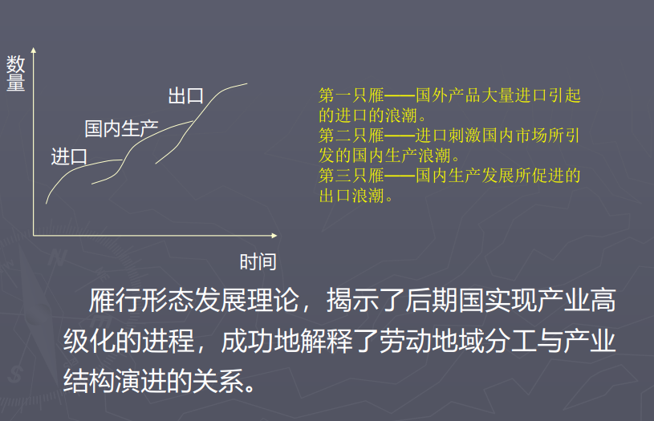

- [产业与发展](#产业与发展)
  - [一、产业的分类与演变](#一产业的分类与演变)
    - [**产业的分类与演变**](#产业的分类与演变)
    - [（一）产业结构与产业分类](#一产业结构与产业分类)
    - [（二）区域产业结构演进理论](#二区域产业结构演进理论)
    - [（三）区域产业结构模式与布局](#三区域产业结构模式与布局)
    - [~~（四）区域产业结构演进理论~~](#四区域产业结构演进理论)
    - [**区域经济发展理论**](#区域经济发展理论)
    - [（一）区域经济发展阶段理论](#一区域经济发展阶段理论)
    - [（二）区域空间结构演进理论](#二区域空间结构演进理论)
  - [二、农业与农业区位](#二农业与农业区位)
    - [（一）第一产业布局](#一第一产业布局)
    - [（二）杜能农业区位论](#二杜能农业区位论)
    - [（三）韦伯工业区位论](#三韦伯工业区位论)
    - [（四）克式的中心地理论](#四克式的中心地理论)
  - [~~三、工业与工业区位~~](#三工业与工业区位)
    - [~~第二产业规划~~](#第二产业规划)
  - [四、服务业与服务业区位](#四服务业与服务业区位)
    - [第三产业布局](#第三产业布局)

# 产业与发展
## 一、产业的分类与演变
**产业**是<u>指由利益相互联系的、具有不同分工的、由各个相关行业所组成的业态总称。围绕者共同产品进行工作</u>。（key point）

### **产业的分类与演变**
### （一）产业结构与产业分类

`产业结构`是<u>指生产要素（劳力、资本、信息、技术、原料等）在产业部门间的比例构成和他们之间相互依存、相互制约的联系</u>，或者说是一种配置状况即期制约方式。它是区域经济结构的重要属性。（key point）

`产业分类`是按照一定的原则，将国民经济各种成分进行分解与组合，<u>是研究产业结构的基础</u>。

- 按社会再生产过程中各部门的相互依存关系分：生产资料生产部门、消费资料生产部门
- *根据社会生产活动历史发展的顺序：第一次产业、第二次产业、第三次产业*
- 产业功能分类：主导产业、关联产业、基础性产业
- 按资源密集程度：资源密集型、资金密集型、劳动密集型、技术密集型
- 按产业的增长率：成长产业、成熟产业、发展产业、衰退产业

**三次产业分类法（克拉克产业分类法）**
- 分类依据：全部经济活动与经济发展、生产部门变化及其人类需要的密切程度。
- 结论：<u>第一产业（基本产品直接从自然界取得的）、第二产业（通过对自然物质资料即工业品原料进行加工获得的）、第三产业（除一、二产业以外的非物质产业，即服务业）</u>
- 特点：与经济发展、社会分工、人类生活相联系；反映了社会经济结构的变化与演进趋势

第三产业行业众多，我国将第三产业分为流通部门和服务部门两大部门，具体分为四个层次：
- 第一层次：流通部门，交通运输、邮电通讯、商业饮食、物资供销仓储等
- 第二层次：为生产和生活服务的部门，金融、保险、房地产、居民服务、旅游、咨询和技术服务业等
- 第三层次：教育、文化、广播电视、卫生、体育、科学研究、社会福利事业等
- 第四层次：为社会公共需要服务的部门，包括国家机关、党政机关、社会团体、军队、警察等

**产业功能分类**
根据各个产业再经济增长中的作用和相互间联系，分为三大类：
- 主导产业——在区域经济增长中起组织和带动作用的产业
- 关联产业——直接与主导产业在产品的投入产出、技术等方面有联系，为主导产业发展进行配套、协作的产业
- 基础性产业——为区域经济增长、社会发展、人们生活提供公共服务的产业

**要素集约度产业分类**
根据产业对自然资源、资本、劳动力、技术等生产要素的依赖程度大小进行产业划分
- 资源密集型
- 资金密集型
- 劳动密集型
- 技术密集型

**增长率产业分类**
按照各产业在前后两个时期增长率的变化来划分产业。
- 成长产业——其增长率在前后两个时期都超过区域平均值；
- 成熟产业——产业增长率前期大大高与平均水平，后期则与平均值大体相当；
- 发展产业——产业增长率在前期与平均值大体相当，后期大大高与平均水平；
- 衰退产业——其增长率在前后两个时期都与平均增长率接近或低与平均值。

**按社会部门的性质**

——*联合国工业组织分类*：
1．农业、狩猎业、林业和渔业；
2．矿业和采矿业；
3．制造业；
4．电力、煤气、供水业；
5．建筑业；
6．批发与零售业、餐馆与旅店业；
7．运输、仓储业和邮电业；
8．金融业、不动产业、保险业和商业性服务业；
9．社会团体、社会及个人的服务业；
10．不能分类的其它活动。

——*我国现行国民经济部门划分*：
1．农、林、牧、渔业；
2．采掘业；
3．制造业；
4．电力、煤气及水的生产和供应业；
5．建筑业；
6．地质勘探业、水利管理业；
7．交通运输、仓储及邮电通信业；
8．批发和零售贸易、饮食业；
9．金融保险业；
10．房地产业；
11．社会服务业；
12．卫生、体育和社会福利业；
13．教育、文化艺术和广播电影电视业；
14．科学研究和综合技术服务业；
15．国家机关、党政机关和社会团体；
16．其它行业。

### （二）区域产业结构演进理论

区域产业结构演进理论旨在解释<u>区域产业结构变化的方向、方式和途径</u>。

**1.佩第——克拉克定理**

基本内容：
随着经济发展，人均国民收入水平相应提高，于是，劳动力就开始从第一产业向第二产业转移。当人均国民收入水平进一步提高时，劳动力就会向第三产业转移。结果，社会劳动力在产业之间的分布状况是，第一产业劳动力减少，第二产业和第三产业的劳动力将增加。(key point)

产业结构演化原因：在经济发展中各产业之间存在着收入相对差异，而劳动力总是倾向于流向高收入的产业。
推论：一个区域的人均国民收入水平越高，那么，农业劳动力在全部劳动力中所占的比重就越小，而第二产业和第三产业的劳动力比重就越大。反之，则相反。(key point)

**2.库兹涅茨法则**
国民收入中的比重和劳动力比重的变化

基本内容 （key point）：
第一，随着时间的推移，农业部门的国民收入在整个国民收入中的比重和农业劳动力在全部劳动力中的比重均处于不断下降之中。

第二，工业部门的国民收入在整个国民收入中的比重大体上是上升的，但是，工业部门劳动力在全部劳动力中的比重则大体不变或略有上升

第三，服务部门的劳动力在全部劳动力中的比重基本上都是上升的。然而，它的国民收入在整个国民收入中的比重却不一定与劳动力的比重一样同步上升，综合地看，大体不变或略有上升。

**3.工业化过程与霍夫曼定理**

工业化过程：近代经济的发展过程一般被称为工业化过程。在整个工业化的过程中，制造业地位的变化是关键。
整体工业化过程可以分为三个过程：重工业化过程、深加工化过程和技术集约化过程。

霍夫曼定理又被称作“霍夫曼经验定理”是指资本资料工业在制造业中所占比重不断上升并超过消费资料工业所占比重。

►霍夫曼比例（H'）＝消费资料工业净产值/资
本资料工业净产值。

霍夫曼定理(key point)
霍夫曼比例或霍夫曼系数：
霍夫曼比例＝消费资料工业的净产值／生产资料工业的净产值
霍夫曼定理：在工业化的进程中，霍夫曼系数是不断下降的。
库兹涅兹和盐野谷佑一通过实证研究后认为：当工业发展到一定阶段后，霍夫曼系数基本保持不变，而重工业的比重持续上升。

- 重工业化过程： 重工业化过程即工业结构由轻工业为主逐步转向以重工业为主的转换过程。
- 深加工化过程：制造工业的结构由以原材料工业为主逐步转向以深加工工业和组装工业为主的过程称为深加工化进程。
- 技术集约化过程：劳动密集型→资金密集型→技术密集型发展

霍夫曼定理基本内容：
在工业化的进程中，霍夫曼比例是呈下降的趋势。
在工业化的第一阶段，消费资料工业的生产在制造业中占主导地位，资本资料工业的生产不发达，此时，霍夫曼比例为5 (±1)。
第二阶段，资本资料工业的发展速度比消费资料工业快，但在规模上仍比消费资料工业小得多，这时，霍夫曼比例为2.5（±1）。
第三阶段，消费资料工业和资本资料工业规模大体相当，这时，霍夫曼比例是1(±0.5)。
第四阶段，资本资料工业的规模超过了消费资料工业的规模。

| 阶段       | 第一阶段 | 第二阶段 | 第三阶段 | 第四阶段 |
| ---------- | -------- | -------- | -------- | -------- |
| 霍夫曼比例 | 5(±1)    | 2.5(±1)  | 1(±0.5)  | 1以下    |

**4.钱纳里工业化阶段理论**

钱纳里从经济发展的长期过程中考察了制造业内部各产业部门的地位和作用的变动，揭示制造业内部结构转换的原因，即产业间存在着产业关联效应，为了解制造业内部的结构变动趋势奠定了基础，他通过深入考察，发现了制造发展受人均GNP、需求规模和投资率的影响大，而受工业品和初级品输出率的影响小。<u>他进而将制造业的发展分为三个发展时期：经济发展初期、中年期和后期；将制造业也按三种不同的时期划分为三种不同类型的产业</u>。即：
► 1）<u>初级产业</u>，是指经济发展初期对经济发展起主要作用的制造业部门，例如食品、皮革、纺织等部门；
► 2）<u>中期产业</u>，是指经济发展中期对经济发展起主要作用的制造业部门，例如非金属矿产品、橡胶制品、木材加工、石油、化工、煤炭制造等部门；
► 3）<u>后期产业</u>，指在经济发展后期起主要作用的制造业部门，例如服装和日用品、印刷出版、粗钢、纸制品、金属制品和机械制造等部门。

| 阶段               | 特征                                                                                                                                                                                                                                                      |
| ------------------ | --------------------------------------------------------------------------------------------------------------------------------------------------------------------------------------------------------------------------------------------------------- |
| 传统社会阶段       | 农业为主，绝大部分人口从事农业，没有或极少现代化工业，生产力 水平很低，基础设施落后，社会发展水平低。                                                                                                                                                     |
| 工业社会阶段——初期 | 产业结构从落后农业为主的传统结构逐步向现代工业为主的工业化结 构转变，工业以食品、烟草、采掘、建材等初级产品生产为主； 开始走上工业化道路，人民生活水平逐步提高，市场逐步扩大， 投资环境改善；劳动密集型产业为主，劳动力廉价。                             |
| 工业社会阶段——中期 | 制造业内部由轻工业的迅速增长转向重型工业的迅速增长，非农业劳 动力开始占主体，第三产业开始迅速发展；大部分产业是资金密 集型，城市化水平迅速提高，市场稳步扩张，投资领域扩大，支 柱产业—重化工业，先导产业—机械电子，服务产业—轻工、耐 用消费品、第三产业。 |
| 工业社会阶段——后期 | 第一、二产业协调高水平发展，第三产业持续高速发展，第三产业是 区域经济增长主导力量；新兴服务业如金融、信息、广告、公用 事业、咨询业发展最快。                                                                                                              |
| 后工业化社会阶段   | 制造业内部由资金密集型主导转向技术密集型主导，生活方式现代化， 高档耐用消费品普及；技术密集型产业迅速发展；技术密集型产 业包括高档消费品、新技术设备、新能源、新材料、生物工程、 航天技术。                                                               |
| 现代化社会阶段     | 智能密集型和知识密集型产业从服务业中分离，并占主导地位；消费 多样化个性化。                                                                                                                                                                               |

**5.雁行形态说**

由日本经济学家赤松于1960年提出，他认为后起国家和地区的幼小产业变为可以在国际市场上具有竞争能力的现代化产业，是以雁行形态发展的。
按照赤松的观点，幼小产业要变成具有强竞争能力的出口产业，对于后进地区来说应当遵循“进口→国内生产→出口”的模式，相继交替发展。这种进口→国内生产→出口的发展过程，在图形上像三只雁在飞翔：第一只雁就是进口的浪潮；第二只雁是进口所引发的国内生产的浪潮；第三只雁是国内生产发展所促进的出口的浪潮。

在产业发展方面，后进国家的产业赶超先进国家时，产业结构的变化呈现出雁行形态。即后进国家的产业发展是按“进口－国内生产－出口”的模式相继交替发展。这样一个产业结构变化过程在图形上很像三只大雁在飞翔，故称之为“雁行形态说”。
第一只雁——国外产品大量进口引起的进口的浪潮。
第二只雁——进口刺激国内市场所引发的国内生产浪潮。
第三只雁——国内生产发展所促进的出口浪潮。
雁行形态模式的两个变型：
产业发展的次序一般是从消费资料产业到生产资料产业，从农业到轻工业，进而到重工业的不断高级化过程。
消费资料产业的产品不断从粗制品向精制品转化，生产资料产业的产品不断从生产生活用的生产资料向生产生产用的生产资料转化，最终使得产业结构趋向多样化和高级化。

**6.产品循环说**

产品循环说是以本国工业开发的新产品在国内市场上的出现为出发点的。该理论认为，产品循环表现为四个过程，具体如下：
第一过程，是产品的诞生期，开发出新产品，扩大市场，直到市场饱和；
第二过程，是产品的增长期，在国内市场饱和后，这个产品就将寻求出口国外，开拓国外市场；
第三过程，是产品的成熟期，随着国外市场的形成，由于国内生产成本的增加，该产品就会由出口产品而转为出口资本和技术，促成资本和技术与国外的；廉价劳动力及其他资源结合，直接在国外生产和销售产品；
第四过程，伴随国外生产能力的形成，又会使产品以更低的价格回销到本国市场，这样就迫使原生产国放弃这种产品的生产，并转向开发新的产品。总结上述四个过程，就会形成“新产品开发→国内市场形成 →产品出口→资本和技术出口→产品进口→开发另一新产品......”的产品循环过程。发达国家开发新产品并在海外投资使本国原有产 业受到国外竞争压力威胁的现象，称之为“飞旋标效应”，亦称为“反回头效应”

产品循环说雁形形态说的比较
二者的出发点不同，但结论有相似之处。不同的只是对象不同，一个是对进口国而言，一个是对出口国而言。这两种分析都说明，落后国家实际可利用“后发优势”，即落后国家和地区可以回避投资多、风险大、历时长的技术开发过程，利用发达国家的资金和技术，利用本地的低工资的优势和市场，发展现代化的生产，待有一定规模后，在将产品打回发达国家的市场。这样可以加速产业结构的转换，缩短与发达国家的经济发展差距。其中的关键是要利用后发优势，并创造利用这种优势的条件。

### （三）区域产业结构模式与布局

关于区域产业结构已提出了多种模式，但在我国运用最广的是以主导产业、关联产业和基础性产业所构建的区域产业结构模式。该模式强调主导产业是区域产业的组织核心，关联产业和基础性产业依据与主导产业的经济技术联系，彼此连接，形成联系紧密有序、相互促进或制约的产业系统。

主导产业的概念
►是指具有一定规模，能够较多地吸收先进技术,保持高于区域整体的增长速度，对其他产业的发展具有较强的带动作用的产业部门,是产业结构的 核 心 内 容 和 产 业 结 构 演 化 的 中 心 。 (keypoint)
➢特点:
➢较强的创新能力
➢持续的部门增长率（市场需求量大）
➢很强的关联效应
➢显著规模与发展潜力
➢经济发展过程具有阶段

优势产业：
是指那些在当前经济总量中其产出占有一定份额，运行状态良好、资源配置基本合理，资本营业效率较高,在一定空间区域和时间范围内有较高投入产出比率的产业。

支柱产业：
严格来说仍属于优势产业的范畴,但优势产业不一定都能成长为支柱产业，因为它更强调某一产业在整个经济总量中所占的份额及其对相关产业的带动作用。指的是净产出在区域经济总量中占有较大份额的产业。

主导产业、支柱产业和优势产业
- 都能体现区域的经济特色，都要求有较高的生产率和生产率增长,有较强的外部联系效果。

区别：
- 含义侧重不同
- 经济地位不同
- 产业寿命周期不同
- 利益目标不同

主导产业的选择——❖ 筱原两基准
- 需求收入弹性基准。选择需求收入弹性系数大的产业为主导产业。
- 生产率上升率基准。选择生产效率上升快的产业为主导产业。

### ~~（四）区域产业结构演进理论~~

### **区域经济发展理论**

### （一）区域经济发展阶段理论
区域经济发展具有明显的阶段特征
（一）区域经济发展的趋势和方向
（二）胡佛—费雪尔的区域经济发展阶段理论
（三）罗斯托的经济成长阶段理论
（四）陈栋生的区域经济发展理论
（五）库兹涅茨理论
（六）霍夫曼定理
（七）钱纳里工业化阶段理论

### （二）区域空间结构演进理论
区域经济空间结构是指在一定地域范围内经济要素的相对区位关系和分布形式，，它是在长期经济发展
过程中人类经济活动和区位选择的累积结果,是指各种社会经济活动在区域内的空间分布状态及空间组合形式。

1、节点——指某些社会经济活动在地理空间上集聚而形成的点状分布形态（一般表现为乡村聚落、集镇或城市）

2、线路——指某些经济活动在地理空间上所呈现出的线状分布状态，是人流、物流、信息流、资金流等的途径和通道

3、网络:由点和线连接而成，能产生单个点和线所不能完成的功能。

节点是网络的核心，线路是沟通节点之间、节点与域面、域面与域面之间的通道。（key point）

4、域面:域面指区域内部某些经济活动在地理空间上所表现出的面状分布状态，是经济活动所依托的地表空间(包括同质域面、异质域）

p199
## 二、农业与农业区位

### （一）第一产业布局
影响农业发展的条件
- 农业自然能条件：光照（太阳辐射、热量）、土地和水分
- 农业技术经济条件分析：（劳动力条件、技术装备、生产技术、种植方式和耕作制度）
- 农业原有基础：

影响农业发展条件因素，在指定农业发展布局中缺一不可，相互影响并产生复杂的反馈关系。因此，在制定区域农业规划布局时，应充分了解各种生产条件及其相互作用，并保持一定数量比例，才能制定出合理布局方案。

### （二）杜能农业区位论

1．杜能关于“孤立国”的假定条件
（1）肥沃的平原中央只有一个城市；
（2）不存在可用于航运的河流（运河），马车是唯一的交通工具；
（3）土质条件一样，任何地点都可以耕作；
（4）距城市50英里之外是荒野，与其它地区隔绝；（中心城市是农产品的唯一贩卖中心，也是唯一的工矿品的供应者）
（5）市场的农产品的价格、农业劳动者工资、资本利息等固定不变。
（6）运输费用同运输的质量成正比，运输费用由农业生产者负担。

2．杜能要解决的问题
（1）在前述条件下，农业发展分布的空间状态。
（2）合理经营农业时，距离城市的远近对农业部门产生的影响。
以最大纯收益为目标，农场的经营类型随到城市距离的增加将如何变化？
3．杜能的研究方法
“孤立化的方法”: 排除其它要素（土质、肥力、河流等）而只探讨一个要素（即市场距离）的作用。也就是不考虑所有自然条件的差异，而只考察在一个均质的假想空间里，农业生产方式的配置与距城市距离的关系。

杜能区位理论：以城市为中心，由里向外依次为自由式农业、林业、轮作式农业、谷草式农业、三圃式农业、畜牧业这样的同心圆结构。(key point)

杜能农业区位论的意义
1、农业地理学意义 (key point)
它揭示了即使在同样的自然条件下，也能够出现农业的空间分异。这种空间分异源于生产区位与消费区位之间的距离，各种农业生产方式在空间上呈现出同心圆结构。它提出了农业地理学的两个原理：
o 不存在对所有地域而言具有绝对优势的农业生产方式，即农业生产方式的相对优越性。
o 距市场越近、单位面积收益越高的农业生产方式越合理。
2、经济学意义
它创立了孤立化的研究思维方法。第一次从理论上系统地阐明了空间摩擦对人类经济活动的影响，成为土地利用一般理论的基础

杜能理论的其它缺陷
►该理论未考虑自给性农业经营的空间问题；
►追求最大地租收入的行为动机与现实不完全符合；
►技术与交通条件的改善使距离因素决定性制约作用减弱；
►缺乏城市周围地区的土地利用。

应用研究：
- 乔纳森的宏观尺度研究
- 纳瓦佛等人的微观尺度研究
- 华熙成对上海郊区农业的研究

### （三）韦伯工业区位论

基本概念
(1)区位因子(locational factors)及其分类
◆概念：区位因子为经济活动在某特定地点进行时得到的利益，即费用的节约 (key point)。

韦伯分三个阶段逐步构建其工业区位理论：（key point）
第一阶段：由运费指向形成地理空间中的基本工业区位格局。
第二阶段：劳动费指向，可以使在运费指向所决定的基本工业区位格局发生第一次偏移。
第三阶段：集聚指向，可以使运费指向与劳动费指向所决定的基本工业区位格局再次偏移。

在生产过程不可分割、消费地和局地原料地只有一个的前提下，依据最小运费原理的区位为：
(1)仅使用遍在原料时，为消费地区位；
(2)仅使用纯原料时，为自由区位；
(3)仅使用损重原料时，为原料地区位。

劳动费——指每单位质量产品的工资部分(key point)。它不仅反映了工资水平，同时也体现了劳动能力的差距

概念
◆集聚因子——因一定量的生产集中在特定场所带来的生产或销售成本降低。
◆分散因子——分散因子是集聚的反作用力，是随着消除集中而带来的生产成本降低。

韦伯区位论的意义(key point)
(１)韦伯首次将抽象和演绎的方法运用于工业区位研究中，建立了完善的工业区位理论体系。
(２)提出最小费用区位原则，即费用最小点就是最佳区位点。
(３)指向理论已发展成为了经济区位布局的一般理论。

理论与现实（缺点）
韦伯工业区位论中有不少假定（如运费构成，完全竞争条件）与现实存在距离，同时，忽视了决策者的差异、技术变化以及政策因素等对工业区位的影响，因而降低了其现实有效性

应用：
（1）运费指向论的应用
——依据原料指数可判断其区位倾向
（2）劳动费指向论的应用
——韦伯测定了当时德国机械、金属和运输机械工业的劳动费指向程度。纺织业和精密机械零件行业的区位是典型的劳动费指向性产业。一般向都市周边和农村地域分散的工业大都是劳动系数高或对集聚利益要求不高的行业。
（3）集聚指向论的应用
——工业由分散走向集聚，再由集聚趋于分散已成为工业区位空间运动的一个规律。“二战”后，日本“三湾一海”形成了高度密集的重化学工业集聚带。20世纪70年代后，这种集聚有所缓和，特别是京滨工业地带的临海部工业的集聚出现停止。

### （四）克式的中心地理论
(一)假设条件和有关的概念
1、假设条件 理想地表、经济人
2、有关概念和术语： （1）中心地 （2）中心货物与服务 中心地职能
（3）中心性或中心度 （4）服务范围
(二)、克氏理论要点
1、同一等级的中心地有同样大小的服务范围，即六边形市场区
2、中心地分布要满足两个条件：P163
商人利润最大化 所有人口都得到每一种货物的服务
3、中心地的分布是等边三角形网络，六边形市场区
4、整个中心地及市场区是由一级套一级的网络嵌套而成
嵌套原则：低一级中心地和市场区被高一级的市场区所包括，整个体系都如
此，相同级别的市场区和中心地是独立的彼此排斥的。
(三)、中心地理论模型
市场原则 交通原则 行政原则

中心地理论（Central Place Theory）
是由德国城市地理学家克里斯塔勒和德国经济学家廖士分别于 1933年和 1940年提出的， 被认为是20世纪人文地理学最重要的贡献之一。 有人评价“没有克里斯塔勒的中心地学说，便没有城市地理学，没有居民点问题的研究”。
◼ 背景：
◼ 1930年代，地理学不能解释区域的城市数量、城市规模和城市分布的规律性。 克氏中心地理论主要探索“决定城市的数量、规模以及分布的规律是否存在，如果存在，那么又是怎样的规律”这一课题。他运用演绎法来研究中心地的空间秩序，提出聚落分布呈三角形，市场区域呈六边形的空间组织结构，进一步分析了中心地规模等级、职能类型与人口的关系以及在三原则基础上的中心地空间系统 。

假设条件：
1)“孤立国”：
◼ ①自然条件无差别；（基础作用）
◼ ②人文条件的无差别（人口分布均匀）；
◼ ③同级中心地提供的同类商品和服务无差别，其销售价格无差别；（供给者）；
◼ ④居民的消费习惯无差别，收入水平相同；（消费者）
◼⑤商品的服务能自由流动，不存在壁垒和非壁垒障碍因素；（供给者——消费者）（剔除了自然和人为因素造成的差异；中心地分布的均匀性；由中心地提供的商品和服务只与中心地的等级层次相关；消费才获得的商品和服务与中心地的层次有关。）
2)、唯一性
运输方式唯一（马车运输）；单位运费唯一（C=pd）
3)经济合理性
供给者：获得利润最大。
最大销售范围/门槛销售范围 （市场区）
需求者：节约费用而获得相应的需求。

有关概念和术语
（l）中心地（Central Place）－－向居住在它周围的居民提供各种货物和服务的地方。 (key point)
• （2）中心货物与服务－－指在中心地内生产的货物与提供的服务，亦可称为中心地职能（Central Place Function）。中心货物和服务是分等级的，即分为较高（低）级别的中心地生产的较高（低）级别的中心货物或提供较高（低）级别的服务。
• （3）中心性或中心度－中心性是指就中心地的周围地区而言，中心地的相对重要性。简单地说，是中心地所起的中心职能作用的大小。也可理解为中心地发挥中心职能的程度。

4）服务范围。
◼ 范围的上限是消费者愿意去一个中心地得到货物或服务的最远距离，超过这一距离他便可能去另一个较近的中心地。以最远距离r为半径，可得到一个圆形的互补区域，它表示中心地的最大腹地。
◼ 服务范围的下限是保持一项中心地职能经营所必需的腹地的最短距离。它表示维持某一级中心地存在所必需的最小腹地， 亦称之为需求门槛距离（Threshold），即最低必需销售距离。
•
•服务范围上下限之间存在着三种关系：
•①如果门槛距离大于货物的最大销售距离，那么这种货物在该地区就不可能以正常的方式提供。
•②如果货物的最大销售距离和门槛距离相等，那么，经营该种货物正好能得到利润。
•③如果货物的最大销售距离大于门槛距离，那么，该项货物不仅可被提供，而且经营者还可从为居住在两个腹地间的人口服务中得到超额利润。

克氏理论要点1、同一等级的中心地有同样大小的服务范围，即六边形市场区
2、中心地分布要满足两个条件：
- 一是各级供应点必须达到最低数量以使商人的利润最大化（必须采用货物的最大销售距离，因为这可以使供应点的数量达到最少化）
- 二是一个地区的所有人口都应得到每一种货物的提供或服务。（圆形的市场区被六边形的市场区所替代）
3、中心地的分布是等边三角形网络，六边形市场区
4、整个中心地及市场区是由一级套一级的网络嵌套而成。嵌套原则：低一级中心地和市场区被高一级的市场区所包括，整个体系都如此，相同级别的市场区和中心地是独立的彼此排斥的。

## ~~三、工业与工业区位~~

### ~~第二产业规划~~

## 四、服务业与服务业区位

### 第三产业布局

`第三产业`包括了商业与贸易、金融与保险、旅游与娱乐、仓储与运输、信息与通讯、旅馆与饮食、文教与卫生、科研与咨询，以及修理、理发、美容及其它劳务性服务在内的多种行业。

第三产业统称为服务业，层次十分复杂。
*国际上*，划分第三产业为两层次：为消费服务的部门和为生产服务的部门，进而再细分。*国内*，划分第三产业为四层次：流通部门、为生产和生活服务部、为提高科学文化水平和居民素质服务、为社会公共需要服务的部门 （key point）。第三产业具有“易行性（低门槛性）”、服务性、普遍性“的特点。

美国学者马克卢普在《美国的知识生产与分配》一书中，则明确给出了现代服务业的一般范畴和简单分类模型。他认为，现代服务业主要包括四个行业，即教育、科学研究、通信媒介和信息服务（key point），突出强调了现代服务业的知识性和信息服务性

`现代服务业`是第三产业的延伸和发展。现代服务业有*广义*和*狭义*之分，广义的现代服务业包括传统服务业的升级和新兴的服务业。狭义的现代服务业主要指依托信息技术、现代化科学技术和技能发展起来的，信息、知识和技能相对密集的服务业 (key point)

现代服务业的特征
► 表述一：现代服务业是信息密集型和知识密集型的服务行业，具有三大基本特性：
► （1）高技术性，即现代服务业科技含量高；
► （2）知识性，即相对于劳动密集型服务业而言，现代服务业是一种以运用智力资源为主的服务业，它越来越注重人力资源的知识水平和创新能力。
► （3）新兴性，即在时间上是现代兴起的或从过去演变而来的。如物流服务业是新兴的和从传统商业和运输业中衍生而来的。

表述二：
► 现代服务业具有“三高”、“三新”特征，“三高”即高人力资本含量、高技术含量和高附加价值。
► 在“三高”的基础上，还衍生出现代服务业“三新”，即“新技术、新业态和新方式”的发展态势。

表述三(key point)：
► 现代服务业一般具有五大基本特性：
(1)高技术性，即现代服务业科技含量高。 
(2)知识性，即现代服务业为消费者提供知识的生产、传播和使用服务，使知识在服务过程中实现增值。(3)高增加值性和集群性，即现代服务业不仅可以使服务过程产生知识的增值，而且可以产生服务的规模效应和各种服务相互融合的聚集效应，引起服务的大幅度增值。
(4)从业人员高素质性，即现代服务业的从业人员大都具有良好的教育背景、专业知识基础和技术、管理的能力，从而构成了现代服务业的核心能力和“白领”、“灰领”阶层的聚集区。
(5)新兴性，即在时间上是现代兴起的或从过去演变而来的。

表述四：
► 现代服务业从产业性质看，产品具有无形态性、中间消耗性以及经验性商品而非搜寻性商品的特征；从企业战略活动的方向看，随着社会专业化分工的不断深化和泛化，生产者服务逐步从企业价值链中分离出来，成为增值最大、也最具战略性的高级环节；从产业的市场结构看，由于其供给多是“量体裁衣”式的“订制化”生产，因而差异性极强、替代性较差，产业竞争呈现出垄断竞争的特征；从生产要素和产出性质看，由于其提供者是生产过程中的重要专家组，且多以人力资本、技术资本和知识资本为主要投入，因而其产出中包含密集的知识要素，可以说是生产者服务将日益专业化的知识技术导入了商品生产过程；从空间载体看，生产者服务具有高度的空间集聚特性，因而是调整城市功能以及增强城市辐射功能的重要手段。

表述五：
► 现代服务业：
► （1）是一种客户经济。产品不过是一种手段，而不是最终的目的。
► （2）是一种速度经济。
► （3）是一种标准经济。肯德基、麦当劳、英特尔—微软联盟，与其说出售的是一种商品，不如说是一种标准。一流的企业做标准。谁创建了行业标准，谁就将主导整个供需链。
► （4）是一种技术经济。必须采用最新的信息技术，一方面对成千上万种商品实行单品管理、全过程管理；另一方面对客户需求进行搜集，形成有效订单

本章知识点：
解释名词的涵义：产业、产业结构、产业分类、主导产业、配第-克拉克定律、霍夫曼定律、库兹涅茨的现代经济增长理论、赤松“雁行模式”、现代服务业（狭义）
陈栋生的区域经济发展理论
韦伯工业区位论和杜能农业区位论的内容
现代服务业的5个基本特征（表征三）

