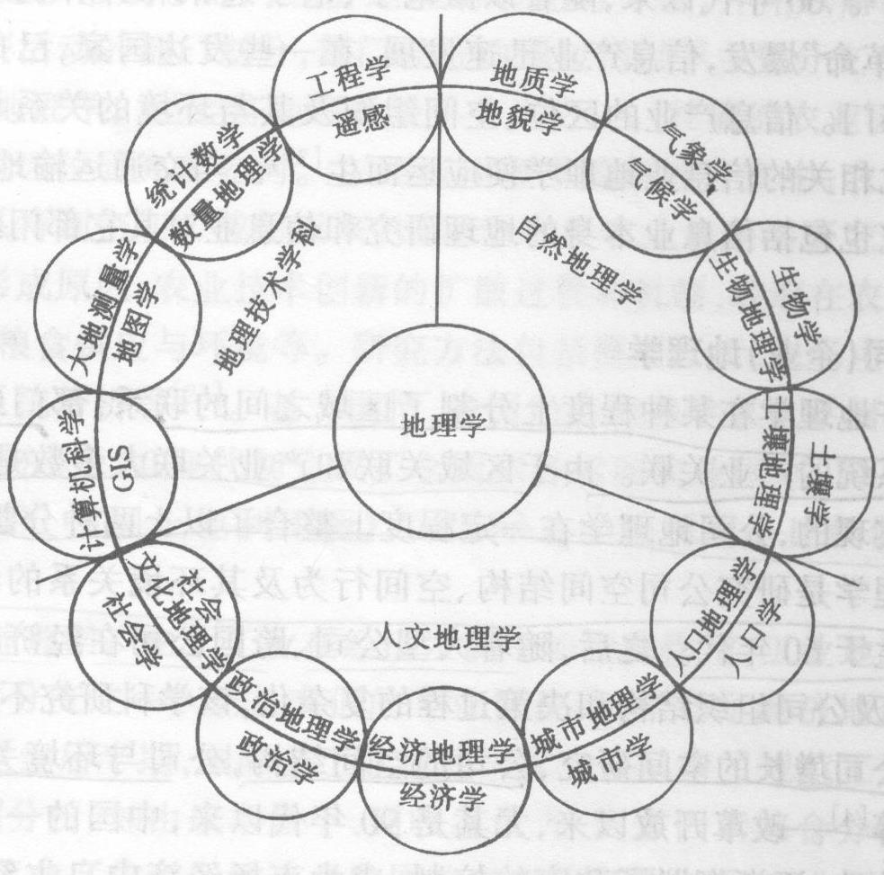
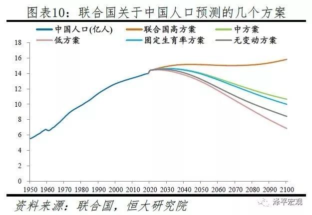
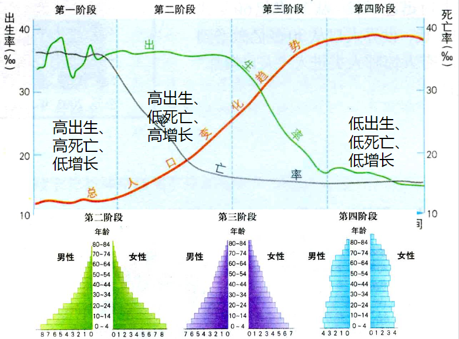

- [人口分布与迁移](#人口分布与迁移)
  - [知识点](#知识点)
  - [一、人文地理学概论](#一人文地理学概论)
    - [（一）人文地理学的概念与研究对象（key point）](#一人文地理学的概念与研究对象key-point)
    - [（二）人文地理发展简史](#二人文地理发展简史)
    - [（三）人文地理学的学科特性（key point）](#三人文地理学的学科特性key-point)
    - [（四）人文地理学研究方法](#四人文地理学研究方法)
  - [二、人口分布与构成](#二人口分布与构成)
    - [（一）人口地理学](#一人口地理学)
    - [（二）人口构成](#二人口构成)
    - [（三）人口构成（key point）](#三人口构成key-point)
  - [三、人口分布](#三人口分布)
    - [（一）人口分布的概念及其度量](#一人口分布的概念及其度量)
    - [（二）世界人口分布的一般规律](#二世界人口分布的一般规律)
    - [（三）中国人口分布](#三中国人口分布)
    - [（四）人口分布的影响因素](#四人口分布的影响因素)
    - [（五）世界人口的增长](#五世界人口的增长)
    - [（六）中国的人口增长](#六中国的人口增长)
    - [（七）人口问题](#七人口问题)
  - [四、人口增长和迁移](#四人口增长和迁移)
    - [（一）人口的自然增长](#一人口的自然增长)
    - [（二）人口的社会增长](#二人口的社会增长)
  - [思考题](#思考题)

# 人口分布与迁移

## 知识点
名词：人口、人口分布、人口密度、人口迁移、
人口移动、人流动、人口的自然增长、人口
问题、人口老龄化。
2、什么是人口密度，是如何分类的？
3、简要回答中国人口分布的特点。
4、什么是人文地理学？其主要研究对象有哪
些，具有什么学科特性。
5、二战后世界人口迁移具有什么特点？
6、简要回答GIS在人口地理学中的作用

## 一、人文地理学概论
### （一）人文地理学的概念与研究对象（key point）

人文地理学是研究地表人文事象的空间分布及其空间差别，并预测其发展规律的科学，它是以<u>**人地关系**</u>为基础，着重研究<u>地表人类活动或人与环境所形成的各种文化现象</u>的分布与变化。

广义人文地理学：包括经济地理学。

研究问题：

人文事物的空间分布；人文事物与自然环境之间，不同层次文化要素之间的纵向关系。

<u>凡是不涉及空间分布和空间过程的问题，均不是人文地理学的问题</u>。

研究对象：

人文现象（人文事象、文化景观）：一个疏松的社会文化综合体。

人文地理学研究对象的特定内核

- 人地关系
- 区域研究
- 空间分析

人文地理学关注地球表面自然现象和人文现象的<u>区位和空间变化</u>，强调地方和空间对过程和现象的重要性，着重说明<u>在什么地方有什么样的人文活动和人文特性，探讨其形成过程，揭示与地理环境的相互关系，并预测其发展变化趋向</u>。

### （二）人文地理发展简史

### （三）人文地理学的学科特性（key point）

- 社会性
  - 人文地理学是社会性较强的地理科学。研究社会现象的地域结构、社会生产方式和社会经济制度；
  - 社会性还表现在历史性上：现代人文地理现象作为历史发展的结构和未来发展的起点。
- 综合性
  - 来源于地理事物的多样性、整体性，人文地理学是从整体的角度去研究人文现象。
- 区域性
  - 区域性是地理学的基本特性。人文地理学与其他人文学科的差异，根本点之一在于人文地理学包含了区域研究的特性，重视了区域特性的差异性和相似性。

### （四）人文地理学研究方法

作为地理学中一门接近人文或社会科学的学科，人文地理学在研究方法上既采用地理学中**传统**的方法(如实地调查、运用地图等)和现代方法(如航空像片、卫星像片、地理模型等)，也引进大量的**社会科学方法**(如抽样调查、定量技术、心理学和行为学等研究方法)。

## 二、人口分布与构成

### （一）人口地理学

人口地理学的概念（key point）：

研究在一定历史条件下人口分布、人口构成、人口变动和人口增长的空间变化，及其与自然环境和社会经济环境的关系的学科。

人口地理学与人口学的关系

人口地理学**着眼于人口现象的空间**方面，人口地理学借助人口学的基本理论、数据和方法，具有**地理学和人口学之间边缘学科**的性质。

人口地理学的基本内容（key point）

研究人口地理分布，人口变动、人口迁移，人口增长，人口构成，劳动力资源，人口承载能力等

人口地理学发展简史

- 中国《汉书 地理志》
- 1798年英国经济学家马尔萨斯《人口论》
- 1804年人文地理学创始人李特尔《欧洲地理》
- 1891年拉采尔《人类地理学》
- 1926年竺可桢发表了对江苏、浙江省人口密度研究的论文
- 1931年几年后胡焕庸提出中国人口分布的密度差异的重要概念（key point）
- 二战后美国的特里瓦撒和齐林斯基、法国的博热·加涅埃、英国的克拉克、等人的著作在国际上都有一定的影响。
- 1966年齐林斯基指出人口地理学可分为：描述人口数量和特性的地理位置；解释人口数量和特性的空间表现形态；人口现象的地理分析
- 1970年代以来，美国一些人口地理学家特别关注人口的重新分布和政府的人口政策，对城市化过程也作了大量研究，还探讨了国际人口迁移趋势以及国际移民计划

### （二）人口构成
人口：生活在一定社会生产方式、一定时间，居住在一定地域，实现其生命活动并构成社会生活主体，具有一定数量和质量的人所组成的社会群体。

人口分布：是指一定时间内人口在一定地区范围的空间分布状况，是人口过程在空间的表现形式。

人口分布的测度——人口密度：人口密度一般被看做是衡量人口分布的主要指标，它反应一定地区的人口密集程度，是指单位土地面积上居住的人口数。

人口密度的弊端：
- 只是一个平均数，掩盖了内部差异
- 范围越小，越能反映人口分布的现实
- 是人口与抽象空间的比较，反映的人地关系不具体、不精确
- 不具有功能特性，难以揭示演变趋势

人口数量

### （三）人口构成（key point）
`人口构成`是指具有不同自然的、社会经济的、地域特征的人口之间的比例关系，即各特征的人口数在人口总数中的百分比，也称人口结构。人口结构包括<u>**自然结构、社会经济结构和地域结构**</u>。人口的自然结构根据人口自然地理生理特征划分，主要包括人口的年龄、性别、种族结构等。

1.**性别构成**：男性人口与女性人口数量在总人口中的比例关系。

影响因素：
- 出生婴儿性别比例：受胎时男女120：100，男胎在妊娠期间流产、死胎的机率较大。到出生时，比例降为105
- 男女分令死亡率：生育观念问题，使0~1岁人口的性别比例高出许多；社会分工、战争等原因，在各个年龄组成中，男性的死亡率比女性高，使性别比例差距逐年减小。
- 人口迁移和社会生产部门对性别的选择性：劳动力跨区域迁移，多以青年男性为主。重工业、采矿业、林业、渔业、交通、建筑、地勘等生产部门男性比例较高。

2.**年龄构成**：是各年龄组人口数量在总人口中的比例关系。通常用各年龄组人口占总人口的百分数来表示。

衡量人口年龄构成的指标：
老年人口比重、少年儿童比重、老年指数（又称老人、儿童比例，即老少比）、抚养指数（又称负担系数）、年龄中位数、平均年龄等。这些指数都从不同的侧面说明了人口年龄构成的特点。

对人口本身再生产的影响：
- 瑞典人口学家桑德巴的人口再生产的类型。
- 在人口统计学中，按年龄构成和中位年龄所做的类似划分。这两种划分方法都反映了人口年龄构成与人口再生产的关系。

对区域发展的影响：
- 首先表现在劳动适龄人口同被抚养人口的比例关系上。
- 其次，处在不同生长发育阶段的人口对社会环境出生率、死亡率和人口迁移；战争、饥荒、瘟疫等有不同的影响和要求，社会的物质消费结构、各类文化教育设施的配套、医疗卫生和社会保障事业的发展、住宅和交通的建设，莫不与人口年龄构成有关，当人口年龄构成发生变动以后，有关的一切社会职能均要随之有相应的变化。经济文化建设如不考虑人口文化构成的变化趋势及其可能带来影响，就难以同未来的社会需求相适应，从而陷于被动的地位。

人口负担系数（Dependency Ratio）：
某一人口中非劳动年龄人口（≤14岁的少儿人口和≥65岁的老年人口）与劳动年龄人口（15~64岁人口）之比，分为少儿负担系数、老年负担系数和总负担系数。

$$少儿负担系数=\frac{\leq14岁人口}{15\sim 64岁人口}\times 100\%\\老年负担系数=\frac{\geq65岁人口}{15\sim 64岁人口}\times 100\%\\总负担系数=少儿负担系数+老年负担系数\\$$
*人口赢利期：总抚养比<50%*

**人口老龄化（key point）：**
（Population aging），指一个人口总体中的中老年人口所占比例不断增加，抑或青少年人口所占比例不断递减这样一种渐进过程。

老龄化成因：
- 寿命延长
- 妇女社会地位提高，受教育程度提高，选择晚婚晚育，不婚不育

几点结论：
1）世界人口老龄化大致显现于<u>20世纪70年代</u>，伴随这一“银发浪潮”的来临，<u>21世纪上半叶，全球人口老龄化将呈加速发展态势</u>。
2）世界各国人口老龄化进程参差不齐，<u>欠发达地区</u>正在成为世界人口老龄化的主导力量。
3）纵观前后一百年间世界人口老龄化态势，全球人口老龄化格局正在从“三分天下”走向“一统天下”。1997年“世界老年大会”提出：<u>展望21世纪，全球只有一个老龄化前途</u>。

中国人口老龄化的特点：

速成性：人口年龄结构从“成年型”转向“老年型”的时间远远短于西方国家。

巨量性：老年人口绝对量居世界之首。

超前性：未富先老。发达国家进入“老年型”社会时人均国民生产总值4000美元，我国在世纪之交成为“老年型”国家只有850美元。

人口红利（key point）：
（Population bonus）是人口转变进程中出现的特定阶段，*劳动年龄人口规模扩展，比例上升（“人手”增加），人口抚养比下降（“人口”减少）*，形成一种**<u>有利于经济快速增长</u>**的年龄结构或人口机会窗口。

人口红利对经济增长的贡献：**人口红利所提供的充裕劳动力和较轻的人口抚养比**（key point）

3.**职业构成**：
概念：
是指区域人口中，劳动人口在各个社会部门分配的比例，亦即各部门劳动职工或工作人员占在职人员总数的比例。它代表经济活动人口的就业分布，从一定角度反映了区域经济发展和生产布局特征。

国际划分：
一般将经济活动分为九个部门，即：①农业，包括林业、狩猎业和渔业在内；②采矿、采石业；③制造业，或称加工工业；④电力、煤气和供水；⑤建筑业；⑥商业和服务业（旅馆旅游业等）；⑦交通运输业和邮电业；⑧金融保险业；⑨公共和社会服务。并将上述①部门称为第一产业，②、③、④、⑤称为第二产业，⑥、⑦、⑧、⑨称为第三产业。

我国划分：
将经济活动分为16个部门，即：①农、林、牧、渔业；②采掘业；③制造业；④电力、煤气及水的生产和供应业；⑤建筑业；⑥地质勘查业、水利管理业；⑦交通运输、仓储及邮电通讯业；⑧批发和零售贸易、餐饮业；⑨金融保险业；10房地产业；11社会服务业；12卫生、体育和社会福利业；13教育、文化艺术和广播电影电视业；14科学研究和综合技术服务业；15国家机关、党政机关和社会团体；16其它行业。并将①部门（农业）称为第一产业，②、③、④、⑤、⑥部门（工业）称为第二产业，其余部门为第三产业。

影响因素：
生产力发展水平; 生产方式特点; 不同部门劳动生产率变化;科技发展; 物质消费; 劳务交换水平; 经济政策; 历史 地理因素。

4.**民族构成**：

概念：指不同民族的人口数量在总人口中的比例关系。通常以百分数 来表示。民族不同于种族，它是人们在历史上形成的一个有共同 语言、共同地域、共同经济生活以及表现在共同文化上的共同心 理素质的稳定的共同体。

分析：在民族构成分析中，除对各民族人口数量占区域人口比例的分析 外，还应对各民族在文化、宗教、习俗等方面的特征进行了解， 以便为制定合理的区域发展规划和政策提供可靠依据。

~~5.人口素质构成~~
人口素质即人口素质，包括三个方面，即身体素质、文化技术素质和思想素质。身体素质是人口素质发展的自然基础，指人的体质和智力；文化技术素质是指人口受文化科技教育与训练的程度；思想素质包括思想觉悟、道德品质、传统习惯等。

## 三、人口分布

影响分布的原因：
- 自然环境因素；
- 经济因素；
- 政治因素（如民族、宗教信仰、传统的风俗习惯）；
- 社会因素（如民族、宗教信仰、传统的风俗习惯）等

分布关系分析：人口分布影响区域发展，而区域发展反过来又影响人口分布。区域分析中，应重点分析人口分布与区域资源分布、国土开发、生产力布局的适应或协调关系。分析指标一般用人口密度，农业人口密度，比较人口密度和经济人口密度等指标。

### （一）人口分布的概念及其度量
人口分布：人口的区域分布，指一定时间点上人口在地理空间中的分布状况。

广义上包括人口各种属性的分布（人口数量分布、性别、年龄、民族结构等），狭义上仅指人口数量的分布。

人口分布的度量：
- 人口密度——单位面积上的人口数量
- 广域度——人口密度倒数，指一定区域内人均占有土地的多少
- 集中指数
- 人口分布重心（population center of gravity）——假设某地域内每个居民的重量都相等，则在该地域全部空间平面上力矩达到平衡的一点就是人口分布重心。较小的行政区可取其行政中心所在地的坐标为其人口分布重心。

### （二）世界人口分布的一般规律

世界人口分布特征（key point）：（中低纬、近海岸、平原）
- 南北半球分布不平衡，北半球人口达85%以上
- 水平分布看，世界人口明显集中在北纬20°~60°之间（纬度分布），距离海岸200km的范围内
- 垂直分布看，明显集中分布在海拔1000米以下的地区，特别是海拔500米以下
- 4个人口密集区：东亚和东南亚；南亚；欧洲；北美洲东部

### （三）中国人口分布
- 东南地区人口稠密，西北地区人口稀少（胡焕庸线：瑷珲（黑河）——腾冲，94.2%：5.8%）
- 人口明显集中于沿海，越往内地越稀疏
- 明显的低地指向性，即人口垂直方向上的分布不平衡

### （四）人口分布的影响因素
- 自然因素
- 社会因素
- 经济因素

一般来说，生产力水平愈低，自然因素对人口分布的影响就愈重要、愈明显，有时甚至起着决定性的影响。随着生产力的发展和水平的提高，这种影响才会变小。
把自然环境分解为各种要素，分别探讨它们对人口分布的不同影响和作用。
政治因素对人口分布的影响也较大，有时短时间内便可改变人口分布状况。
文化因素对人口分布也有一定的影响 。
在不同的历史发展时期，由于生产方式和生产力水平的不同，人口分布具有明显不同的特点。

### （五）世界人口的增长

世界人口增长历程

1）资本主义社会前，全球人口长期处于缓慢增长的状态。

2）18-20世纪初，人口增长较快，而增长最区的地区是发达国家。

3）二次界大战以后，人口迅速增长，而增长最快的地区是经济发展中地区。

各个社会发展阶段人口增长的特点

| World Population | When Reached? | How Long Did It Take?       |
| ---------------- | ------------- | --------------------------- |
| 1 Billion        | about 1800    | almost all of human history |
| 2 Billion        | 1930          | 130 years                   |
| 3 Billion        | 1960          | 30 years                    |
| 4 Billion        | 1974          | 14 years                    |
| 5 Billion        | 1987          | 13 years                    |
| 6 Billion        | 1999          | 12 years                    |

### （六）中国的人口增长

### （七）人口问题
什么是人口问题？
- 人口问题是指：由于人口数量过多，人口增长过快，人口素质偏低而造成的对各种资源、能源以及环境构成的压力，甚至造成各种资源、能源耗竭及污染的问题。

人口问题的表现：
- 人口增长与资源、能源的矛盾
- 拥挤的城市
- 人口老龄化问题

## 四、人口增长和迁移

人口分布的变化主要是通过人口的自然增长和移动来实现的。

### （一）人口的自然增长
**人口自然增长率**

人口自然增长的趋势和程度的指标。即一定时期内人口的自然增长数（出生数减死亡数）与人口总数之比，通常以一年为期，用千分数表示。

**人口自然增长类型**

1、原始型（多产多死型）：文化水准低、经济落后、人口无控制、出生率高、死亡率也高的地方多属此类型。

2、年轻型（多产少死型）：由于文化水准和经济生活的提高、医学的进步，但人口尚无法控制，出生率高、而死亡率减少者。

3、成熟型（少产少死型）：随着文化水准和经济生活的提高、医学的进步、环境卫生的改善、人口死亡率锐减、实行人口控制、出生率也低者。

### （二）人口的社会增长
由于人口移动（迁移和流动）造成的人口增加为人口的社会增长。

`人口迁移`一般是指人口自两个地区之间的空间移动，这种移动通常涉及人偶记住第由迁出地到迁入地永久性或长期地改变。（空间移位、居住地变更、时间限度）（key point）

人口迁移的分类

$$
\left \{
\begin{aligned}
  地理位置
  \left \{
    \begin{aligned}
      国际人口迁移\\
      国内人口迁移
    \end{aligned} 
  \right.\\
  迁移方向
  \left \{
    \begin{aligned}
      农村\to 农村\\
      城市\to 城市\\
      农村\to 城市\\
      城市\to 农村
    \end{aligned}
  \right.
\end{aligned}
\right.
$$

**我国的人口迁移**
- 主要由中部、西部迁往东部沿海的省区和城市，以及工矿区。
- 从东部沿海省区向东北和西北以及海南，是以开发边疆、支援边疆建设为目的。
- 80年代下半期我国人口流动主要是自发性的，迁移和流动人口外出的目的主要是务工和经商。但是，这一时期因学习、培训和分配工作的迁移人数也逐步增多。
- 始终是迁出地:山西、安徽、四川。

**我国人口迁移的意义**
- 调节人口空间分布和人才余缺
- 加强民族融合和文化交流
- 促进经济发展，缩小地区差距

对迁出地
- 缓解人口的压力
- 造成人才流失

对迁入地
- 解决劳动力不足
- 加速城市化进程
- 带来交通拥堵、居住困难、治安混乱等问题

**引起人口迁移的因素**

- 政治因素：政策、战争、政治变革
- 经济因素：经济发展水平、交通通信
- 社会文化因素：家庭婚姻、文化教育、宗教信仰
- 自然生态环境因素：气候、土壤、水、矿产资源等

人口容量：人口承载量，指地球及其各个部分在一定时期，一定条件下所可能容纳和抚育的最多人口数量。

## 思考题
◼名词解释：人文地理学、人口 、人口的社会增长、人口迁移、移民（迁
出地和迁入地）
◼ 概述人文地理学的研究对象及其特征
◼ 简述“人口老龄化”的涵义
◼ 简要回答我国现阶段“人口红利”的原因
◼ 阐述世界人口分布的主要特征
◼ 人口结构类型包括哪些？
◼ 造成人口迁移一般原因包括哪些？
◼ 简要分析印度人口极大概率超过中国人口的原因

思考题
1、名词：人口、人口分布、人口密度、人口迁移、人口移动、人流动、人口的自然增长、人口问题、人口老龄化。
2、什么是人口密度，是如何分类的？
3、简要回答中国人口分布的特点。
4、什么是人文地理学？其主要研究对象有哪
些，具有什么学科特性。
5、二战后世界人口迁移具有什么特点？
6、简要回答GIS在人口地理学中的作用。

red