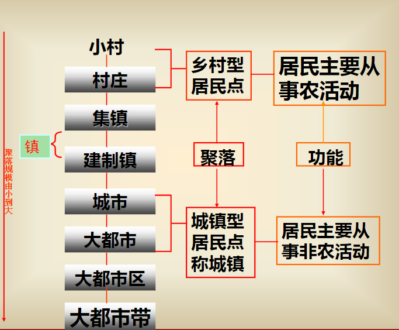

- [聚落与城市](#聚落与城市)
  - [引言](#引言)
  - [一、城市地理学概述](#一城市地理学概述)
  - [二、城乡的划分与城乡地域](#二城乡的划分与城乡地域)
  - [三、城市化的基本原理](#三城市化的基本原理)
    - [（一）城市化定义（key point）：](#一城市化定义key-point)
    - [（二）城市化的机制：](#二城市化的机制)
    - [（三）城市化的类型和发展阶段](#三城市化的类型和发展阶段)
    - [（四）城市化水平的指标和测度](#四城市化水平的指标和测度)
    - [（五）当代世界城市化特点](#五当代世界城市化特点)
    - [（六）解放后我国城市化的特点](#六解放后我国城市化的特点)
    - [（六）城市化水平的预测](#六城市化水平的预测)
  - [四、城市的职能结构](#四城市的职能结构)
    - [（一）城市经济活动类型划分和城市发展](#一城市经济活动类型划分和城市发展)
    - [城市职能和性质](#城市职能和性质)
  - [五、城市规模效应](#五城市规模效应)
    - [城市规模分布理论](#城市规模分布理论)
  - [~~六、城市地域结构与城镇体系~~](#六城市地域结构与城镇体系)

# 聚落与城市

## 引言
**聚落**（key point）：又称为<u>居民点</u>，是人类各种形式的聚居地的总称，不单单是<u>房屋建筑</u>的集合体，还包括与居住直接有关的其他<u>生活设施</u>和<u>生产设施</u>。

聚落地理学：研究**<u>聚落形成、发展和分布规律</u>**的学科。分为<u>乡村聚落地理学</u>（Rural Settlement Geography）和<u>城市地理学</u>（Urban Geography）两大分支学科。

聚落地理学发展
• 最早对聚落作较为系统的地理研究的是德国地理学家科尔，他于1841年发表《人类交通居住与地形的关系》一书。1906年施吕特尔发表《对聚落地理学的意见》，第一次提出“聚落地理”的概念。以后经拉采尔、以及维达尔·白兰士、白吕纳、德芒戎、美国的鲍曼等人的推进，到20世纪30年代，聚落地理研究遍及全世界，并在发展较早的国家形成了不同的研究风格：
• 德国以景观论为特色；
• 法国重视社会经济史对聚落的影响；
• 英国则对聚落的历史地理有较多的研究；
• 美国的聚落
• 由于聚落有乡村和城市之分，聚落地理学也分为乡村聚落地理和城市地理学两大部分。第二次世界大战后，城市地理学发展较快，形成了一门独立学科，而乡村聚落地理研究不仅数量少，而且理论和方法上发展很慢。尽管聚落地理学包含两大部分的概念没有消失，实际上不少地理学家把聚落地理学看作乡村聚落地理学的同义语。

聚落地理学研究内容
- 不同地区聚落的起源和发展；
- 聚落所在地的地理条件；
- 聚落的分布，揭示聚落水平分布和垂直分布的特征并分析其产生的自然、历史、社会和经济原因；
- 聚落的形态，这是聚落地理学中研究较多的方面，涉及的内容有：
（1）聚落组成要素；
（2）聚落个体的平面形态；
（3）聚落的分布形态；
（4）聚落形态的演变；
（5）自然地理因素(主要是地形和气候)以及人文因素(包括历史、民族、人口、交通、产业)对聚落形态的影响。
- 聚落的内部结构。分析聚落经济活动对聚落内部结构的影响，具体研究在平原、山地、沿海、城郊等不同环境条件下聚落内部的组成要素和布局。
- 聚落的分类。通常是按经济活动（或职能）和形态两大属性来划分聚落类型。

聚落地理学研究方法
- 重视**实地调查**，注意搜集与聚落发展有关的自然条件和经济、社会统计资料，充分利用大、中比例尺的地形图或航空像片。20世纪60年代以来，在聚落功能结构、规模结构和地域结构的分析中，还引进了**数量方法**和**行为理论**。

聚落地理学研究意义
- 聚落地理研究对于研究人类活动空间规律是不可缺少的。在实践上它对协调聚落与经济活动的关系有直接的作用，例如村落员为适宜的布置形式、服务设施员为有效的设置地点、村落如何适应社会和经济变革所引起的社会生活的新特点等课题。
- 聚落地理学与人口地理学分别研究人类分布现象的两个侧面，即人口地理学着重研究人口分布，聚落地理学着重研究人口分布的具体形式——聚落(居民点)。聚落地理学与乡村社会学的研究都寻求改善村落的组织，不过前者着眼于改善功能结构和总体布局，后者着眼于社区生活和人际关系的协调。此外，乡村聚落地理也是乡村地理学的重要研究内容之一。

## 一、城市地理学概述
城市

**“城市不仅具有区域性和综合性的特点，而且属于历史范
畴”**（如何理解？key point）
• **<u>城市是有一定人口规模，并以非农业人口为主的居民集居地，是聚落（Settlement）的一种特殊形态</u>。**
• <u>城市是一种复杂的动态现象</u>，它的兴起和发展受自然、经济、社会和人口等方面因素的影响。不同历史时期，不同的地区，不同的社会经济发展水平和发展速度，不同的人口分布和迁移特点，都对城市的发展速度、性质、规模、空间组织等产生影响。
• <u>城市是一种区域现象</u>。它在地球表面占据着一部分土地，虽然面积不大，但它作为人类活动的中心，同周围广大区域保持着密切的联系，具有控制、调整和服务等机能。

**城市地理学**
- 城市地理学是研究在**<u>不同地理环境下，城市形成发展、组合分布和空间结构变化</u>**规律的科学，既是人文地理学的重要分支，又是城市科学群的重要组成成分。
- 侧重于**城镇区域的地理学研究**
- 主要应用领域是**城市规划、区域规划**

**城市地理学的作用**
- 描述（description）：精确地描述城市的形成，存在和发展的空间条件和空间形式
- 解释（explanatory）：解释上述现象的原因和结果
- 评价（evaluation）：纪要认识资源空间分配的不平衡性，又要识别那些符合效益和社会公平标准的可供选择的状态。

任务：揭示和预测世界各国、各地区城市现象发展变化的规律性。

城市地理学研究的主要内容：
- 重心是从区域和城市两种地域系统中考察城市空间组织——区域的城市空间组织和城市内部的空间组织
- 城市形成发展条件的研究
- 区域的城市空间组织研究
- 城市内部空间组织研究
- 城市问题研究：环境问题、交通问题、住宅问题和内城问题的具体表现形式、形成原因、对社会经济发展的影响，以及解决问题的对策。

我国城市地理学研究的主要领域
- 城市化研究
- 城市发展方针研究
- 城市体系研究
- 城市内部结构研究
- 社会空间和居住空间、城市感应空间，城市意向，迁居，城市环境质量地域分异和流动人口对城市的影响等
- 近年来对城市群、都市连绵区的研究迅速开展

## 二、城乡的划分与城乡地域
城镇的宏观定义：
村庄和比村庄还小的居民点一般是乡村型的居民点，居民主要从事农业活动；镇和比镇大的居民点是城镇型的居民点，统称城镇，是以非农业活动为主的人口集中点。

**城乡差别**
1、景观（城市——由现代建筑材料通过建筑和构筑而形成的硬质轮廓线；乡村为软质轮廓线）
2、人口（人口规模、人口密度、人口行为、人口结构）
3、土地利用（土地利用效率、效益——土地级差地租，功能区划——土地利用结构，土地管理制度等）
4、城市拥有完备的基础设施（供水系统、排水系统、污水处理系统，供电，照明系统，道路系统，绿地系统，供气系统等）
5、经济规模、经济结构、经济运行和管理方式、经济联系

城镇不同于乡村的本质特征：（key point）
①城镇是以从事非农业活动的人口为主的居民点，在产业构成上不同于乡村；
②城镇一般聚居有较多的人口，在规模上区别于乡村；
③城镇有比乡村要大的人口密度和建筑密度，在景观上不同于乡村；
④城镇具有上下水、电灯、电话、广场、街道、影剧院、博物馆等市政设施和公共设施，在物质构成上不同于乡村；
⑤城镇一般是工业、商业、交通、文教的集中地，是一定地域的政治、经济、文化的中心，在职能上区别于乡村。还可以从生活方式、价值观念、人口素质等许多方面寻找城乡间的差异

中国城市概念和统计口径存在的问题：
1． 统计上只用行政地域概念的。没有实体地域和功能地域概念的。市镇的行政地域前后变动很大；
2． 城市的行政地域概念容易混淆，不带县的市区和带县的区域都叫“市”；有远郊区或没有远郊区的市；
3． 城市的人口概念混乱：
4 ． 设置城镇的标准多变：1955 ；1964 （上调）；1984（下调）
5． 城镇人口的统计口径多变

## 三、城市化的基本原理
城市化，或称为城镇化（Urbanization）是当今世界上最重要的社会、经济现象之一。

### （一）城市化定义（key point）：
- 人口城市化：农村人口向城市集中，城市人口和城镇数目不断扩大，城镇人口在总人口中的比重增加
- 行为城市化：居民行为方式，思维方式，生活方式的城市化
- 城乡关系不断变化
- 地域城市化：非城市地域逐步转化位城市低于的状态，城市地域逐渐扩大
- 职能城市化：具有城市的基本职能，主要体现在中心地上

城市化地域空间过程的类型
• 第一种是正统的城市化类型，即既有人口和非农业活动的地域集中，城市型景观的地域推进，又有城市文化的地域扩散，它们之间协调发展。
• 第二种是只有人口和非农业活动的地域集中，城市型景观的地域推进，而没有或很少有城市文化的地域扩散。两种情况：
a)假城市化（Pseudo－Urbanization）:在城市中居住着大批没有城市化的人
b)过度城市化（Hyper Urbanization，或Over－Urbanization）:人口地域集中和城市型景观地域推进的速度很快，超过经济发展速度，却缺少城市文化的地域扩散。

•第三种是只有城市文化的地域扩散，而没有或很少有人口和非农业活动的地域集中。也分为两种情况：
a)郊区城市化（Suburbanization）、逆城市化（Counterurbanization）。
b)乡村城镇化（Rural Urbanization）
农民的生活方式向城市型转化，其中相当一部分人逐渐向农村中的小城镇集聚，加速农村原有小城镇发展，形成许多新的小城镇，这种现象可称之为乡村城镇化

### （二）城市化的机制：
动力机制（key point）
- 农业生产力的发展是城市化的基础和前提
- 工业（第二产业）是城市化的动力
- 服务业（第三产业）是城市化的后劲和方向

*城市发展和成长的前提和基础*
- 第一前提——剩余的粮食：城市人口所需的粮食必须由城市外部的农业提供，剩余的粮食生产能力是城市生存的必要前提条件。整个世界第一产业生产力是否有余力，是决定全世界城市化水平的前提条件。
- 第二前提——随着农业生产力提高二造成的农业剩余劳动力是城市兴起和成长的第二前提。没有大量劳动力从事二三产业，城市不会大量产生。

*工业是城市化的动力*
- 城市化是由工业化所产生的劳动力分工在空间上的反应。
- 推拉力——引力来自于城市自身，推力来自于农村（key point）。

1.工业创造了物质财富与经济收入，支援了农业发展，有利于农业剩余粮食的产生，为城市提供剩余人口。
2．工业化的发展，可以吸收容纳大量的农村劳动力，为农业劳动力向非农业生产转化提供了可能。
3．工业化促进了城市自身的发展，表现在吸收大量人口，扩大城市人口规模与用地规模，为城市建设提供了资金。
4．工业化推动了城市生活方式和思维方式的发展。

*服务业是城市化的后劲和方向*
随着发达国家工业现代化后，工业化在城市化过程中的作用减弱，第三产业在城市化中的作用日益突出。

### （三）城市化的类型和发展阶段

类型（key point）
- 集中型城市化和分散型城市化
- 外延型城市化和飞地型城市化
- 景观型城市化与职能型城市化
- 积极型城市化和消极型城市化
- 自上而下型城市化和自下而上型城市化

发展阶段
- 初期城市化（集中城市化）
- 郊区城市化（分散城市化）
- 逆城市化（广域城市化）
- 再城市化

### （四）城市化水平的指标和测度
单一指标和复合指标两种。

度量城镇化的指标可以有城镇化水平、城镇化规模、城镇化速度、城镇化质量、城镇人口增长因素等多个方面

主要指标法：
- 人口比例指标（key point）
- 土地利用指标
- 人口中数居民点的规模法

复合指标法：
选用与城市化有关的多种指标予以综合分析，以考察城市化的进展水平。
在日本使用过的“城市成长力系数”，采用了①总人口，②地方财政年支出，③制造业从业人数，④商业从业人数（包括批发、零售），⑤工业产品上市额，⑥批发业年销售额，⑦零售业年销售额，⑧住宅开工面积，⑨储蓄余额，⑩电话普及率等10个指标，计算各城市每个指标在相同时期（3年或4年）的增减率，然后用全国的平均增减率作标准换算成增长指数，把10个增长指标进行算术平均即得到反映一段时间内各城市的成长力大小

### （五）当代世界城市化特点

一、城市化进程大大加速
二、城市化的主流已由发达国家转移到发展中国家
三、世界城市化水平地区差异显著
四、大城市化趋势明显，巨大城市带出现
五、发展中国家的城市化仍以乡村向城市移民为主

### （六）解放后我国城市化的特点
一、解放后，城市的数量和城镇人口有了很大的发展，城市建设取得了举世瞩目的成就。

二、城镇化速度与世界进程相比较为缓慢，目前城市化水平仍然很低

三、我国城市化进程的波动性较大

四、乡村城市化开始显现

五、城市规模体系的动态变化加速

六、城市化水平的省际差异显著

我国50年的城市化过程：影响城市化的因素最重要的是体制因素，即政策因素导致我国前30年大起大落，后20年出现新现象。

### （六）城市化水平的预测
- 联合国法
- 城镇化与经济发展水平的相关分析法
- 劳动力转移法
- 时间趋势外推法

## 四、城市的职能结构

### （一）城市经济活动类型划分和城市发展
城市基本和非基本活动
的概念最早是1902年萨姆巴特（W.Sombart）在德国提出的。后来这个概念通过城市规划进入英、美等国，经过海格（Robert M.Haig）和霍伊特（Homer Hoyt）等人的发展，成为著名的城市经济基础理论。这一理论在50年代也开始在中国的城市规划中用来预测城市人口，这就是所谓的“劳动平衡法”。

城市的基本活动部分
为本城市以外的需要服务的。是从城市以外为城市创造收入的部分，它是城市得以存在和发展的经济基础，称为城市的基本活动部分，它是导致城市发展的主要动力。

非基本活动部分
满足城市内部需求的经济活动，随着基本部分的发展而发展，它被称为非基本活动部分。

基本部分是城市发展的主导力量，基本和非基本两部分是相互依存的。城市的非基本部分应该和基本部分保持必要的比例，当比例不协调时，就会使城市这架复杂的机器运转不正常。

城市成长发展的机制 (key point)。
一个城市，如果它的经济生活中基本活动部分的内容和规模日渐发展，这个城市就势不可挡的要发展。如果城市的基本活动部分由于某种原因而衰落（如采矿城市因矿产资源的耗竭，港口城市因港湾淤塞或腹地丧失，加工工业城市的输出产品失去竞争力等），同时却没有新的基本活动发展起来，那么这个城市就无可挽回地要趋向衰落。当城市的条件发生变化，促进新的基本部分萌发时，衰落的城市还会复兴。这是一切城市成长发展的机制。

### 城市职能和性质

城市职能是城市科学里的专门术语。它指某城市在国家或区域中所起的作用，所承担的分工。城市性质是城市主要职能的概括，指一个城市在全国或地区的政治、经济、文化生活中的地位和作用，代表了城市的个性、特点和发展方向。确定城市性质一定要进行城市职能分析。
随

（key point）
城市的政治、经济、文化等各个领域的活动是由基本、非基本两部分组成的。这两部分活动的发展常常互相交织在一起，但主动和主导的因素一般来说总是前者。城市职能概念的着眼点就是城市的基本活动部分

按城市职能的相似性和差异性进行分类，这就是城市职能分类。(key point)

城市性质和城市职能区别与联系（key point）
联系：城市性质是城市主要职能的概括，确定城市性质一定要进行城市职能分析。
区别：
1）城市职能分析一般利用城市的现状资料，得到的是现状职能，城市性质一般是表示城市规划期里希望达到的目标或方向；
2）城市职能可能有好几个，职能强度和影响的范围各不相同，而城市性质关注的是最主要、最本质的职能；
3）城市的职能是客观存在的，可能合理，也可能不合理，城市的性质是在认识客观存在的前提下，揉进了人的主观意念，可能正确，也可能不正确。

## 五、城市规模效应

### 城市规模分布理论

城市首位律（Law of the Primate City）认为：即一个国家的“首位城市”总要比这个国家的第二位城市（更不用说其它城市）大得异乎寻常。不仅如此，这个城市还体现了整个国家和民族的智能和情感，在国家中发挥着异常突出的影响。

首位城市（Primate City）：在规模上与第二位城市保持巨大差距，吸引了全国城市人口的很大部分，在国家政治、经济、社会、文化生活中占据明显优势的城市。（key point）

用一国最大城市与第二位城市人口的比值来衡量城市规模分布状况的简单指标就是城市首位度

~~### 对城市规模分布的解释~~

~~### 中国的城市规模分布~~

~~### 城市规模发展政策讨论~~

思考题
1、谈谈你对城市地域概念的理解。
2、城市地理学研究的主要内容
3、城镇不同于乡村的本质特征：
4、什么是大都市带？大都市带必备的条件是什么？世
界有哪些大都市带？
5、什么是城市化？其类型是如何划分的？动力机制如
何？
6、用人口比例指标量度城市化水平有哪些局限性？
7、城市的职能与城市性质的区别与联系。
8、城市规模分布的主要理论有哪些？

## ~~六、城市地域结构与城镇体系~~

