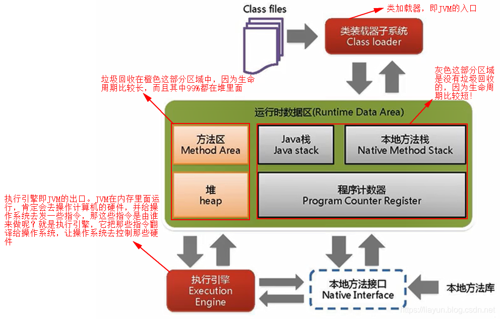

- [Java](#java)
  - [参考书](#参考书)
  - [主讲内容](#主讲内容)
  - [课程要求](#课程要求)
- [Chapter 1](#chapter-1)
  - [简介](#简介)
    - [特点](#特点)
    - [跨平台性原理](#跨平台性原理)
  - [开发环境](#开发环境)
  - [第一个java程序](#第一个java程序)
- [Chapter 2 Java](#chapter-2-java)
  - [基本数据类型](#基本数据类型)
- [Chapter 3 面向过程](#chapter-3-面向过程)
- [Chapter 4 面向对象与类](#chapter-4-面向对象与类)
  - [参数传递](#参数传递)


# Java

## 参考书
- Java编程从入门到精通，胡平，人民邮电
- Java编程思想，Vruce Eckel，机械工业出版社
- Head First 设计模式，Freeman，中国电力出版社

## 主讲内容
- 绪论
- Java语言基础
- 面向对象编程
- Java异常处理
- 基本类
- Java IO
- 多线程编程
- Java图形编程
- 网络编程

## 课程要求
- 30%平时
- 70%期末

```java
import java
```


# Chapter 1
## 简介
### 特点
1. 简单性，不使用指针，垃圾回收机制，模块小。
2. 面向对象
3. 跨平台——一次编译到处运行
   - 生成的字节码不依赖平台
   - 编译器生成与特定体系结构无关的字节码指令
   - java运行时环境中的java虚拟机（JVM:java virtual machine）
4. 安全性
   - 要求显式的变量类型声明
   - 不支持指针，杜绝了内存的非法访问
   - 自动内存回收单元手机了内存泄漏
   - JVM可以自动发现数组和字符串的越界，防止堆栈溢出
   - Java还提供了异常处理机制，简化错误处理任务
   - 运行时环境还有类装载器，字节码校验器和安全管理器这三个组。
5. 多线程性
   - java运行时本身就是多线程，若干个系统线程运行负责不要的无用单元回收，系统维护等系统级操作
   - 内置多线程控制，可大大简化多线程应用程序开发
6. 动态性
   - 执行时需要调用的类在运行时动态地加载到内存，使得java程序运行所需的内存开销小

### 跨平台性原理
1. JVM内部体系结构



## 开发环境
jdk (java development kit)
- 开发工具，主要是javac及基本核心类
- 运行环境jre,jvm
- 其他工具jar,javadic,javah,javap
-JShell java9开始提供
JAVA_HOME
CLASSPATH
PATH


## 第一个java程序
```java
/*
 * JDK 10 or above required
 */

public class Test{
    public static void main(String[]args){
        for(var y:args){
        System.out.println(y);
        }
    }
}
```


# Chapter 2 Java

## 基本数据类型
Java是强类型，静态类型语言。

基本数据类型：整形（byte、short、int、long）、浮点型（float、double）、布尔型（boolean）、字符型（char，**2字节**，‘\u0000’~‘\uFFFF’）

引用类型：class 、interface、enum、数组、注解

# Chapter 3 面向过程

# Chapter 4 面向对象与类

面向对象程序设计

类

对象与构造方法

方法重载与参数传递

static 修饰符

包

访问控制符

实例：单例模式

类的继承

Final修饰符

枚举类型

##  参数传递

参数是基本类型

被调方法中对该参数改变只改变副本。

参数是引用类型

实际传递的是对象引用的副本，这就导致初始时形参和实参指向同一个对象。