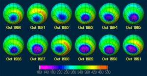
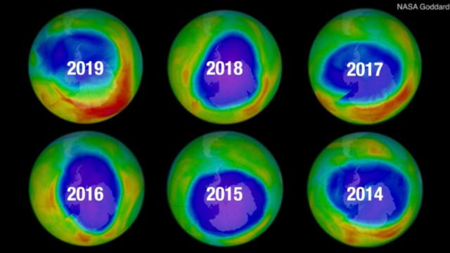
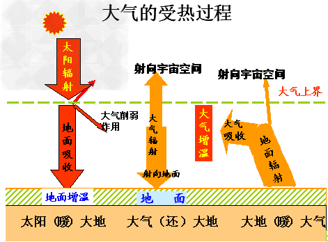
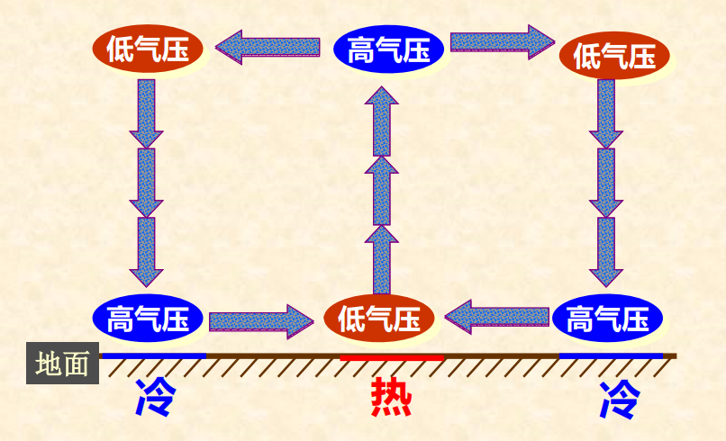
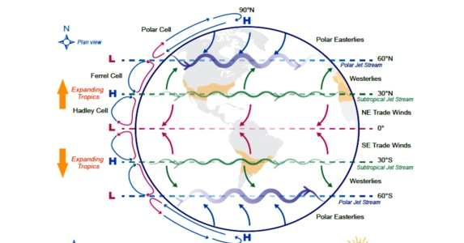
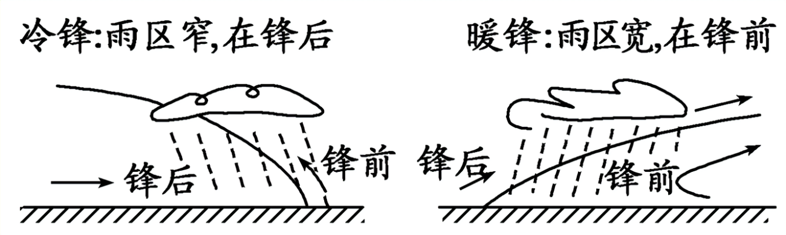

- [Chapter 3 大气圈与气候系统](#chapter-3-大气圈与气候系统)
    - [key issues](#key-issues)
    - [key point](#key-point)
  - [3.1 大气的组成和热能](#31-大气的组成和热能)
    - [1. 大气圈的组成](#1-大气圈的组成)
      - [大气的组成](#大气的组成)
      - [大气污染及其种类](#大气污染及其种类)
    - [2. 大气圈的结构](#2-大气圈的结构)
      - [大气质量](#大气质量)
      - [大气压力](#大气压力)
      - [大气分层](#大气分层)
    - [3. 大气圈的热能](#3-大气圈的热能)
      - [太阳辐射](#太阳辐射)
      - [地面辐射和大气辐射](#地面辐射和大气辐射)
    - [4. 气温](#4-气温)
      - [气温的空间分布](#气温的空间分布)
      - [逆温](#逆温)
      - [地球上的热量带](#地球上的热量带)
  - [3.2 大气水分和降水](#32-大气水分和降水)
    - [1. 大气湿度](#1-大气湿度)
    - [2. 蒸发与凝结](#2-蒸发与凝结)
    - [3. 水汽凝结现象](#3-水汽凝结现象)
    - [4. 大气降水](#4-大气降水)
      - [1. 降水的形成](#1-降水的形成)
      - [2. 降水的类型](#2-降水的类型)
      - [3. 降水的时间变化](#3-降水的时间变化)
  - [3.3 大气运动和天气系统](#33-大气运动和天气系统)
    - [1. 大气的水平运动](#1-大气的水平运动)
    - [2. 大气环流](#2-大气环流)
      - [全球环流](#全球环流)
      - [季风环流](#季风环流)
      - [局地环流](#局地环流)
    - [主要的天气系统](#主要的天气系统)
    - [3. 气团](#3-气团)
    - [4. 锋](#4-锋)
    - [5. 气旋和反气旋](#5-气旋和反气旋)
  - [3.4 气候的形成](#34-气候的形成)
    - [气候的概念](#气候的概念)
    - [气候系统](#气候系统)
    - [气候的形成](#气候的形成)
    - [气候带和气候型](#气候带和气候型)
  - [3.5 气候变化](#35-气候变化)

# Chapter 3 大气圈与气候系统

### key issues
认识大气的组成、特性及其运动规律，掌握 ***气候的形成和变化规律***
### key point
- **大气**：指围绕着地球的厚层气体。
- **大气圈**：指大气所形成的连续圈层。
- **大气过程**：指大气圈中存在的各种物理过程，
如辐射过程、增温冷却过程、蒸发凝结过程等。
- **气象**（天气现象）：指由大气过程所形成的
风、云、雨、雪、雾、露、霜、冰等千变万化
的物理现象。
- **天气**：某地区短时间内大气过程和现象的综
合。即短时间内风、云、降水、温度和气压等
气象要素连续变化的综合现象。其特点是多变。
- **气候**：指某地区多年间常见的和特有的大气
过程和现象的综合

## 3.1 大气的组成和热能

### 1. 大气圈的组成

#### 大气的组成
地球外层的大气圈是多种物质的混合物，由干洁空气、水汽悬浮尘粒或杂质组成。大气物质由三相：气相、液相和固相。  

| 大气组成 |          |        | 主要作用                                       |
| -------- | -------- | ------ | ---------------------------------------------- |
| 干洁空气 | 主要成分 | $N_2$  | 生物体的基本成分                               |
|          |          | $O_2$  | 维持生物活动的必要物质                         |
|          | 次要成分 | $CO_2$ | 植物光合作用的原料；对地面保温                 |
|          |          | $O_3$  | 吸收紫外线，使地球上的生物免遭过量紫外线的伤害 |
| 水汽     |          |        | 成云致雨的必要条件；对地面保温                 |
| 固体杂质 |          |        | 成云致雨的必要条件                             |

空气的组成：
- 氧气：20.94%
- 氮气：78.03%
- 惰性气体：0.93%
- 其他气体：0.10%

干洁空气（干空气）： 不包含水汽和固体杂质的整个混合气体

目前，人们关心最多的是含量较少、寿命较短的微量和痕量成分，如二氧化碳（CO2）、臭氧（O3）、水汽以及气溶胶等。这是因为尽管它们的浓度很低，但它们在大气中的浓度均有较大的时空变化，对**地气系统热量的收支、大气温度的垂直结构及人类活动**有着明显的影响。

**二氧化碳（$CO_2$)**  
- 来源：是大气中的可变成分之一。它主要来自火山喷发、动植物的呼吸以及人类活动等。
- CO2对太阳辐射的吸收虽然很少，但它能强烈吸收地面长波辐射，从而使低层大气变暖；同时，它能向周围及地面放射长波辐射，对大气和地表温度有明显的“温室”作用。CO2对大气辐射收支的影响主要表现在两方面：
- 一方面，CO2的增加将导致平流层放射更多的长波辐射，从而引起平流层的冷却；
- 另一方面，将吸收更多的地面长波辐射，同时吸收能量的一部分又重新辐射回地面，从而引起对流层和地面温度的升高。

**臭氧($O_3$)**  
- 来源：是大气重要的可变成分和微量成分之一。它主要是由于氧分子在太阳辐射下，通过光化学作用，分解为氧原子后再与另外的氧分子结合而形成的。
- 作用：臭氧能强烈地吸收太阳紫外辐射（几乎能吸收0.2～0.3μm波段的全部太阳紫外辐射），使大气温度升高。在大气温度的垂直结构上，平流层形成了一个暖区，同时，使地面上的生物能够免受过多的太阳紫外辐射的伤害

◼ 南极臭氧洞指的是南极春天（每年10月），南极大陆上空气柱臭氧总量急剧下降，形成一个面积与极地涡漩相当的气柱臭氧总量很低的地区。
◼ 臭氧洞有两层含义：一是从空间分布的角度来看，随着纬度增加气柱臭氧总量逐渐增加，在南极环极涡漩外围形成臭氧含量极大值，进入环极涡漩后，气柱臭氧总量
突然大幅度下降，形成低值区；二是，从时间角度看，9 月到10月南极地区气柱臭氧总量突然大幅度下降，形成季节变化中低谷

**水汽**
- 成云致雨的必要条件；对地面保温。整个大气包含的水汽占地球总水量的0.001%。
- 来源：水面的蒸发、植物的蒸腾等。
- 分布： 3km 高度以内，是*大气中唯一可以发生相变的大气组分*。大气中水汽含量的时空分布极不均匀，主要集中在大气的低层，以夏季和低纬地区（热带沙漠地区除外）为最多。
- 作用：
  - 大气中水汽含量虽然不多，但它在天气和气候的形成和演变中担当着非常重要的角色。
  - 通过水相变和水循环、以及伴随的潜热转换，把大气圈、生物圈和地球表面紧密地联系起来。
  - 水汽也能强烈地吸收地面辐射，同时它又向周围空气和地面放射长波辐射，在水相变化中又能吸收或放出热量，这些都对地面和空气的温度有一定的影响

**气溶胶**
- 定义：大气中均匀分布的相当数量的固体微粒和液体微滴，如海盐粉粒、灰尘（特别是硅酸盐）、烟尘和有机物等多种物质，所构成的稳定混合物，统称为大气气溶胶。
- 气溶胶的产生：除了火山爆发、流星燃烧、森林火灾、海浪飞沫、风尘、植物花粉传播等自然原因外，更重要的是由于人类活动，如工业生产、生活燃烧以及各种交通工具排放的烟雾粉尘等。  
- 气溶胶的作用：
  - 成云致雨；
  - 改变透明度；
  - 影响辐射平衡  
- 气溶胶的气候效应有：直接和间接两种。
  - 直接效应是通过散射和吸收，改变大气中的长短波辐射传输特征。
  - 间接效应是改变液态水、云的微结构及其光学特性，如增加云中的水滴的密度，使平均半径变小，增加云的反照率等)

#### 大气污染及其种类
- 概念：大气污染物在大气中达到一定浓度，而对人类的生产和健康造成直接或间接危害时称大气污染。
- 种类：直接污染和间接污染
  - 直接污染：因污染物性质、浓度、时间等因素造成危害的污染物，如粉尘微粒、硫化物、氮化物、氧化物、卤化物（氯化氢、氟化氢）
  - 间接污染：污染物与大气正常成份发生反应形成新的污染物或污染物发生光化学反应形成的新污染物
- 污染气体：主要有二氧化硫（SO2）、一氧化碳（CO）、硫化氢（H2S）、氟化氢、氮氧化物、氨等上千种。这在工业和交通发达的城市尤为严重，它们的含量虽微，却对人类健康和生存环境带来严重危害。
- PM
  - PM，英文全称为particulate matter(颗粒物）。科学家用PM2.5表示每立方米空气中这种颗粒的含量，这个值越高，就代表空气污染越严重。
  - 在城市空气质量日报或周报中的可吸入颗粒物和总悬浮颗粒物是人们较为熟悉的两种大气污染物。
  - 可吸入颗粒物又称为PM10，指直径大于2.5微米、等于或小于10微米，可以进入人的呼吸系统的颗粒物；总悬浮颗粒物也称为PM100，即直径小于或等于100微米的颗粒物。
  - PM2.5产生的主要来源，是日常发电、工业生产、汽车尾气排放等过程中经过燃烧而排放的残留物，大多含有重金属等有毒物质。
  - 一般而言，粒径2.5微米至10微米的粗颗粒物主要来自道路扬尘等；2.5微米以下的细颗粒物（PM2.5）则主要来自化石燃料的燃烧（如机动车尾气、燃煤）、挥发性有机物等。

### 2. 大气圈的结构

**天高地厚？**：高层大气物理学：大气上界为3000km。假定大气是均质的，则大气高度约8000m。  
#### 大气质量
- `大气上界`：
大气按其物理性质来说是不均匀的，特别是在铅直方向变化急剧。在很高的高度上空气十分稀薄，气体分子之间的距离很大。**在理论上，当压力为零或接近于零的高度为大气顶层**，但这种高度不可能出现。因为在很高的高度渐渐到达星际空间，不存在完全没有空气分子的地方。气象学家认为，只要发生在最大高度上的某种现象与地面气候有关，便可定义这个高度为大气上界。因此，过去曾把极光出现的最大高度（1200km）定为大气上界。物理学家、化学家则从大气物理、化学特征出发，认为大气上界至少高于1200km，但不超过3200km，因为在这个高度上离心力以超过重力，大气密度接近星际气体密度。所以在高层大气物理学中，常把大气上界定在**3000km**
- `大气质量`
假定大气是均质的，则大气高度约为8000m，整个大气柱的质量为
$$\begin{aligned}
 m_0&=p_0 H\\
    &=1.125\times 10^{-3}\times8\times10^5\\
    &=1013.3g/cm^2
\end{aligned}$$  
$p_0$为标准情况下（$T=O^0$,气压为1013.25hPa）的大气密度。
**整个地球大气的总质量为$5.14\times10^{18}kg$**

#### 大气压力
- `气压`：
静止大气中任一高度单位面积上所承受的空气柱重量，叫做大气压力，简称气压。气压的测量单位是帕（Pa）（$N/m^2$），气象学采用百帕hPa作为单位，$1hPa=10^{-2}N/cm^2$。
**当选定温度为0℃，维度为45°的海平面时，气压为1013.35hPa，称为一个标准大气压。**
地面气压在980~1040hPa之间变化，平均为1013hPa。
- `气压的分布`：
理想气体状态方程（克拉波龙方程）：$PV=(m/M)RT$
- 气压随高度变化：大气压力总是随着海拔高度的升高而降低的，而且气压随着高度的变化与气温和气压条件有关。（因为空气密度和空气柱厚度随着高度升高而减小。）
  - 空气密度小的地方，气压随高度递减得慢——暖空气，因其密度小，单位气压高度差大；而冷空气，因其密度大，单位气压高度差小。高层大气，因其密度小，气压随着高度增加而降慢，每改变单位气压，高度差大。
  - 气压相同时，温度愈高，气压梯度愈小——在气压相同的条件下，气柱温度愈高，密度愈小，单位气压高度差愈大，气压垂直梯度小。反之气柱温度愈低，气压随着高度递减快。单位气压高度差愈小，气压垂直梯度大。
  - 气温相同时，气压愈大，气压梯度愈大——在相同气温下，气压值愈大的地方，空气密度愈大，气压随着高度递减快，单位气压高度差小，气压梯度愈大，反之单位气压高度差大，气压梯度愈小
- `气压垂直梯度`:每升高（或降低）单位距离，气压减小（或增大）的数值，称为垂直气压梯度或单位高度气压差（Gz）。
- `气压场和气压系统`：
  - `等压线和等压面`：某一水平面上气压相等各点的连线，称为`等压线`；空间气压相等各点组成的面，称为`等压面`，它是一个起伏不平的曲面。
  - `气压场`：气压的空间分布称为气压场。
  - **`气压系统的基本类型`**：
    - 低气压：简称低压，其等压线闭合，中心气压低，等压面向下凹陷如盆地，空气向中心辐合，气流上升；
    - 高气压：简称高压，其等压线闭合，中心气压高，等压面向上凸出如山丘，空气向四周辐散，气流下沉；
    - 低压槽：简称槽，由低压向外延伸出来的狭长区域，或一组未闭合的等压线向气压较高一方突出的部分。在槽内各等压线弯曲最大处的连线，称为槽线。槽附近空间等压面形如山谷，空气向槽内辐合上升；
    - 高压脊：简称脊，由高压向外延伸出来的狭长区域，或一组未闭合的等压线向气压较低一方突出的部分。在脊中各等压线弯曲最大处的连线，称为脊线。脊线附近空间等压面形如山脊，空气向外辐散；
    - 鞍（鞍型气压区）：两个高压与两个低压相对应的中间区域，其附近空间等压面形状似马鞍。

#### 大气分层
**由于地球引力作用，大气密度随高度的增加逐渐减小，到大气上界，逐渐过渡为星际气体密度。** 按照分子组成，大气可分为两个大大层次，即均质层和非均质层。均质层为从地表至85km高度的大气层，除水汽有较大变动外，其组成较均一。*从地面到高空，不仅大气的密度、成分不同，大气的温度也存在着明显的变化。* 可以这么认为：地球大气在垂直方向上形成 **三个相对的暖层和两个相对的冷层**  
大气的垂直分层的**依据**
- 气温适度在垂直方向上的分布；
- 大气中的扰动程度；
- 不同程度上的电离现象。

大气中温度、密度以及物质成分的分层结构
世界气象组织（WMO）根据气温从地面到高空垂直方向上的分布，将整个大气分成：
- 对流层 Troposphere
- 平流层 Stratosphere
- 中间层 Mesosphere
- 暖层   Thermosphere
- 散逸层 Exosphere

**对流层**
- 厚度：本层厚度最簿，并随纬度、季节而不同，在高纬地区平均：8~9km,中纬地区平均：10~12km,低纬地区平均17~18km，夏季大于冬季。
- 温度随高度的升高而降低；因为该层的热量来自于地面的长波辐射，平均气温递减率为$0.65^\circ\mathrm{C}/100m$；
- 具有强烈的对流运动；因为地面受热不均。
- 天气现象复杂多变；几乎所有的水汽、云、雨、雷、电等现象都发生在此层。
- 在对流层内，按气流和天气现象分布特点又可分为三层：
  - 下层：又称摩擦层或扰动层。它的范围自地面到2km高度。下层受地面强烈影响摩擦作用、湍流交换十分明显，各气象要素具有明显的日变化。由于本层的水汽、尘粒含量多，因而低云、雾、霾、浮尘等出现频繁。
  - 中层：从摩擦层顶到6km左右高度。这一层受地表影响较小，气流的状况基本上可以表征整个对流层空气运动的趋势。大气中的云和降水现象大都产生在这一层。
  - 上层：从6km高度到对流层顶。由于这一层离地面更远，受地表影响更小，水汽含量极少，气温常在0℃以下，各种云多由冰晶和过冷水滴组成。在中、低纬度地区上层，常有风速＞30m/s的强风带出现。
  - 此外，在对流层和平流层之间有一个厚度为数百米至1-2km的过渡层，称为对流层顶。此层主要特征是：气温随高度增加变化很小，甚至无变化。这种温度的垂直分布抑制了对流作用的发展，上升的水汽、尘粒多聚集其下，能见度变坏。
- **对流层顶的温度在低纬度地区平均为-83℃，在高纬度地区约为-53℃。(为什么??**

**平流层**
- 对流层顶到55km
- 温度随高度升高而增加：
在平流层内，随着高度的增高，气温最初保持不变或微有上升，自25km以上气温随高度增加而明显上升，到平流层顶可达-3℃左右，平流层这种气温分布的特征，主要是臭氧对太阳紫外线的强烈吸收。虽然25km以上臭氧的含量已逐渐减少，但紫外辐射的强度随高度逐渐增强，而空气密度随高度升高又迅速减小，致使高层吸收的有限辐射可以产生较大的温度增量。
- 没有强烈的对流运动
平流层温度随高度升高而增加，不利于空气对流运动发展。所以叫平流层。飞机在此层飞行不易颠簸。
- 水汽、尘埃含量很少：平流层远离地面，加之有逆温层存在，空气无对流运动，水汽、尘埃很少，使得平流层天气晴朗，大气透明程度好。但有时在20-30km处可看到贝母云，它常出现在冬季极区。

**中间层**
- 平流层顶到85km
- 气温随高度增加迅速降低：
顶界温度可降至-83℃ -113℃，几乎成为大气层中的最低温。其原因是这里没有臭氧吸收太阳紫外辐射，而氮和氧等气体所能吸收的波长更短的太阳辐射又大部分被更上层的大气吸收了。因此，这里的气温随高度是递减的。
- 有相当强烈的垂直运动：这种下暖上凉的气温垂直分布，有利于导致空气的垂直运动，又称“高空对流层”。该层的**80-90km高度**上有一个只在白天出现的**电离层**，叫做D层。

**暖层**
- 中间层顶到800km。
- 空气质量小，空气稀薄，空气密度只有空气总质量的0.5%，在120km高空，空气密度小至声音都难于传播；
- 随高度升高而温度升高；因为所有波长小于0.175um的太阳紫外辐射都被暖层气体所吸收，顶层温度可达1000℃；
- **空气处于高度电离状态，能反射无线电波**；
- 出现极光现象。

极光：
作为太阳风的一部分荷电粒子在到达地球附近时，被地球磁场俘获，并使其朝向磁极下落。它们与氧和氮的原子碰撞，击走电子，使之成为激发态的离子，这些离子发射不同波长的辐射，产生出红、绿或蓝等色的极光特征色彩。在太阳活动盛期，极光有时会延伸到中纬度地带。

**散逸层**
- 800km高度以上的大气层
- 整个大气层的最外一层，是大气圈与星际空间的过渡地带，没有明显的边界。这一层的气温也随高度的增加而升高。由于气温高，且距地较远，受地球引力作用很小，所以大气质点中某些高速运动的分子不断地向星际空间散逸，散逸层也由此而得名。

**大气分层结构小结**

| 层序   | 高度      | 温度分布特点           |
| ------ | --------- | ---------------------- |
| 对流层 | 0~17km    | 随高度升高而降低 ↘     |
| 平流层 | 17~50km   | 随高度升高而升高 ↗     |
| 中间层 | 50-80km   | 随高度升高而降低 ↘     |
| 暖层   | 80-500km  | 随高度升高而升高 ↗     |
| 外层   | 500km之外 | 地球大气与宇宙的过渡层 |

| 层圈   | 高度范围 | 温度变化                                     | 物质成分变化                                        | 对流特征                                         |
| ------ | -------- | -------------------------------------------- | --------------------------------------------------- | ------------------------------------------------ |
| 对流层 | 0~10km   | 随高度升高而降低 ↘                           | N2、O2、CO2及惰性气体和一些有害气体、水气、气溶胶粒 | 对流运动显著，水平、垂直运动，形成各种天气现象。 |
| 平流层 | ~50km    | 气温受地面影响较小（气温随高度增加基本不变） | 臭氧明显增多，水汽含量极少                          | 气流稳定，水平运动为主                           |
| 中间层 | ~80km    | 随高度升高而迅速降低 ↘                       | 水汽含量极少                                        | 强烈垂直对流，顶层出现一个电离层                 |
| 暖层   | ~800km   | 随高度升高而迅速升高 ↗                       | 空气稀薄                                            | 空气高度电离，反射无线电波                       |
| 外层   | >800km   | 温度随高度增加而升高↗                        | 空气稀薄                                            | 大气质点能散逸到星际空间                         |

### 3. 大气圈的热能
地球气候系统的能源主要是太阳辐射，它从根本决定地球、 大气的热状况，从而支配其他的能量传输过程。地球气候系统内部也进行着辐射能量交换。因此，需要研究太阳、地球及大气的辐射能量交换和其他地－气系统的辐射平衡。

#### 太阳辐射
太阳辐射能主要分布在可见光区和红外光区，其中，可见光占太阳辐射总能量的50%，并以0.47um附近最强，红外区占43%，紫外区占7%。太阳辐射强度：单位时间内垂直投射在单位面积上的太阳辐射能。单位：焦耳/平方厘米*分。  
**影响因素：**
- 太阳高度角：太阳直射光与地面测点切线间的夹角。角越大，辐射越大。
- 日地距离：南北半球冬夏的温差不同，南半球夏季（1月）今日顶啊，获得太阳辐射多余北半球夏季（7月）；南半球冬季（7月）远日点，获得太阳辐射少于北半球冬季（1月）。因而南半球冬夏温差大于北半球。
- 可照时数：太阳辐射强度与可照师叔成正比，夏强冬弱。太阳辐射强度与日照时间成正比。北半球夏季，昼长夜短，可照时间长，太阳辐射达到量大；冬季，昼短夜长，可照时间短，太阳辐射到达量少。南半球正好相反。

**太阳辐射随纬度、季节的分布情况：**
- 太阳辐射量的大小因纬度、时间而变化——春秋
分时，赤道最多；夏至时，90ON最多；冬至时，90OS
最多。
- 全年和冬半年获得太阳辐射最多的是赤道，随纬
度增高而减小，到极点达最小；冬半年递减比夏半年
快；夏半年太阳辐射量最大值在20O~25O的纬度带。
所以热赤道北移。
- 太阳辐射年较差随纬度增高而增大；赤道地区和
两极附近太阳辐射量的水平梯度都比较小，而中纬
度水平梯度较大；
- 极圈内有极昼极夜现象；极夜期间。太阳辐射为
零，极昼期间，极圈内太阳辐射大于赤道，北半球
夏至日，极地的太阳辐射量比赤道大0.365倍

**太阳常数**：
在大气上界，**垂直**于太阳光线的$1cm^2$面积内，1min内获得的太阳辐射能量，称为太阳常数。数值为 **$1370W/m^2$**。

**太阳辐射在大气中的减弱**：
太阳幅射光通过大气圈，然后到达地表。由于大气对太阳辐射有一定的吸收、散射和反射作用，使投射到大气上界的太阳辐射不能完全到达地面。所以在地球表面所获得太阳辐射强度比1370W/m2小。  

**太阳暖大地 - > 大气还大地 - > 大地暖大气**
  

**温室效应**：
大气中各种微尘和二氧化碳成分的存在，犹如温室覆盖的玻璃一样，**阻挡了地面向外的辐射**，增强了大气你辐射，对地面由保温和增温的作用，这种现象称为大气温室效应。
**阳伞效应**：
大气中微尘的增加，由于在阳光下撑了一把伞，减弱了到达地面的太阳辐射，对地面由降温作用，这种现象称之为大气阳伞效应。

- 大气对太阳辐射的吸收：大气中吸收太阳辐射的成分主要使水汽、氧、臭氧、二氧化碳以及固体杂质。大气对太阳辐射的吸收是由选择性的，炫耀集中在太阳辐射光谱两端能量较小的区域，因此大气直接吸收的太阳能并不多，对大气来说太阳辐射并不是主要热源。
- 大气对太阳辐射的散射：太阳辐射通过大气，遇到空气分子、尘粒、云端等质点时，都要发生散射，但是并不像吸收那样把辐射转变成热能，而只是改变辐射的方向，时太阳辐射通过散射同部分太阳辐射就到不了地面，如果太阳辐射遇到直径比波长小的空气分子，则辐射的波长越短，散射的愈强。

**为什么天空呈现蔚蓝色？**
主要是因为空气分子在选择地对波长青色、蓝色光进行散射。
**为什么日出、日落时，太阳呈现红色？**
太阳高度角不同，太阳光通过大气的厚度也不同，太阳高度角越小，太阳光投射时所穿过的大气质量就大（垂直时，穿过的质量为1），日出、日落时，日光通过的大气质量数最大，尤其是底层大气的水滴、灰尘等大质点多，红光、橙光散射增强，导致出现红色霞光。

**到达地面的太阳辐射（总辐射）**：总辐射=直接辐射+散射辐射   
*直接辐射*：太阳光以平行光线形式直接投射到地面的辐射。
影响直接辐射的因素：
- *太阳高度角*
- 大气透明度

*散射辐射*：太阳光经散射后到达地面的部分。  
影响散射辐射的因素：
- 太阳高度角
- 透明度
- 云量

影响*总辐射*的因素：
- 太阳高度角越大，总辐射越大
- 云量越多，总辐射越小（云量多时，直接辐射减小的幅度大于散射辐射增加的幅度）
总辐射的时空分布规律：
- 总辐射在夜间为零，日出后逐渐上升，中午最大；一年中夏季大，冬季小。
- 一般是纬度越低，总辐射越大，反之越小。

**地面对太阳辐射的反射**：
道道地面的太阳辐射只有一部分被地面吸收，另一部分则被地面反射出去。地面对入射太阳辐射的反射取决于地面的反射率。而反射率取决于地面的性质。
一般地：陆地表面约为10%~30%，且随着太阳高度的减小而增大，神色土比浅色土小，粗糙土比平滑土小；
水面随着太阳高度角和平静度而变，太阳高度角愈小，反射率愈大，波浪起伏的睡眠，其反射率为10%，对陆地稍小。

#### 地面辐射和大气辐射
- `大气辐射`：大气获得热量后，以电磁波的方式昼夜不断地向四面八方发射长波辐射，其辐射能力取决于大气温度、湿度和云量状况。气温越高，水汽和液态水的含量越多，其辐射能力越大。
- `大气逆辐射`：大气辐射中指向地面的那部分辐射。（大气还大地）
- 大气的保温效应（`温室效应`）
  - 大气逆辐射几乎被地面全部吸收，这就使得地面因辐射所消耗的能量得到一定的补偿，因而大气对地面有保温作用。
  - 据计算，如果没有大气，地面平均温度要由现在的15摄氏度降低到-23摄氏度，较现在低38摄氏度。

- **大气获得能量的结构**
  - **对太阳辐射的直接吸收**： 大气中吸收太阳辐射的物质主要是臭氧、水汽和液态水。
  - **对地面辐射的吸收**： 地表吸收了到达大气上界太阳辐射能的50％，变成热能，温度升高，而后以大于3 m的长波（红外）向外辐射。这种辐射能量的75％～95％被大气吸收，只有少部分波长为8.5～12 m的辐射能通过“大气窗”逸回宇宙空间。
  - **潜热输送**： 海面和路面的水分蒸发使地面热量得以输送到大气层中。一方面水汽凝结成雨滴或者雪时，放出潜热给空气；另一方面余地或者雪讲到地面不久后又被阵法，这个过程交替进行。全球表面年平均潜热输送约2760MJ/m2 ，占辐射平衡的84%，可见地气间能量交换主要是通过潜热输送完成的。
  - **感热输送**： 大气获得热能后依据本身温度向外辐射，称为大气辐射。其中一部分外逸到宇宙空间，一部分向下投向地面，即为大气逆辐射。大气逆辐射的存在使地面实际损失略少于长波辐射放出的能量，地面得以保持一定的温暖程度。这种保温作用，通常称为“温室效应”（key point）。据计算，如果没有大气，地面平均温度将是－18oC，而不是现在的15摄氏度。

### 4. 气温
气温时大气热力状况（空气冷热程度）的数量度量。目前，气象观测和记录的气温，是指离地面`一定高度`上（我国规定`1.5米`高），放在`百叶窗箱`里的温度计测得的`空气`温度。
理论研究方面，多数采用绝对温度（开式温度），以（°A）或者（°K）表示。温度换算：$K=C+273.16$  

表征温度变化的几个物理量
- `较差`：指一定周期内，温度最高值与最低值之差。
- `日较差`：一日内最高温度与最低温度之差。
- `年较差`：一年中最热月平均温度与最冷月平均温度之差。
- `绝对年较差`：年极端最高气温与极端最低气温之差。
- `位相`：最高温度与最低温度出现的时间差

#### 气温的空间分布
大气温度在水平方向山和处置方向上的分布都是不均匀的。

`等温线`：同一水平面上气温相同个点的连接。任意一条等温线上的各点温度都相等。表示同一时间等温线水平分布状况的地图，叫做等温线图。

**气温的水平分布**：主要受纬度、海陆分布、地形起伏、大气环流、洋流等因素影响。
- 气温随纬度增高而递减，北半球南北温差冬大夏小，南半球则季节相反；
- 冬季北半球等温线在大陆凸向赤道，在海洋凸向极地，反映同一纬度上陆地冷于海洋，夏季时则相反；南半球洋多陆少，等温线较平直；
- 高温带（冬、夏月平均温均＞24℃）不是出现在赤道，冬季在 5 ° —10 ° N，夏季在 20 °N左右，该带称为热赤道。
- 洋流的影响大，中纬度西岸气温比同纬度的东岸高。冬季太平洋和大西洋北部等温线急剧向北凸出，反映黑潮暖流、阿留申暖流、墨西哥湾暖流的强大增温作用；夏季北半球等温线沿非洲和北美西岸向南凸出，反映了加那利寒流和加利福尼亚寒流的影响。
- 南半球冬夏最低气温都出现在南极，北半球则夏季在极地、冬季在高纬大陆东部、西伯利亚和格陵兰。最高气温北半球夏季出现在低纬大陆内部热带沙漠地区。
在我国，最低气温为 －53℃，出现在黑龙江的漠河；最高气温48.9℃，出现在新疆的吐鲁番。

**气温的垂直分布**：
每上升单位距离气温的降低值，称为气温直减率，以 r 表示，单位为℃／100m 。 对流层大气平均 r ＝ **0.65 ℃／100m** 。气温直减率一般夏季和白天大，冬季和夜晚小。

#### 逆温
- 定义：指对流层内发生温度随高度增加而上升的局部反常现象。出现逆温的气层称为逆温层，它的状态稳定，会阻止下层空气的垂直对流运动，因此又叫阻挡层。
- 成因：辐射逆温、平流逆温、下沉逆温、锋面逆温、融雪逆温
- **逆温产生的原因：**
  - 辐射：经常发生在晴朗无云的夜间，由于地面有效辐射很强，近地面层气温迅速下降，而高处气层降温较少，从而形成自地面开始的逆温层。
  - 平流：暖空气水平移动到冷地面或气层之上，其下层受冷地面或气层的影响顺迅速降温，上层受影响较小降温较慢，从而形成逆温。
  - 空气下沉：常发生在山地。山坡上的冷空气循山坡下沉到谷底，谷底原来的较暖空气被冷空气抬挤上升，从而出现温度的倒置现象。
- **影响**：逆温的存在阻碍空气垂直运动，妨碍烟尘、污染物、水汽凝结物的扩散，有利于雾的形成并使能见度变坏，使大气污染更为严。废气污染严重的工厂不宜建在闭塞的山谷，以免地形逆温引起大气污染事故

#### 地球上的热量带
太阳辐射的分布规律尽管受到其他因素的干扰，从全球范围来看，热量分布总趋势仍然与纬度大致平行，由低纬向高纬呈带状排列，形成地球上的热量带，热量带是形成地球气候带的基础。
* 10°S-10°N 赤道带
* 10°-25° 热带
* 25°-35° 亚热带
* 35°-55°中纬度带
* 55°-极圈 亚极地带
* 极圈内 极地带

小结  
◼ 1. 太阳辐射能在地球上的接收和转化过程。  
◼ 2.大气获得能量的具体结构包括吸收太阳辐射；吸收地面辐射；潜热输送；感热输送。  
◼ 3. 地-气系统作为一个整体辐射收支是平衡的。  
◼ 4. 气温是大气热力状况的数量度量  

## 3.2 大气水分和降水

### 1. 大气湿度
大气从海洋、湖泊、河流以及潮湿土壤的蒸发或植物的蒸腾作用中获得水分。水分进入大气后，通过分子扩散和气流的的传递而散布于大气中，使之具有不同的潮湿度。常用多个湿度参量表示水气含量。

**为什么暴雨总是发生在暖季？**
因为暖季，气温比较高，饱和水汽压大，空气中所能容纳的水汽含量增多，因而能使原来已处于饱和状态的蒸发面因温度升高而变成不饱和，蒸发增强，当温度降低时，由于饱和水汽压减小，空气中多余的水汽就会凝结出来。

### 2. 蒸发与凝结

**水相变化与潜热交换**：
`蒸发`——由水变成水汽；
凝结——由水汽变成水；
冻结——由水变成冰；
融解——由冰变成水；
凝华——由水汽直接变成冰；
升华——由冰直接变成水汽。

水的相变过程伴随着能量转化和交换，这种能量称为**潜热**（能）

**蒸发及其影响因素**
- 1.蒸发面的**温度**。蒸发面的温度愈高，蒸发过程愈迅速。因为温度高时，蒸发面上的饱和水汽压大，饱和差也比较大。这是影响蒸发的主要因素。
- 2.**空气湿度和风**。空气湿度愈大，饱和差愈小，蒸发过程缓慢；空气湿度愈小，饱和差愈大，蒸发过程迅速。无风时，蒸发面上的水汽靠分子扩散向外传递，水汽压减小很缓慢，容易达到饱和，故蒸发过程微弱。有风时，蒸发面上的水汽随气流散布，水汽压比较小，故蒸发过程迅速。
- 3.**蒸发面的性质**。在同样温度条件下，冰面饱和水汽压比水面饱和水汽压小，如果当时实有水汽压相同，冰面上的饱和差比水面小，因而冰面的蒸发比水面慢。由于海水浓度比淡水大（海水含有盐分），在温度相同的情况下，海水比淡水蒸发慢；清水蒸发比浊水慢，因为浊水吸热多，温度升高快。

`凝结`是发生在f≥100％（e≥E）过饱和情况下的与蒸发相反的过程。凝结现象在地面和大气中都能发生。

### 3. 水汽凝结现象
空气中的水两个凝结条件：
- 空气要达到饱和或过饱和状态。
- 要有凝结核。

空气达到饱和或过饱和的途径：
- 增加空气水汽含量，如暖水面的蒸发。
- 降低气温，大气中水滴凝结主要由于空气冷却而产生（绝热冷却：云、雨产生的主要方式；辐射冷却和平流冷却：雾、露、霜等产生的主要方式；混合冷却）。

**露与霜**：
日没后，地面及近地面层空气冷却，温度降低。当气温降到露点（湿空气等压降温到饱和时的温度）以下时，水汽即凝附于地面或地面物体上。如温度在0摄氏度以上，水汽凝结为液态，称为**露**；温度在0摄氏度一下，水汽凝结成固态，称为**霜**。

霜和露的**形成条件**：
近地面层空气湿度要大；有利于地面辐射的扩散。
晴天、夜晚容易形成霜和露。

**霜期**
入冬后第一次出现霜日交初霜日，最后一次出现霜日叫做终霜日。自初霜日其至终霜日止的持续期称为霜期。自终霜日到初霜日的持续期称为无霜期。

**雾淞**是一种白色固体凝结物，由过冷雾滴附着于地面物体或树枝迅速冻结而成，俗称“树挂”。多出现于寒冷而湿度高的天气条件下冻结而成。它经常出现在有雾、风小的严寒天气里。
**雨凇**是平滑而透明的冰层。它多半在温度为0—-6℃时，由过冷却雨、毛毛雨接触物体表面形成；或是经长期严寒后，雨滴降落在极冷物体表面冻结而成。

**雾（fog）**
雾使漂浮在近地面曾的乳白色微信奥水滴或冰晶，使水平能见度小于1km的物理现象。如果能见度在1~10km内则为轻雾。

**霾（haze）**
霾是由空气中的灰尘、硫酸、硝酸、有机碳氢化合物等粒子组成的。他也能使大气浑浊，事业模糊并能导致能见度恶化，如果水平能见度小于10km时，将这种非水成物组成的气溶胶系统造成的视程障碍称为霾。

**雾和霾的区别**
- 1.**存在形态**的区别：雾是悬浮于空气中的水滴小颗粒；霾是悬浮于空气中的固体小颗粒，包括灰尘、硫酸、硝酸等各种化合物。
- 2.**颜色**的区别：雾是由小水滴构成，呈乳白色，青白色；霾是由各种化合物构成，呈黄色，橙灰色。
- 3.**能见度**区别：雾越接近地面的地方密度越大，对光线的影响也越大，能见度很低，一般在1公里之内；霾在空气中均匀分布，颗粒较小，密度较低，对光线有一定影响，能见度较低，一般在十公里之内。
- 4.**持续时间**区别：雾是由小水滴构成，当大气温度升高，水滴蒸发，雾气就会减少，持续时间短；霾是由固体小颗粒构成，消解速度慢，持续时间长。

**云**：是高空水汽凝结现象。空气对流、锋面抬升、地形抬升等作用使空气上升到凝结高度时，就会形成云。此时气温如果在0℃以上，水汽凝结为水滴；如果在0℃以下，一般凝华成为冰晶。

**云的形成条件**
- 充足的 水分；
- 足够的凝结核
- 要有使空气中水汽凝结的冷却过程，特别是要有使空气上升运动引起的绝热冷却过程。

------------------------------

### 4. 大气降水

#### 1. 降水的形成

**降水**的定义：从云中降到地面上的液态或者固态水，称为降水。
降水的形成：
云滴增大为雨滴、雪花或者其他降水物，并降至地面的过程。
关键：只有当云滴增长到能克服空气阻力和上升气流的顶托，并且在降落到地面的过程中不至于被蒸发掉时，降水才形成。

从雨滴到形成降水需具备两个基本条件：
一是雨滴下降速度超过气流上升速度；二是雨滴从云中降落到地面前不被完全蒸发。降水的形成，必须经历云滴增大为雨滴、雪花及其他降水物的过程。(key point)

#### 2. 降水的类型
根据降水形成原因（主要是气流上升特点），可分为四个基本类型：
- **对流雨** 暖季空气湿度较大，近地面气层强烈受热，引起对流而形成的降水称为对流雨。赤道全年以对流雨为主。我国西南夏季多对流雨。
- **地形雨** 暖湿空气前进途中遇到较高山地阻挡被迫抬升，绝热冷却，在达到凝结高度时便产生降水。因此，山的迎风坡常成为多雨中心；背风坡因水汽早已凝结降落，且下沉增温，将发生焚风效应，降水很少，形成雨影区。
- **锋面雨** 两种物理性质不同的气团相遇，暖湿空气沿交界面上升，绝热冷却，达到凝结高度便产生云雨。温带地区锋面雨占主要地位。
- **台风雨** 台风是产生在热带海洋上的一种空气漩涡。台风中有大量暖空气上升，可产生强度极大的降水。

#### 3. 降水的时间变化
降水强度 单位时间内的降水量，称为
降水强度。气象部门为确定一定时间内降水的数
量特征，并用以预报未来降水数量变化趋势，将
降水强度划分为若干等级
雨量和分级：

| 种类     | 24小时降水量 | 12小时降水量 | 目视特征                                         |
| -------- | ------------ | ------------ | ------------------------------------------------ |
| 小雨     | <10mm        | <5mm         | 雨滴清晰可辨，地全湿，无积水或积水形成很慢       |
| 中雨     | 10~24.9      | 5~14.9       | 雨滴连续成线，可闻雨声，地面积水形成较快         |
| 大雨     | 25.0~49.9    | 15.0~29.9    | 雨滴模糊成片，雨声激烈，地面积水形成很快         |
| 暴雨     | 50.0~99.9    | 30.0~69.9    | 雨如倾盆，讲话受雨声干扰而听不清，地面积水->水流 |
| 大暴雨   | 100.0~249.0  | 70.0~139.9   |                                                  |
| 特大暴雨 | >250.0       | >140.0       |                                                  |

## 3.3 大气运动和天气系统
大气时刻不停地运动着。就规模而言，既有对全球产生影响的大规模的全球性运动，也有对局地地区产生影响的小尺度的局地运动。这种不同规模的大气运动状态，称为大气环流。大气运动最直接的原因是气压的时空分布和变化，尤其是水平气压梯度力的存在和变化。大气运动的最直接的结果是使地球上的物质能量得以传输。
### 1. 大气的水平运动
- 风
  - 空气的水平运动称为风
  - 空气的垂直运动称为上升气流或者下沉气流。
- 影响水平运动的四种力
  - 气压梯度力（原动力）
    - 当气压梯度存在时，作用域单位质量空气上的力，叫做气压梯度力。分为垂直气压梯度力和水平气压梯度力两种。
    - 水平气压梯度力使空气从高压区流向低压区，是大气水平运动的原动力。
    - 表达式：$G=-\frac{1}{\rho}\frac{\Delta{p}}{\Delta{n}}$
      - $G$——水平气压梯度力
      - $\rho$——空气密度
      - $\Delta{p}$——两条等压线之间的气压差
      - $\Delta{n}$——两条等压线之间的垂直距离
      - $\frac{\Delta{p}}{\Delta{n}}$——为水平气压梯度
      - “-”号表示方向由高压指向低压
    - 示意图 
  - 地转偏向力（改变方向）
    - 由于地球自转而使地表运动物体发生方向偏转的力。它包括水平和垂直两个分力。
    - 水平地转偏向力为：$A=2mv\omega\sin{\varphi}$
      - m：空气质量
      - v：风速
      - ω：地球自转角速度
      - $\varphi$：地理纬度
    - 方向：总是与空气运动方向垂直。在北半球，它使风向右偏；南半球向左偏。
    - 大小：它的大小与风速和纬度成正比，在赤道上为零，随纬度而增大，在两极达到最大。
    - 性质：地砖偏向力只能改变风的方向，而不能改变风的速度。
    - 示意图
  - 惯性离心力（改变方向）
    - 离心力是指空气作曲线运动时，收到一个离开曲率中心而沿曲率半径向往的作用力。这是空气为了保持惯性方向运动而产生的，所以称为惯性离心力。
    - 方向与空气运动方向垂直，不改变运动的速度。
    - $C=\frac{V^2}{r}$
      - C——离心力
      - V——空气运动的速度
      - r——曲率半径
    - 一般情况下，空气运动的去鲁班经很大，惯性离心力远小于地转偏向力，但在空气运动速度很大而曲率半径很小时，如龙卷风、台风，离心力很大，甚至超过地转偏向力。
  - 摩擦力（减速、改变方向）
    - 摩擦力是指地面和空气之间，不同运动状况的空气层之间相互作用而产生的阻力。气层之间的阻力，称为内摩擦力；地面对空气的阻力，称为外摩擦力。
    - 近地面层最显著，随高度增加而迅速减弱，一般到1——2km以上就可以忽略不计。此高度以上的气层称为自由大气。
    - 摩擦力方向与风向相反，使风速减小，导致地转偏向力也相应减弱。陆地表面摩擦力总是大于海洋表面。
  - 概括
    - 一般来说，气压梯度力是使空气产生运动的直接动力，是最基本的力。其它力是在空气开始运动后产生和起作用的，而且所起的作用视具体情况而有不同。
    -  地转偏向力对高纬地区或者大尺度的空气运动影响较大，而对低纬度地区特别是赤道附近的空气运功影响甚小；
    - 惯性离心力是在空气作曲线运动时起作用，而在空气运动接近于直线式，可以忽略不计；
    - 摩擦力在摩擦层中起作用，而对自由大气中的空气运动也不考虑。
    - 地转偏向力、惯性离心力和摩擦力虽然不能使空气由静止状态转变为运动状态，但是能影响运动方向和速度。
    - 气压梯度力和重力既可以改变空气运动状态，又可使空气由静止状态转变为运动状态。

- 自由大气中的空气运动
  - **地转风**
    - 指自由大气中空气作等速、直线水平运动。
    - 地转风是气压梯度力和地转偏向力相平衡，即G=A时，空气作等速、直线的水平运动。
    -令G=A，则
      $$
          \left. 
            \begin{matrix}
              G=-\frac{1}{\rho}\frac{\Delta{p}}{\Delta{n}} \\
              A=2V \omega\sin{\varphi}  
            \end{matrix} 
          \right \}
          \rightarrow 
          V_g=-\frac{\Delta{p}}{2\omega\rho\sin{\varphi}\Delta{n}}
      $$
    - 地转风的大小与气压梯度力成正比，与空气密度和纬度的正弦成反比。即等压线越密集，风速越大，但实际观测到的地转风速却时高纬度地区大于低纬度地区，这是由于高纬度的气压梯度值远大于低纬度的缘故。
    - 地转风方向与水平气压梯度力的方向垂直，即平行于等压线。在北半球，背风而立，高压在右，低压在左，南半球相反，这成为白贝罗风压定律。
  - **梯度风**
    - 自由大气中，当空气作曲线运动时，水平气压梯度力G、地转偏向力A和惯性离心力C三个力达到平衡时的空气水平运动，称为梯度风。
    - 以北半球圆形等压线为例，低压中心气压梯度力G指向中心，地转偏向力A和惯性离心力C都向外，当；三个力平衡时：G=A+C
    - 高压中，气压梯度力G和惯性离心力C都自中心指向外，当三力达到平衡时，地转偏向力A必定右外沿指向中心，而且大小等于气压梯度力G和惯性离心力C之和，即A=G+C
    - 北半球，低压中的梯度风必然平行于等压线，绕低压中心作逆时针旋转，高压中梯度风平行于等压线绕高压中心作顺时针旋转；南半球则相反。
    - 梯度风的风向仍然遵守白贝罗风压定律，即北半球，背风而立，高压在左，低压在右，南半球相反。
    - 在一定纬度带，当气压梯度力G相等时，则抵押梯度风风速小于地转风速，高压梯度风风速大于地转风速。

### 2. 大气环流
- **`大气环流`** 是指地球上具有一定稳定性的各种气流运行的综合现象。
- 是形成全球各种天气、气候的主要因素。
- `水平尺度`可设计某个地区、半球甚至全球；
- `垂直尺度`有对流层、平流层、中间层或整个大气圈的大气环流；
- `时间尺度`有一日至数日、月、季、半年、一年甚至多年的平均大气环流。
- `表现形式`：行星风系、三圈环流、季风环流

#### 全球环流
- 7个纬向气压带
  - 赤道低压带
  - 极地高压带
  - 副热带高压带
  - 副极地低压带
- 热力环流——大气运动的基本形式
  - 原理：地面冷热不均匀形成的空气环流
  - 热力环流图
  - 三圈环流图
  - 三圈环流的形成
    - 赤道地区空气受热膨胀**上升**，地面形成低压，而高空形成高压；
    - 极地地区空气冷却**下沉**，地面形成高压，高空形成低压；
    - 从赤道上空高压流向极地上空低压的气流受地转偏向力的影响发生偏转，到20~30°附近气流完全达成西风，阻挡了后来的气流，加上气温下降，气流**下沉**，形成副热带高压带。
    - 从南向北的暖气流与自北向南的冷气流相遇动力**抬升**，形成副极地低压。

- **行星风系**
  - *行星风系是指不考虑海陆分布和地形起伏等的影响，全球性的低层盛行风带*。
  - 主要包括三个盛行风带：
    - `信风带`：由副热带高压带吹向赤道。北半球为东北信风，南半球为东南信风。
    - `盛行西风带`：由副热带高压吹响高纬地区。北半球为西南风，南半球为西北风。
    - `极地东风带`：由极地高压向外辐散形成。
  - 风系环流圈
    - 信风环流圈（Hadley环流）：分布于赤道与南北纬30°之间。高空由赤道吹向副热带高压带（西风），地面由副热带吹向赤道（信风）。
    - 中纬度环流圈（Ferrel环流）：分布于中纬度约30°-65°地带。地面由副热带高压吹向副极地低压带（西风），高空由副极地低压带返回。
    - 极地环流圈：分布于高纬度的60°于极地之间地带。地面由极地高压带吹向副极地低压带（东风），高空由副极地低压带返回（西风）。
    - 全球大气环流

- **经向三圈环流**
  - 假设地球不自转，且表面均匀，由于赤道和两极受热不均匀，赤道上空的空气流向极地，而底层气流自极地流向赤道，这样在赤道和极地之间会形成一个南北闭合的环流。
  - 但地球不停自转，空气一旦开始运动，地转偏向力便随之发生作用。在地转偏向力的作用下，南北半球分别形成三圈环流。

#### 季风环流
- 以一年为周期，大范围地区的盛行风随季节而又显著改变的现象，称为`季风`。季风是由于海洋与大陆之间的热力差异而形成的大范围热力环流。
- 夏季，风由海洋吹向陆地，形成夏季风；冬季，风由陆地吹向海洋，形成冬季风。
- 季风成因
  - 海陆热力差异的存在
  - 行星风带的季节移动
    - 对北半球而言：冬季盛行东北季风，夏季由于赤道低压北移，转向为西南季风。地点：产生于赤道和热带地区，也称赤道季风，热带季风。
- 世界季风区
  - 亚洲季风区
  - 非洲季风区
  - 澳洲季风区

#### 局地环流
由于`局部环境`影响，如地表受热不均、地形的起伏以及人类的活动等引起的小范围气流运动，称为局地气流。
- 海陆风环流
- 高原季风
- 焚风
- 城市热岛

### 主要的天气系统
- **`天气`**——大气中的冷热、阴晴、风雨、雷电等气象要素和天气现象的短时间的综合状况。
- 特点——时间尺度小；变化性强。
- `天气系统`——一个地区天气的变化是由大气中一个个移动的大大小小的系统引起的，这些系统统称为天气系统。
- 主要天气系统：
  - 气团
  - 锋面
  - 气旋与反气旋
  - 高压脊与低压槽
- 各种天气系统都具有一定的空间尺度和时间尺度，各种尺度系统间相互交织、相互作用。许多天气系统的组合，构成大范围的天气形势，构成半球甚至全球的大气环流。

| 地带\尺度(km) | 大尺度         | 中间尺度         | 中尺度             | 小尺度   |
| ------------- | -------------- | ---------------- | ------------------ | -------- |
| 温带          | 超长波         | 气旋、锋         | 背风波             | 雷暴     |
| 副热带        | 副热带高压     | 副热带低压切变线 | 飑（biao）线、暴雨 | 龙卷风   |
| 热带          | 赤道辐合带季风 | 台风、气团       | 热带风暴对流群     | 对流单体 |

### 3. 气团
- 定义：*气象要素（温度、湿度、大气静力稳定度）在水平分布上比较均匀的大范围空气团*。
- 性质：
  - 水平范围大：可延伸几百千米甚至是几千千米
  - 垂直范围大：几千米，甚至可达到对流层顶
  - 水平温度梯度小：一般不超过1-2℃/100千米
  - 天气变化小
- 形成条件
  - 大范围性质比较均一的下垫面
  - 能使空气的物理性质在水平方向上均匀化的环流场（利于空气停滞或缓行的环流条件）
- **气团的变性**
  - 气团形成后，随着环流条件的变化，由源地移行到另一新的地区时，由于下垫面性质以及物理过程的改变，气团的属性也随之发生相应的改变，这种气团原有物理属性的改变过程称为气团变性。
  - 当气团移到另一个地区上空后，气团的性质要发生变化，当它在新的地区上空缓慢移动或者停留时，就会获得新的地区的下垫面的性质，同时形成一种新的气团，因此气团的形成和变性时一个过程的两个方面，只不过气团的形成只是不断地变性过程中的一个相对稳定的阶段。日常所见气团大多属于变性气团。

### 4. 锋
- *锋的定义*：
通常，一个地区在单一起团长期控制下天气少变的，但是当由另一个性质不同的气团移来，对该地区影响时，在这两**种气团的交汇处**，往往是天气变化最强烈的，而这两种性质不同的气团**交汇处或过渡地带就是*锋***。
- *锋的概念*：
锋：锋由两种性质不同的气团相接触形成，由于气团占有三度空间，因而锋是三度空间的天气系统，锋的宽度同气团宽度相比显得很狭窄，因而常把锋区看成是一个几何面，称为锋面。锋面与地面的交线称为锋线，锋面和锋线统称锋。其水平范围与气团水平尺度相当，长达几百千米到几千千米。水平宽度在近地面层一般为几十千米，窄的只有几千米，宽者也不过几百千米，到高空增宽，可达200—400km，甚至更宽些。锋向空间伸展的高度视气团的高度而有不同，凡伸展到对流层中上层者，称对流层锋，仅限于对流层低层（1.5km以下）者，称近地面锋。

- *锋的特征*：
锋是冷暖气团间的过渡带，因而锋两侧的温度、湿度、稳定性以及风、云、气压等气象要素都明显差异，故可以把锋堪称大气中气象要素的不连续面。

- *锋的类型*：根据锋两侧冷暖气团移动方向和结构状况，一般把锋分为冷锋、暖锋、准静止锋和锢囚锋四种类型。
  - 暖锋    Warm Front
  - 冷锋    Cold Front
  - 锢囚锋  Occluded Front
  - 准静止锋 Stationary Front
- 锋的符号表示：

### 5. 气旋和反气旋

- **气旋**：中心气压低于四周的水平空气漩涡；气旋方向在北半球为反时针，南半球为顺时针。
- **反气旋**：中心气压高于四周的大型空气漩涡；反气旋方向在北半球为顺时针，南半球为反时针。

- **左右手法判断气旋和反气旋的运动方向**：
  - 南半球用左手，北半球用右手。
  - 手半握，大拇指与四指垂直。
  - 大拇指代表七六的垂直运动方向，四指的指向为水平气流的流向。
  - 如北半球的气旋：右手半握，拇指向上，代表水平气流是逆时针方向，其东部吹偏南风，西部吹偏北风。

1. 名词解释：干洁空气、大气气溶胶、气压、地转风、梯度风、大气环流、行星风系、三圈环流、季风、海陆风、气团
2. 大气的成分及其作用
3. 大气的垂直分层及各层的特点。
4. 影响大气水平运动的力及其特点
5. 锋、锋的分类及锋面天气
6. 气压及其分布规律
7. 为什么晴朗无风的夜晚常有露水？在晴朗无风的夜晚，辐射冷却强烈，近地面层空气因冷却值露点温度，使水汽发生凝结。
8. 为什么冬季英国境内雾日多？
因为温湿的西风气流扽股后将热量传给下垫面，降温至露点，而发生水汽凝结。

## 3.4 气候的形成

### 气候的概念

### 气候系统

### 气候的形成
- 辐射因子
- 环流因子
- 下垫面因子（海陆分布）
- 人为因子

### 气候带和气候型
采用成因分类法：根据气候形成的辐射因子、环流因子、下垫面因子来划分。  
- 低纬度气候
  - 主要受赤道气团和热带气团控制
- 中纬度气候
  - 主要受热带气团和极地气团控制
- 高纬度气候
  - 主要受极地气团和冰洋气团控制
  - 副极地大陆性气候
  - 极地苔原气候
  - 极地冰原气候
- 高地气候
  - 55°S~70°N之间的大陆高山高原地区；
  - 高地地带随着高度增加，气候要素也随之发生变化，导致高山诋毁具有明显的垂直地带性。
- 城市气候
  - 城市热岛效应
  - 城市干岛效应和湿岛效应
  - 城市浑浊岛效应

## 3.5 气候变化
- 气候异常：短期内气候的起伏发生大幅度的震动而大大超过平均状况，这种现象就称为气候异常或气候反常。

- *气候变化的原因*：
  - 太阳辐射的变化
  - 大气环流的变化
  - 下垫面性质的变化

- *人类活动对气候的影响*：通过对下垫面和大气（成分和能量）的影响而实现的。
  - 下垫面改变对气候的影响
    - 植被的改变：每种植被都有其自身的反射率、粗糙度、土壤持水能力等，从而形成地气之间固有的辐射、热量和水分的平衡关系
    - 海洋石油污染，使海面形成油膜，抑制海水的蒸发，使海洋上空变得干燥，同时又减少海面潜热的转移
    - 人工灌溉和兴建水库等
  - 大气成分改变对气候的影响：温室效应导致气候变暖，使海平面上升，水资源发生变化。
