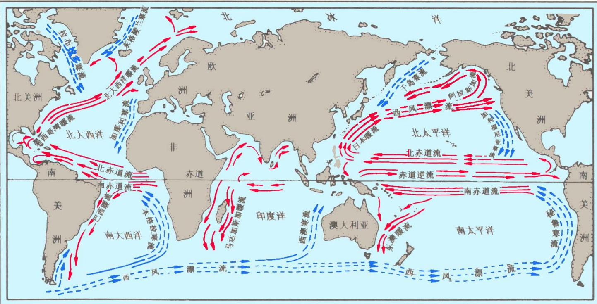
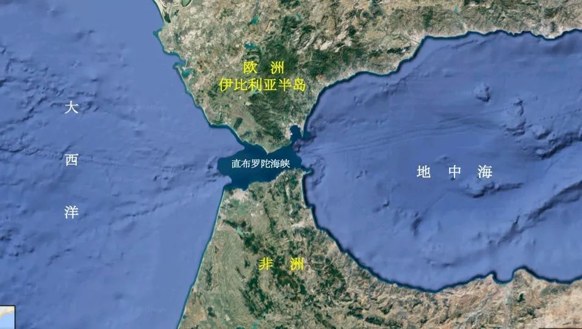

- [Chapter 4 海洋与陆地水](#chapter-4-海洋与陆地水)
  - [4.1 地球水循环与水量平衡](#41-地球水循环与水量平衡)
    - [水圈的演化](#水圈的演化)
    - [地球上水的分布](#地球上水的分布)
    - [水平衡与水量平衡](#水平衡与水量平衡)
  - [4.2 海洋起源与海水理化性质](#42-海洋起源与海水理化性质)
  - [4.3 海水的运动](#43-海水的运动)
    - [潮汐与潮流](#潮汐与潮流)
    - [波浪](#波浪)
    - [洋面流和水团运动](#洋面流和水团运动)
  - [4.4 海平面变化](#44-海平面变化)
  - [4.5 海洋资源和海洋环境保护](#45-海洋资源和海洋环境保护)
  - [4.6 河流](#46-河流)
    - [河流、水系和流域](#河流水系和流域)
    - [水情要素](#水情要素)
    - [河川径流](#河川径流)
    - [河流的补给](#河流的补给)
    - [流域的水量平衡](#流域的水量平衡)
  - [4.7 湖泊与沼泽](#47-湖泊与沼泽)
    - [湖泊](#湖泊)
    - [沼泽](#沼泽)
  - [4.8 地下水](#48-地下水)
  - [4.9 冰川](#49-冰川)

# Chapter 4 海洋与陆地水
重点：认识地球水循环和水量平衡的规律，掌握海洋、河流、湖泊、地下水及冰川等水域环境的特点及其变化规律。  

## 4.1 地球水循环与水量平衡
### 水圈的演化
- 水的来源：
  - 自生说：水来自地球内部
  - 外生说：水来自地球以外的宇宙空间

- 水的作用：
  - 水是一种可以重新利用，可以更新的资源
  - 水是自然界的动力
  - 没有水就没有空气
  - 水是生物圈中形成光合作用的基本原料
  - 水是外营力中的主导因素之一，它对地球上物质的运输、搬移、化学迁移均起重要作用

### 地球上水的分布

| 水的分布 |         |        |         |      |        |        |         |
| -------- | ------- | ------ | ------- | ---- | ------ | ------ | ------- |
| 液态水   | 97.859% | 地表水 | 99.389% | 海水 | 97.23% | 海水   | 97.23%  |
| 固态水   | 2.14%   | 地下水 | 0.61%   | 咸水 | 0.008% | 湖水   | 0.017%  |
| 气态水   | 0.001%  | 大气水 | 0.001%  | 淡水 | 2.762% | 河水   | 0.0001% |
|          |         |        |         |      |        | 冰川水 | 2.14%   |
|          |         |        |         |      |        | 地下水 | 0.61%   |
|          |         |        |         |      |        | 土壤水 | 0.005%  |

| 水体储库       |  水量($km^3$) | 占总水量的百分比(%) |
| :------------- | ------------: | ------------------: |
| 江河           |         1 250 |              0.0001 |
| 淡水湖         |       125 000 |               0.009 |
| 盐湖和内陆海   |       104 000 |               0.008 |
| 冰盖和冰川     |    29 200 000 |                2.41 |
| 地下水         |     8 350 000 |                0.61 |
| 海洋           | 1 370 000 000 |                97.3 |
| 大气水         |         1 300 |               0.001 |
| 土壤水和渗流水 |        67 000 |               0.005 |

**水资源**：
- 广义上水资源是指能够直接或简介使用的各种水和水中的物质，在社会生活中具有是哟个价值和经济价值的水都可称为水资源。
- 狭义上水资源是指人类在一定的经济技术条件下能够直接使用的淡水。
- 特性：
  - 资源的循环性
  - 储量的有限性
  - 时空分布的不均匀性
  - 利用的多样性
  - 利、害的两重性

### 水平衡与水量平衡
- **`水循环`**
  - 概念：地球上各种形态的水，在`太阳辐射`、`重力`等的作用下，通过`蒸发、水汽输送、凝结降水、下渗以及径流`等环节，不断地发生`相态转换`的周而复始运动的过程，称为**水循环**。地球上各类水体，通过水循环形成了一个连续而统一的整体。
  - 机理：
    - 服从于能量守恒定律
    - 基本动力是太阳辐射和重力作用
    - 涉及整个水圈，并深入大气圈、岩石圈和生物圈，同时通过无数条线路实现循环和相变
    - 全球来看水循环是个闭合系统，从局部地区来看，水循环是开放系统。
    - 水携带者一些物质一起运动，这些物质不构成完整的循环系统。水文循环仅指水分的循环。
  - 类型：
    - `大循环`：*发生于全球海洋与陆地之间的水分交换过程*。
      - 循环过程中，水分通过蒸发与降水两个环节进行垂直交换；
      - 以水汽输送和径流的形式进行横向交换。
    - `小循环`：*发生在海洋与大气之间，或陆地与大气之间的水分交换过程*。
      - 海洋小循环：海洋蒸发的水汽，在空中凝结，以降水的形式回到海洋的循环过程。
      - 陆地小循环：陆地蒸发的水汽，在空中凝结，以降水的形式回到陆地的过程。
  - **意义（key point）**：
    - 将地球四大圈层相联系在一起，形成相互联系、相互制约的统一整体。
    - 是巨大的物质和能量流动，是具有全球意义的能量纯属过程。
    - 海陆间联系的纽带。
    - 塑造地表形态。
    - 循环。周而复始地被重新利用，成为可再生能源。
- 水平衡
  - 前提：建立在现今的宇宙背景下，地球上的总水量接近一个常数，自然界的水循环持续不断，并具有相对稳定性。
  - 定义：根据质量守恒定律，地球上任何一个区域在任何一段时间内，水的收入与指出的差额等于该地区的储水变化量。
  - 海洋蒸发大于降水，陆地降水大于蒸发，海洋和陆地水最后通过径流达到平衡。

## 4.2 海洋起源与海水理化性质
- 盐度分布特征：从副热带向高纬度递减，等盐度线与纬线平行；大洋盐度高于近岸。
- 温度分布特征：（水平分布）从赤道向两极逐渐降低，等温度线大致成带状分布；北半球水文高于南半球，夏季水温高于冬季。（垂直分布）从海面向海底不均匀递减。
- 密度分布特征：密度随温度、盐度、压力不同而差异。下层海水密度大；从低纬度向两极，水温降低，密度增大。

## 4.3 海水的运动
### 潮汐与潮流
- **潮汐**
  - 由于月球和太阳的引力引起的地球海水面的周期性升降运动。
  - 低纬度海区最显著，因为潮汐是地球自转和日月引力所致。
  - 地球上某一点受到的太阳和地球的引力（`引潮力`）与全球平均值大小有差别，方向也不同，这一引力差使海平面发生升降。
- *潮流*：海水在天体引潮力作用下形成的周期性水平运动。

### 波浪
- 概念：海水质点以原有平衡位置为中心，在垂直方向上作周期性运动的现象。
- 波浪的类型：
  - 风浪和涌浪
  - 深水波与浅水波

### 洋面流和水团运动
- 概念：洋流，又称大洋环流，是指海洋中具有相对稳定的流速和流向的海水，从一个海区水平地或垂直地向另一个海区大规模的非周期性运动。由于洋流在大范围水域常常构成环状，故又称环流。
- 成因：风是洋流的主要动力。此外地球偏转力、海陆分布、海底起伏、地质作用等也导致或影响洋流。

- 类型：
  - 按成因
    - **风海流**（盛行风对水面的摩擦力作用以及风在波浪逆风上所施加的压力，迫使海水向前运动，产生摩擦流）、
    - **密度流**（海水密度差异引起的海流。海水密度分布不均匀而使海区行程了压力梯度，海水从高压区想低压区流动，所以又称为梯度流）、
    - **补偿流**（由于某种原因是海水从一个海区流出，使另一部分海水流入进行补充。补偿流可以是水平流动，也可以是垂直流，上升或下降）。
    *直布罗陀海峡*（密度流）：西班牙最南部和非洲西北部之间，沟通了大西洋和地中海。
  - 按水温：
    - 暖流
    - 寒流
  - 按流经的地理位置
    - 赤道流
    - 大洋流
    - 极地流
    - 沿岸流
- 洋流对地理环境和人类的影响
  - 巨大的打样洋流系统可以促进高低纬间热量输送和交换，对全球热量平衡有重要作用。
  - 对海洋生物资源的分布，世界浴场的地理分布都有显著的影响。
  - 对海洋航运有显著影响。
  - 陆地上污染物随径流进入海洋。洋流把污染物带到更广阔的海洋中，加快了污染物的净化。

## 4.4 海平面变化
null
## 4.5 海洋资源和海洋环境保护
- 海洋资源：与海水本身有直接关系的物质和能量。
  - 化学资源
  - 矿产资源
  - 动力资源
  - 生物海洋资源
- 对地理环境的影响
  - 是到达地球表面的太阳能的主要接收者和蓄积者。
  - 海水冷却向空气中散发大量的热，增温是将从空气中吸收大量的热。
  - 通过与大气的物质和能量交换间接影响气候和受气候影响的自然现象。
- 海洋环境保护
  - 减少和防止海洋污染
  - 合理开发资源

## 4.6 河流

### 河流、水系和流域
- `河流`：陆地表层唯一畅流的液态水，它的水循环机制既受热力因素的影响，又受重力作用的控制。
- `水系`：河流沿途接纳支流，形成复杂的干支流网络系统，就是水系。
- `流域`：河流或水系获得补给水的陆地区域。
- `分水线`：两相邻流域间地面高程最高点的连线，就是两个水系的分水线。

### 水情要素
- `水位`：河流中莫伊标准几面或测站基面上的水面高度，叫做水位。
- `流速`：水质点在单位时间内移动的距离。
- `流量`：单位时间内通过水断面的水量。
- `水温`与`冰情`

### 河川径流
- **`径流`**： 大气降水到达陆地后，除了蒸发而余存在地表或地下，从高处向低处流动的水流。径流分为地表径流和地下径流。

- 河川径流：从地表和地下汇入河川后，向流域出口断面汇集的水流。

- **径流形成过程**
  + 植物截留：开始降雨时，一部分滞留在植物枝叶上
  + 地下径流：降落到地面上的水向土中下渗，除补充土壤含水量外，逐步向下层渗透，**到达地下水面**，成为地下径流
  + 坡面漫流：当降雨强度超过了土壤下渗能力时，雨水沿坡面向地处流动
  + 地面径流：扣除植物截留、下渗、填洼后的雨水进入溪流
  + 壤中流：土壤含水量先达到饱和后，继续下渗的雨量沿饱和层的坡度在土壤空隙间流动

**地面径流形成过程排序？**
降水->植物截留->下渗->形成坡面漫流->填洼->进入溪沟->汇入河槽形成径流->地面径流。
地下径流形成过程？
壤中流形成过程？

### 河流的补给
- 雪水补给
- 融水补给
- 湖泊与沼泽水补给
- 地下水补给
- 人工补给

### 流域的水量平衡
null

## 4.7 湖泊与沼泽
### 湖泊
- 湖泊是陆地表面具有一定规模的天然洼地的蓄水体系，是湖盆、湖水以及水中物质组合而成的自然综合体。

### 沼泽
- marsh 或 swamp ，较平坦或稍低洼而过度湿润的地面称为沼泽。

## 4.8 地下水
- 存在于地表以下岩土层空隙中的各种不同形式的水，统称为地下水。
- 来源：
  - 大气降水渗入补给
  - 地表水补给
  - 凝结水补给
  - 人工补给等
- 按埋藏条件的分类
  - 上层滞水
  - 潜水：是埋藏在地表下第一个稳定隔水层上具有自由表面（潜水面）的重力水。
  - 承压水：充满两个隔水层之间的水称承压水。

## 4.9 冰川
- 发生在陆地上，有大气固态降水演变而成的通常处于运动状态的天然冰体。雪线触及地面是发生冰川的必要条件。
- 雪线：多年积雪区和季节积雪区的界线。
- 冰川对地理环境的影响：
  - 在极地和中低纬高山冰川区，冰川本身就是自然地理要素之一，并形成独特的冰川景观。
  - 作为一种特殊的下垫面，冰盖的扩展将大大增强地球 的反射率，从而促使地球进一步变冷，并影响气团性质和 环流特征。
  - 冰川对径流也有调节作用。
  - 冰川的推进和退缩，将改变其经过的地区的自然带的分布。
  - 冰川的侵蚀和堆积作用显著改变地 表形态，形成特殊的冰川形态。

