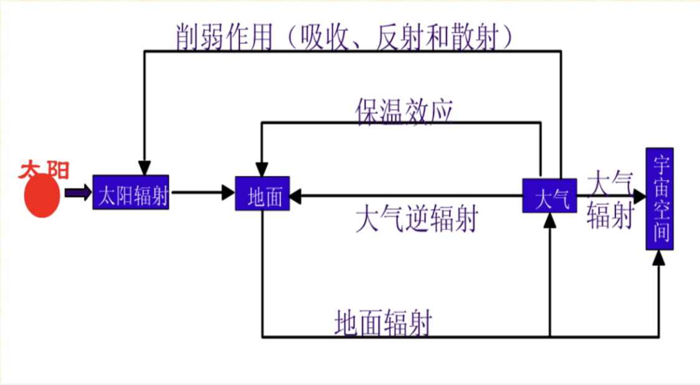
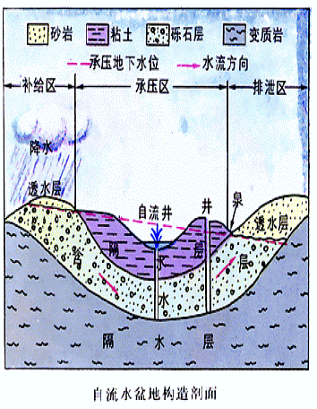

- [《自然地理学》Guideline](#自然地理学guideline)
  - [考试结构](#考试结构)
  - [1：绪论](#1绪论)
    - [1.**什么是地理学**？](#1什么是地理学)
    - [2.**什么是地理事物**？](#2什么是地理事物)
    - [3.**地球表层的定义**？](#3地球表层的定义)
    - [4.**概括地理学的学科特点**](#4概括地理学的学科特点)
    - [5.**列举地理学的主要的分支**](#5列举地理学的主要的分支)
    - [6.**列举近代地理学形成的重要标志**](#6列举近代地理学形成的重要标志)
    - [7.**列举现代地理学的主要研究主题和方向**](#7列举现代地理学的主要研究主题和方向)
  - [2：地球系统](#2地球系统)
    - [1.名词解释：**恒星日、太阳日、恒星年、回归年、黄赤交角、天球、经度、纬度**](#1名词解释恒星日太阳日恒星年回归年黄赤交角天球经度纬度)
    - [2.**类地行星和类木行星的区别**](#2类地行星和类木行星的区别)
    - [3.**概括太阳系中行星的共同特征**](#3概括太阳系中行星的共同特征)
    - [4.**概述地球形状和大小的地理意义**](#4概述地球形状和大小的地理意义)
    - [5.**列举地球内部和外部圈层并描述其分布特点**](#5列举地球内部和外部圈层并描述其分布特点)
    - [6.**描述地球的公转和自转分别对地球自然环境产生怎样的影响**](#6描述地球的公转和自转分别对地球自然环境产生怎样的影响)
    - [7.**解释黄赤交角->太阳回归运动->地球五带之间的关系**](#7解释黄赤交角-太阳回归运动-地球五带之间的关系)
    - [8.**概述地球表面的基本特征**](#8概述地球表面的基本特征)
  - [3：大气圈](#3大气圈)
    - [1.名词解释：**干洁空气、大气气溶胶、气压、地转风、梯度风、大气环流、行星风系、三圈环流、季风、逆温、气团、气团的变性、气旋/反气旋、露点**](#1名词解释干洁空气大气气溶胶气压地转风梯度风大气环流行星风系三圈环流季风逆温气团气团的变性气旋反气旋露点)
    - [2.**列举大气组成成分并简述各主要成分的特点**](#2列举大气组成成分并简述各主要成分的特点)
    - [2.**描述大气垂直分层结构及各分层的特征**](#2描述大气垂直分层结构及各分层的特征)
    - [3.**描述太阳辐射能量在地气系统中的传播过程**](#3描述太阳辐射能量在地气系统中的传播过程)
    - [4.**列举气压系统的基本类型**](#4列举气压系统的基本类型)
    - [5.**地球热量带如何划分？**](#5地球热量带如何划分)
    - [6.**降水的形成需具备哪些条件**](#6降水的形成需具备哪些条件)
  - [4：水圈](#4水圈)
    - [1.**名词解释：盐度、水系、流域、径流、河流、湖泊、沼泽、冰川、大陆冰川、山岳冰川、水循环、潮汐、洋流、**](#1名词解释盐度水系流域径流河流湖泊沼泽冰川大陆冰川山岳冰川水循环潮汐洋流)
    - [2.**解析水循环中的“大循环” 与“小循环”**](#2解析水循环中的大循环-与小循环)
    - [3.**概述海水温度、盐度、密度的分布规律**](#3概述海水温度盐度密度的分布规律)
    - [4.**分析水循环对于地球系统的重要意义**](#4分析水循环对于地球系统的重要意义)
    - [5.**描述太阳和月亮对地球海洋潮汐的影响**](#5描述太阳和月亮对地球海洋潮汐的影响)
    - [6.**描述径流的动态形成过程**](#6描述径流的动态形成过程)
    - [7.**列举地下水的分类**](#7列举地下水的分类)
    - [8.**解释自流盆地的形成原理**](#8解释自流盆地的形成原理)
  - [5：土壤](#5土壤)
    - [1.名词解释：**土壤和土地、土壤肥力、土壤有机质、地质大循环、生物小循环**](#1名词解释土壤和土地土壤肥力土壤有机质地质大循环生物小循环)
    - [2.**列举土壤的组成成分**](#2列举土壤的组成成分)
    - [3.**阐述土壤圈在地球表层系统中的地位和作用**](#3阐述土壤圈在地球表层系统中的地位和作用)
    - [4.解析“**土壤形成的基本规律是物质大循环和生物小循环过程矛盾的统一**”](#4解析土壤形成的基本规律是物质大循环和生物小循环过程矛盾的统一)
    - [5.**列举主要的影响土壤形成和演变的因素**](#5列举主要的影响土壤形成和演变的因素)
    - [6.**概述母质对于土壤形成的影响**](#6概述母质对于土壤形成的影响)
    - [7.**列举中国土壤的分类**（级+纲）](#7列举中国土壤的分类级纲)
    - [8.**列举土壤资源存在的问题及合理保护和利用土壤资源的措施**](#8列举土壤资源存在的问题及合理保护和利用土壤资源的措施)
  - [6：生物圈](#6生物圈)
    - [1.名词解释：**生物圈、环境、生态因子、生态幅、种群、群落、生态系统、生物放大作用、食物链**](#1名词解释生物圈环境生态因子生态幅种群群落生态系统生物放大作用食物链)
    - [2.**列举生物之间的相互关系**](#2列举生物之间的相互关系)
    - [3.解析**生物对环境的趋同/趋异适应**](#3解析生物对环境的趋同趋异适应)
    - [4.概括**光/温度/土壤对生物的作用**](#4概括光温度土壤对生物的作用)
    - [5.**列举生态系统的组成和功能群**](#5列举生态系统的组成和功能群)
    - [6.解析生物->食物链->食物网->**营养级的结构关系**](#6解析生物-食物链-食物网-营养级的结构关系)

# 《自然地理学》Guideline

## 考试结构
1. 填空题 1*10=10
2. 选择题 2*5=10
3. 名词解释 3*10=30
4. 简答题 6*5=30
5. 综合 1*20=20

## 1：绪论
### 1.**什么是地理学**？
   - *地理学是研究地球表层人类生存环境的空间差异、时间演变及人与环境相互作用的科学。*
   - 地理学是研究地球表层人地系统的结构、功能、动态、地域分异规律及优化调控的科学。

### 2.**什么是地理事物**？
   - 当把某一事物与其所在的地域联系起来进行研究时，该事物即称为地理事物。这一过程就是地域化过程。

### 3.**地球表层的定义**？
   - 地球表层是指接近地球海陆表面，由岩石圈、水圈、大气圈、生物圈和智慧圈等相互作用，相互渗透形成的统一整体。
   - 一般认为地球表层的上界是大气圈的对流层顶，下界是岩石圈的沉积岩底。

### 4.**概括地理学的学科特点**
   - 综合性
   - 区域性
   - 动态性
   - 软科学性
   - 工程性
   - 学科视角独特、研究方法多样

### 5.**列举地理学的主要的分支**
   - 自然地理学
   - 人文地理学
   - 人口地理学
   - 地质地貌学
   - 地图学
   - 经济地理学
   - 旅游地理学
   - 水文地理学
   - 土壤地理学
   - 气候地理学

### 6.**列举近代地理学形成的重要标志**
   - 德国洪堡的《宇宙》
   - 李特尔的《地学通论》

### 7.**列举现代地理学的主要研究主题和方向**
   - 强调地理的统一性：强化地理学综合性的特点。
   - 理论化、数量化：地理学由定性到定量发展，地理数量方法、地理信息系统。
   - 行为化和生态化：对研究人口、城市、环境等问题提供方法和技术。
   - 趋势
     - 研究方法的变革
     - 从概念模型到定量表达
     - 大数据、可视化、虚拟现实为研究复杂地理学问题提供了重要工具

## 2：地球系统
### 1.名词解释：**恒星日、太阳日、恒星年、回归年、黄赤交角、天球、经度、纬度**
   - 恒星日：取春分点为标准，则春分点连续两次通过同一子午面的时间。
   - 太阳日：如果取太阳为标准，则地球上同一地点连续两次通过地心与日心的连线所需要的时间。
   - 恒星年：地球连续两次通过太阳与另一个恒星与地球轨道的交点所需时间365天6时9分9.5秒。
   - +：地球连续两次通过春分点的平均时间365天5时48分46秒。
   - `黄赤交角`：太阳运动的路线叫做黄道，黄道所在平面（黄道面）与地球轨道面是重合的。黄道面与赤道面的交角即为黄赤交角，约23′27″。
   - `天球`：一个与地球同球心，并有相同的自转轴，半径无限大的球。
   - `经度`：球面坐标系的横坐标，地球上一点离本初子午线（南北走向）以东或以西的度数。
   - `纬度`：该地铅垂线对赤道面的夹角。

### 2.**类地行星和类木行星的区别**

   **类地行星 & 类木行星**

|          | 类地     | 类木     | 冥王星 |
| -------- | -------- | -------- | ------ |
| 行星     | 水金地火 | 木土天海 | 冥王星 |
| 质量     | 较小     | 较大     | 较小   |
| 体积     | 较小     | 较大     | 较小   |
| 密度     | 较高     | 较低     | 较低   |
| 光环     | 无       | 有       | 无     |
| 表面温度 | 较高     | 较低     | 较低   |
| 卫星数目 | 少       | 多       | 少     |

### 3.**概括太阳系中行星的共同特征**
   - 所有卫星轨道偏心率都很小，几乎都接近圆形
   - 轨道面都近似在一个平面上，对地球轨道面（黄道面）的倾斜也都不大
   - 所有行星都自西向东环绕太阳公转；除金星和天王星外，所有行星的自转方向也自西向东
   - 所有行星的赤道面对轨道面的倾斜都比较小，只有天王星例外
   - 绝大多数卫星轨道都近似圆形，轨道面接近母星的赤道面
   - 绝大多数卫星、包括土星环在内，公转方向都和母星的公转方向相同

### 4.**概述地球形状和大小的地理意义**

   **地球形状的物理意义**（key point）：
   - 日地平均距离为14960*1E+4km，这样可以将投射到地面的太阳光线是为平行光线。当平行光线射到地球表面时，不同纬度地区的正午太阳高度角将不相同。  
   - 造成地球上热量的带状分布和与地表热状况相关的自然现象的地带性分布。

   **地球大小的重要意义**：（key point）
   - 巨大质量，使它能吸引维持周围气体，保持一个具有一定质量和厚度的大气圈
   - 没有这样的大气圈，就没有海洋和河湖，没有风，没有生物

### 5.**列举地球内部和外部圈层并描述其分布特点**

   内部圈层：地壳、地幔地核

   外部圈层：岩石圈、水圈、大气圈、生物圈

### 6.**描述地球的公转和自转分别对地球自然环境产生怎样的影响**

   公转的影响：四季交替和五带的划分。

   自转的影响：
   - 确定地理坐标的基础。
   - 决定了昼夜的交替。同一时刻不同的时刻、不同经线有不同的时刻
   - 地转偏向力，北半球做水平运动二物体发生右偏，南半球向左偏。
   - 潮汐现象，地壳运动，大气运动等。

### 7.**解释黄赤交角->太阳回归运动->地球五带之间的关系**

   太阳运动的路线叫做黄道，黄道面与赤道面的交角是黄赤交角。太阳在天球上来往于赤道面的南北两侧的运动叫做太阳回归运动。太阳回归运动是五带形成的最根本原因。

### 8.**概述地球表面的基本特征**
   - 太阳辐射集中分布于地表，太阳能的转化也主要在地表进行。
   - 固态、液态、气态物质同时并存于地表，使海洋表面成为液——气界面，海底称为液——固界面，陆地表面成为气——固界面，而沿岸地带成为三相界面。
   - 地球表面具有其特有的，由其本身发展形成的物质和现象，如生物，风化壳，土壤层等。
   - 相互渗透的地表各圈层之间，进行着复杂的物质，能量交换和循环，如水循环，地质循环等，并且在交换和循环中伴随着信息的传输。
   - 地球表面存在着复杂的内部分异。
   - 地球表面是人类社会发生、发展的环境，是人类活动的基本场所。

## 3：大气圈
### 1.名词解释：**干洁空气、大气气溶胶、气压、地转风、梯度风、大气环流、行星风系、三圈环流、季风、逆温、气团、气团的变性、气旋/反气旋、露点**

   干洁空气：不包含水汽和固体杂质的整个混合气体。

   大气气溶胶：大气中均匀分布的相当数量的固体颗粒和液体微粒，如灰尘、烟尘和有机物等物质构成的稳定混合物。

   气压：静止大气中任意高度单位面积上所承受的空气柱质量。

   地转风：气压梯度力和地转偏向力相平衡时，空气做等速、直线的水平运动。

   梯度风：自由大气中，空气作曲线运动时，水平气压梯度力G、梯度偏向力A和惯性离心力C三个力达到平衡时的空气水平运动、称为梯度风。

   大气环流：地球上具有一定稳定性的各种气流运行的综合现象。

   行星风系：不考虑海陆分布等的影响，全球性的低层盛行西风带。

   三圈环流：假设地球不自转，且表面均匀，由于赤道和两极受热不均，赤道上空的空气流向极地，而低层气流自极地流向赤道，这样在极地和赤道之间形成一个南北闭合的环流。但是地球不停自传，空气开始运动，地转偏向力发生作用，南北半球分别形成三圈环流。

   季风：以一年为周期，大范围地区的盛行风随季节而有显著改变的现象。季风是海陆间热力差异形成的大范围热力环流。

   逆温：对流层内发生温度随高度升高而上升的局部反常现象，会阻止空气垂直对流。

   气团：气象要素在水平分布上比较均匀的大范围空气团。

   气团的变性：气团形成后，随环流条件的变化，由源地移动到新地区时，由于下垫面性质改变，气团的属性发生相应改变。

   气旋：气压中心低于四周的水平空气漩涡。北半球逆时针，南半球为顺时针。

   反气旋：中心气压高于四周的大型空气漩涡。北半球为顺时针，南半球为逆时针。

   露点：湿空气~~等压~~降温达到饱和时的温度。

### 2.**列举大气组成成分并简述各主要成分的特点**
<!--
| 大气组成 |          |        | 主要作用                                       |
| -------- | -------- | ------ | ---------------------------------------------- |
| 干洁空气 | 主要成分 | $N_2$  | 生物体的基本成分                               |
|          |          | $O_2$  | 维持生物活动的必要物质                         |
|          | 次要成分 | $CO_2$ | 植物光合作用的原料；对地面保温                 |
|          |          | $O_3$  | 吸收紫外线，使地球上的生物免遭过量紫外线的伤害 |
| 水汽     |          |        | 成云致雨的必要条件；对地面保温                 |
| 固体杂质 |          |        | 成云致雨的必要条件                             |
-->
$$大气组成
\left\{
\begin{aligned}
   &干洁空气
   \left\{
   \begin{aligned}
      &主要成分
        \left\{         
        \begin{aligned}
          &N_2:生物体的基本成分\\
          &O_2:维持生物活动的必要物质\\      
        \end{aligned}
        \right.\\
      &次要成分
        \left\{
        \begin{aligned}
          &CO_2:植物光合作用的原料，对地面保温\\
          &O_3:吸收紫外线，使地球上的生物免遭过量紫外线的伤害\\      
        \end{aligned}
        \right.\\             
   \end{aligned}
   \right.\\
   &水汽:成云致雨的必要条件；对地面保温\\
   &固体杂质：成云致雨的必要条件\\
\end{aligned}
\right.
$$

### 2.**描述大气垂直分层结构及各分层的特征**

| 层序   | 高度      | 温度分布特点           |
| ------ | --------- | ---------------------- |
| 对流层 | 0~17km    | 随高度升高而降低 ↘     |
| 平流层 | 17~50km   | 随高度升高而升高 ↗     |
| 中间层 | 50-80km   | 随高度升高而降低 ↘     |
| 暖层   | 80-500km  | 随高度升高而升高 ↗     |
| 外层   | 500km之外 | 地球大气与宇宙的过渡层 |

| 层圈   | 高度范围 | 温度变化                                     | 物质成分变化                                        | 对流特征                                         |
| ------ | -------- | -------------------------------------------- | --------------------------------------------------- | ------------------------------------------------ |
| 对流层 | 0~10km   | 随高度升高而降低 ↘                           | N2、O2、CO2及惰性气体和一些有害气体、水气、气溶胶粒 | 对流运动显著，水平、垂直运动，形成各种天气现象。 |
| 平流层 | ~50km    | 气温受地面影响较小（气温随高度增加基本不变） | 臭氧明显增多，水汽含量极少                          | 气流稳定，水平运动为主                           |
| 中间层 | ~80km    | 随高度升高而迅速降低 ↘                       | 水汽含量极少                                        | 强烈垂直对流，顶层出现一个电离层                 |
| 暖层   | ~800km   | 随高度升高而迅速升高 ↗                       | 空气稀薄                                            | 空气高度电离，反射无线电波                       |
| 外层   | >800km   | 温度随高度增加而升高↗                        | 空气稀薄                                            | 大气质点能散逸到星际空间                         |

### 3.**描述太阳辐射能量在地气系统中的传播过程**

- 太阳暖大地：太阳照射地面，地面聚集一定的能量，使大地温度上升。
- 大地暖大气：太阳下山后空气温度渐渐减小，当大气温度小于大地温度时，大地散发热量给大气。
- 大气还大地：大气将大地散发的热量锁住，再还给大地。

### 4.**列举气压系统的基本类型**
（天气系统）
气团、锋面、气旋与反气旋、高压槽和低压脊

### 5.**地球热量带如何划分？**

太阳辐射的分布规律尽管受到其他因素的干扰，从全球范围来看，热量分布总趋势仍然与纬度大致平行，由低纬向高纬呈带状排列，形成地球上的热量带，热量带是形成地球气候带的基础。
* 10°S-10°N 赤道带
* 10°-25° 热带
* 25°-35° 亚热带
* 35°-55°中纬度带
* 55°-极圈 亚极地带
* 极圈内 极地带

### 6.**降水的形成需具备哪些条件**

**降水**的定义：从云中降到地面上的液态或者固态水，称为降水。
降水的形成：
云滴增大为雨滴、雪花或者其他降水物，并降至地面的过程。
关键：只有当云滴增长到能克服空气阻力和上升气流的顶托，并且在降落到地面的过程中不至于被蒸发掉时，降水才形成。

从雨滴到形成降水需具备两个基本条件：
一是雨滴下降速度超过气流上升速度；二是雨滴从云中降落到地面前不被完全蒸发。降水的形成，必须经历云滴增大为雨滴、雪花及其他降水物的过程。(key point)

## 4：水圈
### 1.**名词解释：盐度、水系、流域、径流、河流、湖泊、沼泽、冰川、大陆冰川、山岳冰川、水循环、潮汐、洋流、**

盐度：1000g海水中所溶解的盐类物质的量，单位是‰；盐度从副热带向高低纬度递减，等盐度线与纬线平行；大洋盐度高于近岸。

水系：河流沿途接纳支流，形成复杂的干支流网络系统，成为水系。

流域：河流或水系获得补给水的陆地区域。

径流：大气降水到达陆地后，除了蒸发而余存在地表或地下，从高处向低处流动的水流。

河流：大气降水或地下水涌出，汇集在地表低洼处，在重力作用下经常或周期性沿流水本身造成的洼地流动。

湖泊：陆地表面具有一定规模的天然洼地的蓄水体系，是湖盆、湖水、水中物质的自然综合体。

沼泽：稍平坦或低洼而过度湿润的地面称为沼泽。

冰川：发生在陆地上，由大气固态降水演变而成的通常处于运动状态的天然冰体。

大陆冰川：占据广阔面积，面积厚度很大的冰川。

山岳冰川：分布在中低纬度山区，雪线较高，积累区不大。

水循环：各种形态的水，在太阳辐射、重力等作用下，通过蒸发、凝结降水、水汽输送、下渗、径流等，不断发生相态转换的周而复始运动的过程。

潮汐：月球与太阳引力引起的地球海水面的周期性升降。

洋流：大洋中具有相对稳定的流速和流向的海水，从一个海区向另一个海区的大规模非周期性运动。常构成圆环故又称为环流。

### 2.**解析水循环中的“大循环” 与“小循环”**

大循环是全球海洋和陆地之间的水分交换过程，水分通过**蒸发**和**降水**两个环节进行垂向交换，以**水汽输送**和**径流**横向交换。

小循环是发生在海洋与大气之间，或陆地与大气之间的水分交换过程，又称为内部循环。（**蒸发-凝结-降水**）

### 3.**概述海水温度、盐度、密度的分布规律**

- 盐度分布特征：从副热带向高低纬度递减，等盐度线与纬线平行；大洋盐度高于近岸。
- 温度分布特征：（水平分布）从赤道向两极逐渐降低，等温度线大致成带状分布；北半球水温高于南半球，夏季水温高于冬季。（垂直分布）从海面向海底不均匀递减。
- 密度分布特征：密度随温度、盐度、压力不同而差异。下层海水密度大；从低纬度向两极，水温降低，密度增大。

### 4.**分析水循环对于地球系统的重要意义**

- 将地球四大圈层相联系在一起，形成相互联系、相互制约的统一整体。
- 是巨大的物质和能量流动，是具有全球意义的能量纯属过程。
- 海陆间联系的纽带。
- 塑造地表形态。
- 循环。周而复始地被重新利用，成为可再生能源。

### 5.**描述太阳和月亮对地球海洋潮汐的影响**

潮汐是由于太阳和月亮及地球三者之间的引力引起的地球海水面的**周期性升降运动**。

地球上某一点受到的太阳和地球的引力（`引潮力`）与全球平均值大小有差别，方向也不同，这一引力差使海平面发生升降。

### 6.**描述径流的动态形成过程**

径流是降落到流于表面的雨水，由地面与地下汇入河川，最终流出流域出偶断面的水流。

+ 植物截留：开始降雨时，一部分滞留在植物枝叶上
+ 地下径流：降落到地面上的水向土中下渗，除补充土壤含水量外，逐步向下层渗透，**到达地下水面**，成为地下径流
+ 坡面漫流：当降雨强度超过了土壤下渗能力时，雨水沿坡面向地处流动
+ 地面径流：扣除植物截留、下渗、填洼后的雨水进入溪流
+ 壤中流：土壤含水量先达到饱和后，继续下渗的雨量沿饱和层的坡度在土壤空隙间流动

### 7.**列举地下水的分类**

+ 按埋藏条件：上层滞水、潜水、承压水
+ 按储存空隙的种类：孔隙水、裂隙水、岩溶水

### 8.**解释自流盆地的形成原理**

- 按埋藏条件不同，地下水分为上层滞水、潜水和承压地下水三类。
- 上层滞水时存在于包气带中局部隔水层之上的重力水。
- 潜水是指埋藏在地表以下第一稳定隔水层之上具有自由水面的重力水。潜水和河水之间一般由互补关系。
- 承压地下水是指埋藏在上下两个隔水层之间的地下水。承压水位高于上部隔水层，再地形条件适宜时，其天然露头或经人工造景喷出地表形成自流井。

自流水盆地又称自流盆地，指具有地下承压蓄水构造的向斜盆地，一般分为`补给区`，`承压区`，`排泄区`三部分。根据向斜构造的封闭程度，可分封闭型自流盆地和开放型自流盆地两种。封闭型自流盆地向斜构造较完整，地下水径流条件差，水矿化度较高。开放型自流盆地常被断层或水文网切割，地下承压水常沿断层或河谷排泄于地表。由钻孔钻穿自流水盆地上层的隔水层顶板，地下承压水在压力作用下，可自动沿钻孔上涌，**当钻孔位置低于承压水面时，地下水可喷出地表，形成自流水**。

自流盆地是一种具有承压蓄水构造的向斜盆地，有大型复式构造盆地和小型单一向斜构造盆地。主要由第四纪以前的岩层组成。自流盆地一般分为补给区、承压区和排泄区三部分。有时可有几个承压含水层，它们有各自不同的承压水位。当蓄水构造与地形一致时，称正地形，此时，下层承压水位高于上层承压水位。反之称负地形，其下层承压水位低于上层承压水位。水位高低不同时，可造成含水层间通过弱水层或断层“天窗”而发生水力联系，形成含水层间的补给关系，高水位含水层补给低水位含水层。自流盆地按向斜构造的封闭程度，分为封闭自流盆地和开放型自流盆地。前者为向斜构造比较完整的承压盆地，地下水径流条件差，水交替程度弱，水矿化度提高。后者常被断层或水文网切割，承压水常沿断层或河谷排泄于地表。

## 5：土壤
### 1.名词解释：**土壤和土地、土壤肥力、土壤有机质、地质大循环、生物小循环**

土壤：分布在地球表面具有肥力特征的能生长植物的陆地疏松表层。

土地：由气候、地貌、土壤、植被和水文等自然要素组成的一个自然综合体。

土壤肥力：土壤为植物生长不断供应和协调`养分`、`水分`、`空气`和`热量的`能力。四个肥力因素不是孤立的，而是相互联系和相互制约的。

土壤有机质：**土壤中动植物残体微生物体及其分解和生成的物质，是土壤中的各种含碳有机化合物**。包括两大类：非特殊性有机物和土壤腐殖质（新鲜有机质经微生物分解转化所形成的黑色胶体物质，占有机质总量的85%~90%。）。土壤有机质对土壤理化性质和肥力影响较大，是植物微生物活动所需养分和能量的源泉。

- 地质大循环
  - 结晶岩石矿物在外力作用下发生风化变成细碎而可溶物之，被流水搬运迁移到海洋，经过漫长的地质年代变成沉积岩，当地壳上升，沉积岩又露出海面称为陆地，再次受到风化淋溶。
  - 过程：基岩露出地表——风化淋溶——风化壳——搬运——沉积物——沉积岩
  - 意义：形成了疏松多孔的成土母质，为植物生长提供了基础。（key point）
- 生物小循环
  - 植物营养元素在生物体与土壤之间的循环：植物从土壤中吸收养分，形成植物体，后者供动物生长，而动植物残体回到土壤中，在微生物的作用下转换为植物需要的养分，促进土壤肥力的形成和发展。
  - 过程：低等植物使母质积累有机质和养分——地衣、苔藓——高等绿色植物等
  - 意义：控制了自然界养料物质无限制的淋失，使有限的营养元素得到了无限的利用，使母质转化成土壤，促进土壤从简单到复杂、由低级到高级不停地运动和向前发展。

### 2.**列举土壤的组成成分**

- 土壤的物质组成（key point）
  - 三相四成分
  $$\left \{
  \begin{aligned}
  &{固相
    \left  \{
    \begin{aligned}
    &土壤矿物质\\
    &土壤有机物
    \end{aligned}
    \right .}\\
  &液相\\
  &气相
  \end{aligned}
  \right.$$

### 3.**阐述土壤圈在地球表层系统中的地位和作用**

 (1)土壤与生物圈进行养分元素的循环,土壤支持和调节生物的生长发育过程,提供植物所需的养分、水分与适宜的理化环境,决定了自然植被的分布。
 (2)土壤圏与水圈进行水分循环与平衡,影响降水在陆地和水域的重新分配,影响元素的表生，地球化学迁移过程及水平分布,也影响水圈 的化学组成。
 (3)土壤圈与大气圈进行着气体交换,影响大气圈的化学组成、水分与 热量平衡和全球大气变化。
 (4)土壤圈与岩石圈进行着金属元素与微量元素的循环。土壤覆盖在岩石圈表面,对其具有一定的保护作用,减少各种外营力的破坏。

### 4.解析“**土壤形成的基本规律是物质大循环和生物小循环过程矛盾的统一**”

- 地质大循环
  - 结晶岩石矿物在外力作用下发生风化变成细碎而可溶物质，被流水搬运迁移到海洋，经过漫长的地质年代变成沉积岩，当地壳上升，沉积岩又露出海面称为陆地，再次受到风化淋溶。
  - 过程：基岩露出地表——风化淋溶——风化壳——搬运——沉积物——沉积岩
  - 意义：形成了疏松多孔的成土母质，为植物生长提供了基础。（key point）
- 生物小循环
  - 植物营养元素在生物体与土壤之间的循环：植物从土壤中吸收养分，形成植物体，后者供动物生长，而动植物残体回到土壤中，在微生物的作用下转换为植物需要的养分，促进土壤肥力的形成和发展。
  - 过程：低等植物使母质积累有机质和养分——地衣、苔藓——高等绿色植物等
  - 意义：控制了自然界养料物质无限制的淋失，使有限的营养元素得到了无限的利用，使母质转化成土壤，促进土壤从简单到复杂、由低级到高级不停地运动和向前发展。
- 物质大循环和生物小循环的关系
  1. **物质的生物小循环是在地质大循环的基础上发展起来的。**有了地质大循环才有生物小循环，有了生物小循环才有了土壤。
  2. **在土壤形成过程种，这两个循环过程是同时并存的，互相关联和相互作用，从而推动土壤不停地运动和发展。**地质大循环使岩石风化成母土质，使植物养分元素的释放、淋失的过程。生物小循环使植物养分元素的积累过程，它可以不断地从地址大循环中积累一系列生物所必须地养料元素，出于有机质的积累、分解和腐殖质的形成，发生和发展了土壤的肥力，使岩石风化产物脱离了母质阶段形成了土壤。
  

### 5.**列举主要的影响土壤形成和演变的因素**

- 气候-climate （影响风化，控制植被生长）
- **母质-parent mater （不同岩石风化壳，冲积土）**
- 生物-biology （植被类型，草地和森林）
- 地形-topography （影响物质与能量的分配）
- 时间-time （控制土壤发育进程）
- ~~人为因素~~

### 6.**概述母质对于土壤形成的影响**

1. 成土母质影响着土壤的质地
2. 母质的化学组成影响着土壤的化学组成
3. 母质可影响土壤形成过程的速度
4. 母质对土壤形成的影响程度随着成土年龄增长而减弱

### 7.**列举中国土壤的分类**（级+纲）

- 中国国土壤分类：
  - 以成土因素、成土过程和土壤属性作为基础
  - 采用土纲、亚纲、土类、亚类、土属、土种、变种7级
  - 以土类和土种为基本分类单元，共分为14土纲，27亚纲，60土类，234亚类

### 8.**列举土壤资源存在的问题及合理保护和利用土壤资源的措施**

存在的问题：
- 耕地面积减少，人地矛盾突出
- 土壤侵蚀严重，危害巨大
- 土壤资源退化，肥力下降
- 土壤盐碱化，沙化加剧
- 土壤污染日益严重，农田生态环境恶化

保护措施
- 扩大耕地面积、盘活土地存量
- 综合整治，合理布局
- 改造土壤资源的障碍因素
  - 防止土壤侵蚀
  - 改良盐碱土
  - 改良沙土地
  - 防治土壤污染
  - 培肥土壤提高单位面积产量

## 6：生物圈
### 1.名词解释：**生物圈、环境、生态因子、生态幅、种群、群落、生态系统、生物放大作用、食物链**

生物圈：地球上存在的生物和受其生命活动影响的区域，包括大气圈下层，整个水圈和岩石圈上部，厚度达到20km。

环境：生物生存的空间和各种自然影响因素。

生态因子：对生命活动起直接作用的环境要素。

生态幅：生物在其生存过程中，对每一种生态因子都有其耐受的上限和下限，上限和下限之间就是这种生态因子的耐受范围，即生态因子。

种群：占据着一定空间或地区的同种生物的个体群。

群落：若干种群有规律结合在一起，形成群落。

生态系统：一定空间内生物成分和非生物成分通过物质循环、能量流动相互作用相互依存的单位。

生物放大作用：污染物通过食物链产生逐级富集的现象，称为生物放大作用。营养级越高的生物体内所含有的污染物的数量或浓度越大。

食物链：生态系统中生物通过食物关系彼此关联而形成一个能量与物质流通的链式结构，它是生态系统营养结构的具体表现形式之一。

### 2.**列举生物之间的相互关系**

竞争（competition）：对食物、生存空间和其他条件具有相似或相同要求的不同物种，为了自身生存，相互间都力求抑制对方，从而给对方带来不利影响，谓之竞争。种间竞争的结果是发生生态分离。生态学上相同的两个物种不可能在同一个地区共存。

寄生作用（parasitism）

捕食作用（predation）

原始合作（cooperation）与互利共生（Mutualism）

### 3.解析**生物对环境的趋同/趋异适应**

生物的适应（adaptation）：生物的形态结构、生理机能、个体发育和行为等特征与其长期生存的一定环境条件相互统一。包括趋同适应和趋异适应。

趋同适应（convergent adaptation）亲缘关系相当疏远的不同种类的生物，由于长期生活在相同的环境中，通过变异和选择，形成相同或相似的适应特征和适应方式的现象。

趋异效应（divergent adaptation）：同一种生物的若干个体，在不同环境条件下长期生活，形成了不同的适应特征和和适应方式。

### 4.概括**光/温度/土壤对生物的作用**

`光`的性质、光照强度和光照时间的长短对生物的生长、发育、形态特征、升值、行为和地理分布都有明显的影响。

各种生物对`温度`都有一定的适应范围。在此范围内生物体内的生物化学过程才能正常进行。

土壤是陆生植物生长发育的基地和营养库，它具有供应和调节植物生活中所需水分养料和空气等条件的双重作用.对动物来说，土壤温度和湿度的变化幅度小得多，因此土壤常成为动物极好的隐蔽场所。

### 5.**列举生态系统的组成和功能群**

生态系统是一定空间内生物成分和非生物成分通过物质循环、能量流动、相互作用、相互依赖而构成的一个生态学功能单位。

- 生态系统的组成
  - 非生物成分
    - 无机物
    - 有机化合物
    - 气候因素
  - 生物成分
    - 生产者（producer）
    - 消费者（consumer）
    - 分解者（decomposer）

- 生态系统的功能
  - 单向的能量流动
  - 循环式的物质流动
  - 信息传递

### 6.解析生物->食物链->食物网->**营养级的结构关系**

生态系统的结构
  - 食物链：生态系统中生物通过食物关系彼此关联而形成一个能量与物质流通的链式结构，它是生态系统营养结构的具体表现形式之一。（key point）。受到能量传递效率限制（一个环节到下一个环节，能量要损失90%），食物链不可能太长。食物链包括捕食食物链和碎屑食物链（腐食食物链）。
  - 食物网：生态系统内，众多食物链相互交织，形成的网状结构称为食物网。食物网越复杂，抵抗外力干扰的能力越强，系统稳定性越大。
  - 营养级（trophic level）：食物网中，凡是以相同的方式获取相同性质食物的植物类群和动物类群可以称为一个营养级。
  - 生物放大作用：污染物通过食物链产生逐级富集的现象，称为生物放大作用。营养级越高的生物体内所含有的污染物的数量或浓度越大。

