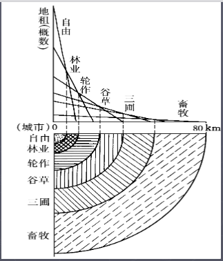

- [《人文地理学》Guideline](#人文地理学guideline)
  - [1：人口与迁移](#1人口与迁移)
    - [1.名词解释：](#1名词解释)
    - [2.人文地理学的研究对象是？人文地理学的学科特性是？](#2人文地理学的研究对象是人文地理学的学科特性是)
    - [3.人口地理学的基本内容包括？](#3人口地理学的基本内容包括)
    - [4.人口密度在测度人口分布上有哪些不足？](#4人口密度在测度人口分布上有哪些不足)
    - [5.如何计算人口抚养比并解释所谓“人口红利”？](#5如何计算人口抚养比并解释所谓人口红利)
    - [6.“人口老龄化”的涵义（定义、表现和原因）](#6人口老龄化的涵义定义表现和原因)
    - [7.世界人口和中国人口的分布特征](#7世界人口和中国人口的分布特征)
    - [8.影响人口分布的因素有哪些？](#8影响人口分布的因素有哪些)
  - [2：聚落与城市](#2聚落与城市)
    - [1.名词解释：](#1名词解释-1)
    - [2.列举聚落地理学研究的主要内容（参考课本）](#2列举聚落地理学研究的主要内容参考课本)
    - [3.城市地理学的主要研究内容](#3城市地理学的主要研究内容)
    - [4.城市化研究的主要内容](#4城市化研究的主要内容)
    - [5.城镇不同于乡村的本质特征](#5城镇不同于乡村的本质特征)
    - [6.全球六大世界级都市带（5国外+1国内）](#6全球六大世界级都市带5国外1国内)
    - [7.地理学角度下城市化概念包含了哪些内容？](#7地理学角度下城市化概念包含了哪些内容)
    - [8.**“城市化是一个地域空间过程”的内涵**](#8城市化是一个地域空间过程的内涵)
    - [9.如何理解城市化的动力机制](#9如何理解城市化的动力机制)
    - [10.解释城市发展中的推拉说(推力和拉力）](#10解释城市发展中的推拉说推力和拉力)
    - [11.城市化的分类（成对出现，对比记忆）](#11城市化的分类成对出现对比记忆)
    - [12.城市化的发展阶段分为哪些？](#12城市化的发展阶段分为哪些)
    - [13.度量城镇化的指标主要有哪些？](#13度量城镇化的指标主要有哪些)
  - [3：产业与发展](#3产业与发展)
    - [1.产业、产业机构、产业分类的定义](#1产业产业机构产业分类的定义)
    - [2.三次产业的分类和实质内涵（参考课本p274）](#2三次产业的分类和实质内涵参考课本p274)
    - [3.第三产业基本概念和划分层次（国际&国内）](#3第三产业基本概念和划分层次国际国内)
    - [4.现代服务业定义（广义&狭义）](#4现代服务业定义广义狭义)
    - [5.配第克拉克定律、霍夫曼工业化阶段理论、库兹涅茨法则、“雁行模式”的内容](#5配第克拉克定律霍夫曼工业化阶段理论库兹涅茨法则雁行模式的内容)
    - [6.主导、支柱产业的定义及区别](#6主导支柱产业的定义及区别)
    - [7.杜能农业区位论（内容，意义，缺点，应用）](#7杜能农业区位论内容意义缺点应用)
    - [8.韦伯工业区位论（内容，意义，缺点，应用）](#8韦伯工业区位论内容意义缺点应用)
  - [4：文化与宗教](#4文化与宗教)
    - [1.名词解释：宗教、文化](#1名词解释宗教文化)
    - [2.宗教在文化中的作用](#2宗教在文化中的作用)
    - [3.导致宗教传播的因素](#3导致宗教传播的因素)
    - [4.世界三大宗教的传播过程](#4世界三大宗教的传播过程)

# 《人文地理学》Guideline
考试结构 1.填空题：1*15=15
2. 名词解释：3*8=24
4. 简答题：6*6=36
5. 综合题：1*25=25

## 1：人口与迁移

### 1.名词解释：
***人文地理学、人口地理学、人口和人口分布、人口密度、人口构成（人口结构）、人口负担系数（抚养比）、人口自然增长率、人口迁移（移民、迁出地&迁入地）、国际、国内人口迁移、难民（联合国&地理学角度）***

**人文地理学**：

人文地理学是研究地表人文事象的空间分布及其空间差别，并预测其发展规律的科学，它是以**<u>人地关系</u>**为基础，着重研究<u>地表人类活动或人与环境所形成的各种文化现象</u>的分布与变化。

**人口地理学**：
研究在一定历史条件下人口分布、人口构成、人口变动和人口增长的空间变化，及其与自然环境和社会经济环境的关系的学科。

**人口和人口分布**：
`人口`：生活在一定社会生产方式、一定时间，居住在一定地域，实现其生命活动并构成社会生活主体，具有一定数量和质量的人所组成的社会群体。

`人口分布`：是指一定时间内人口在一定地区范围的空间分布状况，是人口过程在空间的表现形式。

**人口密度**：

人口密度——单位面积上的人口数量。

**人口构成**：

`人口构成`是指具有不同自然的、社会经济的、地域特征的人口之间的比例关系，即各特征的人口数在人口总数中的百分比，也称人口结构。人口结构包括**<u>自然结构、社会经济结构和地域结构</u>**。人口的自然结构根据人口自然地理生理特征划分，主要包括人口的年龄、性别、种族结构等。

**人口负担系数**：

（Dependency Ratio）：
某一人口中非劳动年龄人口（≤14岁的少儿人口和≥65岁的老年人口）与劳动年龄人口（15~64岁人口）之比，分为少儿负担系数、老年负担系数和总负担系数。

$$少儿负担系数=\frac{\leq14岁人口}{15\sim 64岁人口}\times 100\%\\老年负担系数=\frac{\geq65岁人口}{15\sim 64岁人口}\times 100\%\\总负担系数=少儿负担系数+老年负担系数\\$$

*人口赢利期：总抚养比<50%*

**人口自然增长率**：

人口自然增长的趋势和程度的指标。即一定时期内*人口的自然增长数（出生数减死亡数）与人口总数之比*，通常以一年为期，用千分数表示。

**人口迁移**：
`人口迁移`一般是指人口自两个地区之间的空间移动，这种移动通常涉及人的居住地由迁出地到迁入地永久性或长期地改变。（空间移位、居住地变更、时间限度）

国际、国内**人口迁移**：
- 国际人口迁移：指人口跨国界并改变住所达到一定时间（通常为一年）的迁移活动。
- 国内人口迁移：指在一国范围内，人口从一个地区向另一个地区移居的现象。

**难民**：

- 联合国的定义：基于一种可以证明成立的理由，由于种族、宗教、国籍、身为某一特定社会团体的成员、或具有某种政治见解的原因而畏惧遭受迫害留身在其本国之外，并由于这样的畏惧而不能或不愿意受该国保护的人，或者一个无国籍的人，或国家灭亡的人，并由于上述事情留在他以前经常居住国以外而现在不能、或由于上述畏惧而不愿意返回该国的人。
- 地理学角度讲，难民是人口迁移的特殊形式。因天灾、战祸、阶级压迫和民族压迫、宗教和种族歧视、国界变更等，导致大批人口被迫离开家园，流落他乡，形成强制性的迁移。

### 2.人文地理学的研究对象是？人文地理学的学科特性是？

研究对象：
人文现象（人文事象、文化景观）：一个疏松的社会文化综合体。

- 人地关系
- 区域研究
- 空间分析

学科特性：
- 社会性
  - 人文地理学是社会性较强的地理科学。研究社会现象的地域结构、社会生产方式和社会经济制度；
  - 社会性还表现在历史性上：现代人文地理现象作为历史发展的结构和未来发展的起点。
- 综合性
  - 来源于地理事物的多样性、整体性，人文地理学是从整体的角度去研究人文现象。
- 区域性
  - 区域性是地理学的基本特性。人文地理学与其他人文学科的差异，根本点之一在于人文地理学包含了区域研究的特性，重视了区域特性的差异性和相似性。

### 3.人口地理学的基本内容包括？

研究在一定历史条件下人口分布、人口构成、人口变动和人口增长的空间变化，及其与自然环境和社会经济环境的关系的学科。

研究人口地理分布，人口变动、人口迁移，人口增长，人口构成，劳动力资源，人口承载能力等

### 4.人口密度在测度人口分布上有哪些不足？

人口密度——单位面积上的人口数量。

它把单位面积的人口数表现得相当清楚。计算人口密度的土地面积是指领土范围内的陆地面积和内陆水域，不包括领海。由于人口密度指标是假定人口均匀分布在它所涉及的一定地域内，因此，人口密度计算的范围愈小，就愈能如实地反映人口分布的情况;范围愈大则只能概括地揭示人口分布的大势。

不足之处：
- *假定人口均匀分布*在它所涉及的一定地域内，因此，人口密度计算的范围愈小，就愈能如实地反映人口分布的情况;范围愈大则只能概括地揭示人口分布的大势
- 它考虑的只是陆地土地的面积，并*未考虑土地的质量与土地生产情况*
- 是一种*静态的*概念，它反映不出人口的动态的变化

### 5.如何计算人口抚养比并解释所谓“人口红利”？

`人口抚养比`即`人口负担系数`（Dependency Ratio），指的是某一人口中非劳动年龄人口（<=14,>=65）与劳动年龄人口的比值，分为少儿负担系数、老年负担系数和总负担系数。

$$少儿负担系数=\frac{\leq14岁人口}{15\sim 64岁人口}\times 100\%\\老年负担系数=\frac{\geq65岁人口}{15\sim 64岁人口}\times 100\%\\总负担系数=少儿负担系数+老年负担系数\\$$

*人口赢利期：总抚养比<50%*

人口红利：
（Population bonus）是人口转变进程中出现的特定阶段，*劳动年龄人口规模扩展，比例上升（“人手”增加），人口抚养比下降（“人口”减少）*，形成一种**<u>有利于经济快速增长</u>**的年龄结构或人口机会窗口。

人口红利对经济增长的贡献：**人口红利所提供的充裕劳动力和较轻的人口抚养比**

### 6.“人口老龄化”的涵义（定义、表现和原因）

- 定义：（Population aging），指一个人口总体中的中老年人口所占比例不断增加，抑或青少年人口所占比例不断递减这样一种渐进过程。
- 表现：老龄人口比重增加，青年人口比重降低
- 成因：
  - 寿命延长
  - 妇女社会地位提高，受教育程度提高，选择晚婚晚育，不婚不育

### 7.世界人口和中国人口的分布特征

**世界人口分布的一般规律**：（中低纬、近海岸、平原）

- 南北半球分布不平衡，北半球人口达85%以上
- 水平分布看，世界人口明显集中在北纬20°~60°之间（纬度分布），距离海岸200km的范围内
- 垂直分布看，明显集中分布在海拔1000米以下的地区，特别是海拔500米以下
- 4个人口密集区：东亚和东南亚；南亚；欧洲；北美洲东部

**中国人口分布**
- 东南地区人口稠密，西北地区人口稀少（胡焕庸线：瑷珲（黑河）——腾冲，94.2%：5.8%）
- 人口明显集中于沿海，越往内地越稀疏
- 明显的低地指向性，即人口垂直方向上的分布不平衡

### 8.影响人口分布的因素有哪些？

- 自然因素社会因素经济因素

- 一般来说，生产力水平愈低，自然因素对人口分布的影响就愈重要、愈明显，有时甚至起着决定性的影响。随着生产力的发展和水平的提高，这种影响变小。
- 政治因素对人口分布的影响也较大，有时短时间内便可改变人口分布状况。文化因素对人口分布也有一定的影响 。在不同的历史发展时期，由于生产方式和生产力水平的不同，人口分布具有明显不同的特点。

## 2：聚落与城市

### 1.名词解释：
***聚落、聚落地理学、城市、城市地理学、乡村、工业化、基本和非基本活动、城市职能和性质***

聚落：又称为居民点，是人类各种形式聚居地的总称，不单单是房屋建筑的集合体，还包括与居住直接有关的其他生活设施和生产设施。

聚落地理学：研究聚落的形成、发展和分布规律的学科。分为乡村聚落地理学和城市地理学两大分支学科。

城市：具有一定人口规模、并以非农业人口为主的居民集居地，是聚落（Settlement）的一种特殊形态。

乡村：以从事农业活动的农业人口为主的聚落；乡村聚落除城市以外的位于农村地区的所有居民点，包括村庄和集镇。

工业化：（industrialization）通常被定义为工业（特别是制造业）或第二产业产值在*国民生产总值中比重不断上升*的过程，以及工业就业人数在总就业人数总数中比重不断上升的过程。

城市的基本和非基本活动：
- 城市的基本活动部分：为本城市以外的需要服务的。是从城市以外为城市创造收入的部分，它是城市得以存在和发展的经济基础，称为城市的基本活动部分，它是导致城市发展的主要动力。
- 非基本活动部分：满足城市内部需求的经济活动，随着基本部分的发展而发展，它被称为非基本活动部分。

城市职能和性质：
- `城市职能`是城市科学里的专门术语。它指某城市在国家或区域中所起的作用，所承担的分工。
- `城市性质`是城市主要职能的概括，指一个城市在全国或地区的政治、经济、文化生活中的地位和作用，代表了城市的个性、特点和发展方向。确定城市性质一定要进行城市职能分析。

### 2.列举聚落地理学研究的主要内容（参考课本）

- 不同地区聚落的起源和发展；
- 聚落所在地的地理条件；
- 聚落的分布，揭示聚落水平分布和垂直分布的特征并分析其产生的自然、历史、社会和经济原因；
- 聚落的形态，这是聚落地理学中研究较多的方面，涉及的内容有：
（1）聚落组成要素；
（2）聚落个体的平面形态；
（3）聚落的分布形态；
（4）聚落形态的演变；
（5）自然地理因素(主要是地形和气候)以及人文因素(包括历史、民族、人口、交通、产业)对聚落形态的影响。
- 聚落的内部结构。分析聚落经济活动对聚落内部结构的影响，具体研究在平原、山地、沿海、城郊等不同环境条件下聚落内部的组成要素和布局。
- 聚落的分类。通常是按经济活动（或职能）和形态两大属性来划分聚落类型。

### 3.城市地理学的主要研究内容

- 重心是从区域和城市两种地域系统中考察城市空间组织——区域的城市空间组织和城市内部的空间组织
- 城市形成发展条件的研究
- 区域的城市空间组织研究
- 城市内部空间组织研究
- 城市问题研究：环境问题、交通问题、住宅问题和内城问题的具体表现形式、形成原因、对社会经济发展的影响，以及解决问题的对策。

### 4.城市化研究的主要内容

包括城市化的衡量尺度，
城市化过程，
城市化动力机制，
城市化的效果与问题，
城市化水平预测，以及各国和各地区城市化对比研究等。

### 5.城镇不同于乡村的本质特征

①城镇是以从事非农业活动的人口为主的居民点，在产业构成上不同于乡村；
②城镇一般聚居有较多的人口，在规模上区别于乡村；
③城镇有比乡村要大的人口密度和建筑密度，在景观上不同于乡村；
④城镇具有上下水、电灯、电话、广场、街道、影剧院、博物馆等市政设施和公共设施，在物质构成上不同于乡村；
⑤城镇一般是工业、商业、交通、文教的集中地，是一定地域的政治、经济、文化的中心，在职能上区别于乡村。还可以从生活方式、价值观念、人口素质等许多方面寻找城乡间的差异

### 6.全球六大世界级都市带（5国外+1国内）

- 英格兰都市带：London（伦敦）、Liverpool（利物浦）、Manchester（曼彻斯特）
- 西北欧都市带：Paris（法国巴黎）、Amsterdam（荷兰：阿姆斯特丹）、Brussels（比利时：布鲁塞尔）
- 美国东北部都市带：Boston（波士顿）、New York（纽约）、Washington（华盛顿）等
- 五大湖沿岸都市带：Chicago（芝加哥）、Detroit（底特律）、Toronto（多伦多）
- 日本太平洋沿岸都市带：东京、名古屋、大阪、横滨、京都、神户等
- 沪宁杭都市带（国内）：上海，南京、杭州、苏州等

### 7.地理学角度下城市化概念包含了哪些内容？

- 人口城市化：农村人口向城市集中，城市人口和城镇数目不断扩大，城镇人口在总人口中的比重增加
- 行为城市化：居民行为方式，思维方式，生活方式的城市化
- 城乡关系不断变化
- 地域城市化：非城市地域逐步转化位城市地域的状态，城市地域逐渐扩大
- 职能城市化：具有城市的基本职能，主要体现在中心地上

### 8.**“城市化是一个地域空间过程”的内涵**

城市化包括区域范围内城市数量的增加和每一个城市地域的扩大两个方面。

城市化地域空间过程的类型
• 第一种是正统的城市化类型，即既有人口和非农业活动的地域集中，城市型景观的地域推进，又有城市文化的地域扩散，它们之间协调发展。
• 第二种是只有人口和非农业活动的地域集中，城市型景观的地域推进，而没有或很少有城市文化的地域扩散。两种情况：
a)假城市化（Pseudo－Urbanization）:在城市中居住着大批没有城市化的人
b)过度城市化（Hyper Urbanization，或Over－Urbanization）:人口地域集中和城市型景观地域推进的速度很快，超过经济发展速度，却缺少城市文化的地域扩散。

•第三种是只有城市文化的地域扩散，而没有或很少有人口和非农业活动的地域集中。也分为两种情况：
a)郊区城市化（Suburbanization）、逆城市化（Counter urbanization）。
b)乡村城镇化（Rural Urbanization）
农民的生活方式向城市型转化，其中相当一部分人逐渐向农村中的小城镇集聚，加速农村原有小城镇发展，形成许多新的小城镇，这种现象可称之为乡村城镇化

### 9.如何理解城市化的动力机制

动力机制
**农业生产力的发展是城市化的基础和前提**

- 第一前提——剩余的粮食：城市人口所需的粮食必须由城市外部的农业提供，剩余的粮食生产能力是城市生存的必要前提条件。整个世界第一产业生产力是否有余力，是决定全世界城市化水平的前提条件。
- 第二前提——随着农业生产力提高二造成的农业剩余劳动力是城市兴起和成长的第二前提。没有大量劳动力从事二三产业，城市不会大量产生。

**工业（第二产业）是城市化的动力**
- 城市化是由工业化所产生的劳动力分工在空间上的反应。
- 推拉力——引力来自于城市自身，推力来自于农村。

1．工业创造了物质财富与经济收入，支援了农业发展，有利于农业剩余粮食的产生，为城市提供剩余人口。
2．工业化的发展，可以吸收容纳大量的农村劳动力，为农业劳动力向非农业生产转化提供了可能。
3．工业化促进了城市自身的发展，表现在吸收大量人口，扩大城市人口规模与用地规模，为城市建设提供了资金。
4．工业化推动了城市生活方式和思维方式的发展。

**服务业（第三产业）是城市化的后劲和方向**
- 随着发达国家工业现代化后，工业化在城市化过程中的作用减弱，第三产业在城市化中的作用日益突出。

### 10.解释城市发展中的推拉说(推力和拉力）

推拉模式（推拉说）
1）用于解释城市集中阶段机制的推拉说
+ 拉力：城市以其高的就业率，高收入，齐备的公共服务设施对周围农民具有吸引力。
+ 推力：农村贫困落后不发达。

2）分散逆城市化阶段的推拉说
- 拉力：农村以优美的自然环境和低价的土地
- 推力：城市病

3）置于两种不同类型国家的推拉说
* 发达国家：拉力是主要因素，农村人口是被动的拉
* 发展中国家：推力是主要因素，城市是被动的接纳

### 11.城市化的分类（成对出现，对比记忆）

类型（key point）
- 集中型城市化和分散型城市化
- 外延型城市化和飞地型城市化
- 景观型城市化与职能型城市化
- 积极型城市化和消极型城市化
- 自上而下型城市化和自下而上型城市化

### 12.城市化的发展阶段分为哪些？

发展阶段
- 初期城市化（集中城市化）
- 郊区城市化（分散城市化）
- 逆城市化（广域城市化）
- 再城市化

### 13.度量城镇化的指标主要有哪些？

单一指标和复合指标。

度量城镇化的指标可以有城镇化水平、城镇化规模、城镇化速度、城镇化质量、城镇人口增长因素等多个方面。

主要指标法：
- 人口比例指标（key point）
- 土地利用指标
- 人口中数居民点的规模法

复合指标法:
选用与城市化有关的多种指标予以综合分析，以考察城市化的进展水平。

## 3：产业与发展
概念与理论：
### 1.产业、产业机构、产业分类的定义
**产业**是<u>指由利益相互联系的、具有不同分工的、由各个相关行业所组成的业态总称。围绕者共同产品进行工作</u>。

`产业结构`是<u>指生产要素（劳力、资本、信息、技术、原料等）在产业部门间的比例构成和他们之间相互依存、相互制约的联系</u>，或者说是一种配置状况及其制约方式。它是区域经济结构的重要属性。

`产业分类`是按照一定的原则，将国民经济各种成分进行分解与组合，<u>是研究产业结构的基础</u>。

### 2.三次产业的分类和实质内涵（参考课本p274）
- 分类依据：全部经济活动与经济发展、生产部门变化及与人类需要的密切程度。
- 第一产业（基本产品直接从自然界取得）第二产业（通过对自然物质资料即工业品原料进行加工获得的）第三产业（除第一二产业以外的非物质产业，即服务业）
- 实质内涵：与经济发展、社会分工、人类生活过相联系；反映了社会经济结构的变化与演进趋势。

### 3.第三产业基本概念和划分层次（国际&国内）

国际上：两层次
- 为消费服务的部门
- 为生产服务的部门

国内：四层次
- 流通部门
- 为生产和生活服务部门
- 为提高科学文化水平和居民素质服务
- 为社会公共需要服务

### 4.现代服务业定义（广义&狭义）

`现代服务业`是第三产业的延伸和发展。有*广义*和*狭义*之分:
- 广义的现代服务业包括传统服务业的升级和新兴的服务业。
- 狭义的现代服务业主要指依托信息技术、现代化科学技术和技能发展起来的，信息、知识和技能相对密集的服务业。

### 5.配第克拉克定律、霍夫曼工业化阶段理论、库兹涅茨法则、“雁行模式”的内容

**佩第克拉克定律**：
随着经济发展，人均国民收入水平相应提高，于是，劳动力就开始从第一产业向第二产业转移。当人均国民收入水平进一步提高时，劳动力就会向第三产业转移。结果，社会劳动力在产业之间的分布状况是，第一产业劳动力减少，第二产业和第三产业的劳动力将增加。

**霍夫曼工业化阶段理论**：
（指资本资料工业在制造业中所占比重不断上升并超过消费资料工业所占比重）
在工业化的进程中，霍夫曼比例（消费资料工业/生产资料工业）是呈下降的趋势。
在工业化的第一阶段，消费资料工业的生产在制造业中占主导地位，资本资料工业的生产不发达，此时，霍夫曼比例为5 (±1)。
第二阶段，资本资料工业的发展速度比消费资料工业快，但在规模上仍比消费资料工业小得多，这时，霍夫曼比例为2.5（±1）。
第三阶段，消费资料工业和资本资料工业规模大体相当，这时，霍夫曼比例是1(±0.5)。
第四阶段，资本资料工业的规模超过了消费资料工业的规模。

**库兹涅兹法则**：
第一，随着时间的推移，农业部门的国民收入在整个国民收入中的比重和农业劳动力在全部劳动力中的比重均处于不断下降之中。
第二，工业部门的国民收入在整个国民收入中的比重大体上是上升的，但是，工业部门劳动力在全部劳动力中的比重则大体不变或略有上升
第三，服务部门的劳动力在全部劳动力中的比重基本上都是上升的。然而，它的国民收入在整个国民收入中的比重却不一定与劳动力的比重一样同步上升，综合地看，大体不变或略有上升。

**雁行模式**：
在产业发展方面，后进国家的产业赶超先进国家时，产业结构的变化呈现出雁行形态。即后进国家的产业发展是按“进口－国内生产－出口”的模式相继交替发展。这样一个产业结构变化过程在图形上很像三只大雁在飞翔，故称之为“雁行形态说”。

### 6.主导、支柱产业的定义及区别

**主导产业**：是指具有一定规模，能够较多地吸收先进技术,保持高于区域整体的增长速度，对其他产业的发展具有较强的带动作用的产业部门,是产业结构的核心内容和产业结构演化的中心。

**支柱产业**：指的是净产出在区域经济总量中占有较大份额的产业。严格来说仍属于优势产业的范畴,但优势产业不一定都能成长为支柱产业，因为它更强调某一产业在整个经济总量中所占的份额及其对相关产业的带动作用。

区别：
- 含义侧重不同
- 经济地位不同
- 产业寿命周期不同
- 利益目标不同

### 7.杜能农业区位论（内容，意义，缺点，应用）

内容：以城市为中心，由里向外依次为自由式农业、林业、轮作式农业、谷草式农业、三圃式农业、畜牧业这样的同心圆结构。

意义：
1、农业地理学意义 (key point)
它揭示了即使在同样的自然条件下，也能够出现农业的空间分异。这种空间分异源于生产区位与消费区位之间的距离，各种农业生产方式在空间上呈现出同心圆结构。它提出了农业地理学的两个原理：
o 不存在对所有地域而言具有绝对优势的农业生产方式，即农业生产方式的相对优越性。
o 距市场越近、单位面积收益越高的农业生产方式越合理。
2、经济学意义
它创立了孤立化的研究思维方法。第一次从理论上系统地阐明了空间摩擦对人类经济活动的影响，成为土地利用一般理论的基础。

缺点：
►该理论未考虑自给性农业经营的空间问题；
►追求最大地租收入的行为动机与现实不完全符合；
►技术与交通条件的改善使距离因素决定性制约作用减弱；
►缺乏城市周围地区的土地利用。

应用：
- 乔纳森的宏观尺度研究
- 纳瓦佛等人的微观尺度研究
- 华熙成对上海郊区农业的研究

### 8.韦伯工业区位论（内容，意义，缺点，应用）

内容：
第一阶段：由运费指向形成地理空间中的基本工业区位格局。
第二阶段：劳动费指向，可以使在运费指向所决定的基本工业区位格局发生第一次偏移。
第三阶段：集聚指向，可以使运费指向与劳动费指向所决定的基本工业区位格局再次偏移。

意义：
(１)韦伯首次将抽象和演绎的方法运用于工业区位研究中，建立了完善的工业区位理论体系。
(２)提出最小费用区位原则，即费用最小点就是最佳区位点。
(３)指向理论已发展成为了经济区位布局的一般理论。

缺点：
韦伯工业区位论中有不少假定（如运费构成，完全竞争条件）与现实存在距离，同时，忽视了决策者的差异、技术变化以及政策因素等对工业区位的影响，因而降低了其现实有效性。

应用：
（1）运费指向论的应用
——依据原料指数可判断其区位倾向
（2）劳动费指向论的应用
——韦伯测定了当时德国机械、金属和运输机械工业的劳动费指向程度。纺织业和精密机械零件行业的区位是典型的劳动费指向性产业。一般向都市周边和农村地域分散的工业大都是劳动系数高或对集聚利益要求不高的行业。
（3）集聚指向论的应用
——工业由分散走向集聚，再由集聚趋于分散已成为工业区位空间运动的一个规律。“二战”后，日本“三湾一海”形成了高度密集的重化学工业集聚带。20世纪70年代后，这种集聚有所缓和，特别是京滨工业地带的临海部工业的集聚出现停止。

## 4：文化与宗教

### 1.名词解释：宗教、文化

`宗教`是一种为社群所认知的主宰的崇拜和文化风俗的教化，是一种社会历史文化现象，多俗宗教是对超自然力量、宇宙创造者和控制着的相信和尊敬，它给人以灵魂并延续至死后的信仰体系。

`文化`是人类<u>物质生活和精神生活</u>的历史沉淀，是人们对<u>伦理、道德和秩序</u>概况的认定，也是人们<u>生活方式的基本准则</u>。

### 2.宗教在文化中的作用

- 宗教是意识形态重要组成，也是一种文化现象。由宗教创造的文化集中体现在建筑、绘画、诗歌、音乐、雕塑等方面、这些艺术营造的神圣又加深了人们对宗教信仰的追求。

### 3.导致宗教传播的因素

导致宗教传播的因素
- 1、移民：当某种宗教信仰者从一地迁向另一地，必然将他们的信仰带到新的地方。
- 2、传抪：
  - 1.交流和转教——儒教在东亚国家的传播；不同文化和宗教背景的婚姻；通过宗教统治者的威望加大传播速度。
  - 2.有组织的传教。
- 3、领土竞争

### 4.世界三大宗教的传播过程

佛教：产生时间公元前6世纪，创始人乔达摩·悉达多，地点古印度

基督教：产生时间：公元前1世纪，创始人：耶稣，地点：巴勒斯坦地区

伊斯兰教：产生时间公元7世纪（610年），创始人为穆罕默德，地点是麦加。

