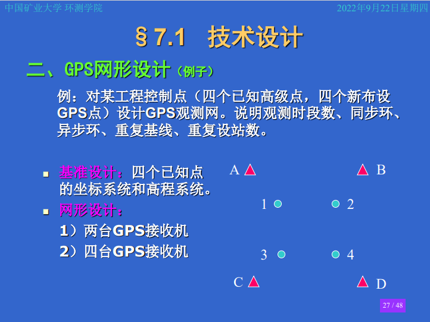
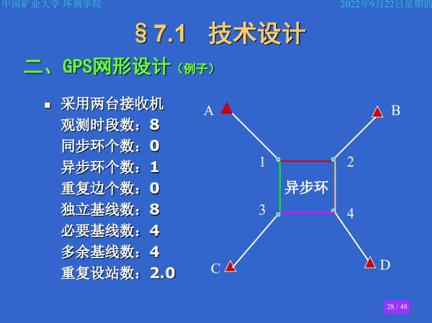
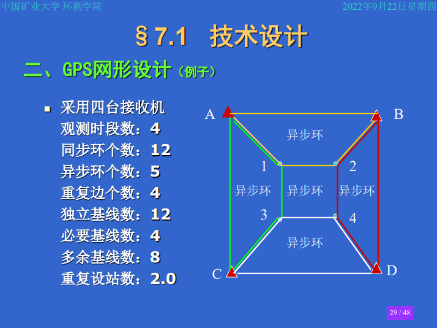

# GPS测量设计与实践

## **GPS 网形设计**  

`观测时段`：开始接收卫星信号到观测停止，连续工作的时间段。  

`同步观测`：两台或两台以上接收机同时观测对同一组卫星进行的观测。

`同步观测环`：三台以上接收机同步对同一组卫星进行的观测。

`异步观测环`：含有非同步观测的基线向量闭合环。

`独立观测环`：非同步观测所形成的基线向量闭合环，独立环。

`必要基线`：n个测点所形成的独立基线向量，n-1条。

`独立基线`：N台接收机同步观测所获得的独立基线，N-1条。

`多余基线`：除必要基线外的其他独立基线，独立基线与必要基线数之差。

`非独立基线`：除独立基线以外的其他基线，基线总数与独立基线数之差。  

理论上，`同步闭合环闭合差`应为零。但是，由于不同接收机的观测并不能严格同步观测等观测缺陷，导致同步换闭合差并不为零。若同步换闭合差不查过限差，表明观测无严重失误和基线向量解算合格，但不能说明观测精度高（`为什么`）；若同步换闭合差较大，表明观测或基线向量解算有严重失误。  

为确观测成果的可靠性和有效地发现观测值中存在的粗差（天线高、信号干扰等），必须使GPS网中的独立边构成一定的几何图形。这种几何图形可以是由数条独立边构成的`异步环`，也可以使由两个起算点之间的数条独立边构成的`附和路线`。  

`网点数`：n  
`每点设站次数`：m  
`接收机数`：N  
`时段数：`
$$C=n \cdot m/N$$

`总基线数：`
$$J_总=C \cdot N \cdot (N-1)/2$$

`必要基线数：`
$$J_必=n-1$$

`独立基线数：`
$$J_独=C \cdot (N-1)$$

`多余基线数：`
$$J_多=C \cdot (N-1)-(n-1)$$
$$J_多=J_独-J_必$$
`最简同步换个数（单时段）`:
$$T=J_总-J_独(N-1)$$

例如：n=4,m=3,N=3时

C=4*3/3=4  
J总=4*3*(3-1)/2=12  
J必=4-1=3  
J独=4*(3-1)=8  
J多=4*(3-1)-(4-1)  

