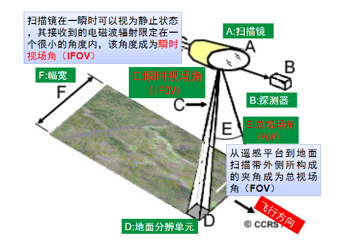
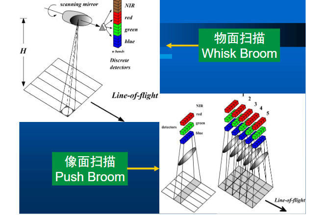

- [chapter 3 遥感传感器和信息获取](#chapter-3-遥感传感器和信息获取)
  - [3.1 遥感传感器](#31-遥感传感器)
    - [一、传感器定义和组成](#一传感器定义和组成)
    - [二、传感器分类](#二传感器分类)
    - [三、摄影型遥感传感器](#三摄影型遥感传感器)
    - [四、扫描型遥感传感器](#四扫描型遥感传感器)
    - [五、微波遥感与成像](#五微波遥感与成像)
  - [3.2 主要卫星遥感系统](#32-主要卫星遥感系统)
    - [遥感平台的种类](#遥感平台的种类)
    - [卫星轨道](#卫星轨道)
    - [陆地卫星](#陆地卫星)
    - [气象卫星](#气象卫星)
    - [海洋卫星](#海洋卫星)
  - [3.3 遥感图像分辨率](#33-遥感图像分辨率)
    - [一、空间分辨率(几何特征)](#一空间分辨率几何特征)
    - [二、光谱分辨率(物理特征)](#二光谱分辨率物理特征)
    - [三、辐射分辨率(物理特征)](#三辐射分辨率物理特征)
    - [四、时间分辨率(时间特征)](#四时间分辨率时间特征)

# chapter 3 遥感传感器和信息获取

## 3.1 遥感传感器

### 一、传感器定义和组成
`遥感传感器`是收集、探测、记录从目标反射或发射来的电磁波的仪器，是遥感技术系统的核心。

组成：遥感传感器一般由采集器（收集器）、探测器、处理器和输出器4部分组成
- 采集器：采集来自目标地物的辐射能量
- 探测器：将采集的辐射能转化成化学能或电能
- 处理器：对采集的信号进行处理。例如：胶片的显影、定影处理；电信号的放大、滤波、调制、变换处理等
- 输出器：输出获取的图像、数据。例如：摄影胶片、磁带记录仪、扫描晒像仪、阴极射线管、电视显像管、彩色喷墨仪等

### 二、传感器分类
- 按电磁波来源：
  - 主动遥感传感器（雷达）、
  - 被动遥感传感器（可见光近红外、热红外、被动微波）
- 按结构原理
  - 非图像类
  - 摄影成像类
  - 扫描成像类
  - 微波遥感类
- 按工作波段
  - 可见光、近红外传感器
  - 多光谱传感器
  - 高光谱传感器
  - 热红外传感器
  - 微波遥感传感器

Landsat-8卫星上携带两个传感器，分别是
- OLI陆地成像仪(Operational Land Imager)
- TIRS热红外传感器(Thermal Infrared Sensor)

### 三、摄影型遥感传感器

摄影成像：通过成像设备获取物体影像的技术。

摄影成像遥感方式以航空遥感为主

依据探测波长，分为：近紫外摄影、可见光摄影、红外摄影、多光谱摄影

分类：
- 按成像面积分
  - 分幅式
  - 全景式
    - 缝隙式摄像机：推扫式
    - 镜头转动摄像机：物镜沿垂直航线方向摆动
- 按影像波段数分
  - 黑白
  - 多光谱

### 四、扫描型遥感传感器
依靠探测元件（和扫描镜），对目标地物以**瞬时视场**为单位进行逐点逐行以时序方式取样，获取目标地物电磁辐射特性信息，形成一定波谱段的图像

> 瞬时视场角（Instantaneous Field Of View，IFOV），是指传感器内单个探测元件的`受光角度或观测视野`，它决定了在给定高度上瞬间观测的地表面积，这个面积就是传感器所能分辨的最小单元。IFOV越小，最小可分辨单元越小，图像空间分辨率越高。IFOV取决于传感器光学系统和探测器的大小。定义：IFOV以毫弧度（mrad）计量，其对应的地面大小被称为地面分辨率单元。

> CCD：电荷耦合组件(charge coupled device)：CCD就像传统相机的底片一样，是感应光线的电路装置，可以将它想象成一颗颗微小的`感应粒子`，铺满在光学镜头后方，当光线与图像从镜头透过、投射到CCD表面时，CCD就会产生电流，将感应到的电信号转换成数字信号储存起来。 包括`线阵CCD和面阵CCD`。

**物面扫描**

工作方式：遥感平台行进时，依靠机械传动装置使**镜头摆动**，对与行进的垂直方向的地面进行**逐点扫描**，进而实现**逐行扫描**，获得二维遥感图像。

典型物面扫描传感器：Landsat MSS、TM、ETM+、NOAA AVHRR

物面扫描特点：
- 依靠`扫描镜`实现逐点逐行扫描。
- 行扫描，每条扫描线/扫描线组均有一个投影中心，所得影像为`多中心投影影像`。
- 在每条扫描线上，距离投影中心越远，每个IFOV对应的地面单元越大，像点变形越大

**像面扫描**（推扫式扫描）

工作方式：将`探测器`*按垂直于行进方向*`阵列式排列`，来感应地面响应，瞬间得到一条“图像线”；在遥感平台行进时，以推扫方式获得二维遥感图像。

典型像面扫描传感器：SPOT HRV、HJ-1A/1B CCD、Sentinel-3 OLCI、Landsat-8 OLI和TIRS

像面扫描相对于物面扫描的特点：
| 优点                       | 缺点                       |
| -------------------------- | -------------------------- |
| 对每个地面单元响应时间长   | 易产生带状噪声，需进行校准 |
| 几何完整性更好             | CCD的光谱响应范围有限      |
| 体积小、重量轻、能耗低     | 总视场一般不如物面扫描     |
| 稳定性好、可靠性高、寿命长 | ~                          |

**高光谱成像光谱仪**

通过将传统的空间成像技术与地物光谱技术有机地结合在一起，使得扫描仪在取得目标地物图像的同时也获取地物的光谱组成。这种既能成像又能获取地物目标连续光谱曲线的“谱像合一”技术，称为成像光谱技术。按该原理制成的扫描仪称为成像光谱仪

典型星载成像光谱仪：美国Terra/Aqua MODIS、EO-1 Hyperion，洲ENVISAT MERIS、PROBA CHRIS，中国“神州三号”MORIS、FY-3 MERIS、HJ-1A高光谱成像仪、高分五号可见光短波红外高光谱相机

### 五、微波遥感与成像

`微波`：波长在1mm~1m的电磁波

`微波遥感`：通过微博传感器获取从目标地物发射或发射的微波辐射，经过判断处理来识别地物。（反射太阳辐射的微波或反射探测器发出的微波）

微波遥感的分类：
- 主动微波遥感：向目标地物发射并接收其向后散射信号
- 被动微波遥感：传感器接收来自目标地物发射的微波辐射

微波遥感的特点
- 能全天时、全天候工作
- 对地物具有一定的穿透能力（冰、雪、森林、土壤等）：微波λ远远大于粒子直径d，发生`瑞利散射`，但微波的散射强度很小，透射能力很强
- 主动微波遥感可记录电磁波幅度、极化、相位信息
- 对某些地物的鉴别能力更强

主动微波遥感——雷达

雷达：Radar（Radio Direction and Range），无线电测距和定位

工作原理：由发射机通过天线在很短时间内，向目标地物发射一束很窄的大功率电磁波脉冲，然后用同一天线接收目标地物反射的回波信号而进行显示的一种传感器。

`真实孔径雷达（ Real Aperture Radar—RAR）`：早期的雷达系统，由于成像分辨率与雷达天线的长度成正比，要想得到较高分辨率的图像，需要增加天线的物理尺寸，限制其发展和应用

`合成孔径雷达（Synthetic Aperture Radar—SAR）`：可以获取高分辨率的地球表面图像，是目前广泛使用的雷达系统

## 3.2 主要卫星遥感系统

### 遥感平台的种类

`遥感平台`：用于安置各种遥感仪器，使其从一定高度或距离对地面目标进行探测，并为其提供技术保障和工作条件的运载工具。包括地面平台、航空平台、航天平台

- 地面平台
  - 高度在0-100m范围内，包括车、船、塔、支架等。
  - 主要目的：在较理想条件下获得地面真值、地物光谱性质，服务于遥感模型方法的发展和检验
- 航空平台
  - 距离地面高度在百米至十几千米。包括运行在不同高度的飞机、飞艇、气球、无人机等。
  - 优势：空间分辨率高，适用于专题遥感研究；作为实验性技术系统，是星载系统的先行检验者；信息获取方便。
  - 不足：易受天气等不可控因素限制；观测范围有限；数据的周期性和连续性较差。
- 航天平台
  - 传感器搭载在环地球的航天器上，如人造地球卫星、航天飞机、空间站、火箭等。一般距离地面高度在240 km以上。
  - 低轨卫星：150-300 km；中轨卫星：700-1000 km；高轨卫星：36000 km。航天飞机：240-350 km
  - 卫星平台包括：陆地卫星系列、气象卫星系列、海洋卫星系列等

### 卫星轨道

轨道平面：卫星运行的平面

轨道倾角i：轨道平面和赤道面之间的夹角
- 顺轨卫星：i<90°（自西向东）
- 逆轨卫星：i>90°（自东向西）
- 赤轨卫星：i=0°
- 极轨卫星：i=90°

卫星轨道半长轴a：
- 低轨卫星（150~50km）多用于军事侦察
- 中轨卫星（350~1800km，多在1000km左右）陆地卫星、海洋卫星、极轨气象卫星
- 高轨卫星（约36000km）通讯卫星、静止气象卫星

升降轨
- 升轨：自南向北
- 降轨：自北向南

**`太阳同步轨道（Sun-Synchronous Orbit，SSO）`**
- *卫星的轨道平面和太阳地球连线之间的夹角不随地球绕太阳公转而改变*，轨道倾角接近**90度**，卫星在两级附近通过，又称`近极地太阳同步轨道`。
- 太阳都是从同一角度照射某地，可使**卫星经过同一地点的地方时基本相同**，卫星资料具有长期可比性。
  - 一种特殊的极轨卫星；
  - 相对于地球西向逆行；
  - 多数卫星高度约**600-800km**；
  - 轨道周期90-100min；
  - 卫星每天绕地球旋转14-16圈。

**`地球同步轨道（Geosynchronous Orbit）`**
- 地球同步轨道：卫星的重访周期等于地球的自转周期(23小时56分4秒)，且方向亦与之一致。
- 卫星高度**35786 km**。
- 轨迹投影为8字型

**`地球静止轨道（Geostationary Orbit，GEO）`**
- 地球静止轨道：当地球同步轨道是倾角为0的圆形轨道时，称为地球静止轨道。在这样的轨道上运行的卫星将始终位于赤道某地的上空，相对于地球表面是静止的。
- 特殊的地球同步卫星。
- 卫星高度**35786 km**。

> 太阳同步轨道属于中低轨道，空间分辨率更高，离得越近看得越清；地球静止轨道属于高轨道，站得高看得远，自然覆盖范围更广。
>
> 两种轨道可以互补达到最佳的监测效果，所以很多卫星星座采用这样的组合方式，比如高分系列，以此取得更高的时空分辨率

高分系列卫星
| 卫星名称     | 轨道                           | 传感器                                                       |
| ------------ | ------------------------------ | ------------------------------------------------------------ |
| 高分一号GF-1 | 太阳同步轨道645km重访时间2/4天 | 两台2m分辨率全色/8m分辨率多光谱相机，四台16m分辨率多光谱相机 |
| 高分二号GF-2 | 太阳同步轨道645km重访时间5天   | 两台高分辨率1米全色、4米多光谱相机                           |
| 高分四号GF-4 | 地球同步轨道36000km重访时间20s | 可见光50米/中波红外400米分辨率、大于400公里幅宽              |

高分四号是我国第一颗**地球同步轨道**遥感卫星

### 陆地卫星

陆地卫星：用于陆地资源和环境探测的卫星。航天遥感中应用最广、最深入的就是陆地卫星，其应用几乎涉及地学和国民经济的各个领域。

陆地卫星的特点
- 主要为近极地太阳同步轨道
- 传感器种类多样，包括多光谱、高光谱、热红外、雷达等
- 空间分辨率从亚米级到千米级

陆地卫星系列——中分辨率
- 美国Landsat卫星系列
- 法国SPOT卫星系列
- 欧洲Sentinel卫星系列
- 中国资源卫星系列
- 中国环境减灾卫星系列
- 印度IRS卫星系列

陆地卫星系列—高分辨率：欧美商业卫星系列
- IKONOS
- QuickBird
- GeoEye-1
- Worldview-1、2、3、4
- Pléiades-1、2

陆地卫星系列—高分辨率：我国的高分卫星系列
| 卫星名称 | 发射时间 | 轨道                | 重访周期 | 传感器                                                                                                                                                                 | 特点                                                                                               |
| -------- | -------- | ------------------- | -------- | ---------------------------------------------------------------------------------------------------------------------------------------------------------------------- | -------------------------------------------------------------------------------------------------- |
| GF-1     | 2013     | 太阳同步轨道645km   | 2/4天    | 光学遥感卫星，两台2m分辨率全色/8m分辨率多光谱相机，四台16m分辨率多光谱相机                                                                                             | 中高分辨率与800km大宽幅成像结合                                                                    |
| GF-2     | 2014     | 太阳同步轨道645km   | 5天      | 光学遥感卫星，两台高分辨率1米全色、4米多光谱相机                                                                                                                       | 标志着我国遥感卫星进入了亚米级“高分时代”                                                           |
| GF-3     | 2016     | 太阳同步轨道755km   | 1.5-3天  | 我国首颗分辨率达到1m的C频段多极化合成孔径雷达（SAR）卫星，实现1m至500m分辨率、10公里至650公里幅宽的微波遥感数据获取                                                    | 多成像模式，高分辨率，全能应用，全天时全天候，高空间分辨率、高时间分辨率、高光谱分辨率             |
| GF-4     | 2015     | 地球同步轨道36000km | 20s      | 光学遥感卫星。一台可见光50m/中波红外400m分辨率、大于400公里幅宽的凝视相机，具备可见光、多光谱和红外成像能力                                                            | 对中国及周边地区观测，与高分一号、高分二号卫星组成星座，具备高时间分辨率和较高空间分辨率的优势。   |
| GF-5     | 2018     | 太阳同步轨道705km   | -        | 2台高光谱/多光谱陆地观测相机(30m)和4台大气类观测相机                                                                                                                   | 世界上首颗实现对大气和陆地综合观测的全谱段高光谱卫星                                               |
| GF-6     | 2018     | 太阳同步轨道645km   | 2天      | 光学遥感卫星。配置2m全色/8m多光谱高分辨率相机、16m多光谱中分辨率宽幅相机                                                                                               | 中国首颗精准农业观测的高分卫星，国内首次增加了能够有效反映作物特有光谱特性的“红边”波段，与GF-1组网 |
| GF-7     | 2019     | 太阳同步轨道505km   | -        | 高分辨率空间立体测绘卫星。1台双线阵相机(0.8m)和1台激光测高仪。前者可连续观测地面重叠影像，用于获得立体影像；后者可对地形条件复杂的地区进行测绘，提高卫星的高程定位精度 | 我国首颗亚米级高分辨率光学传输型立体测绘卫星                                                       |

### 气象卫星

气象卫星的轨道分为：低轨（近极地太阳同步轨道）和高轨（地球静止轨道）
- 低轨：800-1600 km，与太阳同步，固定时间经过每个地点的上空。
- 高轨：36 000 km，与地球同步，绕地球一周需24小时，相对于地球似乎固定于高空某一点，故称作地球静止气象卫星

特点
- 短周期重复观测：地球静止气象卫星访问周期0.5小时1次（每半小时获取1次）；极轨卫星则是0.5-1天1次。较高的时间分辨率有利于快速变化的动态监测！
- 成像面积大，有利于宏观同步信息：气象卫星幅宽约2800 km，2-3条轨道可覆盖中国。
- 资料来源连续、实时性强、成本低：可见光和红外云图等图像资料；云量、云分布、大气水汽含量、臭氧含量、海面温度等数据资料

### 海洋卫星

海洋遥感的特点：
- 需要高空遥感平台，以进行大面积同步覆盖的观测
- 以微波为主——具备全天时(昼夜)、全天候工作能力和穿云透雾的能力
- 具有一定的透视海水能力，以便取得海水较深部的信息
- 电磁波与激光、声波结合扩大海洋遥感探测手段
- 需要海面实测资料对海洋遥感进行校正

## 3.3 遥感图像分辨率

`遥感图像`是各种传感器所获信息的产物，是遥感探测目标的信息载体。遥感图像有三方面的特征：
- 几何特征（目标地物的大小、形状、空间分布特点）
- 物理特征（目标地物的属性特点）
- 时间特征（目标地物的变化动态特点）

### 一、空间分辨率(几何特征)
空间分辨率，又称地面分辨率，均反映对两个非常靠近的目标物的识别、区分能力。
- 空间分辨率： 针对遥感器或图像而言的，指图像上能够详细区分的最小单元的尺寸或大小。
- 地面分辨率： 针对地面而言，指可以识别的最小地面距离或最小目标物的大小。
- 影响因素：传感器与探测目标的距离（航高）、单位瞬时视场角度（IFOV）

空间分辨率 = IFOV * 卫星高

| 遥感数据类型   | 空间分辨率 | 应用               |
| -------------- | ---------- | ------------------ |
| IKONOS         | 1m         | 城市规划、土地管理 |
| SPOT-HRV Pan   | 10m        | 立体量测           |
| ETM1-5，7      | 30m        | 陆地资源调查       |
| ETM6           | 60m        | 地面热性质调查     |
| ETM Pan        | 15m        | 规划、管理         |
| Landsat-MSS4-7 | 80m        | 陆地资源调查       |
| Radarsat-SAR   | 1m         | 形变监测           |
| Seasat-VIR     | 20m        | 海洋调查           |
| Seasat-SAR     | 10m        | 海洋调查           |
| NOAA-AVHRR     | 1.1km      | 气象               |

### 二、光谱分辨率(物理特征)

- `光谱分辨率`是指传感器在接受目标辐射的光谱时能分辨的最小波长间隔。
- 传感器的通道数、每个通道的带宽、中心波长，这三个因素共同决定光谱分辨率。
- 传感器的波段数量越多、带宽越窄, 其光谱分辨率就越高。光谱分辨率越高，获得的图像就越能反映出地物的光谱特性，不同地物间的差别在图像上就越能更好地体现出来

### 三、辐射分辨率(物理特征)
- 辐射分辨率是指传感器接收波谱信号时，能分辨的最小辐射度差（传感器的灵敏度）。
- 实际上表达了传感器对不同能量、强度的分辨能力
- 在遥感图像上表现为每一像元的辐射量化级

一般用灰度的分级数来表示，即最暗到最亮灰度值（亮度值）间分级的数目－－量化级数

一般瞬时视场角IFOV越大，最小可分像元越大，空间分辨率越低；但是IFOV越大，光通量，即瞬时获得的入射能量越大，辐射测量越敏感，对微弱能量差异的检测能力越强，则辐射分辨率越高。因此，空间分辨率越高，将伴随辐射分辨率的降低。

### 四、时间分辨率(时间特征)

`时间分辨率`指传感器重复观测的最小时间间隔

时间分辨率越高，越能描述对象的动态变化过程。

**时间分辨率和空间分辨率互为限制**
- 卫星高度越低，空间分辨率高，时间分辨率低
- 卫星高度越高，空间分辨率低，时间分辨率高

