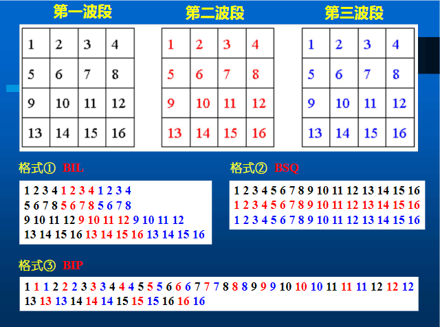
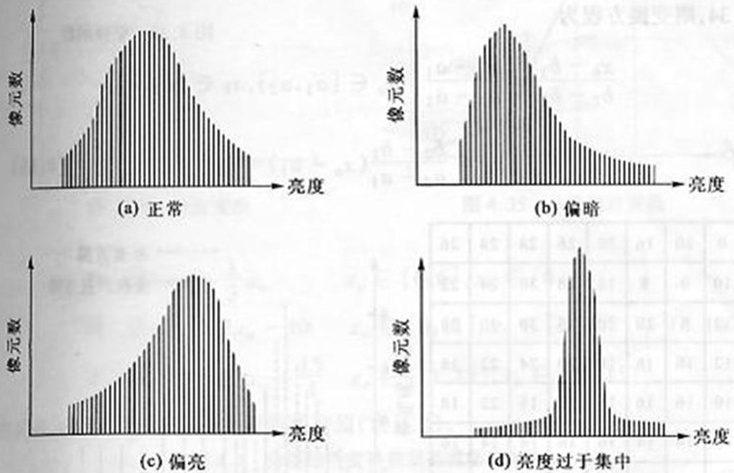

- [chapter 4 遥感图像处理基础](#chapter-4-遥感图像处理基础)
  - [4.1 遥感图像的数字表达](#41-遥感图像的数字表达)
  - [4.2 遥感图像的存储](#42-遥感图像的存储)
  - [4.3 遥感图像目视解译与判读](#43-遥感图像目视解译与判读)
  - [4.4 遥感图像特征的统计分析](#44-遥感图像特征的统计分析)

# chapter 4 遥感图像处理基础

## 4.1 遥感图像的数字表达

模拟图像（Analog）

数字图像（Digital）

A/D转换
- 空间采样：空间坐标的离散化
- 灰度量化：灰度的离散化

## 4.2 遥感图像的存储

存储介质：磁带、磁盘、光盘、移动硬盘、优盘存储格式

**存储格式**
- BSQ格式（Band Sequential）：波段交叉
- BIP格式（Band Interleaved by Pixel）：像元交叉
- BIL格式（Band Interleaved by Line）：行交叉

**BSQ、BIL和BIP格式的优缺点？**
- BSQ是记录多波段数据最简单的格式，便于单波段选取和处理。
- BIP格式便于从整幅图像中提取小的子区，适于提取典型地物光谱曲线，因为同一个像元各波段的灰度值都集中在一起，可以一次读出，调用方便。
- BIL具有另外两种格式的折中特征

## 4.3 遥感图像目视解译与判读

人们对地表物体的有关领域，如土地利用存在一种先验知识，在遥感图像寻找对应关系。然后，根据遥感图像的影像特征推论地表物体的属性。这一过程就称之为`遥感图像的解译`，也叫遥感图像的判读。

**目视解译**：指*专业人员*通过直接观察或借助辅助判读仪器在遥感图像上获取特定目标地物信息的过程。

**计算机解译**：以计算机为支撑，利用*模式识别与人工智能*技术相结合，根据遥感图像中目标地物的各种影像特征（颜色、形状、纹理与空间位置），结合*专家知识库*中目标地物的解译经验和成像规律等知识进行分析和推理，实现对遥感图像的理解，完成对遥感图像的解译。

**地物识别特征**：色、形、位

颜色

阴影

形状

纹理

大小

位置

图型

相关布局

**目视解译方法**
- 直接判读法：使用的直接判读标志有色调、色彩、大小、形状、阴影、纹理、图案等。
- 对比分析法：同类地物对比分析、空间对比分析、时相动态对比法。
- 信息复合法：利用同一区域的专题图或地形图与遥感图像复合，根据专题图或者地形图提供的多种辅助信息，识别遥感图像上目标地物的方法。
- 综合推理法：综合考虑遥感图像多种解译特征，结合生活常识，分析、推断某种目标地物的方法。
- 地理相关分析法：根据地理环境中各种地理要素之间的相互依存，相互制约的关系，借助专业知识，分析推断某种地理要素性质、类型、状况与分布的方法

## 4.4 遥感图像特征的统计分析

| 统计类型 | 计算公式                                                     | 含义                                       |
| -------- | ------------------------------------------------------------ | ------------------------------------------ |
| 均值     | $f=\frac{\sum_{i=0}^{M-1}\sum_{j=0}^{N-1}f(i,j)}{MN}$        | 反映图像中地物的平均反射强度               |
| 中值     | $f(i,j)=\frac{f_{max}(i,j)-f_{min}(i,j)}{2}$                 | 图像所有灰度级中处于中间的值               |
| 众数     | ~                                                            | 图像中出现最多次数的灰度值                 |
| 灰度值域 | $f_{range}(i,j)=f_{max}(i,j)-f_{min}(i,j)$                   | 灰度值的变化程度                           |
| 反差     | $$\begin{aligned} C_1=f_{max}/f_{min}\\C_2=f_range\\C_3=S\end{aligned}$$ | 反映图像的显示效果和可分辨性               |
| 方差     | $S^2=\frac{\sum_{i=0}^{M-1}\sum_{j=0}^{N-1}[f(i,j)-f]^2}{MN}$ | 反映各像元灰度值域图像平均值的总的离散程度 |

影像直方图：是指影像中所有灰度值的概率分布。横坐标表示影像的灰度级变化，纵坐标表示影像中各个灰度级像元数占整幅影像像元数的百分比。

影像直方图的作用：直观地了解图像的亮度值分布范围、峰值的位置、均值以及亮度值分布的离散程度。直方图的曲线可以反映图像的质量差异。

正态分布：反差适中，亮度分布均匀，层次丰富，图像质量高。

偏态分布：图像偏亮或偏暗，层次少，质量较差。单波段的统计分析

直方图是描述图像质量的可视化图表。在图像处理中，可以通过调整图像直方图的形态，改善图像显示的质量，以达到图像增强的目的。

**协方差**
设f(i,j)和g(i,j)是大小为M*N的两幅图像，则它们
之间的协方差为:
$\sigma^2=\frac{1}{MN}\sum_{i=1}^M\sum_{j=1}^N[f(i,j)][g(i,j)-u_g]$ ，其中u_f和u_g分别是图像的f和g的均值

协方差矩阵：将N个波段相互间的协方差排列在一起所组成的矩阵称为协方差矩阵

相关系数：
相关系数是描述波段图像间相关程度的统计量，反映了两个或两个以上波段图像所包含信息的重叠程度
$r_{fg}=\frac{\sigma^2_{fg}}{\sigma_{ff}\sigma_{gg}}$，其中$\sigma_{ff}$和$\sigma_{gg}$分别是图像f和g的标准差

相关矩阵：
将N个波段相互间的相关系数排列在一起组成的矩阵
为相关矩阵R

